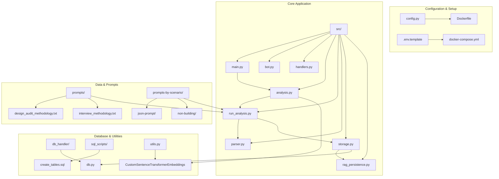
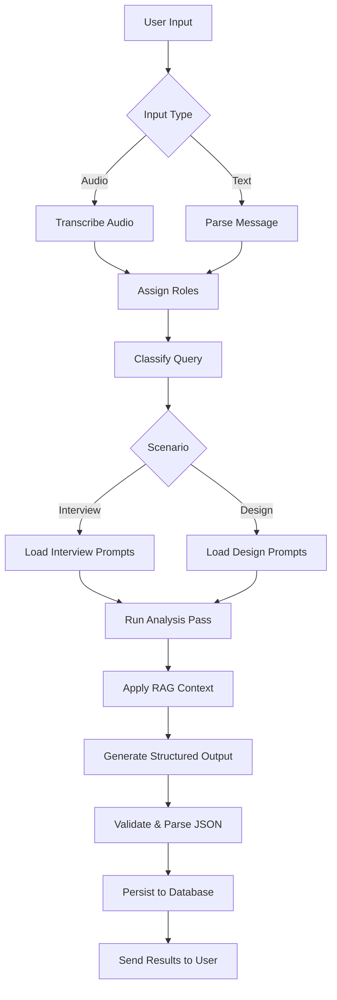
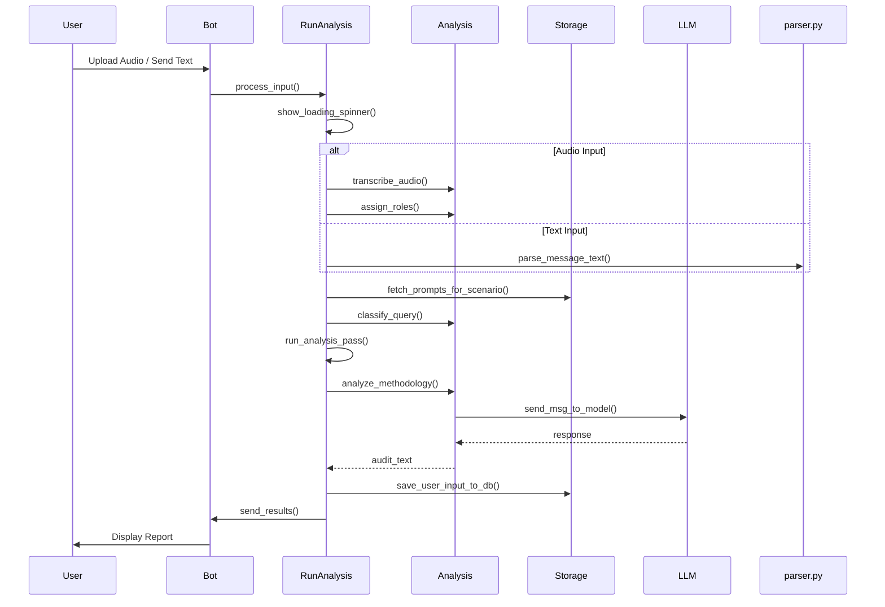
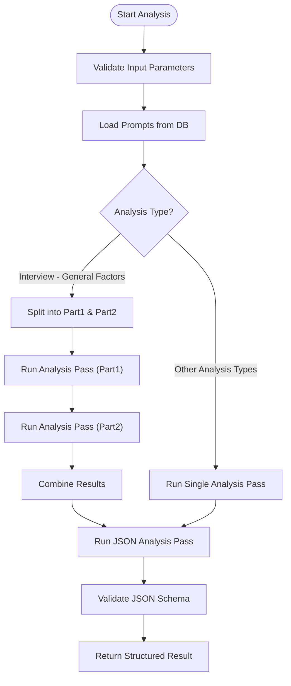
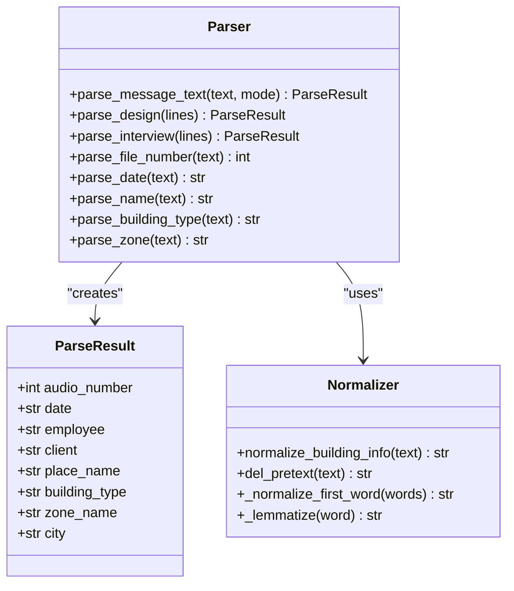
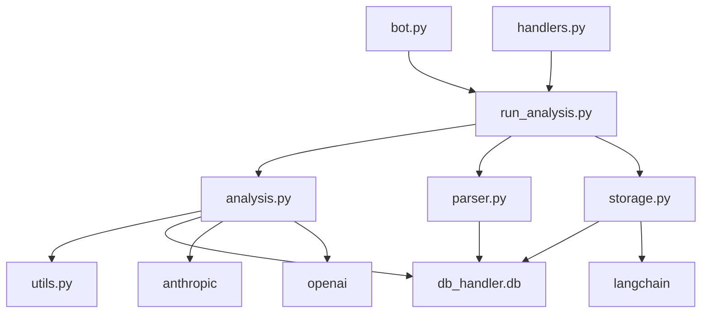
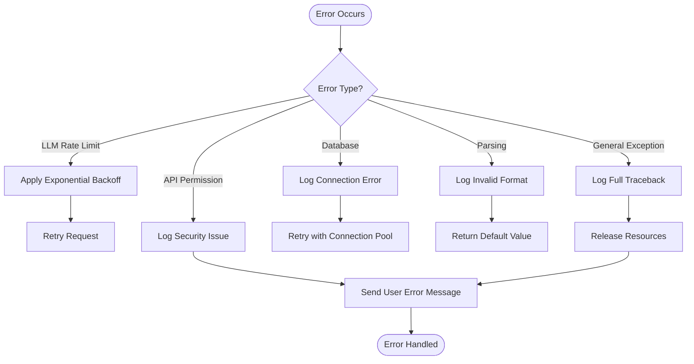

# Analysis Engine

<cite>
**Referenced Files in This Document**   
- [run_analysis.py](file://src/run_analysis.py#L1-L344)
- [analysis.py](file://src/analysis.py#L1-L491)
- [parser.py](file://src/parser.py#L1-L175)
- [storage.py](file://src/storage.py#L1-L310)
- [rag_persistence.py](file://src/rag_persistence.py#L1-L37)
- [README.md](file://README.md#L1-L224)
</cite>

## Table of Contents
1. [Introduction](#introduction)
2. [Project Structure](#project-structure)
3. [Core Components](#core-components)
4. [Architecture Overview](#architecture-overview)
5. [Detailed Component Analysis](#detailed-component-analysis)
6. [Dependency Analysis](#dependency-analysis)
7. [Performance Considerations](#performance-considerations)
8. [Troubleshooting Guide](#troubleshooting-guide)
9. [Conclusion](#conclusion)

## Introduction
The Analysis Engine is the central processing component of the VoxPersona platform, responsible for orchestrating multi-stage AI-driven analysis of voice recordings. It leverages Anthropic's Claude 3.5 Sonnet model for deep language understanding, integrates Retrieval-Augmented Generation (RAG) via FAISS and SentenceTransformers for context-aware responses, and applies structured data extraction using JSON schema validation. The engine supports two primary analysis types: interview evaluation and design audit, each with scenario-specific prompts and evaluation logic. This document provides a comprehensive breakdown of the workflow, component interactions, data flow, error handling, and performance optimization strategies implemented in the system.

## Project Structure
The project follows a modular structure with clear separation of concerns. Core analysis logic resides in the `src/` directory, while prompts are organized by scenario in dedicated directories. The `prompts/` directory contains base prompt templates, whereas `prompts-by-scenario/` houses structured, scenario-specific prompts including JSON-formatted variants for structured output generation.

**Diagram sources**
- [README.md](file://README.md#L1-L224)
- [run_analysis.py](file://src/run_analysis.py#L1-L344)

**Section sources**
- [README.md](file://README.md#L1-L224)

## Core Components
The Analysis Engine comprises several interconnected components that work in concert to process audio inputs and generate structured analytical reports. Key components include `run_analysis.py` as the orchestration layer, `analysis.py` for LLM interaction and RAG operations, `parser.py` for structured data extraction, and `storage.py` for database persistence and vector index management. These components follow a pipeline architecture where raw audio is transcribed, analyzed through multiple prompt stages, enriched with external context via RAG, and finally persisted with metadata.

**Section sources**
- [run_analysis.py](file://src/run_analysis.py#L1-L344)
- [analysis.py](file://src/analysis.py#L1-L491)
- [parser.py](file://src/parser.py#L1-L175)
- [storage.py](file://src/storage.py#L1-L310)

## Architecture Overview
The Analysis Engine follows a multi-stage processing pipeline that begins with user input and culminates in structured report generation. The architecture integrates LLM processing with vector-based retrieval systems and relational database storage. It supports both real-time interactive analysis and batch processing workflows.

**Diagram sources**
- [run_analysis.py](file://src/run_analysis.py#L1-L344)
- [analysis.py](file://src/analysis.py#L1-L491)
- [parser.py](file://src/parser.py#L1-L175)

## Detailed Component Analysis

### run_analysis.py: Orchestration Layer
The `run_analysis.py` module serves as the primary orchestration component, managing the end-to-end analysis workflow. It handles user interaction through the Telegram bot interface, coordinates multiple analysis passes, and manages state throughout the processing pipeline.

#### Analysis Workflow

**Diagram sources**
- [run_analysis.py](file://src/run_analysis.py#L1-L344)

**Section sources**
- [run_analysis.py](file://src/run_analysis.py#L1-L344)

### analysis.py: LLM Interaction and RAG Processing
The `analysis.py` module contains the core logic for interacting with the LLM and managing retrieval-augmented generation. It implements both synchronous and asynchronous processing patterns for efficient resource utilization.

#### Multi-Stage Analysis Pattern

**Diagram sources**
- [analysis.py](file://src/analysis.py#L1-L491)

**Section sources**
- [analysis.py](file://src/analysis.py#L1-L491)

### parser.py: Structured Data Extraction
The `parser.py` module is responsible for parsing user input and extracting structured data according to predefined schemas. It handles both interview and design scenarios with different data models.

#### Data Parsing Logic

**Diagram sources**
- [parser.py](file://src/parser.py#L1-L175)

**Section sources**
- [parser.py](file://src/parser.py#L1-L175)

## Dependency Analysis
The Analysis Engine components exhibit a layered dependency structure where higher-level modules depend on lower-level utilities while maintaining loose coupling through well-defined interfaces.

**Diagram sources**
- [run_analysis.py](file://src/run_analysis.py#L1-L344)
- [analysis.py](file://src/analysis.py#L1-L491)
- [parser.py](file://src/parser.py#L1-L175)
- [storage.py](file://src/storage.py#L1-L310)

**Section sources**
- [run_analysis.py](file://src/run_analysis.py#L1-L344)
- [analysis.py](file://src/analysis.py#L1-L491)
- [parser.py](file://src/parser.py#L1-L175)
- [storage.py](file://src/storage.py#L1-L310)

## Performance Considerations
The Analysis Engine incorporates several performance optimization strategies to handle resource-intensive LLM operations efficiently.

### Token Usage Optimization
The system implements token-aware processing to minimize API costs and prevent model context overflow:
- Dynamic chunking of input text based on token count
- Selective prompt loading based on analysis type
- Efficient RAG retrieval with controlled k-value (default: 15)
- Token counting utility for pre-emptive validation

### Caching Strategies
The engine employs multiple caching mechanisms:
- In-memory FAISS vector databases for RAG operations
- Persistent RAG indices via `rag_persistence.py`
- Reuse of embedding models across requests
- Thread-safe semaphores for rate limiting control

### Parallel Execution
For high-throughput scenarios, the system supports parallel processing:
- Asynchronous RAG retrieval with `extract_from_chunk_parallel_async`
- Threaded execution of analysis passes
- Concurrent API key utilization to maximize throughput
- Rate limiting awareness with token-per-minute and request-per-minute tracking

**Section sources**
- [analysis.py](file://src/analysis.py#L1-L491)
- [rag_persistence.py](file://src/rag_persistence.py#L1-L37)
- [storage.py](file://src/storage.py#L1-L310)

## Troubleshooting Guide
The Analysis Engine includes comprehensive error handling and logging mechanisms to facilitate debugging and maintenance.

### Common Error Scenarios
**Section sources**
- [run_analysis.py](file://src/run_analysis.py#L1-L344)
- [analysis.py](file://src/analysis.py#L1-L491)

#### LLM Response Errors
- **Malformed JSON**: When JSON parsing fails, the system logs the raw response and returns appropriate error messages
- **Rate Limiting**: The engine implements exponential backoff (1s, 2s, 4s, 8s, 16s) for rate limit recovery
- **API Key Issues**: Permission errors trigger specific user-facing messages about API key/region problems

#### Prompt Injection Failures
- Invalid prompt names result in fallback to default prompts
- Missing prompt parameters are handled with default values
- Database connection issues during prompt retrieval trigger exception logging

#### RAG Retrieval Inaccuracies
- Empty retrieval results return "nothing found" messages
- Corrupted vector indices are skipped with warning logs
- Embedding model loading failures trigger graceful degradation

### Error Handling Flow

**Diagram sources**
- [analysis.py](file://src/analysis.py#L1-L491)
- [run_analysis.py](file://src/run_analysis.py#L1-L344)

## Conclusion
The Analysis Engine represents a sophisticated integration of LLM technology, retrieval-augmented generation, and structured data processing. By orchestrating multiple analysis stages through carefully designed prompts and validation mechanisms, it transforms raw audio inputs into actionable business insights. The modular architecture enables extensibility for new analysis types while maintaining robust error handling and performance optimization. The system's ability to handle both interview evaluations and design audits demonstrates its versatility in processing diverse qualitative data. Future enhancements could include adaptive prompt selection, enhanced schema validation, and real-time collaboration features.