# Multi-Stage Evaluation

<cite>
**Referenced Files in This Document**   
- [run_analysis.py](file://src/run_analysis.py#L1-L344)
- [handlers.py](file://src/handlers.py#L1-L805)
- [analysis.py](file://src/analysis.py#L1-L491)
- [storage.py](file://src/storage.py#L1-L310)
- [datamodels.py](file://src/datamodels.py#L1-L72)
</cite>

## Table of Contents
1. [Introduction](#introduction)
2. [Project Structure](#project-structure)
3. [Core Components](#core-components)
4. [Architecture Overview](#architecture-overview)
5. [Detailed Component Analysis](#detailed-component-analysis)
6. [Dependency Analysis](#dependency-analysis)
7. [Performance Considerations](#performance-considerations)
8. [Troubleshooting Guide](#troubleshooting-guide)
9. [Conclusion](#conclusion)

## Introduction
VoxPersona is an AI-powered voice analysis platform that automates transcription, contextual retrieval, and deep analysis of audio recordings using advanced language models. This document details the multi-stage evaluation workflow orchestrated by `run_analysis.py`, which manages a complex pipeline from audio input to structured reporting. The system supports two primary evaluation types—interview and design audit—each with specialized processing paths, prompt sets, and data handling logic. The workflow integrates RAG (Retrieval-Augmented Generation), asynchronous LLM processing, and robust error handling to deliver comprehensive analytical reports.

## Project Structure
The project follows a modular structure with clear separation of concerns. The core logic resides in the `src` directory, while prompts are organized by scenario and type. The system uses PostgreSQL for persistent storage and FAISS for in-memory vector databases to support semantic search.

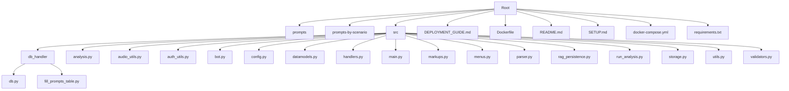

**Diagram sources**
- [README.md](file://README.md#L1-L224)

## Core Components
The system's core functionality is distributed across several key components that handle audio processing, analysis orchestration, state management, and database interaction. The workflow begins with audio upload in `handlers.py`, transitions through analysis coordination in `run_analysis.py`, and concludes with LLM-driven processing in `analysis.py`. The `storage.py` module manages both persistent database operations and in-memory RAG indices, while `datamodels.py` defines critical mappings between user-facing labels and internal identifiers.

**Section sources**
- [run_analysis.py](file://src/run_analysis.py#L1-L344)
- [handlers.py](file://src/handlers.py#L1-L805)
- [analysis.py](file://src/analysis.py#L1-L491)
- [storage.py](file://src/storage.py#L1-L310)
- [datamodels.py](file://src/datamodels.py#L1-L72)

## Architecture Overview
The system architecture follows a client-server model with Telegram as the primary user interface. Audio files are processed through a multi-stage pipeline that includes transcription, role assignment, contextual analysis, and report generation. The architecture leverages asynchronous processing for LLM interactions and maintains state through in-memory dictionaries and database persistence.

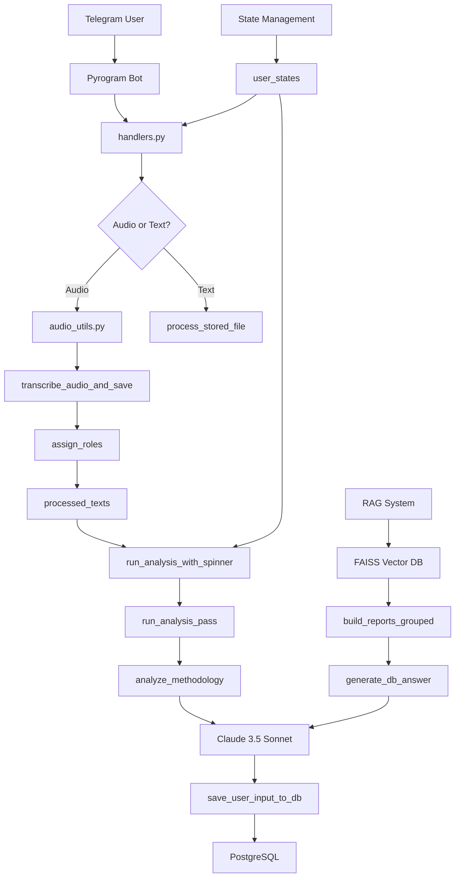

**Diagram sources**
- [run_analysis.py](file://src/run_analysis.py#L1-L344)
- [handlers.py](file://src/handlers.py#L1-L805)
- [analysis.py](file://src/analysis.py#L1-L491)
- [storage.py](file://src/storage.py#L1-L310)

## Detailed Component Analysis

### run_analysis.py: Analysis Orchestration
The `run_analysis.py` module serves as the central orchestrator for the evaluation workflow, managing the end-to-end pipeline from user input to final report generation. It implements a multi-phase process that ensures systematic analysis while providing real-time feedback to users.

#### Analysis Pipeline Control Flow
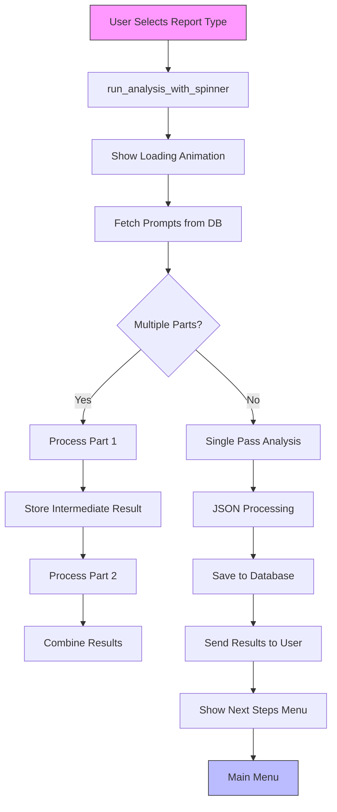

**Diagram sources**
- [run_analysis.py](file://src/run_analysis.py#L1-L344)

The `run_analysis_with_spinner` function initiates the analysis workflow when a user selects a report type from the menu. It first displays a loading animation to provide immediate feedback, then retrieves the appropriate prompts from the database based on the selected scenario (interview or design), report type, and building type. For complex analyses that require multiple processing stages (such as "Common Factors" in interviews), the function executes sequential passes, with each pass generating intermediate results that are combined for final JSON processing.

#### State Management and Progress Tracking
The system maintains user state through the `user_states` dictionary, which tracks the current step in the data collection process. When initiating analysis, `run_analysis_with_spinner` accesses the user's collected data (employee name, place name, date, etc.) and combines it with the transcribed audio text for processing. The function uses threading events and spinner threads to manage the loading animation, ensuring the user interface remains responsive during potentially lengthy LLM operations.

#### Specialized Execution Paths
The workflow diverges based on the evaluation type, with distinct processing logic for interview and design audit scenarios:

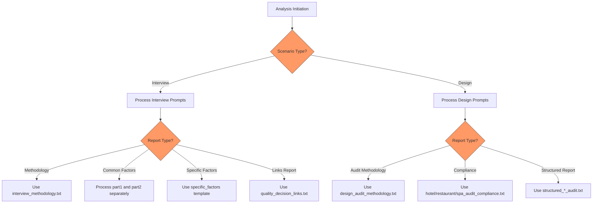

**Diagram sources**
- [run_analysis.py](file://src/run_analysis.py#L1-L344)
- [datamodels.py](file://src/datamodels.py#L1-L72)

For interview evaluations, the system first processes general factors (common decision-making elements across establishments) and then specific factors (unique to the particular venue). The results are combined and processed through a JSON-specific prompt to generate structured output. Design audits follow a similar pattern but focus on compliance with audit programs and structured reporting of design elements.

**Section sources**
- [run_analysis.py](file://src/run_analysis.py#L1-L344)

### handlers.py: Workflow Initiation and State Management
The `handlers.py` module serves as the entry point for user interactions, managing the flow from audio upload to analysis initiation. It implements a state machine that guides users through data collection before triggering the analysis pipeline.

#### Audio Upload and Processing Flow
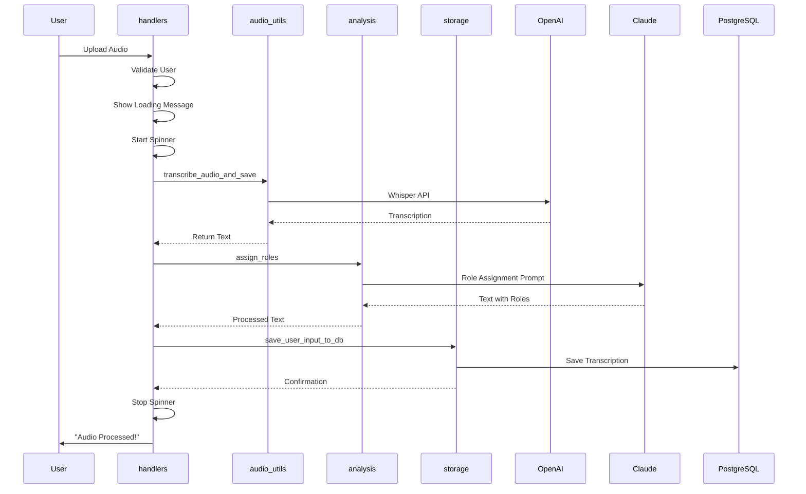

**Diagram sources**
- [handlers.py](file://src/handlers.py#L1-L805)
- [audio_utils.py](file://src/audio_utils.py#L1-L50)
- [analysis.py](file://src/analysis.py#L1-L491)

When a user uploads an audio file, the `handle_audio_msg` function validates the user's authorization, checks file size limits, and initiates processing. It downloads the audio to a temporary location, uploads it to MinIO storage, and calls `transcribe_audio_and_save` to generate a text transcript using OpenAI's Whisper API. After transcription, it invokes `assign_roles` to identify speakers in the dialogue (e.g., interviewer vs. interviewee), enhancing the quality of subsequent analysis.

#### State Machine Implementation
The system implements a step-by-step data collection process using the `user_states` dictionary:

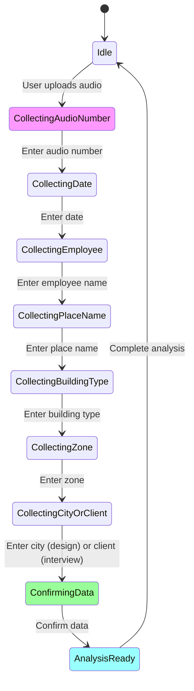

**Diagram sources**
- [handlers.py](file://src/handlers.py#L1-L805)

The state machine guides users through collecting essential metadata (audio number, date, employee name, etc.) before analysis can proceed. Each step updates the user's state, and the system provides appropriate prompts for the next required input. Once all data is collected, users can confirm and proceed to select analysis reports.

#### Analysis Initiation
When a user selects a report type from the menu, the `handle_report` function determines whether building-specific prompts are required. For reports that depend on building type (hotel, restaurant, spa), it first prompts the user to select the appropriate type before proceeding with analysis. This ensures that the correct specialized prompts are used for contextually accurate results.

**Section sources**
- [handlers.py](file://src/handlers.py#L1-L805)

### analysis.py: Core Analysis Engine
The `analysis.py` module contains the core logic for LLM-driven analysis, implementing both sequential and parallel processing patterns for different types of analytical tasks.

#### Sequential Analysis Pipeline
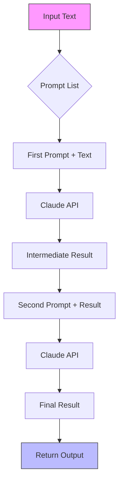

**Diagram sources**
- [analysis.py](file://src/analysis.py#L1-L491)

The `analyze_methodology` function implements a sequential processing pipeline where multiple prompts are applied in order, with each subsequent prompt operating on the output of the previous step. This allows for complex analytical workflows, such as first extracting key information and then synthesizing it into a structured report. The function handles both single-pass analyses and multi-stage processes, maintaining state between prompt applications.

#### Parallel Processing for RAG
For retrieval-augmented generation tasks, the system implements parallel processing to improve performance and manage API rate limits:

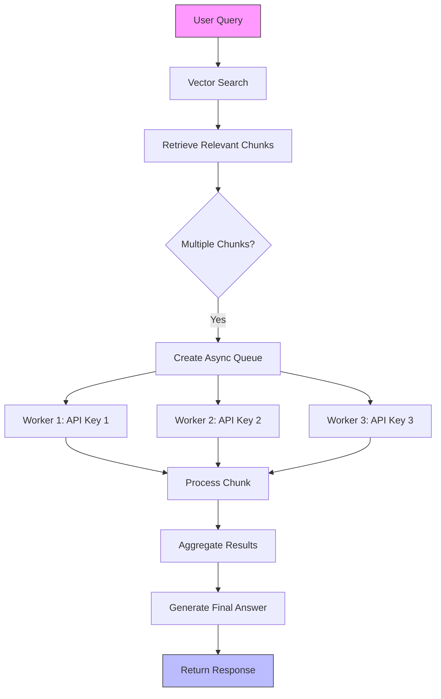

**Diagram sources**
- [analysis.py](file://src/analysis.py#L1-L491)

The `extract_from_chunk_parallel_async` function distributes processing across multiple Anthropic API keys to overcome rate limits. It implements token and request rate limiting based on each API key's quota, calculating appropriate delays between requests to avoid exceeding limits. The system uses a priority queue to distribute work evenly across available API keys, maximizing throughput while maintaining compliance with usage quotas.

#### Error Handling and Resilience
The analysis engine implements comprehensive error handling to ensure reliability:

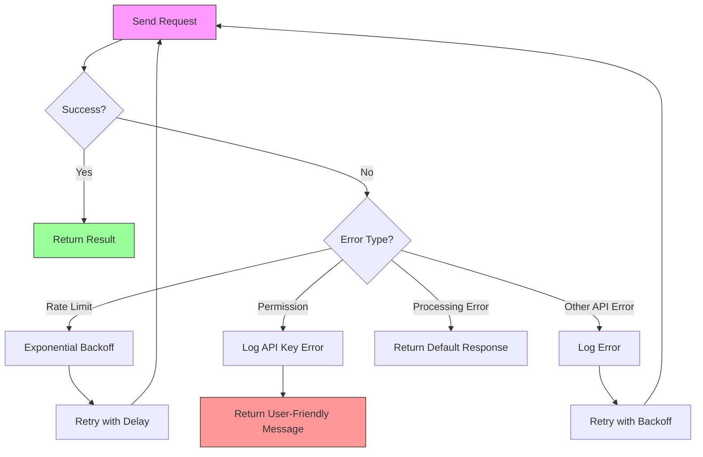

**Diagram sources**
- [analysis.py](file://src/analysis.py#L1-L491)

The `send_msg_to_model` function implements retry logic with exponential backoff for rate limit errors, automatically retrying failed requests with increasing delays. It also handles permission errors (such as invalid API keys) by logging the issue and returning user-friendly error messages. For other API errors, it implements a general retry mechanism with backoff to handle transient issues.

**Section sources**
- [analysis.py](file://src/analysis.py#L1-L491)

### storage.py: Data Management and RAG System
The `storage.py` module manages both persistent database operations and the in-memory RAG (Retrieval-Augmented Generation) system that enables contextual analysis across multiple reports.

#### RAG Index Creation
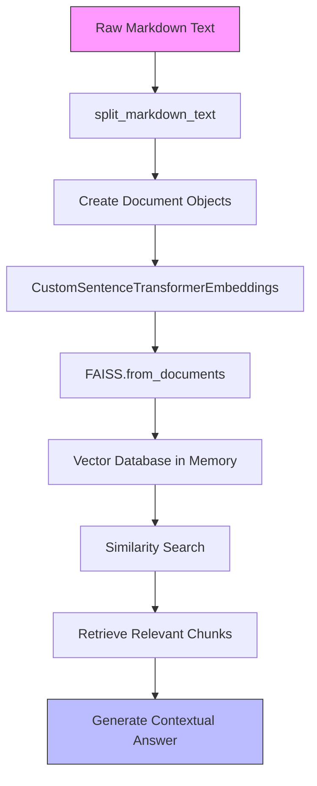

**Diagram sources**
- [storage.py](file://src/storage.py#L1-L310)

The `create_db_in_memory` function transforms markdown-formatted report text into a FAISS vector database using SentenceTransformer embeddings. It first splits the text into manageable chunks, then creates Document objects for each chunk, and finally generates embeddings to create the searchable index. This allows for semantic search across thousands of reports, retrieving the most relevant content for a given query.

#### Database Integration
The system integrates with PostgreSQL to store transcripts, audit results, and metadata:

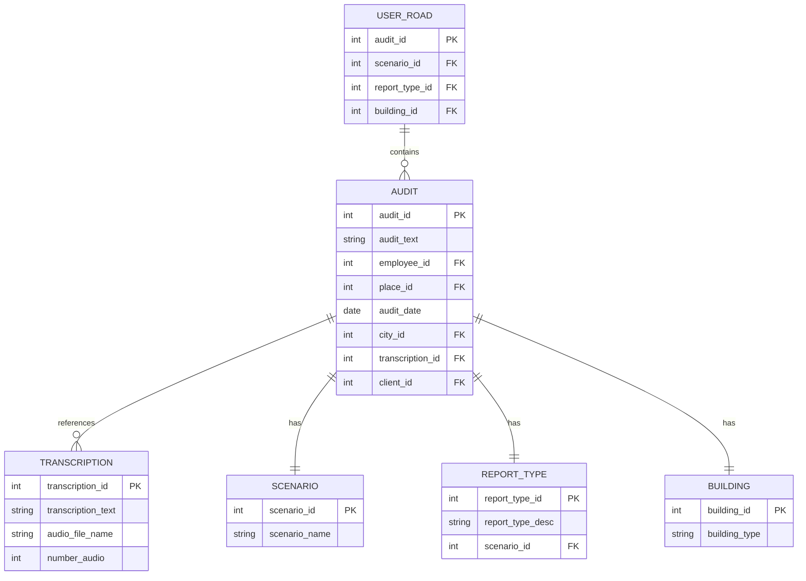

**Diagram sources**
- [storage.py](file://src/storage.py#L1-L310)
- [db_handler/db.py](file://src/db_handler/db.py#L1-L100)

The database schema supports complex queries that join audit results with their contextual metadata. The `build_reports_grouped` function executes a comprehensive SQL query that joins multiple tables to retrieve complete report information, including transcription details, employee data, location information, and audit metadata. This grouped data is then used to populate the RAG system for contextual analysis.

**Section sources**
- [storage.py](file://src/storage.py#L1-L310)

## Dependency Analysis
The system components are interconnected through a well-defined dependency structure that enables modularity while maintaining cohesive functionality.

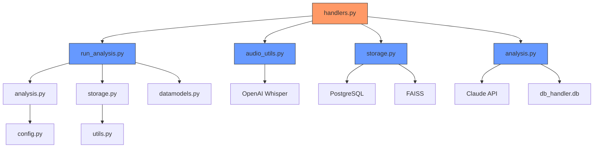

**Diagram sources**
- [run_analysis.py](file://src/run_analysis.py#L1-L344)
- [handlers.py](file://src/handlers.py#L1-L805)
- [analysis.py](file://src/analysis.py#L1-L491)
- [storage.py](file://src/storage.py#L1-L310)

The dependency graph shows that `handlers.py` serves as the primary integration point, depending on multiple core modules to implement the complete workflow. The `run_analysis.py` module depends on analysis and storage components to execute the evaluation pipeline, while the analysis engine itself relies on external LLM APIs and database access. Configuration data is centralized in `config.py`, which is imported by all components that require API keys or system settings.

**Section sources**
- [run_analysis.py](file://src/run_analysis.py#L1-L344)
- [handlers.py](file://src/handlers.py#L1-L805)
- [analysis.py](file://src/analysis.py#L1-L491)
- [storage.py](file://src/storage.py#L1-L310)

## Performance Considerations
The system implements several performance optimizations to handle resource-intensive LLM operations efficiently while managing costs and rate limits.

### Asynchronous Execution
The system uses both threading and asyncio to maintain responsiveness during long-running operations. The loading animation runs in a separate thread from the main analysis, preventing UI blocking. For RAG operations, the system uses `aiohttp` with async/await patterns to process multiple chunks concurrently, significantly reducing total processing time compared to sequential execution.

### Parallel Analysis of Multiple Files
While the current implementation processes one file at a time per user, the architecture supports parallel analysis through its state management design. Each user's session is isolated through their chat ID, allowing the system to handle multiple concurrent analysis requests. The use of thread-safe data structures and proper synchronization primitives ensures data integrity across concurrent operations.

### Resource Throttling for LLM API Management
The system implements sophisticated resource throttling to manage LLM API costs and rate limits:

- **Token Rate Limiting**: The `extract_from_chunk_parallel_async` function calculates delays based on estimated token consumption, ensuring compliance with each API key's token-per-minute quota.
- **Request Rate Limiting**: The system also enforces requests-per-minute limits, using the maximum of token-based and request-based delays to prevent quota violations.
- **Multiple API Keys**: By supporting seven Anthropic API keys, the system can distribute load across multiple accounts, effectively multiplying the available rate limits.
- **Exponential Backoff**: For rate limit errors, the system implements exponential backoff with a maximum retry threshold to avoid infinite loops while handling temporary throttling.

These performance considerations ensure that the system can handle high-volume analysis tasks while remaining within API usage quotas and providing acceptable response times to users.

## Troubleshooting Guide
The system includes comprehensive error handling and logging to facilitate troubleshooting of common issues.

### Common Issues and Solutions
**Section sources**
- [run_analysis.py](file://src/run_analysis.py#L1-L344)
- [handlers.py](file://src/handlers.py#L1-L805)
- [analysis.py](file://src/analysis.py#L1-L491)

#### API Key Errors
- **Symptoms**: "LLM unavailable (key/region)" messages, permission errors in logs
- **Causes**: Invalid API keys, region restrictions, expired keys
- **Solutions**: Verify keys in `.env` file, check Anthropic console for key status, ensure proper region access

#### Audio Processing Failures
- **Symptoms**: "Error processing audio" messages, incomplete transcripts
- **Causes**: Large file sizes, unsupported formats, Whisper API issues
- **Solutions**: Ensure audio is under size limits, convert to supported formats (MP3, WAV), verify OpenAI API connectivity

#### Rate Limit Exceeded
- **Symptoms**: Slow processing, "Rate limit hit" warnings in logs
- **Causes**: Excessive API requests, insufficient API keys
- **Solutions**: Add additional API keys to configuration, optimize prompt usage, implement caching

#### Database Connection Issues
- **Symptoms**: "Failed to create bucket" errors, inability to save results
- **Causes**: Incorrect database credentials, network issues, PostgreSQL service down
- **Solutions**: Verify database configuration in `.env`, check PostgreSQL service status, validate network connectivity

The system logs detailed information for each operation, including token counts, processing times, and API response codes, facilitating diagnosis of performance and functionality issues.

## Conclusion
The multi-stage evaluation workflow in VoxPersona represents a sophisticated integration of audio processing, natural language understanding, and structured reporting. The system orchestrates a complex pipeline from audio upload to final report generation, leveraging multiple AI models and data sources to deliver comprehensive analytical insights. Key strengths include its modular architecture, robust error handling, and efficient resource management through parallel processing and rate limit compliance. The clear separation of concerns between components enhances maintainability and allows for targeted improvements to specific stages of the workflow. Future enhancements could include caching of frequent queries, improved error recovery mechanisms, and expanded support for additional analysis types, further solidifying the system's capabilities as a comprehensive voice analysis platform.