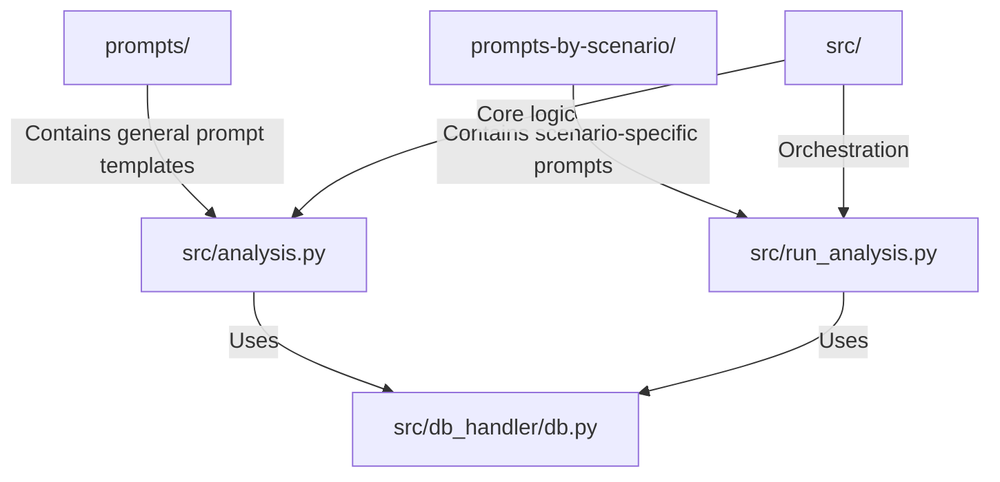
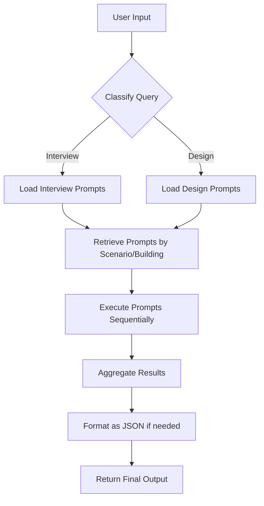
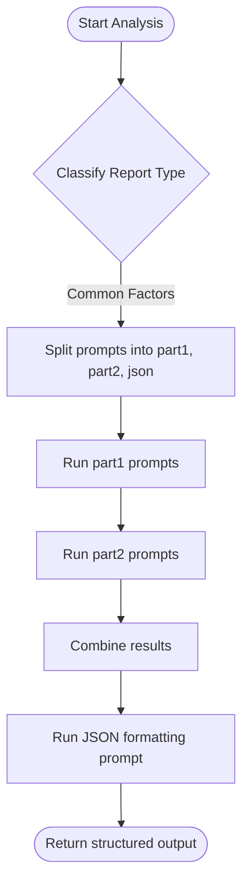
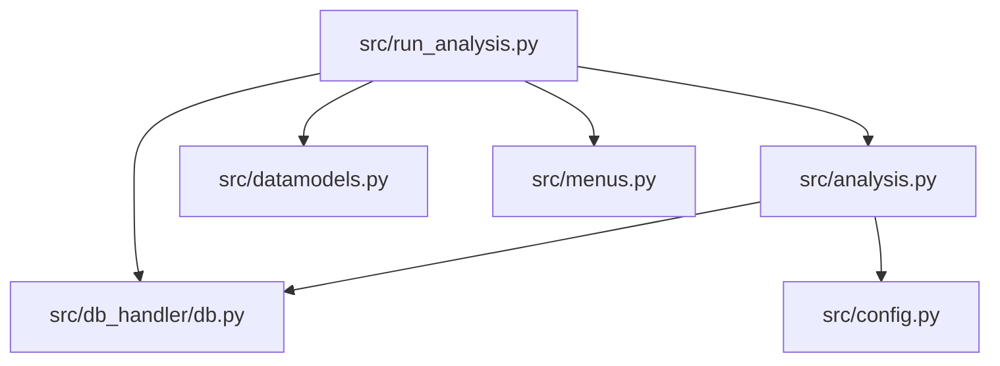

# Prompt Orchestration

<cite>
**Referenced Files in This Document**   
- [analysis.py](file://src/analysis.py#L1-L490)
- [run_analysis.py](file://src/run_analysis.py#L1-L343)
- [db.py](file://src/db_handler/db.py#L344-L383)
</cite>

## Table of Contents
1. [Introduction](#introduction)
2. [Project Structure](#project-structure)
3. [Core Components](#core-components)
4. [Architecture Overview](#architecture-overview)
5. [Detailed Component Analysis](#detailed-component-analysis)
6. [Dependency Analysis](#dependency-analysis)
7. [Conclusion](#conclusion)

## Introduction
This document provides a comprehensive analysis of the prompt orchestration system within the VoxPersona project. The system dynamically loads, composes, and executes prompts based on user-selected analysis types (interview or design audit) and business contexts (hotel, restaurant, spa). It leverages structured JSON prompts, RAG-based retrieval, and modular prompt organization to ensure reliable and context-aware LLM outputs. This documentation details the architecture, workflow, and implementation of the prompt orchestration logic, focusing on dynamic prompt selection, composition, error handling, and integration with external systems.

## Project Structure
The project is organized into modular directories that separate concerns such as prompts, scenario-specific configurations, and core application logic. The `prompts/` directory contains general-purpose prompt templates, while `prompts-by-scenario/` houses structured, scenario-specific prompts organized by analysis type and business context. The `src/` directory contains the core Python modules responsible for audio processing, analysis orchestration, database interaction, and utility functions.



**Diagram sources**
- [analysis.py](file://src/analysis.py#L1-L490)
- [run_analysis.py](file://src/run_analysis.py#L1-L343)
- [db.py](file://src/db_handler/db.py#L344-L383)

**Section sources**
- [analysis.py](file://src/analysis.py#L1-L490)
- [run_analysis.py](file://src/run_analysis.py#L1-L343)

## Core Components
The prompt orchestration system is driven by two primary components: `analysis.py` and `run_analysis.py`. These modules handle prompt loading, dynamic composition, LLM interaction, and result aggregation. The system uses a database-backed prompt management system to retrieve prompts based on scenario, report type, and building context.

Key functions include:
- `analyze_methodology`: Sequentially applies a list of prompts, chaining outputs.
- `run_analysis_with_spinner`: Orchestrates analysis passes with UI feedback.
- `fetch_prompts_for_scenario_reporttype_building`: Retrieves prompts from the database based on context.

**Section sources**
- [analysis.py](file://src/analysis.py#L1-L490)
- [run_analysis.py](file://src/run_analysis.py#L1-L343)

## Architecture Overview
The prompt orchestration system follows a modular, data-driven architecture where prompts are dynamically selected and composed based on user input and business context. The system supports two main analysis types: interview and design audit. Each analysis type is further specialized by business context (hotel, restaurant, spa) and report type (e.g., compliance, structured report).

The workflow begins with user input classification, followed by prompt retrieval from the database, prompt execution in sequence, and result formatting. The system supports both simple and multi-part analyses, where intermediate results are combined before final JSON formatting.



**Diagram sources**
- [run_analysis.py](file://src/run_analysis.py#L1-L343)
- [analysis.py](file://src/analysis.py#L1-L490)

## Detailed Component Analysis

### Prompt Loading and Selection
Prompts are retrieved from the PostgreSQL database using the `fetch_prompts_for_scenario_reporttype_building` function, which queries a normalized schema linking scenarios, report types, buildings, and prompts. The function returns a list of prompt texts, execution order (`run_part`), and a flag indicating whether the prompt should produce JSON output.

```python
def fetch_prompts_for_scenario_reporttype_building(cursor, scenario_name: str, report_type_desc: str, building_type: str):
    query = """
        SELECT DISTINCT p."prompt", p."run_part", p."is_json_prompt"
        FROM "scenario" s
        JOIN "report_type" rt ON s."scenario_id" = rt."scenario_id"
        JOIN "buildings_report_type" brt ON rt."report_type_id" = brt."report_type_id"
        JOIN "buildings" b ON brt."building_id" = b."building_id"
        JOIN "prompts_buildings" pb ON pb."building_id" = brt."building_id"
            AND pb."report_type_id" = brt."report_type_id"
        JOIN "prompts" p ON p."prompt_id" = pb."prompt_id"
        WHERE s."scenario_name" = %s
        AND rt."report_type_desc" = %s
        AND b."building_type" = %s
        ORDER BY p."run_part";
    """
    cursor.execute(query, (scenario_name, report_type_desc, building_type))
    rows = cursor.fetchall()
    result = [(row[0], row[1], row[2]) for row in rows]
    return result
```

This function ensures that only prompts relevant to the selected scenario, report type, and building context are loaded, enabling fine-grained control over prompt behavior.

**Section sources**
- [db.py](file://src/db_handler/db.py#L344-L383)

### Dynamic Prompt Composition and Execution
The `analyze_methodology` function in `analysis.py` executes a sequence of prompts, where the output of one prompt becomes the input to the next. This enables multi-stage reasoning and structured output generation.

```python
def analyze_methodology(text: str, prompt_list: list[tuple[str, int]]) -> str:
    current_response = None
    for prompt, _ in prompt_list:
        if current_response is None:
            messages = [{"role": "user", "content": [{"type": "text", "text": f"{prompt}\n\n{text}"}]}]
            current_response = send_msg_to_model(messages=messages)
        else:
            combined_prompt = f"{prompt}\n\nТекст:{current_response}"
            messages = [{"role": "user", "content": [{"type": "text", "text": combined_prompt}]}]
            current_response = send_msg_to_model(messages=messages)
    return current_response
```

This chaining mechanism allows for complex analysis workflows, such as first summarizing interview content, then extracting decision factors, and finally generating a structured JSON report.

**Section sources**
- [analysis.py](file://src/analysis.py#L1-L490)

### Multi-Part Analysis Workflow
For certain report types like "Information-about-common-decision-making-factors", the system performs a two-phase analysis. First, it runs separate analyses for "part1" and "part2" prompts (e.g., common factors and unexplored factors), then combines the results and runs a final JSON formatting prompt.

This is implemented in `run_analysis_with_spinner`, which:
1. Splits ordinary prompts by `run_part`
2. Executes part1 and part2 sequentially
3. Combines results
4. Runs JSON-formatted prompt on combined output

This ensures structured, machine-readable output while maintaining flexibility in prompt design.



**Diagram sources**
- [run_analysis.py](file://src/run_analysis.py#L1-L343)

## Dependency Analysis
The prompt orchestration system has a clear dependency hierarchy. The `run_analysis.py` module orchestrates the workflow and depends on `analysis.py` for core analysis functions and `db.py` for prompt retrieval. The `analysis.py` module handles LLM interactions and depends on `db.py` for prompt fetching and `config.py` for API keys.



This modular design allows for independent development and testing of components while maintaining a cohesive orchestration flow.

**Diagram sources**
- [run_analysis.py](file://src/run_analysis.py#L1-L343)
- [analysis.py](file://src/analysis.py#L1-L490)
- [db.py](file://src/db_handler/db.py#L344-L383)

## Conclusion
The prompt orchestration system in VoxPersona provides a robust, flexible framework for dynamic prompt composition and execution. By leveraging database-backed prompt management, sequential prompt chaining, and context-aware selection, the system delivers reliable, structured outputs tailored to specific business scenarios. The architecture supports easy extension with new scenarios, report types, and building contexts, making it scalable for future requirements. Error handling, logging, and fallback mechanisms ensure resilience in production environments.