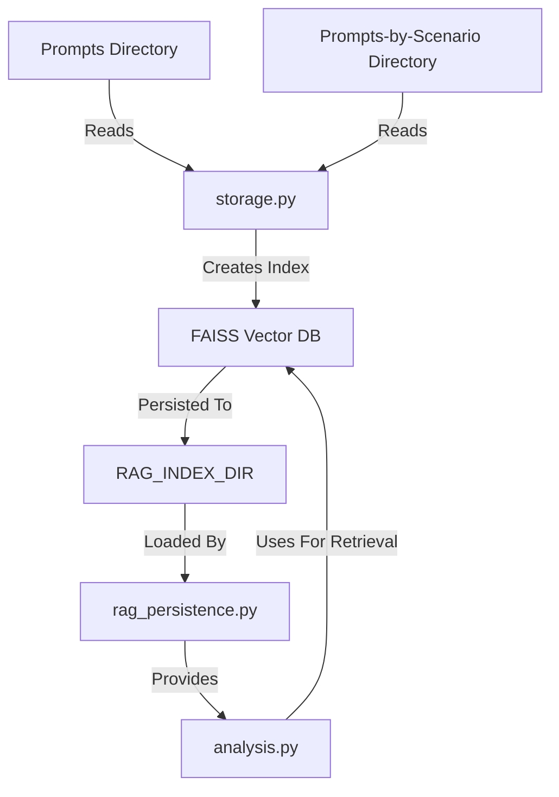
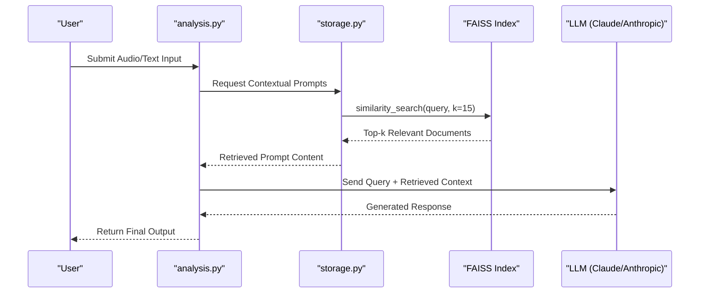
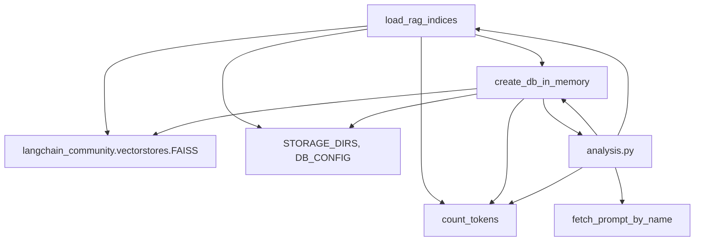

# RAG Integration

<cite>
**Referenced Files in This Document**   
- [rag_persistence.py](file://src/rag_persistence.py#L1-L36)
- [storage.py](file://src/storage.py#L1-L309)
- [analysis.py](file://src/analysis.py#L1-L490)
- [config.py](file://src/config.py)
- [utils.py](file://src/utils.py)
</cite>

## Table of Contents
1. [Introduction](#introduction)
2. [Project Structure](#project-structure)
3. [Core Components](#core-components)
4. [Architecture Overview](#architecture-overview)
5. [Detailed Component Analysis](#detailed-component-analysis)
6. [Dependency Analysis](#dependency-analysis)
7. [Performance Considerations](#performance-considerations)
8. [Troubleshooting Guide](#troubleshooting-guide)
9. [Conclusion](#conclusion)

## Introduction
This document provides a comprehensive overview of the Retrieval-Augmented Generation (RAG) integration within the VoxPersona system. The RAG subsystem enhances the accuracy and contextual relevance of Large Language Model (LLM) responses by retrieving scenario-specific prompts and audit reports from a vector database. This integration leverages FAISS for efficient similarity search and SentenceTransformers for generating high-quality text embeddings. The document details the initialization, persistence, retrieval, and application of these embeddings in the analysis pipeline.

## Project Structure
The project is organized into several key directories:
- `prompts/`: Contains general prompt templates used across scenarios.
- `prompts-by-scenario/`: Houses scenario-specific prompts categorized by functionality (e.g., design, interview).
- `src/`: Main source code directory containing core modules including `rag_persistence.py`, `storage.py`, and `analysis.py`.
- Configuration and deployment files (e.g., `Dockerfile`, `docker-compose.yml`) support containerized deployment.

The RAG system primarily interacts with the `prompts/` and `prompts-by-scenario/` directories to index prompt content and uses the `src/` modules for embedding generation, storage, and retrieval.



**Diagram sources**
- [rag_persistence.py](file://src/rag_persistence.py#L1-L36)
- [storage.py](file://src/storage.py#L1-L309)

**Section sources**
- [rag_persistence.py](file://src/rag_persistence.py#L1-L36)
- [storage.py](file://src/storage.py#L1-L309)

## Core Components
The RAG integration consists of three primary components:
1. **Embedding Model**: Utilizes SentenceTransformers via `get_embedding_model()` from `utils.py` to convert text into dense vector representations.
2. **Vector Database**: FAISS is used for storing and querying embeddings efficiently.
3. **Persistence Layer**: `rag_persistence.py` manages saving and loading FAISS indices to and from disk.

These components work together to enable fast, context-aware prompt retrieval during the analysis phase.

**Section sources**
- [rag_persistence.py](file://src/rag_persistence.py#L1-L36)
- [storage.py](file://src/storage.py#L1-L309)
- [analysis.py](file://src/analysis.py#L1-L490)

## Architecture Overview
The RAG architecture follows a pipeline pattern where prompts are preprocessed into embeddings, stored in a persistent FAISS index, and retrieved at query time to enrich LLM inputs.



**Diagram sources**
- [analysis.py](file://src/analysis.py#L1-L490)
- [storage.py](file://src/storage.py#L1-L309)

## Detailed Component Analysis

### rag_persistence.py: FAISS Index Management
This module handles the persistence of FAISS vector databases to disk, ensuring that embeddings are not regenerated on every application restart.

#### Key Functions:
- `save_rag_indices(rags: dict)`: Iterates over a dictionary of FAISS indices and saves each to a subdirectory under `RAG_INDEX_DIR`. It uses `safe_filename()` to sanitize directory names and removes any existing directory before saving.
- `load_rag_indices() -> dict`: Loads all FAISS indices from `RAG_INDEX_DIR`, reconstructing the embedding model and using `CustomSentenceTransformerEmbeddings` wrapper for compatibility.

```python
def save_rag_indices(rags: dict) -> None:
    for name, index in rags.items():
        if not hasattr(index, "save_local"):
            continue
        path = os.path.join(RAG_INDEX_DIR, safe_filename(name))
        shutil.rmtree(path, ignore_errors=True)
        index.save_local(path)
```

```python
def load_rag_indices() -> dict:
    model = get_embedding_model()
    embeddings = CustomSentenceTransformerEmbeddings(model)
    rags = {}
    for name in os.listdir(RAG_INDEX_DIR):
        path = os.path.join(RAG_INDEX_DIR, name)
        if not os.path.isdir(path):
            continue
        try:
            rags[name] = FAISS.load_local(path, embeddings)
        except Exception:
            continue
    return rags
```

**Section sources**
- [rag_persistence.py](file://src/rag_persistence.py#L1-L36)

### storage.py: Prompt Indexing and In-Memory Database Creation
This module contains logic for creating in-memory FAISS databases from markdown text, primarily used for dynamic context enrichment.

#### Key Function:
- `create_db_in_memory(markdown_text: str)`: Splits input text into chunks, generates embeddings using `CustomSentenceTransformerEmbeddings`, and constructs a FAISS index.

```python
def create_db_in_memory(markdown_text: str):
    chunks = split_markdown_text(markdown_text)
    chunks_documents = [Document(page_content=chunk) for chunk in chunks]
    model = get_embedding_model()
    embedding = CustomSentenceTransformerEmbeddings(model)
    db_index = FAISS.from_documents(documents=chunks_documents, embedding=embedding)
    return db_index
```

This function is critical for dynamically building context from audit reports or prompt files before retrieval.

**Section sources**
- [storage.py](file://src/storage.py#L1-L309)

### analysis.py: Contextual Retrieval and LLM Integration
This module orchestrates the RAG pipeline during analysis, retrieving relevant context and injecting it into LLM requests.

#### Key Function:
- `generate_db_answer(query: str, db_index, k: int=15)`: Performs a similarity search on the provided FAISS index, formats the top-k results, and sends them along with the user query to the LLM.

```python
def generate_db_answer(query: str, db_index, k: int=15, verbose: bool=True, model: str=REPORT_MODEL_NAME):
    system_prompt = """..."""
    similar_documents = db_index.similarity_search(query, k=k)
    message_content = "\n ".join([f'Отчет № {i+1}:\n' + doc.page_content for i, doc in enumerate(similar_documents)])
    messages = [{"role": "user", "content": f'Вопрос пользователя: {query}'}]
    response = send_msg_to_model(messages=messages, model=model, system=f'{system_prompt} Вот наиболее релевантные отчеты из бд: \n{message_content}')
    return response
```

This function demonstrates how retrieved prompts or audit reports are injected into the LLM request to improve response quality.

**Section sources**
- [analysis.py](file://src/analysis.py#L1-L490)

## Dependency Analysis
The RAG system relies on several internal and external dependencies:



**Diagram sources**
- [rag_persistence.py](file://src/rag_persistence.py#L1-L36)
- [storage.py](file://src/storage.py#L1-L309)
- [analysis.py](file://src/analysis.py#L1-L490)

## Performance Considerations
Several performance aspects are addressed in the RAG implementation:

- **Embedding Model Selection**: Uses SentenceTransformers for balanced speed and semantic accuracy.
- **Index Persistence**: FAISS indices are saved to disk via `save_rag_indices()` to avoid re-computation.
- **Query Latency Optimization**: Limits retrieval to top-k (default 15) results to manage context window size and reduce latency.
- **Token Management**: `count_tokens()` is used to estimate input size and prevent exceeding model limits.
- **Caching Strategy**: While no explicit cache is implemented, persistent FAISS indices serve as a form of long-term caching for prompt embeddings.
- **Error Handling**: Failed retrievals or low-similarity matches are handled gracefully by returning fallback messages like "Произошла ошибка при агрегации цитат."

## Troubleshooting Guide
Common issues and their resolutions:

- **Index Not Found**: Ensure `RAG_INDEX_DIR` exists and contains valid FAISS indices. Use `load_rag_indices()` to verify loading.
- **Low Similarity Matches**: Adjust query formulation or increase `k` value in `similarity_search()`.
- **Embedding Mismatch**: Confirm that the same `get_embedding_model()` is used for indexing and querying.
- **Disk Persistence Failure**: Check directory permissions and ensure `shutil.rmtree()` and `save_local()` execute without errors.
- **Memory Errors**: For large indexes, consider using approximate nearest neighbor (ANN) methods or batching queries.

**Section sources**
- [rag_persistence.py](file://src/rag_persistence.py#L1-L36)
- [storage.py](file://src/storage.py#L1-L309)
- [analysis.py](file://src/analysis.py#L1-L490)

## Conclusion
The RAG integration in VoxPersona significantly enhances the contextual awareness of the LLM by retrieving relevant prompts and audit reports based on input metadata and scenario. The system leverages FAISS for efficient similarity search and ensures persistence across sessions. By integrating with `analysis.py`, it dynamically enriches LLM inputs, improving the quality and relevance of generated responses. Future improvements could include query expansion, hybrid search (keyword + vector), and real-time index updates.