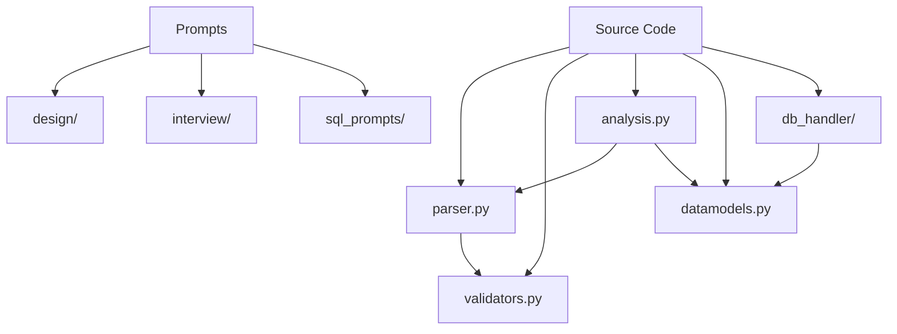
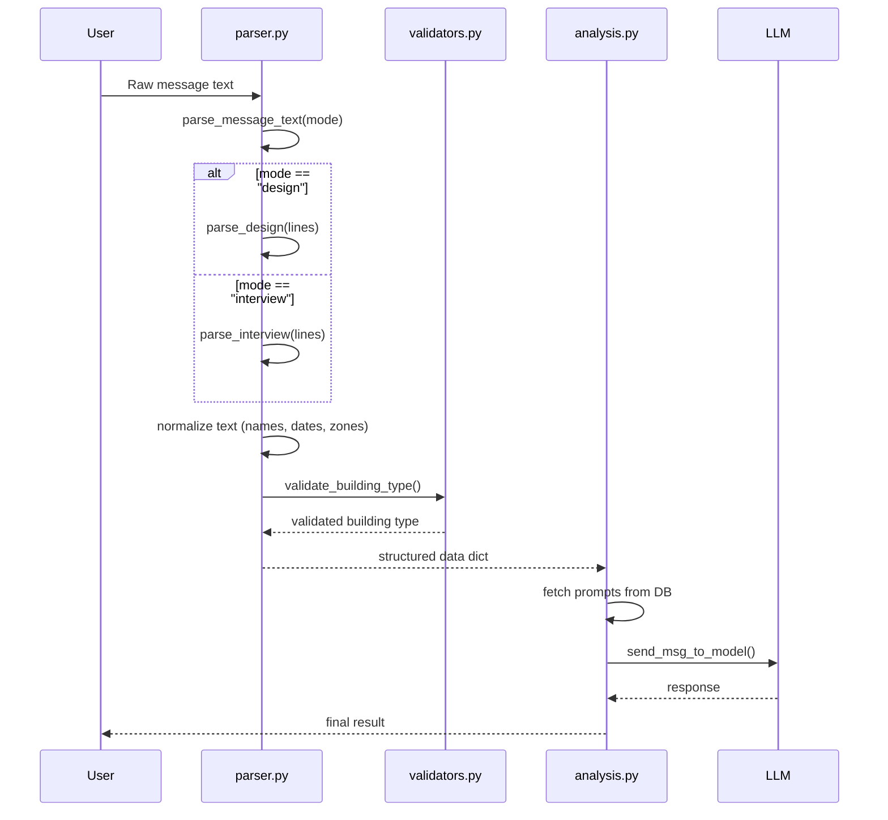
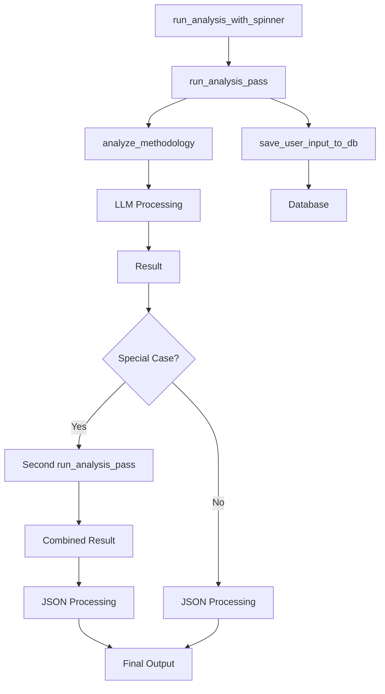
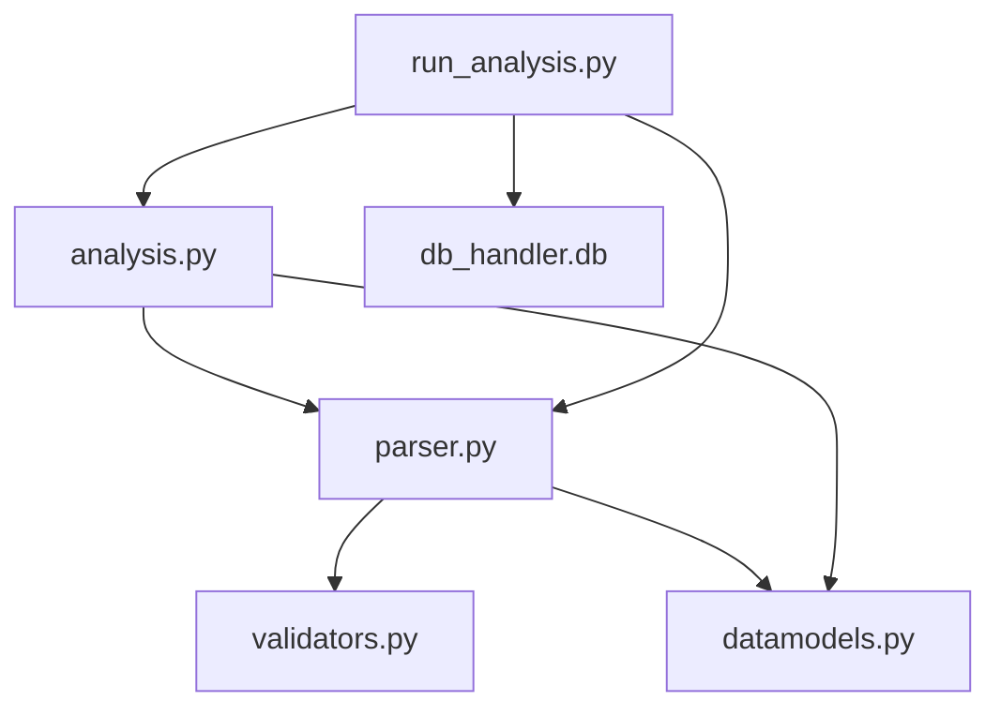

# Response Parsing

<cite>
**Referenced Files in This Document**   
- [parser.py](file://src/parser.py#L1-L174)
- [validators.py](file://src/validators.py#L1-L50)
- [analysis.py](file://src/analysis.py#L1-L491)
- [datamodels.py](file://src/datamodels.py#L1-L72)
</cite>

## Table of Contents
1. [Introduction](#introduction)
2. [Project Structure](#project-structure)
3. [Core Components](#core-components)
4. [Architecture Overview](#architecture-overview)
5. [Detailed Component Analysis](#detailed-component-analysis)
6. [Dependency Analysis](#dependency-analysis)
7. [Performance Considerations](#performance-considerations)
8. [Troubleshooting Guide](#troubleshooting-guide)
9. [Conclusion](#conclusion)

## Introduction
This document provides a comprehensive analysis of the response parsing sub-component in the VoxPersona project. It details how raw input messages are parsed into structured data, validated, and prepared for downstream processing by the LLM analysis pipeline. The focus is on the `parser.py` module and its integration with `validators.py`, `analysis.py`, and data models. The system handles two primary scenarios: "design" and "interview", each with distinct parsing logic and data requirements. The parsing process includes normalization of Russian text, schema validation, and error handling to ensure robust data processing.

## Project Structure
The project follows a modular structure with clear separation of concerns. The core parsing logic resides in the `src` directory, specifically in `parser.py`. This module depends on `validators.py` for data validation and `datamodels.py` for configuration and mappings. The overall structure is organized by functionality, with prompts separated by scenario and type, and source code components handling specific aspects of the application lifecycle.



**Diagram sources**
- [parser.py](file://src/parser.py#L1-L174)
- [validators.py](file://src/validators.py#L1-L50)
- [datamodels.py](file://src/datamodels.py#L1-L72)

**Section sources**
- [parser.py](file://src/parser.py#L1-L174)
- [validators.py](file://src/validators.py#L1-L50)

## Core Components
The core components of the response parsing system are `parser.py`, `validators.py`, and their integration with the analysis pipeline. The `parser.py` module contains functions for parsing message text into structured dictionaries based on the scenario type. It handles normalization of building types, zones, names, and dates. The `validators.py` module provides validation functions, particularly for building types and date formats. These components work together to ensure that input data is clean, consistent, and ready for LLM processing.

**Section sources**
- [parser.py](file://src/parser.py#L1-L174)
- [validators.py](file://src/validators.py#L1-L50)

## Architecture Overview
The response parsing architecture is a pipeline that transforms raw user input into validated, structured data. The process begins with `parse_message_text` in `parser.py`, which routes the input to either `parse_design` or `parse_interview` based on the mode. These functions extract fields, normalize text, and validate data using functions from `validators.py`. The resulting dictionary is then used by `run_analysis.py` to fetch appropriate prompts and initiate LLM analysis. The architecture is designed to be modular, with clear separation between parsing, validation, and analysis components.



**Diagram sources**
- [parser.py](file://src/parser.py#L1-L174)
- [validators.py](file://src/validators.py#L1-L50)
- [analysis.py](file://src/analysis.py#L1-L491)

## Detailed Component Analysis

### Parser Module Analysis
The `parser.py` module is responsible for extracting structured data from raw message text. It handles two main scenarios: "design" and "interview", each with different field requirements and parsing logic.

#### Parsing Logic and Data Normalization
The module includes several helper functions for normalizing and cleaning input data. These functions handle common text processing tasks such as removing prepositions, lemmatizing words, and standardizing case.

```mermaid
flowchart TD
A["parse_message_text(text, mode)"] --> B{mode == "design"?}
B --> |Yes| C["parse_design(lines)"]
B --> |No| D["parse_interview(lines)"]
C --> E["parse_file_number()"]
C --> F["parse_date()"]
C --> G["parse_name()"]
C --> H["parse_place_name()"]
C --> I["parse_building_type()"]
C --> J["parse_zone()"]
C --> K["parse_city()"]
D --> L["parse_file_number()"]
D --> M["parse_date()"]
D --> N["parse_name()"]
D --> O["parse_place_name()"]
D --> P["parse_building_info()"]
P --> Q["parse_zone()"]
P --> R["parse_building_type()"]
I --> S["validate_building_type()"]
R --> S
S --> T["validators.py"]
```

**Diagram sources**
- [parser.py](file://src/parser.py#L1-L174)

**Section sources**
- [parser.py](file://src/parser.py#L1-L174)

#### Data Validation and Error Handling
The `validators.py` module provides critical validation functions that ensure data integrity. The `validate_building_type` function standardizes building type names into a consistent format, which is essential for database lookups and report generation.

```python
def validate_building_type(building_type: str) -> str:
    building_type = building_type.lower()
    if 'отел' in building_type:
        return 'Отель'
    elif 'ресторан' in building_type:
        return 'Ресторан'
    elif 'центр здоров' in building_type or 'центре здоров' in building_type:
        return "Центр Здоровья"
    logging.warning(f"Не удалось спарсить тип заведения")
    return 
```

This function uses substring matching to identify building types, making it robust to variations in user input. It returns standardized names that match the database schema, ensuring consistency across the application.

**Section sources**
- [validators.py](file://src/validators.py#L1-L50)

### Integration with Analysis Pipeline
The parsed data is used by the analysis pipeline to determine which prompts to use and how to structure the LLM requests. The `run_analysis.py` module uses the parsed data to fetch appropriate prompts from the database and initiate the analysis process.

#### Scenario-Specific Processing
Different analysis types require distinct parsing strategies and processing flows. For example, the "Общие факторы" (Common Factors) report for interviews requires two separate analysis passes before generating a final JSON output.



**Diagram sources**
- [run_analysis.py](file://src/run_analysis.py#L1-L338)
- [analysis.py](file://src/analysis.py#L1-L491)

**Section sources**
- [run_analysis.py](file://src/run_analysis.py#L1-L338)

## Dependency Analysis
The response parsing system has a clear dependency hierarchy. The `parser.py` module depends on `validators.py` for data validation and uses functions from `datamodels.py` for configuration. The analysis pipeline in `analysis.py` depends on the output of `parser.py` to determine which prompts to use and how to structure the LLM requests.



**Diagram sources**
- [parser.py](file://src/parser.py#L1-L174)
- [validators.py](file://src/validators.py#L1-L50)
- [analysis.py](file://src/analysis.py#L1-L491)
- [datamodels.py](file://src/datamodels.py#L1-L72)

**Section sources**
- [parser.py](file://src/parser.py#L1-L174)
- [validators.py](file://src/validators.py#L1-L50)
- [analysis.py](file://src/analysis.py#L1-L491)

## Performance Considerations
The parsing system is designed to be lightweight and efficient, with minimal computational overhead. The text processing functions use regular expressions and simple string operations that are fast and memory-efficient. The system handles large responses by processing them in chunks when necessary, particularly in the LLM interaction components. Schema evolution is managed through the database-backed prompt system, allowing new analysis types to be added without code changes. The use of standardized data formats ensures compatibility across different components and reduces the risk of parsing errors.

## Troubleshooting Guide
Common issues in the response parsing system typically involve malformed input data or validation failures. The system includes comprehensive logging to help diagnose these issues. For example, if a building type cannot be validated, a warning is logged with the specific input that failed. Error recovery mechanisms include default values for optional fields and graceful degradation when non-critical data is missing. The system also includes retry logic for LLM interactions, with exponential backoff to handle rate limiting.

**Section sources**
- [validators.py](file://src/validators.py#L1-L50)
- [parser.py](file://src/parser.py#L1-L174)
- [analysis.py](file://src/analysis.py#L1-L491)

## Conclusion
The response parsing system in VoxPersona provides a robust foundation for processing user input and preparing it for LLM analysis. By separating parsing, validation, and analysis concerns, the system achieves high modularity and maintainability. The use of standardized data formats and comprehensive error handling ensures reliable operation across different scenarios and input conditions. The integration with the database-backed prompt system allows for flexible configuration and easy extension to support new analysis types.