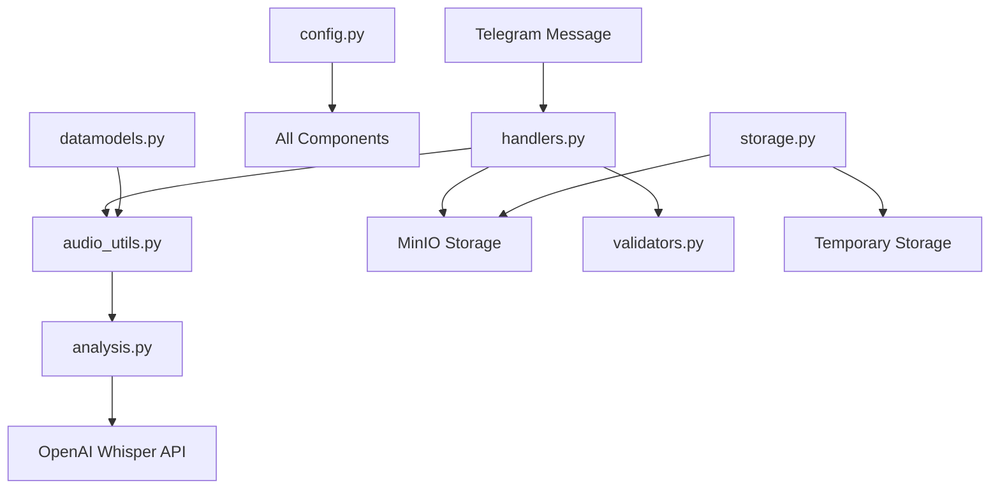
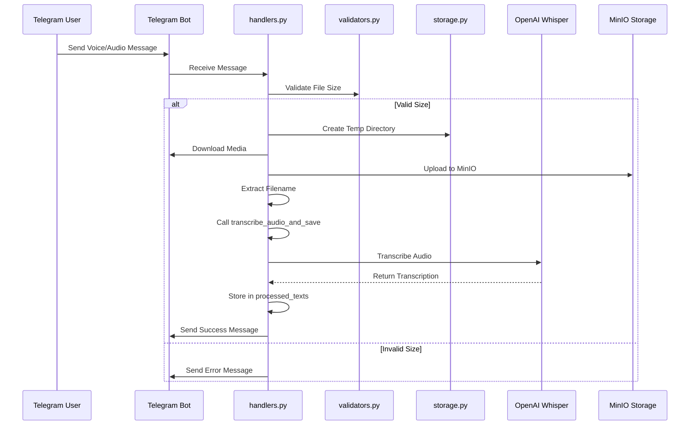
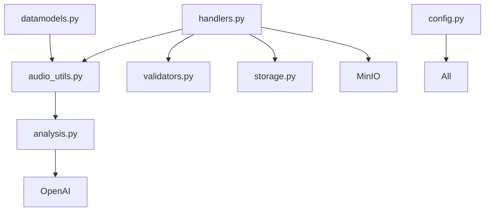

# Audio Processing

<cite>
**Referenced Files in This Document**   
- [audio_utils.py](file://src/audio_utils.py)
- [handlers.py](file://src/handlers.py)
- [analysis.py](file://src/analysis.py)
- [config.py](file://src/config.py)
- [storage.py](file://src/storage.py)
- [validators.py](file://src/validators.py)
- [datamodels.py](file://src/datamodels.py)
</cite>

## Table of Contents
1. [Introduction](#introduction)
2. [Project Structure](#project-structure)
3. [Core Components](#core-components)
4. [Architecture Overview](#architecture-overview)
5. [Detailed Component Analysis](#detailed-component-analysis)
6. [Dependency Analysis](#dependency-analysis)
7. [Performance Considerations](#performance-considerations)
8. [Troubleshooting Guide](#troubleshooting-guide)
9. [Conclusion](#conclusion)

## Introduction
This document provides a comprehensive overview of the audio processing sub-component within the VoxPersona system. It details how audio files are received via Telegram, validated for format and size, temporarily stored, and transcribed using OpenAI Whisper. The pipeline includes preprocessing, error handling, integration with message handlers, metadata preservation, and performance optimization. This guide is designed to be accessible to both technical and non-technical users.

## Project Structure
The audio processing functionality is distributed across several modules in the `src/` directory. Key files include:
- `audio_utils.py`: Handles audio extraction, size validation, and transcription coordination.
- `handlers.py`: Manages incoming Telegram messages, including audio, and orchestrates processing.
- `analysis.py`: Contains the core transcription logic using OpenAI Whisper.
- `config.py`: Stores configuration such as API keys, file paths, and size limits.
- `storage.py`: Manages temporary file handling and MinIO integration.
- `validators.py`: Validates audio file size and other constraints.
- `datamodels.py`: Defines constants like supported audio formats.



**Diagram sources**
- [handlers.py](file://src/handlers.py#L300-L400)
- [audio_utils.py](file://src/audio_utils.py#L1-L50)
- [analysis.py](file://src/analysis.py#L50-L100)
- [config.py](file://src/config.py#L1-L94)
- [storage.py](file://src/storage.py#L1-L50)
- [validators.py](file://src/validators.py#L1-L50)
- [datamodels.py](file://src/datamodels.py#L1-L72)

## Core Components
The audio processing pipeline consists of tightly integrated components responsible for receiving, validating, storing, and transcribing audio input from Telegram users.

### Audio Reception and Validation
Audio files are received through Telegram messages containing voice notes, audio files, or documents with supported extensions. The system uses a custom filter `openai_audio_filter` in `handlers.py` to identify valid audio inputs based on message type and file extension.

**Section sources**
- [handlers.py](file://src/handlers.py#L300-L350)
- [utils.py](file://src/utils.py#L50-L70)
- [datamodels.py](file://src/datamodels.py#L10-L15)

### Audio Metadata Extraction
The `extract_audio_filename` function in `audio_utils.py` generates a filename based on the message content. If the audio has a filename (e.g., uploaded audio), it uses that; otherwise, it generates a timestamp-based name for voice messages.

```python
def extract_audio_filename(message: Message) -> str:
    if message.audio and message.audio.file_name:
        return message.audio.file_name
    elif message.voice:
        current_time = datetime.now().strftime("%d-%m-%Y-%H-%M-%S")
        return f"voice_{current_time}.ogg"
    elif message.document and message.document.file_name:
        return message.document.file_name
    else:
        current_time = datetime.now().strftime("%d-%m-%Y-%H-%M-%S")
        return f"audio_{current_time}.mp3"
```

**Section sources**
- [audio_utils.py](file://src/audio_utils.py#L6-L35)

### Audio Size Validation
The `define_audio_file_params` function retrieves the file size from the Telegram message, while `check_audio_file_size` in `validators.py` enforces a 2GB maximum limit.

```python
def define_audio_file_params(message: Message) -> int:
    if message.voice:
        return message.voice.file_size
    if message.audio:
        return message.audio.file_size
    if message.document:
        return message.document.file_size
    raise ValueError("Message does not contain audio or voice")
```

**Section sources**
- [audio_utils.py](file://src/audio_utils.py#L37-L49)
- [validators.py](file://src/validators.py#L45-L50)

## Architecture Overview
The audio processing workflow follows a sequential pipeline from message reception to transcription storage.



**Diagram sources**
- [handlers.py](file://src/handlers.py#L300-L400)
- [audio_utils.py](file://src/audio_utils.py#L41-L50)
- [analysis.py](file://src/analysis.py#L50-L100)
- [storage.py](file://src/storage.py#L1-L50)

## Detailed Component Analysis

### Audio Transcription Pipeline
The transcription process is managed by `transcribe_audio_and_save` in `audio_utils.py`, which calls `transcribe_audio` from `analysis.py`. This function handles large files by chunking them into 3-minute segments.

```python
def transcribe_audio_raw(
    file_path: str,
    model_name: str = TRANSCRIBATION_MODEL_NAME,
    api_key: str = OPENAI_API_KEY,
    base_url: str = OPENAI_BASE_URL,
    chunk_length_ms: int = 3 * 60_000,
) -> str:
    sound = AudioSegment.from_file(file_path)
    duration_ms = len(sound)
    out_texts = []
    client = OpenAI(api_key=api_key, base_url=base_url)

    start_ms = 0
    end_ms = chunk_length_ms

    while start_ms < duration_ms:
        chunk = sound[start_ms:end_ms]
        start_ms = end_ms
        end_ms += chunk_length_ms

        chunk_io = io.BytesIO()
        chunk.export(chunk_io, format="mp3")
        chunk_io.seek(0)
        chunk_io.name = "chunk.mp3"

        try:
            response = client.audio.transcriptions.create(
                model=model_name,
                file=chunk_io
            )
            text_part = response.text
        except Exception as e:
            logging.error(f"Transcription error: {e}")
            text_part = ""

        out_texts.append(text_part)

    return " ".join(out_texts).strip()
```

**Section sources**
- [analysis.py](file://src/analysis.py#L50-L100)

### Error Handling
The system implements comprehensive error handling for various failure scenarios:

- **Unsupported Formats**: Handled by `openai_audio_filter` which only allows specific extensions.
- **Size Limit Exceeded**: `check_audio_file_size` raises a `ValueError` if file exceeds 2GB.
- **Whisper API Failure**: `transcribe_audio_raw` catches exceptions and returns empty text.
- **MinIO Upload Failure**: `handle_audio_msg` catches `S3Error` and notifies the user.
- **Timeout Scenarios**: The loading animation runs on a separate thread with a stop event.

```python
except S3Error as e:
    logging.error(f"Failed to upload file to MinIO: {e}")
    app.edit_message_text(c_id, msg_.id, "❌ Failed to upload file to MinIO.")
except OpenAIPermissionError:
    logging.exception("Whisper is unavailable (key/region).")
    app.edit_message_text(c_id, msg_.id, "❌ Whisper is unavailable.")
except Exception as e:
    logging.exception(f"Audio processing error: {e}")
    app.edit_message_text(c_id, msg_.id, "❌ Audio processing error")
```

**Section sources**
- [handlers.py](file://src/handlers.py#L380-L400)
- [analysis.py](file://src/analysis.py#L70-L90)

### Integration with Message Handling System
The `handle_audio_msg` function in `handlers.py` integrates audio processing with the main message flow. It updates user state, stores metadata, and triggers role assignment for interview scenarios.

```python
def handle_audio_msg(app: Client, message: Message, tmpdir: str="/root/Vox/VoxPersona/temp_audio", max_size: int=2 * 1024 * 1024 * 1024):
    # ... validation and download ...
    transcription_text = transcribe_audio_and_save(downloaded, c_id, processed_texts)
    handle_assign_roles(c_id, app, mode, processed_texts)
    st["step"] = "inputing_fields"
```

Audio metadata such as filename, size, and transcription text are preserved in global dictionaries (`processed_texts`, `user_states`) throughout the pipeline.

**Section sources**
- [handlers.py](file://src/handlers.py#L300-L400)

## Dependency Analysis
The audio processing component depends on several external services and internal modules.



**Diagram sources**
- [handlers.py](file://src/handlers.py#L1-L805)
- [audio_utils.py](file://src/audio_utils.py#L1-L50)
- [analysis.py](file://src/analysis.py#L1-L491)
- [config.py](file://src/config.py#L1-L94)
- [storage.py](file://src/storage.py#L1-L310)
- [validators.py](file://src/validators.py#L1-L50)
- [datamodels.py](file://src/datamodels.py#L1-L72)

## Performance Considerations
The system implements several performance optimizations:

- **Chunking**: Large audio files are split into 3-minute segments to avoid API timeouts and memory issues.
- **Threading**: Loading animations run on separate threads to prevent blocking the main event loop.
- **Memory Management**: Temporary files and directories are cleaned up after processing.
- **Concurrent Processing**: The system can handle multiple users simultaneously through Pyrogram's async architecture.
- **Latency Optimization**: Direct streaming to Whisper API without intermediate file writes.

The chunking strategy balances API limitations with processing efficiency. Each chunk is converted to MP3 format, which is optimal for Whisper's performance.

**Section sources**
- [analysis.py](file://src/analysis.py#L50-L100)
- [handlers.py](file://src/handlers.py#L300-L400)
- [storage.py](file://src/storage.py#L150-L200)

## Troubleshooting Guide
Common audio-related issues and their solutions:

### Low-Quality Recordings
- **Symptom**: Poor transcription accuracy
- **Solution**: Ensure recordings are made in quiet environments with clear speech
- **System Response**: The system will still process but accuracy may be reduced

### Speaker Separation Problems
- **Symptom**: Difficulty distinguishing between speakers
- **Solution**: The system uses `assign_roles` to identify speakers, but works best with clear turn-taking
- **Limitation**: Overlapping speech may not be properly separated

### Unsupported File Formats
- **Symptom**: "File not recognized" error
- **Supported Formats**: MP3, MP4, MPEG, MPGA, M4A, WAV, WEBM, OGG, FLAC
- **Solution**: Convert files to one of the supported formats before uploading

### Large File Processing
- **Maximum Size**: 2GB
- **Chunking**: Files >3 minutes are automatically split
- **Performance**: Processing time scales linearly with audio duration

### Authentication Issues
- **Symptom**: "Whisper unavailable" error
- **Cause**: Invalid or missing OpenAI API key
- **Solution**: Verify `OPENAI_API_KEY` in environment variables

**Section sources**
- [handlers.py](file://src/handlers.py#L380-L400)
- [analysis.py](file://src/analysis.py#L50-L100)
- [datamodels.py](file://src/datamodels.py#L10-L15)

## Conclusion
The audio processing component in VoxPersona provides a robust pipeline for handling audio input from Telegram. It integrates validation, temporary storage, transcription via OpenAI Whisper, and metadata preservation. The system handles edge cases through comprehensive error handling and provides feedback to users throughout the process. Performance is optimized through chunking and threading, while maintaining compatibility with various audio formats and sizes up to 2GB.