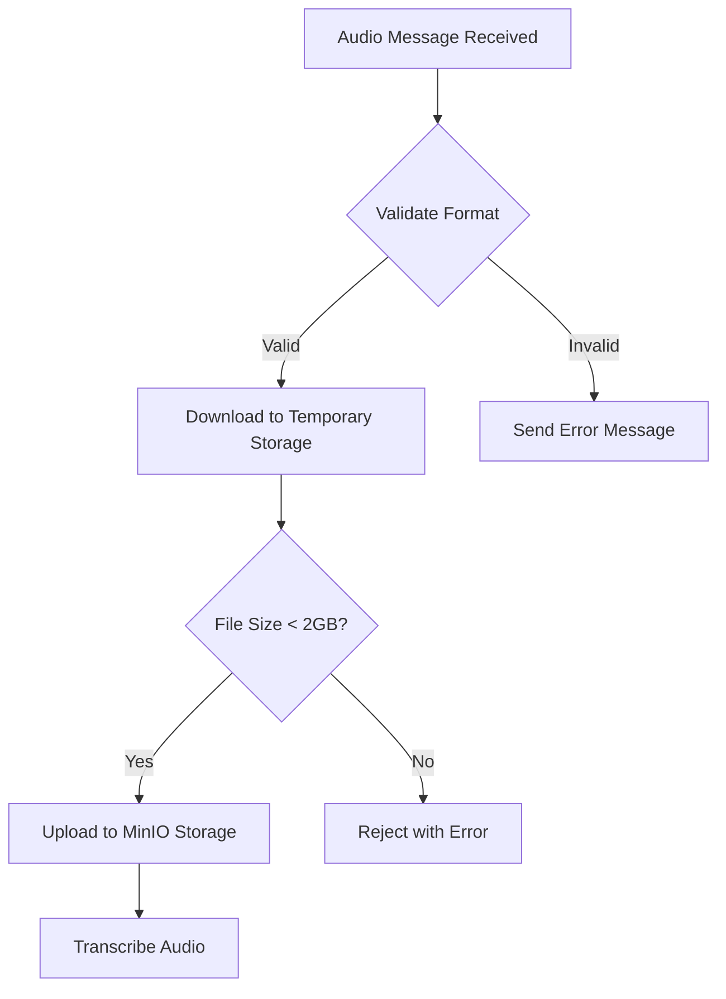
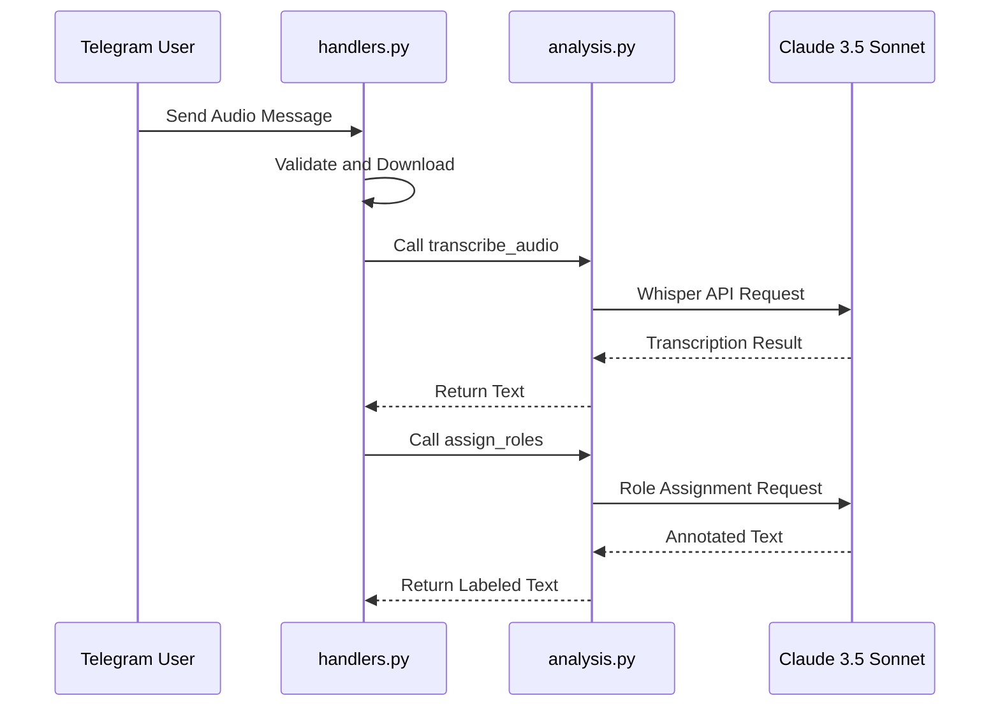
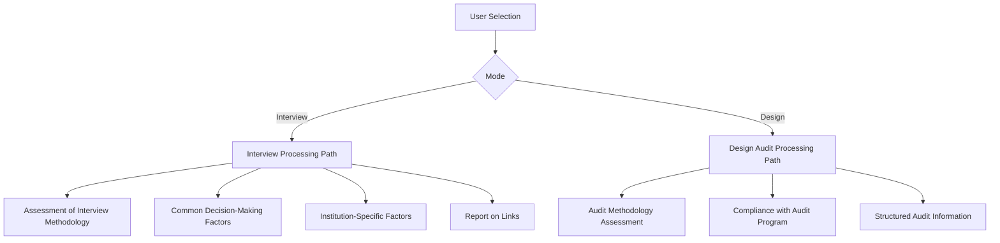
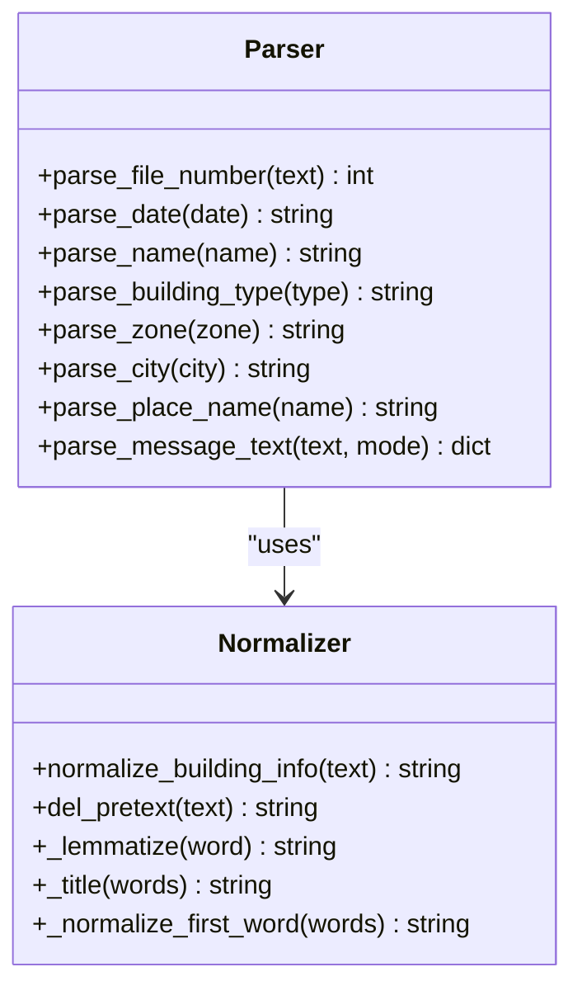
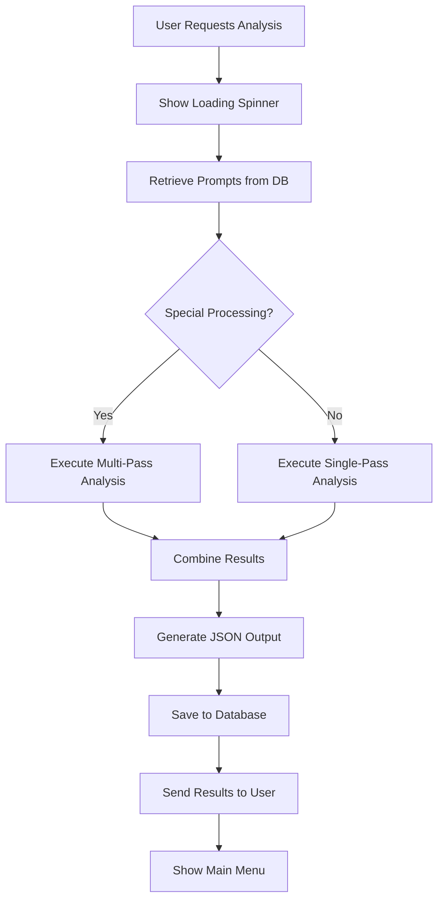
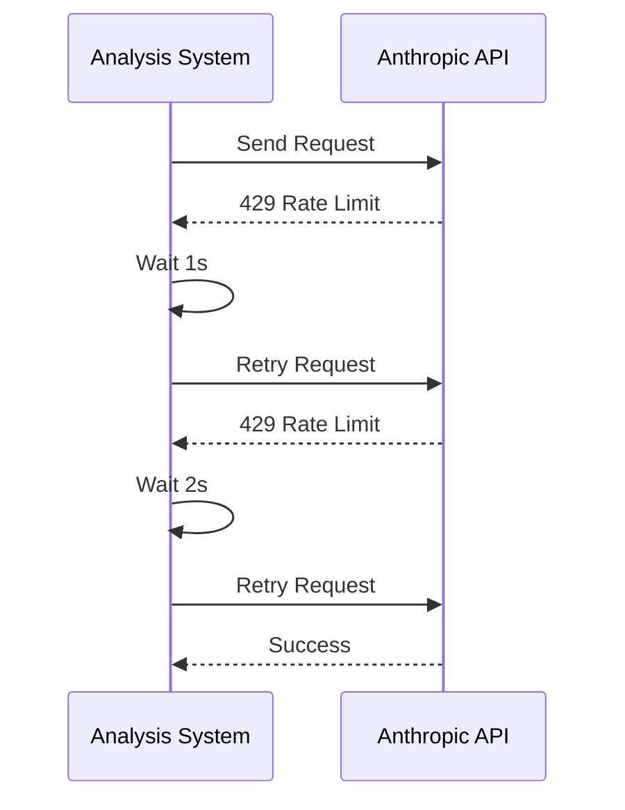
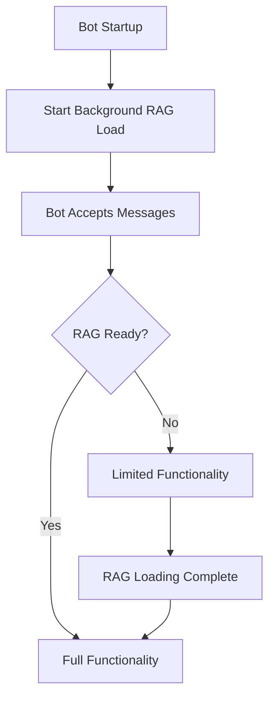
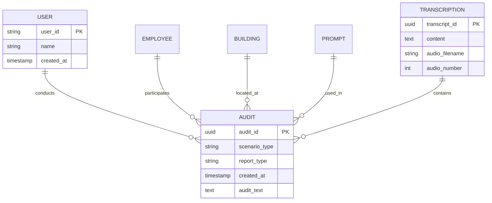

# Core Functionality

<cite>
**Referenced Files in This Document**   
- [main.py](file://src/main.py)
- [handlers.py](file://src/handlers.py)
- [audio_utils.py](file://src/audio_utils.py)
- [analysis.py](file://src/analysis.py)
- [run_analysis.py](file://src/run_analysis.py)
- [parser.py](file://src/parser.py)
- [README.md](file://README.md)
</cite>

## Table of Contents
1. [Introduction](#introduction)
2. [Audio Processing Workflow](#audio-processing-workflow)
3. [Analysis Pipeline Architecture](#analysis-pipeline-architecture)
4. [Interview vs Design Audit Processing Paths](#interview-vs-design-audit-processing-paths)
5. [Parser Module Functionality](#parser-module-functionality)
6. [Run Analysis Module](#run-analysis-module)
7. [Error Handling Mechanisms](#error-handling-mechanisms)
8. [Performance Optimization](#performance-optimization)
9. [Integration Points](#integration-points)
10. [Conclusion](#conclusion)

## Introduction
VoxPersona is an AI-powered voice analysis platform that transforms audio recordings into structured insights through automated transcription and intelligent analysis. The system leverages advanced AI technologies including OpenAI Whisper for speech-to-text conversion and Claude 3.5 Sonnet for content analysis. This document details the core functionality of the audio processing and analysis engine, focusing on the end-to-end workflow from audio message reception to final report generation.

**Section sources**
- [README.md](file://README.md#L1-L20)

## Audio Processing Workflow

### Audio Message Reception and Format Validation
The audio processing workflow begins with the reception of audio messages through the Telegram bot interface. The system accepts various audio formats including MP3, WAV, M4A, and OGG with a maximum file size of 50MB and duration up to 2 hours. The audio reception is handled by the `handle_audio_msg` function in handlers.py, which processes voice messages, audio files, and document-attached audio.



**Diagram sources**
- [handlers.py](file://src/handlers.py#L400-L499)
- [audio_utils.py](file://src/audio_utils.py#L30-L49)

### Transcription via Whisper
The transcription process utilizes OpenAI's Whisper model to convert speech to text. The `transcribe_audio_and_save` function in audio_utils.py orchestrates this process, calling the `transcribe_audio` function in analysis.py. For large audio files exceeding 3 minutes, the system automatically segments the audio into 3-minute chunks, processes each chunk individually, and combines the results to form a complete transcription.

The transcription workflow includes:
1. Audio file extraction using `extract_audio_filename`
2. File parameter determination via `define_audio_file_params`
3. Chunked processing for files longer than 3 minutes
4. MP3 format conversion for compatibility
5. API calls to OpenAI Whisper service
6. Result aggregation and storage

**Section sources**
- [audio_utils.py](file://src/audio_utils.py#L1-L49)
- [analysis.py](file://src/analysis.py#L100-L150)

## Analysis Pipeline Architecture

### Text Segmentation and Speaker Role Assignment
After transcription, the system performs text segmentation and speaker role assignment, particularly for interview scenarios. The `assign_roles` function in analysis.py analyzes the transcribed text to identify and label different speakers (e.g., interviewer, interviewee). This process enhances the quality of subsequent analysis by providing context about who said what.

The role assignment process follows these steps:
1. Raw transcription is passed to the role assignment prompt
2. The LLM analyzes speech patterns and contextual clues
3. Speakers are identified and labeled in the output
4. The annotated text replaces the original transcription



**Diagram sources**
- [handlers.py](file://src/handlers.py#L450-L480)
- [analysis.py](file://src/analysis.py#L450-L490)

### Prompt-Based LLM Analysis
The core analysis engine uses a sophisticated prompt-based system to extract insights from transcribed audio. The system retrieves scenario-specific prompts from the database based on the selected analysis type (interview or design audit) and building type (hotel, restaurant, spa). These prompts guide the LLM in performing specific analytical tasks such as methodology assessment, compliance checking, or factor identification.

The analysis process involves:
- Dynamic prompt retrieval from the database
- Sequential processing of multiple prompts
- Chaining analysis results (output of one prompt becomes input for the next)
- JSON-formatted output generation for structured data

**Section sources**
- [analysis.py](file://src/analysis.py#L1-L50)
- [run_analysis.py](file://src/run_analysis.py#L1-L50)

## Interview vs Design Audit Processing Paths

### Distinct Processing Paths
The system implements different processing paths for interview and design audit scenarios, each with specialized analysis objectives and output formats. The processing path is determined by the user's selection in the Telegram interface, which sets the `mode` parameter to either "interview" or "design".



**Diagram sources**
- [handlers.py](file://src/handlers.py#L300-L350)
- [run_analysis.py](file://src/run_analysis.py#L200-L250)

### Interview Analysis Path
The interview analysis path focuses on extracting insights from customer interviews, with specific reports including:
- **Methodology Assessment**: Evaluates the quality and effectiveness of the interview process
- **Common Factors**: Identifies general decision-making factors across multiple interviews
- **Specific Factors**: Extracts institution-specific decision criteria
- **Links Report**: Analyzes connections between different factors and themes

For the "Common Factors" analysis, the system implements a two-pass processing approach where it first generates reports on known factors, then analyzes for previously unidentified factors, combining both results for comprehensive insights.

### Design Audit Analysis Path
The design audit path evaluates architectural and design elements, with reports including:
- **Methodology Assessment**: Reviews the audit methodology and approach
- **Compliance Check**: Verifies adherence to audit programs and standards
- **Structured Information**: Provides organized data about audit findings

The design audit path requires additional data points such as city location, which is collected during the data input phase but not required for interview scenarios.

**Section sources**
- [run_analysis.py](file://src/run_analysis.py#L248-L338)
- [handlers.py](file://src/handlers.py#L200-L250)

## Parser Module Functionality

### Raw LLM Output Structuring
The parser.py module plays a critical role in structuring raw LLM output and user input data. It contains functions for parsing and normalizing various data types including file numbers, dates, names, and building types. The parser ensures data consistency and prepares information for database storage and analysis.

Key parsing functions include:
- `parse_file_number`: Extracts numeric file identifiers from text
- `parse_date`: Converts date strings to standardized format (YYYY-MM-DD)
- `parse_name`: Normalizes names with proper capitalization
- `parse_building_type`: Standardizes building type terminology
- `parse_zone`: Processes zone information and removes prepositions



**Diagram sources**
- [parser.py](file://src/parser.py#L1-L175)
- [validators.py](file://src/validators.py#L1-L50)

### Data Validation and Normalization
The parser implements robust validation and normalization routines to ensure data quality. For building types, it uses synonym mapping to convert variations (e.g., "отеле" → "отель") and validates against acceptable types. The module also handles edge cases such as missing zone information (represented by "-") and malformed date formats.

The `parse_message_text` function can parse structured text input containing multiple data fields, automatically extracting information based on the selected mode (interview or design). This allows users to input data in a formatted text block rather than answering individual questions.

**Section sources**
- [parser.py](file://src/parser.py#L1-L175)

## Run Analysis Module

### Multi-Stage Evaluation Coordination
The run_analysis.py module coordinates multi-stage evaluations and manages the overall analysis workflow. It contains the `run_analysis_with_spinner` function that orchestrates the entire analysis process, including progress indication, error handling, and result presentation.

The module implements several key functions:
- `run_analysis_pass`: Executes a single analysis pass with loading animation
- `run_analysis_with_spinner`: Coordinates complete analysis with user feedback
- `run_dialog_mode`: Handles conversational queries using RAG system
- `init_rags`: Initializes Retrieval-Augmented Generation models



**Diagram sources**
- [run_analysis.py](file://src/run_analysis.py#L1-L344)

### Handler Function Invocation
Handler functions in handlers.py invoke the analysis pipeline through callback queries. When a user selects a report type, the `handle_report` function processes the request, determines the appropriate processing path, and calls `run_analysis_with_spinner` with the necessary parameters.

The handler first checks if building type information is available. If not, it prompts the user to select a building type before proceeding with the analysis. This ensures that the correct prompts are retrieved from the database based on the specific building type (hotel, restaurant, or spa).

**Section sources**
- [run_analysis.py](file://src/run_analysis.py#L1-L344)
- [handlers.py](file://src/handlers.py#L350-L400)

## Error Handling Mechanisms

### Transcription Failures
The system implements comprehensive error handling for transcription failures. When Whisper API calls fail, the system catches `OpenAIPermissionError` exceptions and notifies the user with an appropriate error message. Common causes include invalid API keys or regional restrictions.

```python
except OpenAIPermissionError:
    logging.exception("🚫 Ошибка: Whisper недоступен (ключ/регион).")
    app.edit_message_text(c_id, msg_.id, "❌ Ошибка обработки аудио")
```

### API Rate Limit Handling
For LLM analysis, the system handles rate limiting through exponential backoff strategies. When encountering `RateLimitError` from the Anthropic API, the `send_msg_to_model` function implements a retry mechanism with doubling wait times (1s, 2s, 4s, etc.) up to a maximum of 16 seconds.

The system also distributes requests across multiple API keys to mitigate rate limiting:
- Primary model: 80,000 tokens/minute, 2,000 requests/minute
- Secondary models: 20,000 tokens/minute, 50 requests/minute each

This multi-key approach allows the system to handle high request volumes while respecting individual API rate limits.



**Diagram sources**
- [analysis.py](file://src/analysis.py#L400-L450)
- [run_analysis.py](file://src/run_analysis.py#L100-L150)

**Section sources**
- [analysis.py](file://src/analysis.py#L400-L450)
- [run_analysis.py](file://src/run_analysis.py#L100-L150)

## Performance Optimization

### Large Audio File Processing
For large audio files, the system implements several optimization strategies:
- **Chunked Processing**: Audio is divided into 3-minute segments to avoid API timeouts
- **Parallel Transcription**: Multiple audio files can be processed concurrently
- **Background RAG Initialization**: Retrieval-Augmented Generation models are loaded asynchronously to avoid blocking bot startup
- **Periodic RAG Saving**: RAG indices are automatically saved every 15 minutes to prevent data loss

The `transcribe_audio_raw` function handles large files by:
1. Loading the audio file into memory
2. Splitting it into 3-minute chunks
3. Converting each chunk to MP3 format
4. Processing chunks sequentially with error handling
5. Combining results into a single transcription

### Concurrent Processing
The system supports concurrent processing through:
- Asynchronous RAG operations using asyncio
- Threaded loading animations to maintain responsiveness
- Non-blocking database operations
- Efficient resource management with connection pooling

The main.py file implements background RAG initialization that doesn't block bot startup, allowing the system to become operational while models continue loading in the background.



**Diagram sources**
- [main.py](file://src/main.py#L1-L95)
- [audio_utils.py](file://src/audio_utils.py#L1-L50)

**Section sources**
- [main.py](file://src/main.py#L1-L95)
- [audio_utils.py](file://src/audio_utils.py#L1-L50)

## Integration Points

### RAG System Integration
The system integrates a Retrieval-Augmented Generation (RAG) system for enhanced analysis capabilities. The RAG system is initialized in main.py and managed through handlers.py. It provides two search modes:
- **Fast Search**: Uses vector similarity search for quick answers
- **Deep Search**: Performs comprehensive analysis across multiple reports

The RAG system is built from structured reports grouped by scenario and report type, creating in-memory databases for efficient querying. The `init_rags` function creates separate RAG instances for different analysis categories including "Интервью" (Interview) and "Дизайн" (Design).

### Database Integration
The system integrates with PostgreSQL for persistent storage of:
- Audit records
- Transcriptions
- Prompts
- Client information
- Employee data
- Building types
- Analysis scenarios

The db_handler module manages database connections and operations, with functions to fetch prompts by name and store analysis results. The `save_user_input_to_db` function in run_analysis.py saves completed analyses to the database with all relevant metadata.



**Diagram sources**
- [db_handler/db.py](file://src/db_handler/db.py#L1-L50)
- [run_analysis.py](file://src/run_analysis.py#L1-L50)

**Section sources**
- [db_handler/db.py](file://src/db_handler/db.py#L1-L50)
- [run_analysis.py](file://src/run_analysis.py#L1-L50)

## Conclusion
The VoxPersona audio processing and analysis engine demonstrates a sophisticated architecture for transforming voice recordings into actionable insights. The system effectively combines speech-to-text technology with advanced LLM analysis, implementing distinct processing paths for interview and design audit scenarios. Key strengths include robust error handling, performance optimizations for large files, and seamless integration with RAG and database systems. The modular design allows for easy extension of analysis capabilities through additional prompts and scenarios, making it a flexible platform for voice-based data analysis.