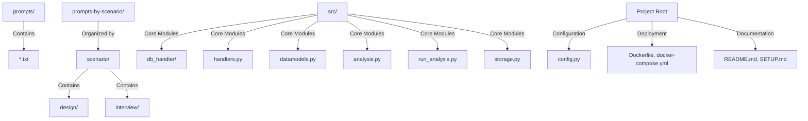
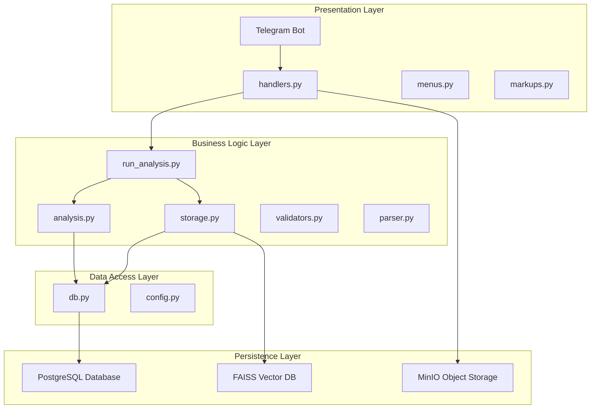
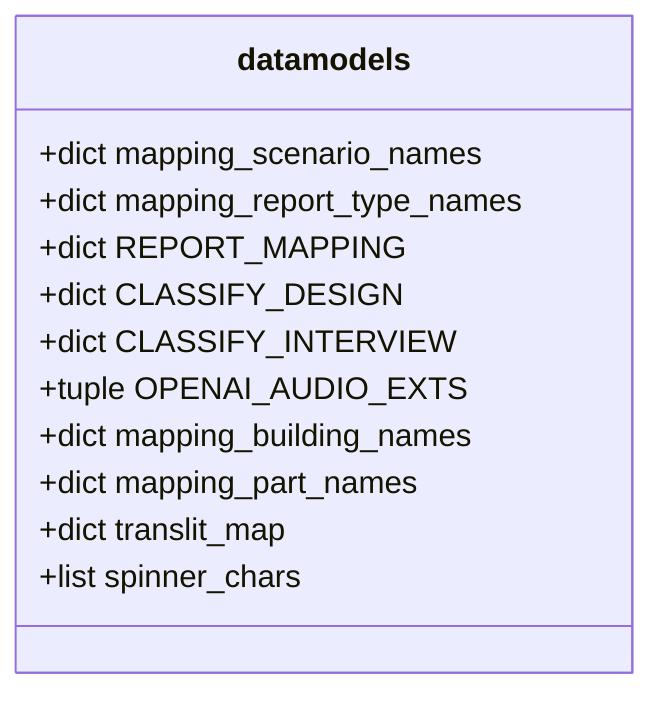
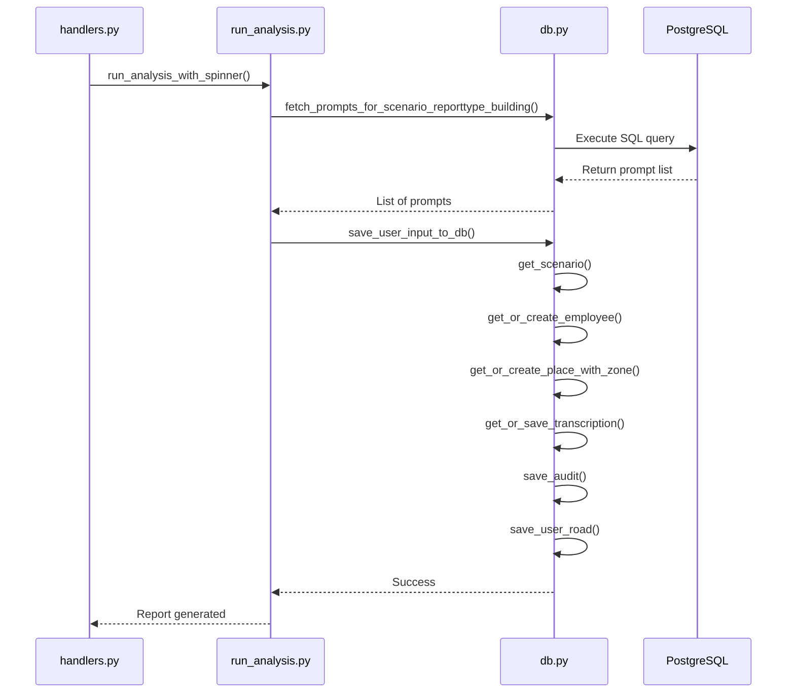
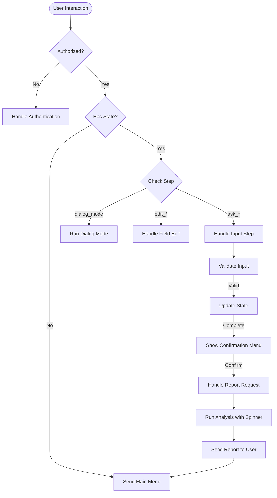
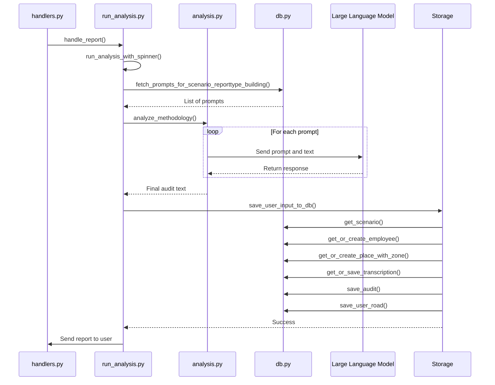
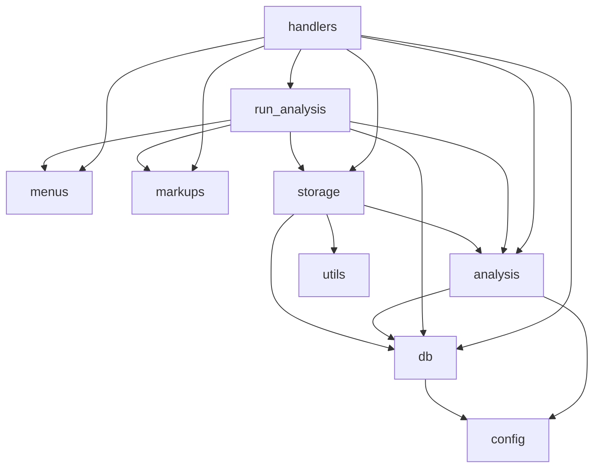

# Reporting System

<cite>
**Referenced Files in This Document**   
- [datamodels.py](file://src/datamodels.py)
- [db.py](file://src/db_handler/db.py)
- [handlers.py](file://src/handlers.py)
- [markups.py](file://src/markups.py)
- [menus.py](file://src/menus.py)
- [run_analysis.py](file://src/run_analysis.py)
- [analysis.py](file://src/analysis.py)
- [storage.py](file://src/storage.py)
</cite>

## Table of Contents
1. [Introduction](#introduction)
2. [Project Structure](#project-structure)
3. [Core Components](#core-components)
4. [Architecture Overview](#architecture-overview)
5. [Detailed Component Analysis](#detailed-component-analysis)
6. [Dependency Analysis](#dependency-analysis)
7. [Performance Considerations](#performance-considerations)
8. [Troubleshooting Guide](#troubleshooting-guide)
9. [Conclusion](#conclusion)

## Introduction
The Reporting System is a core sub-component of the VoxPersona application, designed to process audio and text inputs, generate structured analytical reports, persist them into a PostgreSQL database, and deliver results to users via a Telegram interface. The system supports two primary scenarios: "Interview" and "Design", each with multiple report types such as methodology assessment, compliance checks, and structured audits. It leverages Large Language Models (LLMs) to analyze transcribed dialogues, applies a series of prompts to extract insights, and formats the output for user consumption. This document details the data flow, key components, error handling, and integration points that enable the system to function as a cohesive reporting engine.

## Project Structure
The project is organized in a modular fashion, with distinct directories for prompts, source code, and configuration. The `prompts` directory contains plain text files that define the instructions sent to the LLM for various analysis tasks. The `prompts-by-scenario` directory further categorizes these prompts by scenario, report type, and building type, ensuring context-specific analysis. The `src` directory houses all Python modules, including handlers for user interaction, database operations, data models, and analysis logic. Configuration files and deployment scripts are located at the root level, facilitating setup and containerization.

**Diagram sources**
- [src/datamodels.py](file://src/datamodels.py#L0-L71)
- [src/db_handler/db.py](file://src/db_handler/db.py#L0-L399)

## Core Components
The core components of the Reporting System include the data models defined in `datamodels.py`, the database interaction layer in `db.py`, the user interaction handlers in `handlers.py`, and the analysis engine in `run_analysis.py`. These components work in concert to collect user input, process audio, generate reports, and store the results. The system uses a state machine pattern in `user_states` to manage the multi-step data collection process from users. The `rags` dictionary holds in-memory vector databases for fast information retrieval during the dialog mode. The integration between these components ensures a seamless flow from user input to final report delivery.

**Section sources**
- [src/datamodels.py](file://src/datamodels.py#L0-L71)
- [src/db_handler/db.py](file://src/db_handler/db.py#L0-L399)
- [src/handlers.py](file://src/handlers.py#L0-L799)
- [src/run_analysis.py](file://src/run_analysis.py#L0-L344)

## Architecture Overview
The system architecture is a layered design with clear separation of concerns. The presentation layer is the Telegram bot interface, managed by `handlers.py` and `menus.py`. The business logic layer handles report generation, state management, and prompt orchestration, primarily in `run_analysis.py` and `analysis.py`. The data access layer, implemented in `db.py`, provides a transactional interface to the PostgreSQL database. The persistence layer uses MinIO for storing raw audio files and FAISS for in-memory vector databases. The architecture supports two main workflows: the report generation workflow and the dialog mode workflow, both of which are initiated from the Telegram interface.

**Diagram sources**
- [src/handlers.py](file://src/handlers.py#L0-L799)
- [src/run_analysis.py](file://src/run_analysis.py#L0-L344)
- [src/analysis.py](file://src/analysis.py#L0-L491)
- [src/storage.py](file://src/storage.py#L0-L310)
- [src/db_handler/db.py](file://src/db_handler/db.py#L0-L399)

## Detailed Component Analysis

### Data Models and Mappings
The `datamodels.py` file defines critical mappings between internal codes and human-readable labels for scenarios, report types, and building types. These mappings are used throughout the system to ensure consistent labeling in user interfaces and database entries. The `REPORT_MAPPING` dictionary translates callback data from the Telegram interface into report type descriptions, while `mapping_scenario_names` converts between "interview"/"design" codes and their Russian equivalents. The `CLASSIFY_DESIGN` and `CLASSIFY_INTERVIEW` dictionaries are used to map numeric classifications from the LLM to specific report types.

**Diagram sources**
- [src/datamodels.py](file://src/datamodels.py#L0-L71)

### Database Interaction Layer
The `db.py` file implements a robust database interaction layer using the psycopg2 library. It features a `@db_transaction` decorator that ensures all database operations are performed within a transaction context, automatically handling connection and cursor management. The module provides functions to create or retrieve database records for clients, employees, places, zones, and cities, ensuring data consistency. The `save_user_road` function captures the complete context of a user's analysis session, linking the audit to its scenario, report type, and building type. The `fetch_prompts_for_scenario_reporttype_building` function dynamically retrieves the appropriate prompts based on the current analysis context.

#### Sequence Diagram for Database Operations

**Diagram sources**
- [src/db_handler/db.py](file://src/db_handler/db.py#L0-L399)
- [src/run_analysis.py](file://src/run_analysis.py#L0-L344)

### User Interaction and State Management
The `handlers.py` file manages all user interactions through the Telegram bot. It uses a `user_states` dictionary to maintain the state of each user session, tracking the current step in the data collection process. The state machine supports multiple modes: "interview" and "design", each with its own data collection flow. The handler processes text messages, audio files, and callback queries, directing the flow based on the current state. For audio files, it downloads the media, uploads it to MinIO, transcribes it, and optionally assigns roles in the dialogue. The `handle_report` function processes user requests for specific reports, validating the collected data and initiating the analysis process.

#### Flowchart for User Interaction

**Diagram sources**
- [src/handlers.py](file://src/handlers.py#L0-L799)
- [src/menus.py](file://src/menus.py#L0-L94)
- [src/markups.py](file://src/markups.py#L0-L133)

### Report Generation Engine
The `run_analysis.py` file contains the core report generation engine. The `run_analysis_with_spinner` function orchestrates the entire analysis process, showing a loading animation to the user while the report is generated. It retrieves the appropriate prompts from the database based on the scenario, report type, and building type, then passes them to `analyze_methodology` in `analysis.py`. For complex reports like "Information-about-common-decision-making-factors", it performs multiple analysis passes (part1, part2) before combining the results into a final JSON output. The `save_user_input_to_db` function in `storage.py` is called to persist the final report along with all contextual metadata.

#### Sequence Diagram for Report Generation

**Diagram sources**
- [src/run_analysis.py](file://src/run_analysis.py#L0-L344)
- [src/analysis.py](file://src/analysis.py#L0-L491)
- [src/storage.py](file://src/storage.py#L0-L310)
- [src/db_handler/db.py](file://src/db_handler/db.py#L0-L399)

## Dependency Analysis
The system has a well-defined dependency graph with clear boundaries between components. The `handlers.py` module depends on `run_analysis.py` for report generation, `menus.py` and `markups.py` for UI elements, and `db.py` for data persistence. The `run_analysis.py` module depends on `analysis.py` for LLM interactions and `storage.py` for database operations. The `analysis.py` module depends on `db.py` for prompt retrieval and `config.py` for API keys. There are no circular dependencies, and external dependencies are managed through configuration files. The use of decorators in `db.py` reduces code duplication and ensures consistent transaction handling.

**Diagram sources**
- [src/handlers.py](file://src/handlers.py#L0-L799)
- [src/run_analysis.py](file://src/run_analysis.py#L0-L344)
- [src/analysis.py](file://src/analysis.py#L0-L491)
- [src/storage.py](file://src/storage.py#L0-L310)
- [src/db_handler/db.py](file://src/db_handler/db.py#L0-L399)

## Performance Considerations
The system employs several strategies to maintain performance. The use of in-memory vector databases (FAISS) enables fast information retrieval during the dialog mode. The `run_deep_search` function in `run_analysis.py` uses asynchronous processing with multiple API keys to parallelize requests and avoid rate limits. The audio transcription process in `analysis.py` splits large audio files into chunks, allowing for incremental processing and reducing memory usage. The database queries are optimized with proper indexing, and the `fetch_prompts_for_scenario_reporttype_building` function uses a single complex query to retrieve all necessary prompts. However, potential bottlenecks include the sequential processing of prompts in `analyze_methodology` and the synchronous nature of some database operations.

## Troubleshooting Guide
Common issues in the Reporting System include authentication failures, audio processing errors, and LLM connectivity problems. Authentication issues are typically due to incorrect passwords or unauthorized user IDs in the `authorized_users` list. Audio processing failures can occur if the file size exceeds 2GB or if the Whisper API is unavailable. LLM errors, such as "LLM недоступна (ключ/регион)", indicate problems with the Anthropic API keys or network connectivity. Database errors may arise from invalid IDs or missing prompt configurations. The system logs detailed error messages, which should be checked first when troubleshooting. For report generation issues, verify that the correct prompts exist in the database for the selected scenario, report type, and building type.

**Section sources**
- [src/handlers.py](file://src/handlers.py#L0-L799)
- [src/analysis.py](file://src/analysis.py#L0-L491)
- [src/db_handler/db.py](file://src/db_handler/db.py#L0-L399)

## Conclusion
The Reporting System is a sophisticated component that integrates user interaction, audio processing, LLM analysis, and database persistence to deliver actionable insights through a Telegram interface. Its modular design allows for easy extension and maintenance. The system effectively handles the complexity of multi-step user interactions and context-specific report generation. By leveraging in-memory databases and asynchronous processing, it maintains good performance even with large datasets. Future improvements could include caching of frequently used reports, more sophisticated error recovery, and support for additional output formats or delivery channels.