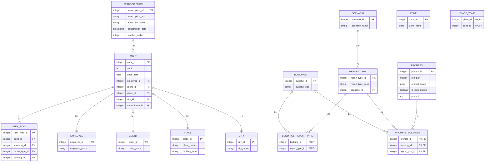

# Database Schema Design

<cite>
**Referenced Files in This Document**   
- [db.py](file://src/db_handler/db.py)
- [fill_prompts_table.py](file://src/db_handler/fill_prompts_table.py)
- [datamodels.py](file://src/datamodels.py)
- [storage.py](file://src/storage.py)
- [step_2_sql_request.txt](file://prompts-by-scenario/sql_prompts/part2/step_2_sql_request.txt)
</cite>

## Table of Contents
1. [Introduction](#introduction)
2. [Core Data Tables](#core-data-tables)
3. [Entity Relationship Diagram](#entity-relationship-diagram)
4. [Table Definitions and Field Descriptions](#table-definitions-and-field-descriptions)
5. [Indexing and Performance Optimization](#indexing-and-performance-optimization)
6. [Transaction Management](#transaction-management)
7. [Data Lifecycle and Retention](#data-lifecycle-and-retention)
8. [Prompts Initialization Process](#prompts-initialization-process)
9. [Sample Queries](#sample-queries)
10. [Conclusion](#conclusion)

## Introduction
The VoxPersona database schema is designed to support audio transcription analysis, audit reporting, and user journey tracking across multiple business verticals including hotels, restaurants, and health centers. The schema captures transcribed audio content, stores analytical reports, tracks user interaction paths, and manages prompt templates used for AI-driven analysis. This document provides comprehensive documentation of the database structure, entity relationships, and operational workflows that enable the application's core functionality.

## Core Data Tables
The database schema consists of several interconnected tables that store transcription data, audit reports, user journey information, and analysis prompts. The core tables include:
- **transcription**: Stores processed audio text with metadata
- **audit**: Contains generated audit reports linked to transcriptions
- **user_road**: Tracks user journeys through different scenarios and report types
- **prompts**: Holds template instructions for analysis processes

These tables are interconnected through foreign key relationships that maintain referential integrity and support complex querying patterns.

**Section sources**
- [step_2_sql_request.txt](file://prompts-by-scenario/sql_prompts/part2/step_2_sql_request.txt#L28-L55)
- [step_2_sql_request.txt](file://prompts-by-scenario/sql_prompts/part2/step_2_sql_request.txt#L94-L131)

## Entity Relationship Diagram



**Diagram sources**
- [db.py](file://src/db_handler/db.py#L273-L320)
- [step_2_sql_request.txt](file://prompts-by-scenario/sql_prompts/part2/step_2_sql_request.txt#L28-L55)
- [step_2_sql_request.txt](file://prompts-by-scenario/sql_prompts/part2/step_2_sql_request.txt#L94-L131)

## Table Definitions and Field Descriptions

### transcription Table
Stores processed audio transcription data with metadata for traceability.

**Fields:**
- `transcription_id`: Primary key, unique identifier for each transcription
- `transcription_text`: Text content of the transcribed audio
- `audio_file_name`: Original audio file name for reference
- `transcription_date`: Timestamp when transcription was created
- `number_audio`: Sequence number for audio files

**Constraints:** Unique constraint on (`transcription_text`, `audio_file_name`)

**Section sources**
- [db.py](file://src/db_handler/db.py#L297-L320)

### audit Table
Contains generated audit reports derived from transcription analysis.

**Fields:**
- `audit_id`: Primary key, unique identifier for each audit
- `audit`: Text content of the audit report
- `employee_id`: Foreign key referencing employee who conducted the audit
- `client_id`: Foreign key referencing client associated with the audit
- `place_id`: Foreign key referencing location where audit was conducted
- `city_id`: Foreign key referencing city of the audit location
- `transcription_id`: Foreign key linking to source transcription
- `audit_date`: Date when the audit was performed

**Constraints:** All foreign key constraints enforced

**Section sources**
- [db.py](file://src/db_handler/db.py#L273-L298)
- [storage.py](file://src/storage.py#L131-L164)

### user_road Table
Tracks the user's journey through different analysis scenarios and report types.

**Fields:**
- `user_road_id`: Primary key, unique identifier for each user journey record
- `audit_id`: Foreign key linking to associated audit
- `scenario_id`: Foreign key referencing the analysis scenario
- `report_type_id`: Foreign key referencing the report type
- `building_id`: Foreign key referencing the building type

**Purpose:** Serves as the central relationship table that connects audits with their contextual metadata including scenario, report type, and building type.

**Section sources**
- [step_2_sql_request.txt](file://prompts-by-scenario/sql_prompts/part2/step_2_sql_request.txt#L94-L131)

### prompts Table
Stores template prompts used for AI-driven analysis of transcriptions.

**Fields:**
- `prompt_id`: Primary key, unique identifier for each prompt
- `run_part`: Integer indicating execution order/partition
- `prompt_name`: Descriptive name for the prompt
- `is_json_prompt`: Boolean flag indicating if prompt expects JSON output
- `prompt`: Text content of the analysis instruction

**Relationships:** Connected to buildings and report types through junction tables to support scenario-based routing.

**Section sources**
- [step_2_sql_request.txt](file://prompts-by-scenario/sql_prompts/part2/step_2_sql_request.txt#L94-L131)

## Indexing and Performance Optimization
The database schema includes several indexing strategies to optimize query performance:

1. **Primary Key Indexes:** All primary keys are automatically indexed for fast lookups
2. **Foreign Key Indexes:** All foreign key columns are indexed to optimize JOIN operations
3. **Composite Indexes:** Strategic composite indexes on frequently queried column combinations
4. **Text Search Optimization:** Appropriate indexing on text fields used in search operations

The `fetch_prompts_for_scenario_reporttype_building` function leverages these indexes to efficiently retrieve prompts based on scenario, report type, and building type combinations, which is a critical path in the application's analysis workflow.

**Section sources**
- [db.py](file://src/db_handler/db.py#L273-L298)

## Transaction Management
The database operations are managed through a transaction decorator pattern implemented in `db.py`. The `@db_transaction` decorator ensures that database operations are performed within proper transaction contexts with automatic connection management.

Key features:
- **Atomic Operations:** Each decorated function runs within a single transaction
- **Automatic Commit/Rollback:** Configurable commit behavior with automatic rollback on exceptions
- **Connection Pooling:** Efficient connection reuse through context managers
- **Error Handling:** Comprehensive error logging and validation

The transaction management system ensures data consistency, especially during complex operations like saving audits and associated metadata.

**Section sources**
- [db.py](file://src/db_handler/db.py#L1-L398)

## Data Lifecycle and Retention
The data lifecycle in VoxPersona follows a structured flow from ingestion to analysis:

1. **Ingestion:** Audio files are transcribed and stored in the `transcription` table
2. **Processing:** Transcriptions are analyzed using prompts to generate audit reports
3. **Storage:** Audit results are stored in the `audit` table with full context
4. **Tracking:** User journeys are recorded in the `user_road` table
5. **Retrieval:** Data can be queried through various access patterns for reporting

The schema supports data retention through referential integrity constraints that prevent orphaned records and maintain the complete context of each analysis.

**Section sources**
- [storage.py](file://src/storage.py#L0-L53)

## Prompts Initialization Process
The `fill_prompts_table.py` script initializes the prompts table with template data from the filesystem. This process:

1. **Directory Traversal:** Recursively processes the `prompts-by-scenario` directory structure
2. **Entity Creation:** Creates or retrieves scenario, report type, and building records
3. **Prompt Registration:** Registers individual prompt files with appropriate metadata
4. **Relationship Mapping:** Establishes connections between prompts, buildings, and report types

The script uses mapping dictionaries from `datamodels.py` to translate directory names into standardized values, ensuring consistency across the system.

The initialization process creates a comprehensive prompt library organized by:
- **Scenario:** Design vs. Interview
- **Report Type:** Methodology assessment, compliance, structured reports
- **Building Type:** Hotel, Restaurant, Health Center
- **Execution Order:** Part 1, 2, 3 processing stages

**Section sources**
- [fill_prompts_table.py](file://src/db_handler/fill_prompts_table.py#L0-L227)
- [datamodels.py](file://src/datamodels.py#L0-L71)

## Sample Queries

### Retrieve Audit with Complete Context
```sql
SELECT 
    a.audit,
    t.transcription_text,
    e.employee_name,
    c.client_name,
    p.place_name,
    ci.city_name,
    s.scenario_name,
    rt.report_type_desc,
    b.building_type
FROM audit a
JOIN transcription t ON a.transcription_id = t.transcription_id
JOIN employee e ON a.employee_id = e.employee_id
JOIN client c ON a.client_id = c.client_id
JOIN place p ON a.place_id = p.place_id
JOIN city ci ON a.city_id = ci.city_id
JOIN user_road ur ON a.audit_id = ur.audit_id
JOIN scenario s ON ur.scenario_id = s.scenario_id
JOIN report_type rt ON ur.report_type_id = rt.report_type_id
JOIN buildings b ON ur.building_id = b.building_id
WHERE t.audio_file_name = %s;
```

### Get Prompts for Specific Scenario and Building
```sql
SELECT DISTINCT p.prompt, p.run_part, p.is_json_prompt
FROM scenario s
JOIN report_type rt ON s.scenario_id = rt.scenario_id
JOIN buildings_report_type brt ON rt.report_type_id = brt.report_type_id
JOIN buildings b ON brt.building_id = b.building_id
JOIN prompts_buildings pb ON pb.building_id = brt.building_id 
    AND pb.report_type_id = brt.report_type_id
JOIN prompts p ON p.prompt_id = pb.prompt_id
WHERE s.scenario_name = %s 
    AND rt.report_type_desc = %s 
    AND b.building_type = %s
ORDER BY p.run_part;
```

### Find Transcriptions by Date Range
```sql
SELECT transcription_id, transcription_text, audio_file_name
FROM transcription
WHERE transcription_date BETWEEN %s AND %s
ORDER BY transcription_date;
```

**Section sources**
- [db.py](file://src/db_handler/db.py#L273-L298)
- [step_2_sql_request.txt](file://prompts-by-scenario/sql_prompts/part2/step_2_sql_request.txt#L28-L55)

## Conclusion
The VoxPersona database schema is a well-structured relational model that effectively supports the application's requirements for audio transcription analysis, audit reporting, and user journey tracking. The schema design emphasizes data integrity through proper normalization and foreign key constraints, while maintaining flexibility through the prompt system that can be easily extended. The transaction management system ensures data consistency, and the indexing strategy supports efficient querying. The initialization process for prompts demonstrates a thoughtful approach to managing template data from the filesystem. Overall, the database schema provides a solid foundation for the application's analytical capabilities and can be extended to support additional scenarios and report types as needed.