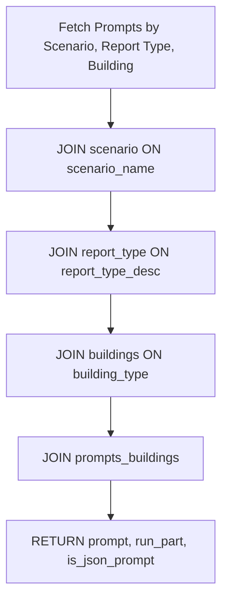
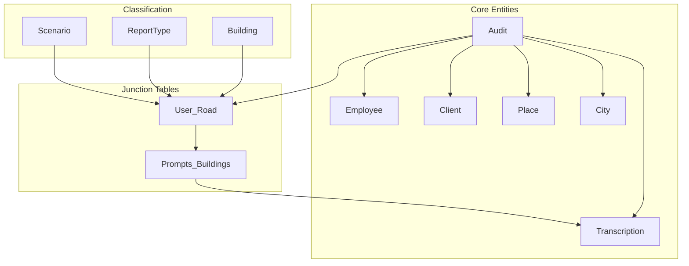

# Database Schema

<cite>
**Referenced Files in This Document**   
- [datamodels.py](file://src/datamodels.py)
- [db.py](file://src/db_handler/db.py)
- [fill_prompts_table.py](file://src/db_handler/fill_prompts_table.py)
- [step_2_sql_request.txt](file://prompts-by-scenario/sql_prompts/part2/step_2_sql_request.txt)
- [storage.py](file://src/storage.py)
</cite>

## Table of Contents
1. [Database Schema](#database-schema)
2. [Entity Definitions](#entity-definitions)
3. [Relationships and Data Flow](#relationships-and-data-flow)
4. [CRUD Operations and Data Access](#crud-operations-and-data-access)
5. [Indexing and Performance](#indexing-and-performance)
6. [Data Lifecycle and Retention](#data-lifecycle-and-retention)
7. [Schema Diagram Description](#schema-diagram-description)
8. [Normalization Rationale](#normalization-rationale)

## Entity Definitions

The VoxPersona database schema is designed to store and manage data related to audits, interviews, transcriptions, and associated metadata. The following entities are defined:

### Clients
Stores information about clients involved in interviews.

**Fields:**
- `client_id` (INTEGER, PK): Unique identifier for the client.
- `client_name` (VARCHAR(255)): Full name of the client.

**Section sources**
- [db.py](file://src/db_handler/db.py#L34-L49)

### Employees
Stores information about employees conducting audits or interviews.

**Fields:**
- `employee_id` (INTEGER, PK): Unique identifier for the employee.
- `employee_name` (VARCHAR(255)): Full name of the employee.

**Section sources**
- [db.py](file://src/db_handler/db.py#L50-L62)

### Buildings
Stores types of buildings such as hotels, restaurants, and health centers.

**Fields:**
- `building_id` (INTEGER, PK): Unique identifier for the building type.
- `building_type` (VARCHAR(255)): Type of building (e.g., "отель", "ресторан", "центр-здоровья").

**Section sources**
- [db.py](file://src/db_handler/db.py#L154-L185)
- [fill_prompts_table.py](file://src/db_handler/fill_prompts_table.py#L67-L78)

### Scenarios
Stores the type of scenario under which an audit or interview was conducted.

**Fields:**
- `scenario_id` (INTEGER, PK): Unique identifier for the scenario.
- `scenario_name` (VARCHAR(255)): Name of the scenario ("Интервью" or "Дизайн").

**Section sources**
- [db.py](file://src/db_handler/db.py#L245-L254)
- [fill_prompts_table.py](file://src/db_handler/fill_prompts_table.py#L34-L45)

### Prompts
Stores prompts used for analyzing transcriptions.

**Fields:**
- `prompt_id` (INTEGER, PK): Unique identifier for the prompt.
- `prompt` (TEXT): Content of the prompt.
- `run_part` (INTEGER): Execution order or part number.
- `prompt_name` (VARCHAR(255)): Descriptive name of the prompt.
- `is_json_prompt` (BOOLEAN): Indicates if the prompt expects JSON output.

**Section sources**
- [fill_prompts_table.py](file://src/db_handler/fill_prompts_table.py#L79-L93)

### Transcriptions
Stores transcribed audio content.

**Fields:**
- `transcription_id` (INTEGER, PK): Unique identifier for the transcription.
- `transcription_text` (TEXT): Full text of the transcription.
- `audio_file_name` (VARCHAR(255)): Original audio file name.
- `transcription_date` (TIMESTAMP): Date and time when transcription was created.
- `number_audio` (INTEGER): Audio sequence number.

**Section sources**
- [db.py](file://src/db_handler/db.py#L132-L148)

### AuditRecords
Stores audit records derived from transcriptions.

**Fields:**
- `audit_id` (INTEGER, PK): Unique identifier for the audit.
- `audit` (TEXT): Audit content.
- `employee_id` (INTEGER, FK → employee): Reference to the employee.
- `client_id` (INTEGER, FK → client): Reference to the client.
- `place_id` (INTEGER, FK → place): Reference to the place.
- `city_id` (INTEGER, FK → city): Reference to the city.
- `transcription_id` (INTEGER, FK → transcription): Reference to the transcription.
- `audit_date` (DATE): Date of the audit.

**Section sources**
- [db.py](file://src/db_handler/db.py#L107-L131)

### Reports
Represents report types associated with scenarios and buildings.

**Fields:**
- `report_type_id` (INTEGER, PK): Unique identifier for the report type.
- `report_type_desc` (VARCHAR(255)): Description of the report type.
- `scenario_id` (INTEGER, FK → scenario): Reference to the scenario.

**Section sources**
- [db.py](file://src/db_handler/db.py#L255-L276)
- [fill_prompts_table.py](file://src/db_handler/fill_prompts_table.py#L46-L66)

## Relationships and Data Flow

The schema uses a relational model to link audits with metadata through intermediate tables.

### Key Relationships:
- A **Transcription** belongs to one **AuditRecord** via `transcription_id`.
- An **AuditRecord** references one **Employee**, one **Client**, one **Place**, and one **City**.
- A **Place** can have multiple **Zones** via the `place_zone` junction table.
- A **Scenario** has multiple **ReportTypes**.
- A **ReportType** applies to multiple **Buildings** via the `buildings_report_type` table.
- **Prompts** are linked to specific combinations of **Building**, **Scenario**, and **ReportType** via `prompts_buildings`.

### Central Linking Table: user_road
The `user_road` table is the central junction that connects:
- `audit_id` → Audit
- `scenario_id` → Scenario
- `report_type_id` → ReportType
- `building_id` → Building

This enables tracking of which audit was conducted under which scenario, report type, and building context.

```mermaid
erDiagram
CLIENT {
int client_id PK
string client_name
}
EMPLOYEE {
int employee_id PK
string employee_name
}
BUILDINGS {
int building_id PK
string building_type
}
SCENARIO {
int scenario_id PK
string scenario_name
}
REPORT_TYPE {
int report_type_id PK
string report_type_desc
int scenario_id FK
}
PROMPTS {
int prompt_id PK
string prompt_name
int run_part
bool is_json_prompt
text prompt
}
TRANSCRIPTION {
int transcription_id PK
text transcription_text
string audio_file_name
timestamp transcription_date
int number_audio
}
AUDIT {
int audit_id PK
text audit
date audit_date
int employee_id FK
int client_id FK
int place_id FK
int city_id FK
int transcription_id FK
}
PLACE {
int place_id PK
string place_name
string building_type
}
CITY {
int city_id PK
string city_name
}
ZONE {
int zone_id PK
string zone_name
}
USER_ROAD {
int user_road_id PK
int audit_id FK
int scenario_id FK
int report_type_id FK
int building_id FK
}
BUILDINGS_REPORT_TYPE {
int building_id PK FK
int report_type_id PK FK
}
PROMPTS_BUILDINGS {
int prompt_id PK FK
int building_id PK FK
int report_type_id PK FK
}
PLACE_ZONE {
int place_id PK FK
int zone_id PK FK
}
CLIENT ||--o{ AUDIT : "has"
EMPLOYEE ||--o{ AUDIT : "conducts"
PLACE ||--o{ AUDIT : "located_at"
CITY ||--o{ AUDIT : "in"
TRANSCRIPTION ||--o{ AUDIT : "source_of"
SCENARIO ||--o{ REPORT_TYPE : "defines"
REPORT_TYPE ||--o{ BUILDINGS_REPORT_TYPE : "linked_to"
BUILDINGS ||--o{ BUILDINGS_REPORT_TYPE : "linked_to"
BUILDINGS_REPORT_TYPE }o--|| PROMPTS_BUILDINGS : "via"
REPORT_TYPE }o--|| PROMPTS_BUILDINGS : "via"
PROMPTS ||--o{ PROMPTS_BUILDINGS : "used_in"
PLACE ||--o{ PLACE_ZONE : "contains"
ZONE ||--o{ PLACE_ZONE : "part_of"
AUDIT ||--o{ USER_ROAD : "traverses"
SCENARIO ||--o{ USER_ROAD : "part_of"
REPORT_TYPE ||--o{ USER_ROAD : "classified_as"
BUILDINGS ||--o{ USER_ROAD : "conducted_at"
```

**Diagram sources**
- [step_2_sql_request.txt](file://prompts-by-scenario/sql_prompts/part2/step_2_sql_request.txt#L28-L149)
- [db.py](file://src/db_handler/db.py)

## CRUD Operations and Data Access

CRUD operations are implemented in `db.py` using async-compatible patterns with psycopg2 and decorator-based transaction management.

### Key Functions in db.py:
- `@db_transaction`: Decorator managing database connection and commit/rollback.
- `get_or_create_*` functions: Idempotent inserts for entities like Client, Employee, Place.
- `save_audit()`: Creates a new audit record.
- `get_or_save_transcription()`: Ensures transcription uniqueness.
- `fetch_prompts_for_scenario_reporttype_building()`: Retrieves prompts based on scenario, report type, and building.

### Pydantic Models in datamodels.py
Although not explicitly shown, the use of structured mappings suggests data validation via Pydantic models. These would define:
- Field types
- Validation rules
- Serialization logic

Example inferred model:
```python
class Transcription(BaseModel):
    transcription_text: str
    audio_file_name: str
    number_audio: int
```

### Sample Query: Retrieve Audit with Full Context
```sql
SELECT 
    a.audit_id,
    a.audit,
    a.audit_date,
    e.employee_name,
    c.client_name,
    p.place_name,
    ci.city_name,
    t.audio_file_name,
    s.scenario_name,
    rt.report_type_desc,
    b.building_type
FROM audit a
JOIN employee e ON e.employee_id = a.employee_id
JOIN client c ON c.client_id = a.client_id
JOIN place p ON p.place_id = a.place_id
JOIN city ci ON ci.city_id = a.city_id
JOIN transcription t ON t.transcription_id = a.transcription_id
JOIN user_road ur ON ur.audit_id = a.audit_id
JOIN scenario s ON s.scenario_id = ur.scenario_id
JOIN report_type rt ON rt.report_type_id = ur.report_type_id
JOIN buildings b ON b.building_id = ur.building_id;
```

**Section sources**
- [db.py](file://src/db_handler/db.py)
- [storage.py](file://src/storage.py#L131-L164)

## Indexing and Performance

To optimize performance on large transcription datasets, indexing strategies should include:

### Recommended Indexes:
- `transcription(transcription_text)` – GIN index for full-text search.
- `transcription(audio_file_name)` – B-tree for fast lookups.
- `audit(audit_date)` – B-tree for date-range queries.
- `audit(employee_id)` – B-tree for filtering by employee.
- Composite index on `user_road(audit_id, scenario_id, report_type_id, building_id)`.

### Query Optimization Example:
Using `fetch_prompts_for_scenario_reporttype_building()` with indexed fields ensures fast retrieval of prompts based on scenario, report type, and building.



**Diagram sources**
- [db.py](file://src/db_handler/db.py#L319-L351)

## Data Lifecycle and Retention

### Retention Policies:
- **Transcriptions**: Retained indefinitely unless flagged for deletion.
- **Audio Metadata**: Stored with transcription; file paths retained even if audio is archived.
- **Audit Records**: Permanent retention for compliance.

### Archival Considerations:
- Cold storage of audio files after 1 year.
- Partitioning of `audit` and `transcription` tables by year.
- Use of materialized views for frequently accessed aggregated reports.

## Schema Diagram Description

The schema follows a star-like structure centered around the `audit` and `user_road` tables. Dimensions include:
- **People**: Employee, Client
- **Location**: Place, City, Zone, Building
- **Process**: Scenario, ReportType, Prompt
- **Source**: Transcription

Junction tables (`user_road`, `prompts_buildings`, `buildings_report_type`, `place_zone`) enable many-to-many relationships while maintaining normalization.

## Normalization Rationale

The schema is normalized to the third normal form (3NF) to:
- Eliminate redundancy (e.g., separate `employee`, `client` tables).
- Ensure referential integrity via foreign keys.
- Support flexible querying across scenarios and report types.

Denormalization is avoided except in reporting views. The use of mapping tables (`mapping_scenario_names`, `mapping_report_type_names`) in code rather than the database allows for dynamic label handling without schema changes.



**Diagram sources**
- [step_2_sql_request.txt](file://prompts-by-scenario/sql_prompts/part2/step_2_sql_request.txt)
- [db.py](file://src/db_handler/db.py)