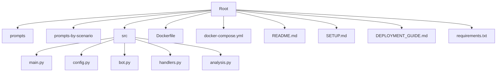
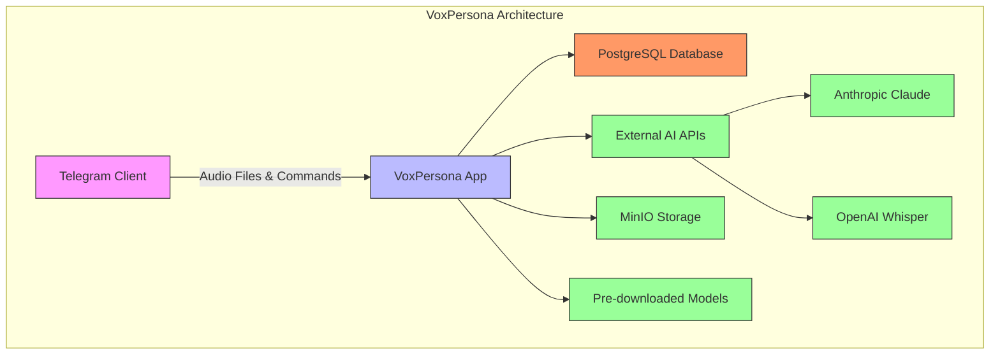
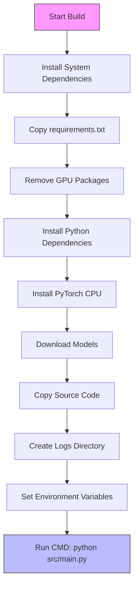
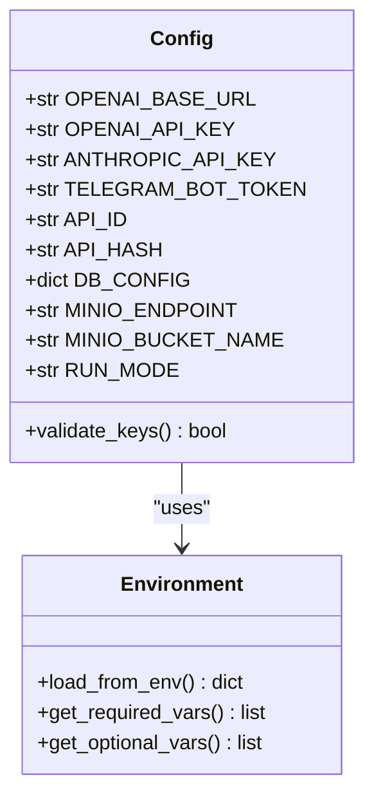
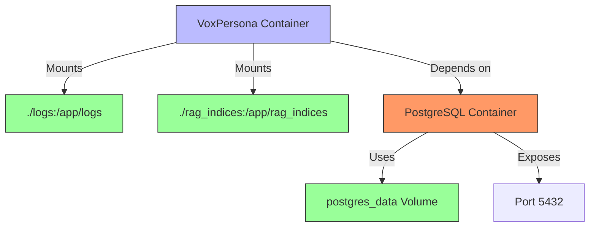
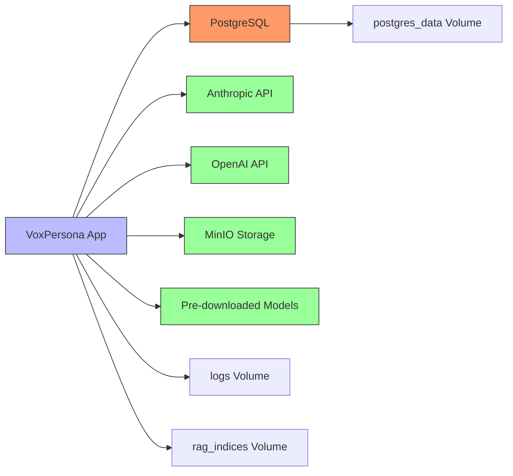

# Deployment Guide

<cite>
**Referenced Files in This Document**   
- [Dockerfile](file://Dockerfile)
- [docker-compose.yml](file://docker-compose.yml)
- [src/config.py](file://src/config.py)
- [README.md](file://README.md)
- [SETUP.md](file://SETUP.md)
</cite>

## Table of Contents
1. [Introduction](#introduction)
2. [Project Structure](#project-structure)
3. [Core Components](#core-components)
4. [Architecture Overview](#architecture-overview)
5. [Detailed Component Analysis](#detailed-component-analysis)
6. [Dependency Analysis](#dependency-analysis)
7. [Performance Considerations](#performance-considerations)
8. [Troubleshooting Guide](#troubleshooting-guide)
9. [Conclusion](#conclusion)

## Introduction
VoxPersona is an AI-powered voice analysis platform that leverages advanced artificial intelligence technologies to transcribe, analyze, and generate detailed reports from audio recordings. The system integrates with Telegram for user interaction and uses state-of-the-art language models for deep content analysis. This deployment guide provides comprehensive instructions for deploying VoxPersona in various environments using Docker and docker-compose, covering configuration, environment setup, scaling, monitoring, and troubleshooting.

## Project Structure
The VoxPersona project follows a modular structure with clear separation of concerns. The application is containerized using Docker, with configuration managed through environment variables and Docker Compose for orchestration.



**Diagram sources**
- [Dockerfile](file://Dockerfile#L1-L66)
- [docker-compose.yml](file://docker-compose.yml#L1-L69)

**Section sources**
- [Dockerfile](file://Dockerfile#L1-L66)
- [docker-compose.yml](file://docker-compose.yml#L1-L69)
- [README.md](file://README.md#L1-L223)

## Core Components
The core components of VoxPersona include the main application container, PostgreSQL database, and supporting services. The application is built on Python 3.10 with AI/ML dependencies including OpenAI GPT, Anthropic Claude, and SentenceTransformers. The Dockerfile installs system dependencies, Python packages, and pre-downloads embedding models (BAAI/bge-m3 and sentence-transformers/all-MiniLM-L6-v2) during image build to ensure they are cached and available at runtime without requiring internet access.

**Section sources**
- [Dockerfile](file://Dockerfile#L1-L66)
- [src/config.py](file://src/config.py#L1-L93)
- [docker-compose.yml](file://docker-compose.yml#L1-L69)

## Architecture Overview
VoxPersona follows a microservices architecture with two primary services orchestrated by Docker Compose: the main application service and PostgreSQL database. The application container depends on the database service and uses environment variables for configuration. The architecture is designed for scalability with resource limits defined for memory usage.



**Diagram sources**
- [docker-compose.yml](file://docker-compose.yml#L1-L69)
- [Dockerfile](file://Dockerfile#L1-L66)

## Detailed Component Analysis

### Container Configuration Analysis
The Docker-based deployment of VoxPersona is configured through the Dockerfile and docker-compose.yml files. The Dockerfile specifies a python:3.10-slim base image and installs system dependencies including ffmpeg, libpq-dev, and build tools. Python dependencies are installed from requirements.txt with GPU-oriented packages (faiss-gpu and triton) removed to ensure CPU compatibility. The build process pre-downloads embedding models (BAAI/bge-m3 and sentence-transformers/all-MiniLM-L6-v2) to cache them in the Docker image, eliminating the need for internet access at runtime.



**Diagram sources**
- [Dockerfile](file://Dockerfile#L1-L66)

**Section sources**
- [Dockerfile](file://Dockerfile#L1-L66)

### Environment Configuration Analysis
Environment variables are managed through a .env file that is loaded by the application at runtime. The config.py file uses python-dotenv to load environment variables with validation for critical keys. The system supports different run modes (PROD and TEST) with separate database configurations. Environment variables include API keys for Anthropic and OpenAI services, Telegram credentials, database connection parameters, and application-specific settings.



**Diagram sources**
- [src/config.py](file://src/config.py#L1-L93)

**Section sources**
- [src/config.py](file://src/config.py#L1-L93)
- [docker-compose.yml](file://docker-compose.yml#L1-L69)

### Volume and Network Setup Analysis
The docker-compose.yml file defines volume mounts for persistent storage of logs and RAG indices. The ./logs directory is mounted to /app/logs in the container, and ./rag_indices is mounted to /app/rag_indices to preserve vector search indices across container restarts. The PostgreSQL service uses a named volume (postgres_data) for database persistence. The services are connected via Docker's default network, with the voxpersona service depending on the postgres service for database availability.



**Diagram sources**
- [docker-compose.yml](file://docker-compose.yml#L1-L69)

**Section sources**
- [docker-compose.yml](file://docker-compose.yml#L1-L69)

## Dependency Analysis
The dependency graph of VoxPersona shows a clear separation between the application and database services. The voxpersona service depends on the postgres service for database functionality, with environment variables providing the connection details. The application has external dependencies on AI services (Anthropic Claude and OpenAI Whisper) through API calls. The Docker build process has a dependency on internet access for package installation and model downloading, though this is mitigated by pre-downloading models during image build.



**Diagram sources**
- [docker-compose.yml](file://docker-compose.yml#L1-L69)
- [Dockerfile](file://Dockerfile#L1-L66)

**Section sources**
- [docker-compose.yml](file://docker-compose.yml#L1-L69)
- [Dockerfile](file://Dockerfile#L1-L66)

## Performance Considerations
The docker-compose.yml file specifies resource limits with a memory limit of 10G for the voxpersona service, indicating substantial memory requirements for AI processing tasks. The system pre-downloads embedding models during Docker build to reduce startup time and eliminate runtime dependencies on external downloads. The application is designed to run in production mode by default, with configuration options for test environments. For systems with limited resources, the memory limit can be adjusted downward, though 4G is recommended as a minimum.

## Troubleshooting Guide
Common deployment issues include database connection failures, API rate limits, and storage configuration errors. For database connection issues, verify that the postgres service is running and that database credentials in the .env file match those in the postgres service configuration. API rate limits can be mitigated by ensuring valid API keys are configured and by using multiple Anthropic API keys for load balancing. Storage configuration errors can occur if the logs and rag_indices directories do not have proper write permissions.

```mermaid
flowchart TD
A[Deployment Issue] --> B{Issue Type}
B --> |Database| C[Check postgres service status]
B --> |API Keys| D[Verify environment variables]
B --> |Storage| E[Check volume permissions]
B --> |Performance| F[Monitor resource usage]
C --> G[Use docker-compose ps postgres]
C --> H[Check postgres logs]
D --> I[Use docker exec env | grep API]
D --> J[Test API key validity]
E --> K[Verify directory exists]
E --> L[Check write permissions]
F --> M[Use docker stats]
F --> N[Adjust resource limits]
```

**Section sources**
- [docker-compose.yml](file://docker-compose.yml#L1-L69)
- [src/config.py](file://src/config.py#L1-L93)
- [SETUP.md](file://SETUP.md#L1-L289)

## Conclusion
VoxPersona provides a comprehensive AI-powered voice analysis solution that can be deployed using Docker and docker-compose. The deployment configuration is designed for production use with proper resource allocation, persistent storage, and secure handling of API credentials. By following the configuration guidelines and understanding the component interactions, users can successfully deploy VoxPersona in development, staging, and production environments. The system's modular architecture allows for scaling and adaptation to various use cases while maintaining performance and reliability.