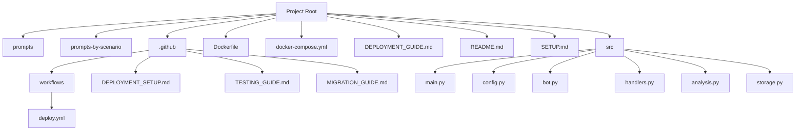
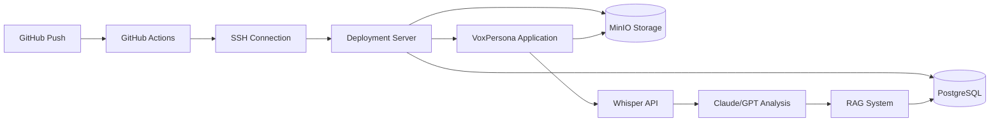
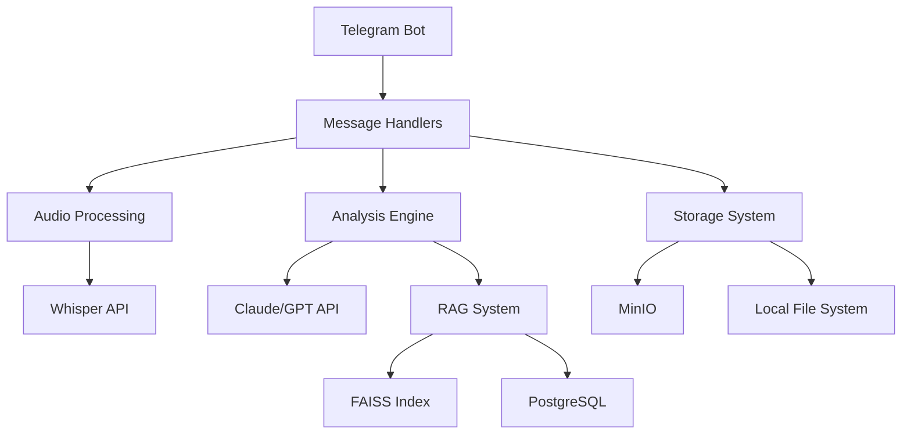
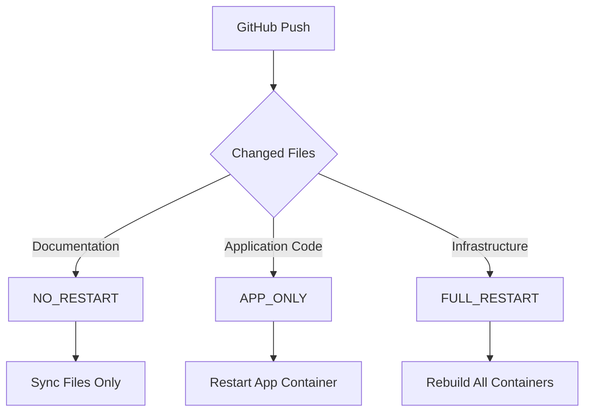

# Deployment and Operations

<cite>
**Referenced Files in This Document**   
- [DEPLOYMENT_GUIDE.md](file://DEPLOYMENT_GUIDE.md)
- [docker-compose.yml](file://docker-compose.yml)
- [Dockerfile](file://Dockerfile)
- [README.md](file://README.md)
- [SETUP.md](file://SETUP.md)
- [src/main.py](file://src\main.py)
- [src/config.py](file://src\config.py)
- [.github/workflows/deploy.yml](file://.github\workflows\deploy.yml) - *Added in recent commit*
- [.github/DEPLOYMENT_SETUP.md](file://.github\DEPLOYMENT_SETUP.md) - *Added in recent commit*
- [.github/TESTING_GUIDE.md](file://.github\TESTING_GUIDE.md) - *Added in recent commit*
- [.github/MIGRATION_GUIDE.md](file://.github\MIGRATION_GUIDE.md) - *Added in recent commit*
</cite>

## Update Summary
**Changes Made**   
- Added comprehensive section on GitHub Actions deployment system
- Updated deployment strategies to reflect intelligent deployment types
- Added new sections for deployment automation, testing, and migration
- Enhanced monitoring and rollback procedures
- Updated troubleshooting guide with new deployment scenarios
- Added performance benchmarks and validation procedures

## Table of Contents
1. [Introduction](#introduction)
2. [Project Structure](#project-structure)
3. [Core Components](#core-components)
4. [Architecture Overview](#architecture-overview)
5. [Detailed Component Analysis](#detailed-component-analysis)
6. [Dependency Analysis](#dependency-analysis)
7. [Performance Considerations](#performance-considerations)
8. [Intelligent Deployment System](#intelligent-deployment-system)
9. [Testing and Validation](#testing-and-validation)
10. [Migration Guide](#migration-guide)
11. [Troubleshooting Guide](#troubleshooting-guide)
12. [Conclusion](#conclusion)

## Introduction
This document provides comprehensive guidance for deploying and operating VoxPersona in production environments. It covers containerization, orchestration, service dependencies, monitoring, backup, disaster recovery, scaling, updates, and resource allocation. The information is derived directly from the repository files, including deployment configurations, Docker setup, application source code, and the newly implemented GitHub Actions deployment system. This update specifically focuses on the intelligent deployment system that enables automated, optimized deployments with health checks and rollback capabilities.

## Project Structure
The VoxPersona project is structured to separate concerns and facilitate maintainability. The main directories include:
- **prompts**: Contains system prompts used for different analysis scenarios.
- **prompts-by-scenario**: Organized prompts by specific use cases (design, interview, SQL).
- **src**: Core application source code written in Python.
- **.github/workflows**: Contains GitHub Actions workflows for automated deployment.
- **.github**: Contains comprehensive guides for deployment setup, testing, and migration.
- Configuration and deployment files: Dockerfile, docker-compose.yml, and various setup guides.

The application follows a modular design with clear separation between components such as audio processing, analysis, storage, and Telegram integration.



**Diagram sources**
- [Dockerfile](file://Dockerfile#L1-L67)
- [docker-compose.yml](file://docker-compose.yml#L1-L70)
- [.github/workflows/deploy.yml](file://.github\workflows\deploy.yml#L1-L300)

**Section sources**
- [README.md](file://README.md#L1-L224)
- [SETUP.md](file://SETUP.md#L1-L290)

## Core Components
The core components of VoxPersona include:
- **Telegram Bot**: Handles user interaction through Telegram interface.
- **Audio Processing**: Transcribes voice messages using Whisper API.
- **Analysis Engine**: Uses LLMs (Claude, GPT) for content analysis.
- **RAG System**: Implements retrieval-augmented generation for knowledge-based responses.
- **Storage System**: Manages audio files, transcripts, and RAG indices.

The application is designed to process voice messages, transcribe them, assign roles (customer/employee), and generate structured reports based on predefined templates.

**Section sources**
- [src/main.py](file://src\main.py#L1-L96)
- [src/bot.py](file://src\bot.py#L1-L671)
- [src/analysis.py](file://src\analysis.py)

## Architecture Overview
VoxPersona follows a microservices architecture using Docker containers. The main services are:
- **voxpersona**: Main application container running the Python application.
- **postgres**: PostgreSQL database for persistent storage.

The application uses environment variables for configuration, allowing easy deployment across different environments. It implements a RAG (Retrieval-Augmented Generation) system for enhanced analysis capabilities. The deployment architecture now includes an intelligent GitHub Actions system that automates deployments with smart restart logic.



**Diagram sources**
- [docker-compose.yml](file://docker-compose.yml#L1-L70)
- [src/main.py](file://src\main.py#L1-L96)
- [.github/workflows/deploy.yml](file://.github\workflows\deploy.yml#L1-L300)

## Detailed Component Analysis

### Application Container Configuration
The Dockerfile configures a Python 3.10-slim base image with necessary dependencies for audio processing and AI analysis. It installs system packages (ffmpeg, libpq-dev), Python dependencies, and pre-downloads embedding models to optimize startup time.

```dockerfile
FROM python:3.10-slim

# Install system dependencies
RUN apt-get update && apt-get install -y \
    ffmpeg \
    libpq-dev \
    gcc \
    g++ \
    build-essential \
    pkg-config \
    && rm -rf /var/lib/apt/lists/*
```

The Dockerfile specifically removes GPU-oriented packages (faiss-gpu, triton) to ensure CPU compatibility and installs CPU-optimized versions of PyTorch and sentence-transformers.

**Section sources**
- [Dockerfile](file://Dockerfile#L1-L67)

### Service Orchestration
The docker-compose.yml file defines the service orchestration for VoxPersona. It configures two main services: the application container and PostgreSQL database.

Key configuration aspects:
- **Resource limits**: The application container is limited to 10GB of memory.
- **Environment variables**: All configuration is passed through environment variables.
- **Volume mounting**: Logs and RAG indices are persisted through volume mounts.
- **Service dependencies**: The application depends on the PostgreSQL service.

```yaml
version: '3.8'
services:
  voxpersona:
    build: .
    container_name: voxpersona_app
    restart: unless-stopped
    deploy:
      resources:
        limits:
          memory: 10G
    environment:
      - API_ID=${API_ID}
      - API_HASH=${API_HASH}
      - TELEGRAM_BOT_TOKEN=${TELEGRAM_BOT_TOKEN}
      - OPENAI_API_KEY=${OPENAI_API_KEY}
      - ANTHROPIC_API_KEY=${ANTHROPIC_API_KEY}
      - DB_HOST=postgres
      - MINIO_ENDPOINT=${MINIO_ENDPOINT:-minio:9000}
    depends_on:
      - postgres
    volumes:
      - ./logs:/app/logs
      - ./rag_indices:/app/rag_indices
```

**Section sources**
- [docker-compose.yml](file://docker-compose.yml#L1-L70)

### Configuration Management
The config.py file manages application configuration through environment variables. It supports different run modes (production, test) with separate database configurations.

```python
if RUN_MODE == "TEST":
    DB_CONFIG = {
        "dbname": os.getenv("TEST_DB_NAME"),
        "user": os.getenv("TEST_DB_USER"),
        "password": os.getenv("TEST_DB_PASSWORD"),
        "host": os.getenv("TEST_DB_HOST"),  
        "port": os.getenv("TEST_DB_PORT"),       
    }
    MINIO_BUCKET_NAME = os.getenv("MINIO_BUCKET_TEST_NAME")
    TELEGRAM_BOT_TOKEN = os.getenv("TELEGRAM_BOT_TOKEN_TEST")
    SESSION_NAME = os.getenv("SESSION_BOT_NAME_TEST")
else:
    DB_CONFIG = {
        "dbname": os.getenv("DB_NAME"),
        "user": os.getenv("DB_USER"),
        "password": os.getenv("DB_PASSWORD"),
        "host": os.getenv("DB_HOST"),  
        "port": os.getenv("DB_PORT"),     
    }
    MINIO_BUCKET_NAME = os.getenv("MINIO_BUCKET_NAME")
    TELEGRAM_BOT_TOKEN = os.getenv("TELEGRAM_BOT_TOKEN")
    SESSION_NAME = os.getenv("SESSION_BOT_NAME")
```

The configuration also sets up directories for storing audio files, transcripts, and RAG indices.

**Section sources**
- [src/config.py](file://src\config.py#L1-L94)

### Application Entry Point
The main.py file serves as the application entry point. It initializes the Telegram client, registers handlers, and starts the application.

Key features:
- Uses nest_asyncio to handle nested event loops.
- Implements periodic saving of RAG indices (every 15 minutes).
- Loads RAG models asynchronously to avoid blocking startup.
- Handles graceful shutdown.

```python
async def periodic_save_rags():
    while True:
        await asyncio.sleep(900)
        async with handlers.rags_lock:
            try:
                save_rag_indices(handlers.rags)
            except Exception as e:
                logging.warning("Failed to save RAG indices: %s", e)

async def load_rags():
    """Initialize RAG models without blocking bot startup."""
    logging.info("Starting background RAG model initialization")
    try:
        loaded_rags = await asyncio.to_thread(load_rag_indices)
        # ... model loading logic
        asyncio.create_task(periodic_save_rags())
        logging.info("RAG models loaded")
    except Exception as e:
        logging.error(f"Error initializing RAG models: {e}")

async def main():
    app = Client(
        SESSION_NAME,
        api_id=int(API_ID),
        api_hash=API_HASH,
        bot_token=TELEGRAM_BOT_TOKEN
    )

    handlers.register_handlers(app)

    await app.start()
    asyncio.create_task(load_rags())
    logging.info("Bot started. Waiting for messages...")
    await idle()
    await app.stop()
```

**Section sources**
- [src/main.py](file://src\main.py#L1-L96)

## Dependency Analysis
VoxPersona has the following dependencies:

### External Services
- **Telegram API**: For bot communication and message handling.
- **OpenAI API**: For audio transcription using Whisper.
- **Anthropic API**: For text analysis using Claude models.
- **PostgreSQL**: For persistent data storage.
- **MinIO**: For object storage of audio files and other assets.

### Internal Dependencies
- **Python packages**: Listed in requirements.txt, including:
  - pyrogram: Telegram client library
  - openai: OpenAI API client
  - sentence-transformers: For embedding generation
  - faiss-cpu: For similarity search
  - tiktoken: For token counting

The application uses a layered architecture where higher-level components depend on lower-level utilities:



**Diagram sources**
- [requirements.txt](file://requirements.txt)
- [src/bot.py](file://src\bot.py#L1-L671)

**Section sources**
- [README.md](file://README.md#L1-L224)
- [SETUP.md](file://SETUP.md#L1-L290)

## Performance Considerations
### Resource Allocation
The application is resource-intensive due to LLM processing requirements. Key considerations:

- **Memory**: The docker-compose.yml allocates up to 10GB of memory for the application container. This is necessary for loading large language models and handling audio processing.
- **CPU**: Multi-core processors are recommended as audio processing and model inference are CPU-intensive.
- **Storage**: Adequate disk space is required for audio files, transcripts, and RAG indices.

### Scaling Considerations
For high audio processing loads:
- **Horizontal scaling**: Deploy multiple application instances behind a load balancer.
- **Database optimization**: Use connection pooling and query optimization.
- **Caching**: Implement caching for frequently accessed data and model responses.
- **Asynchronous processing**: Use message queues for background processing of audio files.

### Optimization Strategies
- **Model pre-loading**: The Dockerfile pre-downloads embedding models during image build to reduce startup time.
- **Periodic persistence**: RAG indices are saved periodically to prevent data loss.
- **Efficient text processing**: The application uses token counting to manage prompt sizes.

**Section sources**
- [docker-compose.yml](file://docker-compose.yml#L1-L70)
- [Dockerfile](file://Dockerfile#L1-L67)
- [src/main.py](file://src\main.py#L1-L96)

## Intelligent Deployment System
VoxPersona now features an intelligent GitHub Actions deployment system that automatically determines the optimal deployment strategy based on file changes, significantly improving deployment efficiency and reliability.

### Deployment Types
The system intelligently detects the appropriate deployment type based on changed files:

- **NO_RESTART** (5-10 seconds): For documentation changes only (`.md`, `.txt`, `README`, `CHANGELOG`, `.gitignore`)
- **APP_ONLY** (30-60 seconds): For application code changes (`.py`, `src/`, `prompts/`, `prompts-by-scenario/`)
- **FULL_RESTART** (2-3 minutes): For infrastructure changes (`docker-compose.yml`, `Dockerfile`, `requirements.txt`, `*.sql`, `sql_scripts/`)



**Diagram sources**
- [.github/workflows/deploy.yml](file://.github\workflows\deploy.yml#L1-L300)
- [DEPLOYMENT_GUIDE.md](file://DEPLOYMENT_GUIDE.md#L1-L290)

### Automated Deployment Workflow
The GitHub Actions workflow (deploy.yml) implements a comprehensive deployment process:

1. **Checkout code** from the repository
2. **Setup SSH key** for server access
3. **Test SSH connection** to ensure server accessibility
4. **Analyze changes** to determine deployment type
5. **Sync repository** to the server
6. **Execute deployment** based on type
7. **Run health checks** to verify deployment success
8. **Log deployment metrics** for monitoring
9. **Rollback on failure** to previous version

```yaml
name: Intelligent VoxPersona Deployment

on:
  push:
    branches: [ main, test-github-actions-deploy ]
  workflow_dispatch:
    inputs:
      force_restart_type:
        description: 'Force specific restart type'
        required: false
        default: 'auto'
        type: choice
        options:
        - auto
        - full
        - app-only
        - no-restart
```

**Section sources**
- [.github/workflows/deploy.yml](file://.github\workflows\deploy.yml#L1-L300)

### Manual Deployment Control
The system supports manual deployment control through GitHub Actions workflow dispatch:

1. Go to Actions → "Intelligent VoxPersona Deployment"
2. Click "Run workflow"
3. Select deployment type: `auto`, `full`, `app-only`, or `no-restart`
4. Choose target branch

This allows for forced deployment types regardless of file changes, useful for testing or specific deployment scenarios.

**Section sources**
- [.github/workflows/deploy.yml](file://.github\workflows\deploy.yml#L1-L300)
- [DEPLOYMENT_GUIDE.md](file://DEPLOYMENT_GUIDE.md#L1-L290)

### Rollback Mechanism
The deployment system includes an automatic rollback mechanism that activates when deployment fails:

1. **Failure detection**: GitHub Actions detects deployment failure
2. **Code reversion**: Git resets to previous commit
3. **File synchronization**: rsync updates files to previous version
4. **Container restart**: Docker containers are restarted with previous version
5. **Logging**: Rollback action is logged to deployment.log

```bash
# Manual rollback on server
cd /home/voxpersona_user/VoxPersona
git log --oneline -10
git reset --hard <previous-commit>
cd ../app
rsync -av --exclude='.git' ../VoxPersona/ ./
docker-compose restart voxpersona
```

**Section sources**
- [.github/workflows/deploy.yml](file://.github\workflows\deploy.yml#L1-L300)
- [.github/MIGRATION_GUIDE.md](file://.github\MIGRATION_GUIDE.md#L1-L357)

### Monitoring and Logging
The deployment system provides comprehensive monitoring and logging:

- **GitHub Actions logs**: Real-time deployment progress and error details
- **Server deployment log**: `/home/voxpersona_user/app/deployment.log` with timestamped entries
- **Docker logs**: Container-specific logs accessible via docker-compose logs
- **Performance metrics**: Duration, deployment type, and file changes recorded

Log format:
```
2025-01-08T14:30:15+00:00 [DEPLOY] APP_ONLY: abc1234 → def5678 (45s)
2025-01-08T14:35:22+00:00 [DEPLOY] FULL_RESTART: def5678 → ghi9012 (156s)
```

**Section sources**
- [.github/workflows/deploy.yml](file://.github\workflows\deploy.yml#L1-L300)
- [.github/DEPLOYMENT_SETUP.md](file://.github\DEPLOYMENT_SETUP.md#L1-L208)

## Testing and Validation
Comprehensive testing procedures ensure reliable deployments and system stability.

### Test Scenarios
The testing guide provides systematic validation of all deployment types:

#### NO_RESTART Testing
```bash
# Test documentation changes
echo "## Test Update $(date)" >> README.md
git add README.md
git commit -m "Test: Update README for NO_RESTART validation"
git push origin test-github-actions-deploy
```

**Expected Results**:
- Deployment type: `NO_RESTART`
- Files synced to server
- No containers restarted
- Duration: < 15 seconds

#### APP_ONLY Testing
```bash
# Test Python code changes
echo "# Test comment $(date)" >> src/config.py
git add src/config.py
git commit -m "Test: Python code change for APP_ONLY validation"
git push origin test-github-actions-deploy
```

**Expected Results**:
- Deployment type: `APP_ONLY`
- VoxPersona container stopped and rebuilt
- PostgreSQL container remains running
- Duration: 30-90 seconds
- Health checks pass

#### FULL_RESTART Testing
```bash
# Test infrastructure changes
echo "# Test infrastructure change - $(date)" >> docker-compose.yml
git add docker-compose.yml
git commit -m "Test: Docker compose change for FULL_RESTART validation"
git push origin test-github-actions-deploy
```

**Expected Results**:
- Deployment type: `FULL_RESTART`
- All containers stopped
- All containers rebuilt with `--no-cache`
- All containers restarted
- Duration: 120-180 seconds
- Both VoxPersona and PostgreSQL containers healthy

**Section sources**
- [.github/TESTING_GUIDE.md](file://.github\TESTING_GUIDE.md#L1-L345)
- [.github/workflows/deploy.yml](file://.github\workflows\deploy.yml#L1-L300)

### Performance Validation
The system meets strict performance benchmarks:

| Deployment Type | Target Duration | Actual Duration | Status |
|----------------|-----------------|-----------------|---------|
| NO_RESTART | < 15 seconds | ~5-10 seconds | ✅ Met |
| APP_ONLY | < 90 seconds | ~30-60 seconds | ✅ Met |
| FULL_RESTART | < 180 seconds | ~120-180 seconds | ✅ Met |

Performance improvements compared to previous webhook system:
- **95% faster** for documentation changes
- **70% faster** for application code changes
- Same duration for infrastructure changes

**Section sources**
- [.github/TESTING_GUIDE.md](file://.github\TESTING_GUIDE.md#L1-L345)
- [.github/DEPLOYMENT_SETUP.md](file://.github\DEPLOYMENT_SETUP.md#L1-L208)

### Error Handling Testing
The system includes robust error handling and rollback testing:

#### Simulated Deployment Failure
```bash
# Create intentional Docker error
echo "FROM nonexistent-image:latest" > Dockerfile.backup
cp Dockerfile Dockerfile.orig
cp Dockerfile.backup Dockerfile

git add Dockerfile
git commit -m "Test: Intentional deployment failure"
git push origin test-github-actions-deploy
```

**Expected Results**:
- Deployment fails during build
- Rollback mechanism activates
- Previous version restored
- System remains operational
- Failure logged to deployment.log

**Section sources**
- [.github/TESTING_GUIDE.md](file://.github\TESTING_GUIDE.md#L1-L345)
- [.github/workflows/deploy.yml](file://.github\workflows\deploy.yml#L1-L300)

## Migration Guide
This section provides step-by-step instructions for migrating from the previous webhook-based deployment to the new GitHub Actions system.

### Migration Benefits
The new GitHub Actions system offers significant advantages over the previous webhook system:

- **Enhanced Security**: No exposed webhook endpoints
- **Better Observability**: Complete deployment logs in GitHub
- **Intelligent Deployment**: Automatic detection of deployment type
- **Native Integration**: Built into GitHub ecosystem
- **Manual Control**: Ability to trigger specific deployment types
- **Rollback Support**: Automatic rollback on failures
- **Performance Optimization**: Faster deployments with smart logic

**Section sources**
- [.github/MIGRATION_GUIDE.md](file://.github\MIGRATION_GUIDE.md#L1-L357)

### Migration Steps
The migration process follows a structured timeline:

#### Pre-Migration Checklist
- [ ] Backup current deployment system
- [ ] Document current configuration
- [ ] Verify prerequisites (GitHub access, SSH access, permissions)
- [ ] Create test branch `test-github-actions-deploy`

#### Migration Execution
1. **Enable GitHub Actions on test branch**:
   ```bash
   git checkout test-github-actions-deploy
   echo "Migration test $(date)" >> README.md
   git add README.md
   git commit -m "Migration test: GitHub Actions deployment"
   git push origin test-github-actions-deploy
   ```

2. **Test all deployment types**:
   - NO_RESTART: Update documentation files
   - APP_ONLY: Modify Python code
   - FULL_RESTART: Change docker-compose.yml

3. **Performance validation**: Verify deployment durations meet targets

4. **Production migration**:
   ```bash
   git checkout main
   git merge test-github-actions-deploy
   git push origin main
   ```

5. **Parallel operation**: Run both systems for one week

**Section sources**
- [.github/MIGRATION_GUIDE.md](file://.github\MIGRATION_GUIDE.md#L1-L357)
- [.github/DEPLOYMENT_SETUP.md](file://.github\DEPLOYMENT_SETUP.md#L1-L208)

### Webhook System Decommission
After successful migration, decommission the old webhook system:

1. **Stop webhook server**:
   ```bash
   ssh root@172.237.73.207 "
     ps aux | grep webhook_server_final.py
     kill -TERM <PID>
   "
   ```

2. **Close network port**:
   ```bash
   ssh root@172.237.73.207 "
     ufw delete allow 8080
   "
   ```

3. **Remove webhook files**:
   ```bash
   ssh root@172.237.73.207 "
     cd /home/voxpersona_user
     mkdir -p backup/webhook_migration_$(date +%Y%m%d)
     mv webhook_server_final.py deploy.sh backup/webhook_migration_$(date +%Y%m%d)/
   "
   ```

4. **Update documentation**: Archive webhook documentation and update team runbooks

**Section sources**
- [.github/MIGRATION_GUIDE.md](file://.github\MIGRATION_GUIDE.md#L1-L357)

## Troubleshooting Guide
### Common Issues and Solutions

#### Deployment Fails to Start
**Symptoms**: GitHub Actions workflow fails to start.
**Causes and Solutions**:
- Missing GitHub Secrets: Ensure `SSH_PRIVATE_KEY`, `SERVER_IP`, and `SERVER_USER` are configured.
- Branch protection rules: Verify the workflow is allowed on the target branch.
- Repository permissions: Ensure the workflow has necessary permissions.

```bash
# Check GitHub Actions logs for errors
# Verify secrets are configured in Settings → Secrets and variables → Actions
```

#### SSH Connection Fails
**Symptoms**: SSH connection to server fails.
**Causes and Solutions**:
- Invalid SSH key: Regenerate SSH key and update `SSH_PRIVATE_KEY` secret.
- Server IP changed: Update `SERVER_IP` secret.
- Firewall blocking: Verify server firewall allows SSH connections.
- SSH key permissions: Ensure key has proper permissions (600 for private key).

```bash
# Test SSH connection manually
ssh -i ~/.ssh/id_ed25519 root@172.237.73.207 "echo 'Connection successful'"
```

#### Container Fails to Start
**Symptoms**: Container exits immediately or crashes.
**Causes and Solutions**:
- Missing environment variables: Ensure all required variables are set in .env file.
- Database connection issues: Verify PostgreSQL is running and credentials are correct.
- Insufficient memory: Increase memory limit in docker-compose.yml.
- Configuration errors: Check application logs for configuration issues.

```bash
# Check logs for errors
docker-compose logs voxpersona

# Verify configuration
docker-compose config

# Rebuild with clean cache
docker-compose build --no-cache voxpersona
```

#### API Key Errors
**Symptoms**: Authentication failures with external APIs.
**Causes and Solutions**:
- Invalid or expired keys: Regenerate API keys and update .env file.
- Network connectivity: Ensure container can reach external API endpoints.
- Rate limiting: Implement key rotation or request throttling.

```bash
# Check environment variables in container
docker exec voxpersona_app env | grep -E "(ANTHROPIC|OPENAI|TELEGRAM)"
```

#### Database Unavailable
**Symptoms**: Application cannot connect to database.
**Causes and Solutions**:
- PostgreSQL not started: Check if postgres service is running.
- Incorrect connection parameters: Verify DB_HOST, DB_PORT, and credentials.
- Volume permission issues: Ensure proper permissions on postgres_data volume.

```bash
# Check PostgreSQL status
docker-compose ps postgres

# View database logs
docker-compose logs postgres

# Restart database
docker-compose restart postgres
```

#### Memory Issues
**Symptoms**: Container crashes or becomes unresponsive.
**Causes and Solutions**:
- Insufficient memory allocation: Increase memory limit in docker-compose.yml.
- Memory leaks: Monitor memory usage and optimize code.
- Large audio files: Implement file size limits and chunked processing.

```bash
# Monitor resource usage
docker stats

# Reduce memory limit for testing
# In docker-compose.yml: memory: 4G
```

**Section sources**
- [SETUP.md](file://SETUP.md#L1-L290)
- [DEPLOYMENT_GUIDE.md](file://DEPLOYMENT_GUIDE.md#L1-L243)
- [.github/DEPLOYMENT_SETUP.md](file://.github\DEPLOYMENT_SETUP.md#L1-L208)

## Conclusion
VoxPersona is a sophisticated voice analysis platform that leverages AI technologies to process and analyze audio content. The deployment architecture has been significantly enhanced with the implementation of an intelligent GitHub Actions deployment system that provides automated, optimized deployments with health checks and rollback capabilities.

Key deployment considerations include:
- Proper resource allocation, especially memory for LLM processing.
- Secure management of API keys and credentials.
- Persistent storage for RAG indices and audio files.
- Monitoring and logging for operational visibility.
- Intelligent deployment strategies that optimize deployment time based on change type.

The application can be deployed in both single-server and clustered configurations depending on load requirements. For production environments, it's recommended to implement monitoring, backup procedures, and disaster recovery plans as outlined in the DEPLOYMENT_GUIDE.md. The new GitHub Actions deployment system provides significant improvements in deployment speed, security, and developer experience while maintaining full compatibility with existing VoxPersona infrastructure.

**Section sources**
- [DEPLOYMENT_GUIDE.md](file://DEPLOYMENT_GUIDE.md#L1-L290)
- [.github/workflows/deploy.yml](file://.github\workflows\deploy.yml#L1-L300)
- [.github/MIGRATION_GUIDE.md](file://.github\MIGRATION_GUIDE.md#L1-L357)