# Developer Guide

<cite>
**Referenced Files in This Document**   
- [main.py](file://src/main.py)
- [handlers.py](file://src/handlers.py)
- [config.py](file://src/config.py)
- [storage.py](file://src/storage.py)
- [datamodels.py](file://src/datamodels.py)
- [run_analysis.py](file://src/run_analysis.py)
- [analysis.py](file://src/analysis.py)
- [db_handler/db.py](file://src/db_handler/db.py)
- [utils.py](file://src/utils.py)
</cite>

## Table of Contents
1. [Introduction](#introduction)
2. [Project Structure](#project-structure)
3. [Core Components](#core-components)
4. [Architecture Overview](#architecture-overview)
5. [Detailed Component Analysis](#detailed-component-analysis)
6. [State Management](#state-management)
7. [Configuration Management](#configuration-management)
8. [Request Handling Pattern](#request-handling-pattern)
9. [Prompt Templates and Analysis Pipeline](#prompt-templates-and-analysis-pipeline)
10. [Contribution Workflow](#contribution-workflow)
11. [Development Environment Setup](#development-environment-setup)
12. [Testing and Debugging](#testing-and-debugging)
13. [Coding Standards and Best Practices](#coding-standards-and-best-practices)
14. [Error Handling and Logging](#error-handling-and-logging)
15. [Common Development Tasks](#common-development-tasks)
16. [Conclusion](#conclusion)

## Introduction
VoxPersona is a Telegram bot application designed for analyzing audio interviews and design audits. The system processes audio files, transcribes them, assigns speaker roles, and generates structured reports based on predefined prompt templates. This guide provides comprehensive documentation for developers contributing to the VoxPersona project, covering codebase structure, module responsibilities, contribution workflow, and best practices for maintainable code.

## Project Structure
The VoxPersona project follows a modular structure with clear separation of concerns. The application is organized into several key directories:

- **prompts**: Contains prompt templates used for analysis, organized by scenario and report type
- **prompts-by-scenario**: Contains scenario-specific prompt templates, including JSON prompts and multi-part prompts
- **src**: Contains all source code files
- **src/db_handler**: Database interaction components
- **src/utils**: Utility functions and helper modules

The project uses environment variables for configuration and integrates with external services including Telegram, MinIO for storage, and various LLM APIs for transcription and analysis.

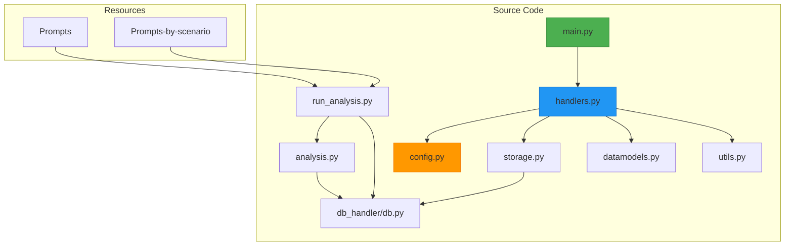

**Diagram sources**
- [main.py](file://src/main.py)
- [handlers.py](file://src/handlers.py)
- [config.py](file://src/config.py)
- [run_analysis.py](file://src/run_analysis.py)
- [analysis.py](file://src/analysis.py)
- [storage.py](file://src/storage.py)
- [db_handler/db.py](file://src/db_handler/db.py)

**Section sources**
- [main.py](file://src/main.py)
- [handlers.py](file://src/handlers.py)
- [config.py](file://src/config.py)

## Core Components
The VoxPersona application consists of several core components that work together to process audio files and generate analysis reports. The main components include the entry point (main.py), request handlers (handlers.py), configuration management (config.py), analysis engine (analysis.py), and database interaction layer (db_handler/db.py).

**Section sources**
- [main.py](file://src/main.py)
- [handlers.py](file://src/handlers.py)
- [config.py](file://src/config.py)
- [analysis.py](file://src/analysis.py)
- [db_handler/db.py](file://src/db_handler/db.py)

## Architecture Overview
VoxPersona follows a layered architecture with clear separation between the presentation layer (Telegram bot interface), business logic layer (analysis and processing), and data access layer (database and storage). The application uses a state machine pattern to manage user interactions and a plugin-based architecture for analysis reports.

The system processes requests through the following flow:
1. User uploads an audio file or selects a stored file
2. Audio is transcribed using Whisper API
3. Speaker roles are assigned using LLM analysis
4. User provides metadata (employee, client, location, etc.)
5. Analysis reports are generated based on prompt templates
6. Results are stored in the database and returned to the user

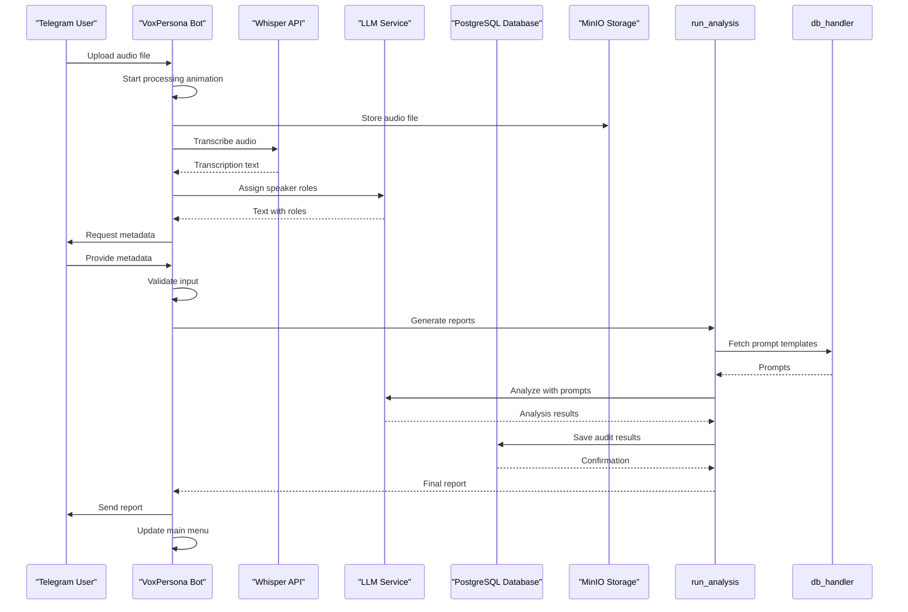

**Diagram sources**
- [main.py](file://src/main.py)
- [handlers.py](file://src/handlers.py)
- [run_analysis.py](file://src/run_analysis.py)
- [analysis.py](file://src/analysis.py)
- [db_handler/db.py](file://src/db_handler/db.py)

## Detailed Component Analysis
This section provides in-depth analysis of the key components in the VoxPersona codebase, explaining their responsibilities, interactions, and implementation details.

### Entry Point Analysis
The main.py file serves as the entry point for the VoxPersona application. It initializes the Telegram bot client, registers handlers, and manages the application lifecycle.

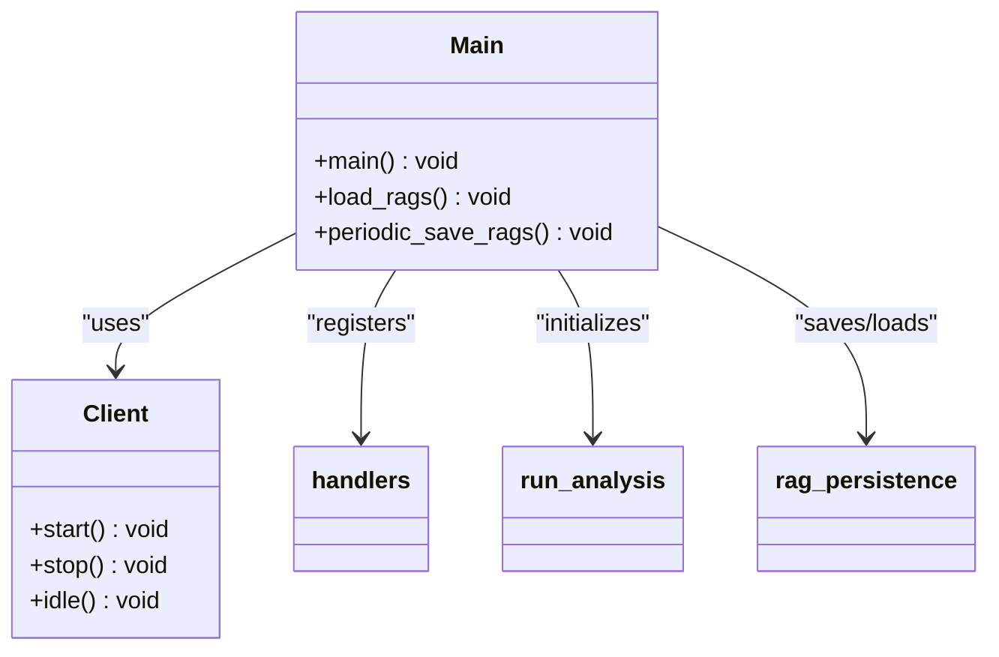

**Diagram sources**
- [main.py](file://src/main.py)
- [handlers.py](file://src/handlers.py)
- [run_analysis.py](file://src/run_analysis.py)
- [rag_persistence.py](file://src/rag_persistence.py)

**Section sources**
- [main.py](file://src/main.py)

### Request Handling Analysis
The handlers.py module implements the request handling pattern for the VoxPersona application. It processes various types of user interactions including text messages, audio files, documents, and callback queries.

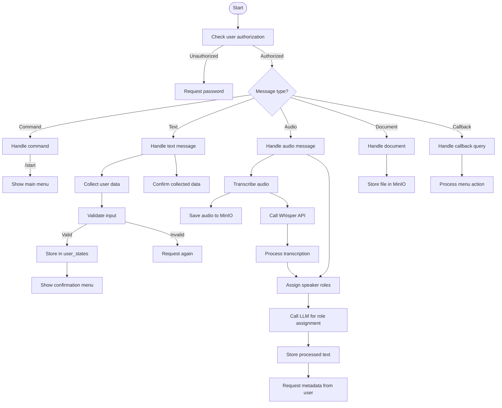

**Diagram sources**
- [handlers.py](file://src/handlers.py)
- [audio_utils.py](file://src/audio_utils.py)
- [analysis.py](file://src/analysis.py)
- [storage.py](file://src/storage.py)

**Section sources**
- [handlers.py](file://src/handlers.py)

### Configuration Management Analysis
The config.py module manages application configuration through environment variables and provides global state management for the application.

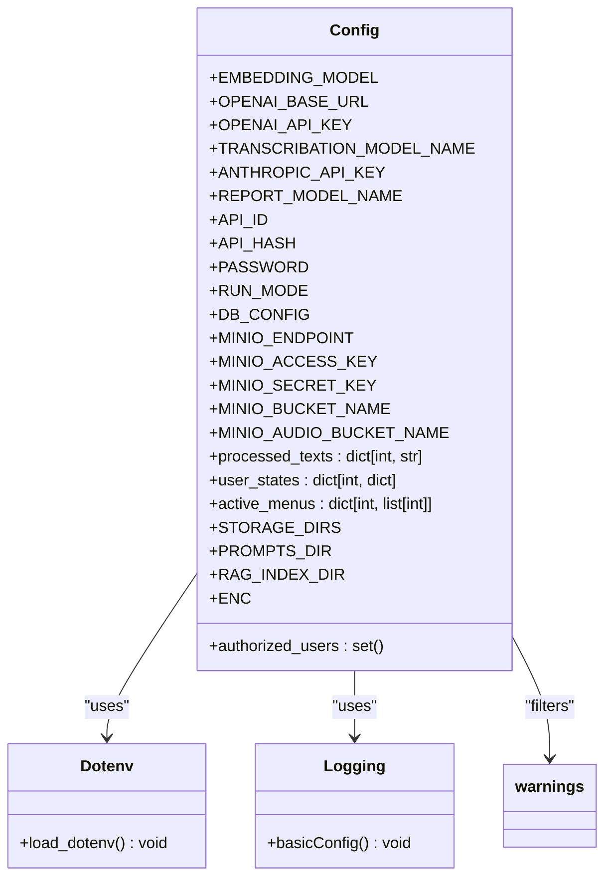

**Diagram sources**
- [config.py](file://src/config.py)

**Section sources**
- [config.py](file://src/config.py)

## State Management
VoxPersona uses a state management pattern based on the `user_states` dictionary to track user interactions across multiple steps. This pattern enables the application to collect multi-part input from users in a conversational manner.

The state management system works as follows:
1. Each user session is identified by their Telegram chat ID
2. A state dictionary is created for each active user session
3. The state dictionary contains:
   - Current step in the workflow
   - Collected data fields
   - Mode (interview or design)
   - Pending report selection
   - Deep search preference

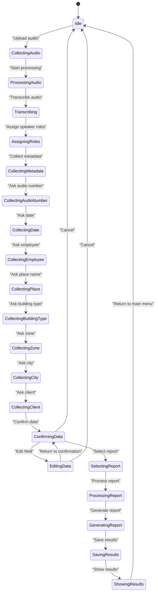

**Diagram sources**
- [handlers.py](file://src/handlers.py)
- [config.py](file://src/config.py)

**Section sources**
- [handlers.py](file://src/handlers.py)
- [config.py](file://src/config.py)

## Configuration Management
The configuration system in VoxPersona is implemented in config.py and provides a centralized way to manage application settings and credentials. The system uses environment variables loaded from a .env file, allowing for easy configuration across different environments.

Key configuration aspects include:
- API credentials for external services (OpenAI, Anthropic, Telegram)
- Database connection parameters
- Storage configuration (MinIO)
- Model selection for transcription and analysis
- Directory paths for file storage
- RAG (Retrieval-Augmented Generation) index storage

The configuration system also handles environment-specific settings through the RUN_MODE variable, which determines whether the application uses production or test configuration values.

```mermaid
erDiagram
CONFIG ||--o{ ENV_VARS : contains
CONFIG ||--o{ DATABASE : configures
CONFIG ||--o{ STORAGE : configures
CONFIG ||--o{ API_KEYS : manages
class ENV_VARS {
string OPENAI_API_KEY
string ANTHROPIC_API_KEY
string TELEGRAM_BOT_TOKEN
string API_ID
string API_HASH
string PASSWORD
string RUN_MODE
}
class DATABASE {
string DB_NAME
string DB_USER
string DB_PASSWORD
string DB_HOST
string DB_PORT
string TEST_DB_NAME
string TEST_DB_USER
string TEST_DB_PASSWORD
string TEST_DB_HOST
string TEST_DB_PORT
}
class STORAGE {
string MINIO_ENDPOINT
string MINIO_ACCESS_KEY
string MINIO_SECRET_KEY
string MINIO_BUCKET_NAME
string MINIO_AUDIO_BUCKET_NAME
string STORAGE_DIRS
string PROMPTS_DIR
string RAG_INDEX_DIR
}
class API_KEYS {
string OPENAI_BASE_URL
string TRANSCRIBATION_MODEL_NAME
string REPORT_MODEL_NAME
}
```

**Diagram sources**
- [config.py](file://src/config.py)

**Section sources**
- [config.py](file://src/config.py)

## Request Handling Pattern
The request handling pattern in VoxPersona is implemented through the handlers.py module, which uses the Pyrogram framework to process incoming messages and callback queries. The pattern follows a modular approach with separate functions for different types of interactions.

The request handling system includes:
- Command handlers for /start and other commands
- Message handlers for text, audio, voice, and document messages
- Callback query handlers for menu interactions
- Authorization system to restrict access
- State management to track multi-step workflows
- Error handling for various failure scenarios

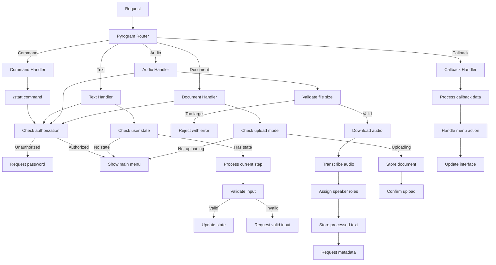

**Diagram sources**
- [handlers.py](file://src/handlers.py)

**Section sources**
- [handlers.py](file://src/handlers.py)

## Prompt Templates and Analysis Pipeline
The analysis pipeline in VoxPersona is driven by prompt templates stored in the prompts and prompts-by-scenario directories. These templates define how the LLM should analyze the transcribed audio and generate reports.

The analysis pipeline consists of the following steps:
1. Fetch appropriate prompt templates based on scenario, report type, and building type
2. Process the input text through the prompt sequence
3. Generate intermediate and final analysis results
4. Save results to the database
5. Return results to the user

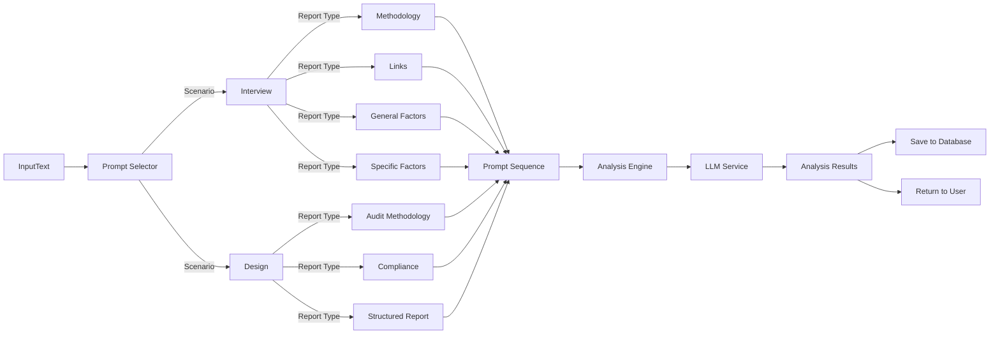

**Diagram sources**
- [run_analysis.py](file://src/run_analysis.py)
- [analysis.py](file://src/analysis.py)
- [db_handler/db.py](file://src/db_handler/db.py)

**Section sources**
- [run_analysis.py](file://src/run_analysis.py)
- [analysis.py](file://src/analysis.py)
- [db_handler/db.py](file://src/db_handler/db.py)

## Contribution Workflow
The contribution workflow for VoxPersona follows standard Git practices with the following key steps:

1. Fork the repository and create a feature branch
2. Make changes following the coding standards
3. Test changes locally
4. Commit changes with descriptive messages
5. Push changes to the forked repository
6. Create a pull request

When adding new features or modifying existing functionality, contributors should:
- Update relevant documentation
- Add or modify tests as needed
- Follow the existing code style
- Ensure backward compatibility when possible
- Use descriptive variable and function names

For adding new prompt templates, the process involves:
1. Creating the prompt file in the appropriate directory
2. Adding the prompt to the database schema
3. Updating the prompt mapping in datamodels.py
4. Testing the new prompt with sample data

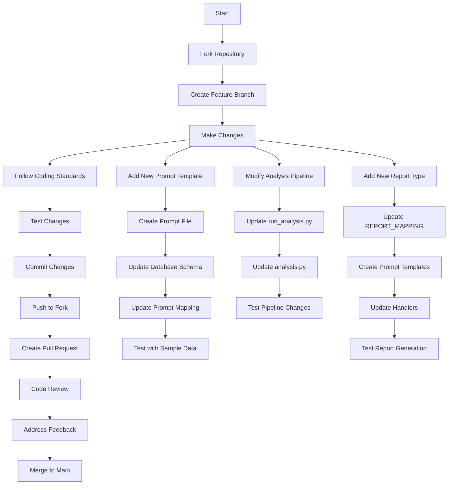

**Diagram sources**
- [run_analysis.py](file://src/run_analysis.py)
- [analysis.py](file://src/analysis.py)
- [datamodels.py](file://src/datamodels.py)
- [handlers.py](file://src/handlers.py)

**Section sources**
- [run_analysis.py](file://src/run_analysis.py)
- [analysis.py](file://src/analysis.py)
- [datamodels.py](file://src/datamodels.py)
- [handlers.py](file://src/handlers.py)

## Development Environment Setup
To set up the development environment for VoxPersona, follow these steps:

1. Clone the repository
2. Install Python dependencies from requirements.txt
3. Set up a virtual environment
4. Create a .env file with required environment variables
5. Configure database connection
6. Set up MinIO storage
7. Install required system dependencies (ffmpeg, etc.)

The application requires the following external services:
- PostgreSQL database
- MinIO object storage
- Telegram Bot API
- OpenAI/Whisper API for transcription
- Anthropic/LLM API for analysis

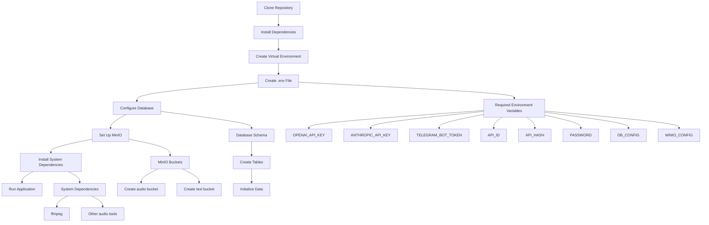

**Diagram sources**
- [requirements.txt](file://requirements.txt)
- [config.py](file://src/config.py)
- [docker-compose.yml](file://docker-compose.yml)

**Section sources**
- [SETUP.md](file://SETUP.md)
- [config.py](file://src/config.py)

## Testing and Debugging
The VoxPersona application includes several mechanisms for testing and debugging:

1. Logging system with different log levels
2. Error handling with descriptive messages
3. Loading animations to indicate processing status
4. Database logging for audit trails
5. Test mode configuration

Common issues and their solutions include:

**Audio Processing Issues**
- Large audio files: Split into smaller chunks
- Unsupported formats: Convert to supported format
- Transcription errors: Check Whisper API key and connectivity

**Authentication Issues**
- Invalid password: Verify password in .env file
- Unauthorized access: Check user ID and authorization logic

**Database Issues**
- Connection errors: Verify database configuration
- Missing tables: Run database migration
- Data integrity errors: Check foreign key constraints

**LLM Integration Issues**
- API key errors: Verify API key and permissions
- Rate limiting: Implement retry logic with backoff
- Model availability: Check model name and region

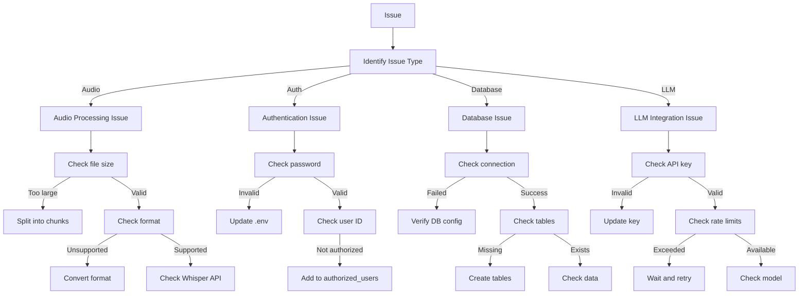

**Diagram sources**
- [handlers.py](file://src/handlers.py)
- [config.py](file://src/config.py)
- [db_handler/db.py](file://src/db_handler/db.py)
- [analysis.py](file://src/analysis.py)

**Section sources**
- [handlers.py](file://src/handlers.py)
- [config.py](file://src/config.py)
- [db_handler/db.py](file://src/db_handler/db.py)
- [analysis.py](file://src/analysis.py)

## Coding Standards and Best Practices
The VoxPersona codebase follows several coding standards and best practices to ensure maintainability and readability:

1. **Code Organization**: Modular structure with clear separation of concerns
2. **Naming Conventions**: Descriptive variable and function names
3. **Documentation**: Inline comments and docstrings for complex logic
4. **Error Handling**: Comprehensive error handling with logging
5. **Type Hints**: Use of type hints where appropriate
6. **Configuration Management**: Centralized configuration through environment variables
7. **Security**: Secure handling of credentials and user data

Best practices for writing maintainable code in VoxPersona include:

- Use descriptive function and variable names
- Keep functions focused on a single responsibility
- Add comments for complex logic or algorithms
- Follow the existing code style and formatting
- Use constants for magic numbers and strings
- Implement proper error handling and logging
- Write modular, reusable code
- Avoid global state when possible
- Use configuration files for environment-specific settings

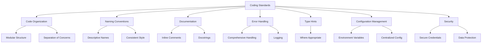

**Diagram sources**
- [handlers.py](file://src/handlers.py)
- [config.py](file://src/config.py)
- [analysis.py](file://src/analysis.py)
- [run_analysis.py](file://src/run_analysis.py)

**Section sources**
- [handlers.py](file://src/handlers.py)
- [config.py](file://src/config.py)
- [analysis.py](file://src/analysis.py)
- [run_analysis.py](file://src/run_analysis.py)

## Error Handling and Logging
The error handling and logging system in VoxPersona is designed to provide comprehensive visibility into application behavior and facilitate debugging. The system uses Python's built-in logging module with a consistent format across all components.

Key aspects of the error handling system include:

- **Centralized Logging**: All components use the same logging configuration
- **Error Levels**: Use of appropriate log levels (INFO, WARNING, ERROR)
- **Exception Handling**: Comprehensive try-except blocks around critical operations
- **User Feedback**: Informative error messages for users
- **Security**: Avoid leaking sensitive information in error messages

The logging system captures important events such as:
- Application startup and shutdown
- User authentication attempts
- Audio processing steps
- Database operations
- API calls to external services
- Error conditions and exceptions

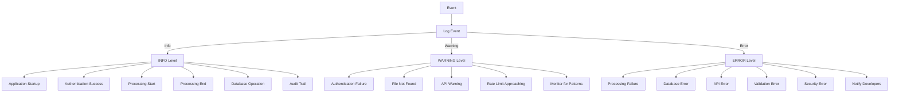

**Diagram sources**
- [handlers.py](file://src/handlers.py)
- [config.py](file://src/config.py)
- [analysis.py](file://src/analysis.py)
- [db_handler/db.py](file://src/db_handler/db.py)

**Section sources**
- [handlers.py](file://src/handlers.py)
- [config.py](file://src/config.py)
- [analysis.py](file://src/analysis.py)
- [db_handler/db.py](file://src/db_handler/db.py)

## Common Development Tasks
This section provides examples of common development tasks in the VoxPersona codebase, including adding new features, modifying existing functionality, and creating new prompt templates.

### Adding a New Report Type
To add a new report type, follow these steps:

1. Define the report type in datamodels.py
2. Create prompt templates in the prompts directory
3. Update the REPORT_MAPPING in datamodels.py
4. Add the report to the appropriate menu in markups.py
5. Implement any necessary analysis logic in analysis.py
6. Update the database schema if needed
7. Test the new report type

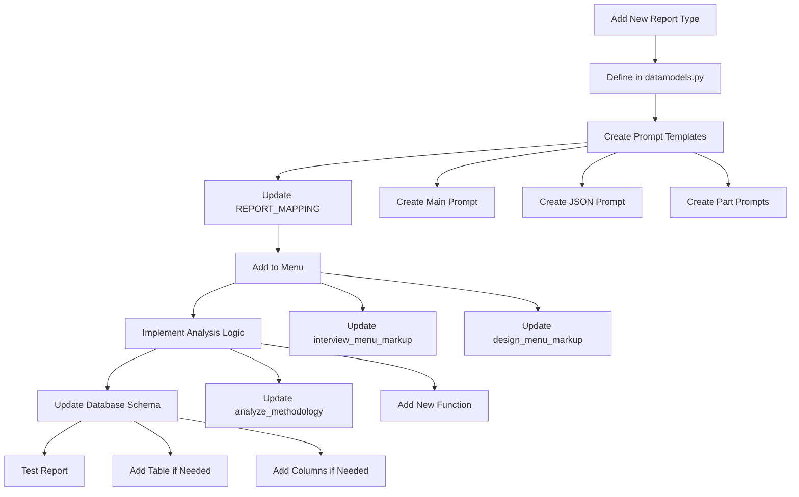

**Diagram sources**
- [datamodels.py](file://src/datamodels.py)
- [prompts](file://prompts)
- [markups.py](file://src/markups.py)
- [analysis.py](file://src/analysis.py)
- [db_handler/db.py](file://src/db_handler/db.py)

**Section sources**
- [datamodels.py](file://src/datamodels.py)
- [prompts](file://prompts)
- [markups.py](file://src/markups.py)
- [analysis.py](file://src/analysis.py)
- [db_handler/db.py](file://src/db_handler/db.py)

### Modifying the Analysis Pipeline
To modify the analysis pipeline, follow these steps:

1. Identify the appropriate module (run_analysis.py or analysis.py)
2. Understand the existing pipeline structure
3. Make changes to the analysis logic
4. Update any dependent components
5. Test the modified pipeline
6. Update documentation if needed

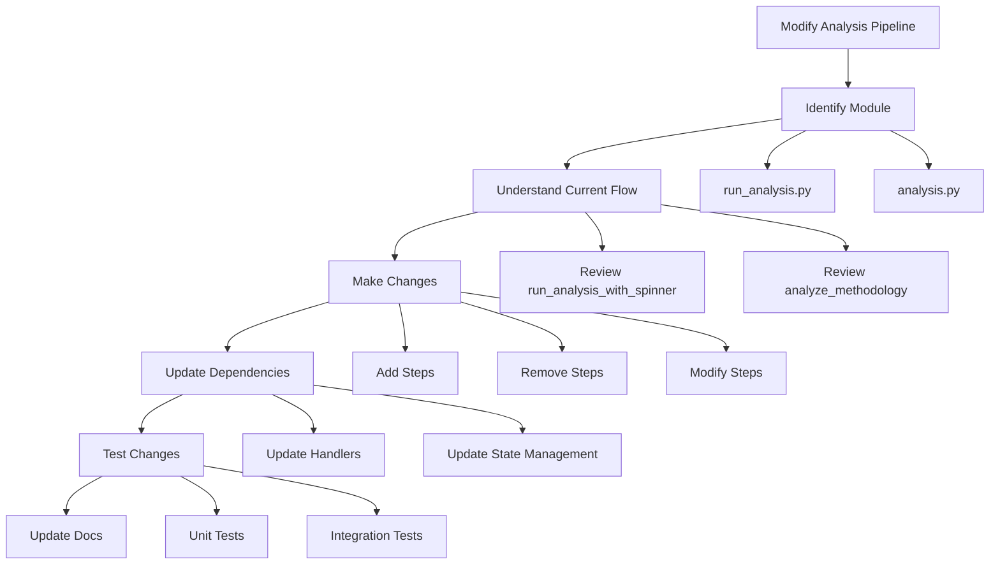

**Diagram sources**
- [run_analysis.py](file://src/run_analysis.py)
- [analysis.py](file://src/analysis.py)
- [handlers.py](file://src/handlers.py)

**Section sources**
- [run_analysis.py](file://src/run_analysis.py)
- [analysis.py](file://src/analysis.py)
- [handlers.py](file://src/handlers.py)

## Conclusion
This developer guide provides comprehensive documentation for contributing to the VoxPersona project. The application follows a modular architecture with clear separation of concerns, making it easier to understand and extend. Key components include the entry point (main.py), request handlers (handlers.py), configuration management (config.py), and analysis pipeline (run_analysis.py and analysis.py).

The state management system using the user_states dictionary enables complex multi-step workflows, while the configuration system provides flexibility across different environments. The analysis pipeline leverages prompt templates to generate structured reports from audio transcriptions.

When contributing to the project, developers should follow the established coding standards, use descriptive names, and maintain consistent formatting. The error handling and logging systems provide valuable insights for debugging and monitoring application behavior.

By following the patterns and practices documented in this guide, developers can effectively contribute to the VoxPersona project and help improve its functionality and reliability.