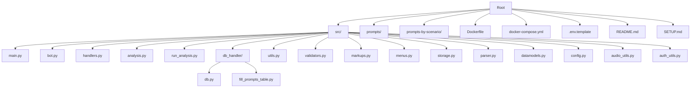
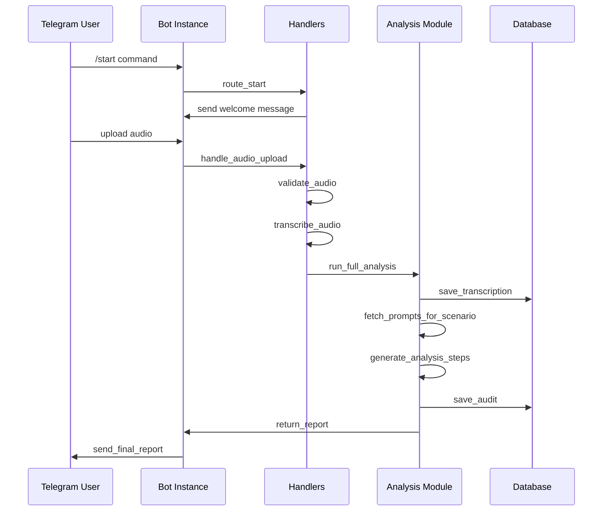
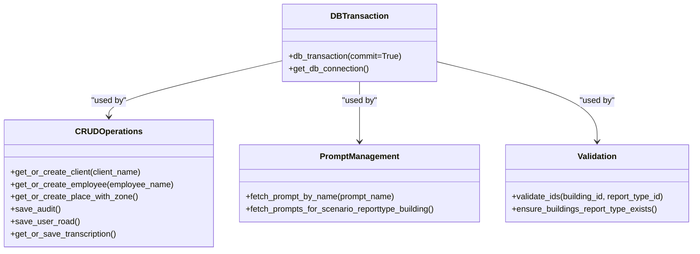
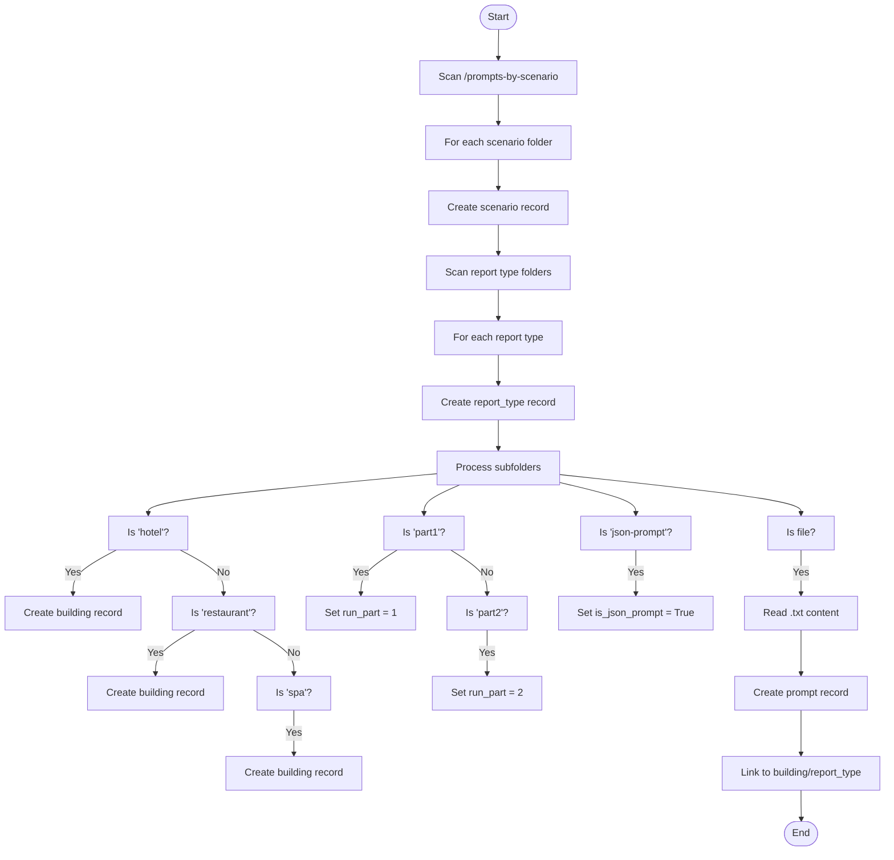
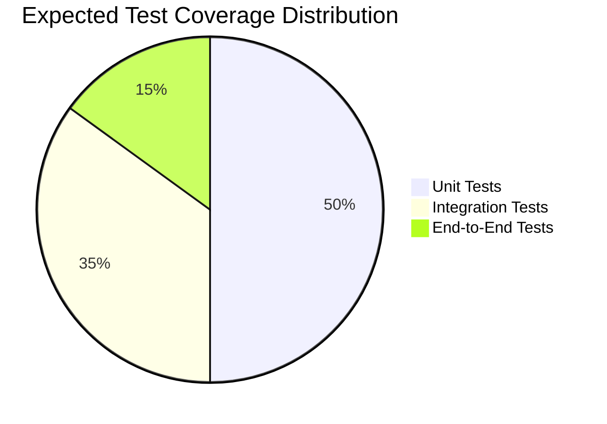

# Development Guide

<cite>
**Referenced Files in This Document**   
- [src/main.py](file://src\main.py)
- [src/bot.py](file://src\bot.py)
- [src/handlers.py](file://src\handlers.py)
- [src/analysis.py](file://src\analysis.py)
- [src/run_analysis.py](file://src\run_analysis.py)
- [src/db_handler/db.py](file://src\db_handler\db.py)
- [src/db_handler/fill_prompts_table.py](file://src\db_handler\fill_prompts_table.py)
- [src/datamodels.py](file://src\datamodels.py)
- [src/utils.py](file://src\utils.py)
- [src/validators.py](file://src\validators.py)
- [src/markups.py](file://src\markups.py)
- [src/menus.py](file://src\menus.py)
- [src/storage.py](file://src\storage.py)
- [src/parser.py](file://src\parser.py)
- [src/config.py](file://src\config.py)
- [src/audio_utils.py](file://src\audio_utils.py)
- [src/auth_utils.py](file://src\auth_utils.py)
- [prompts-by-scenario](file://prompts-by-scenario)
- [.env.template](file://.env.template)
- [README.md](file://README.md)
- [SETUP.md](file://SETUP.md)
- [Dockerfile](file://Dockerfile)
- [docker-compose.yml](file://docker-compose.yml)
- [requirements.txt](file://requirements.txt)
- [DEPLOYMENT_GUIDE.md](file://DEPLOYMENT_GUIDE.md) - *Updated in recent commit*
- [.github/DEPLOYMENT_SETUP.md](file://.github\DEPLOYMENT_SETUP.md) - *Added in recent commit*
- [.github/TESTING_GUIDE.md](file://.github\TESTING_GUIDE.md) - *Added in recent commit*
</cite>

## Update Summary
**Changes Made**   
- Added new section on Intelligent GitHub Actions Deployment System
- Updated Contribution Workflow section with new deployment procedures
- Added references to new deployment and testing guide documentation
- Enhanced documentation with intelligent deployment detection details

## Table of Contents
1. [Introduction](#introduction)
2. [Project Structure](#project-structure)
3. [Core Components](#core-components)
4. [Architecture Overview](#architecture-overview)
5. [Detailed Component Analysis](#detailed-component-analysis)
6. [Contribution Workflow](#contribution-workflow)
7. [Testing Strategy](#testing-strategy)
8. [Coding Conventions and Best Practices](#coding-conventions-and-best-practices)
9. [Extending Functionality](#extending-functionality)
10. [Debugging and Troubleshooting](#debugging-and-troubleshooting)
11. [Appendices](#appendices)

## Introduction

VoxPersona is an AI-powered voice analysis platform designed to transcribe, analyze, and generate structured reports from audio recordings using advanced language models. The system integrates with Telegram for user interaction and leverages Retrieval-Augmented Generation (RAG), PostgreSQL for data persistence, and FAISS for semantic search. This guide provides comprehensive documentation for developers contributing to the codebase, covering architecture, component responsibilities, contribution workflows, testing strategies, and extension patterns.

**Section sources**
- [README.md](file://README.md#L1-L50)

## Project Structure

The project follows a modular structure organized by functionality and domain concerns. The root directory contains configuration, deployment, and documentation files, while the `src/` directory houses all application logic.



**Diagram sources**
- [src/main.py](file://src\main.py#L1-L10)
- [src/db_handler/db.py](file://src\db_handler\db.py#L1-L20)

**Section sources**
- [README.md](file://README.md#L50-L100)

## Core Components

The core components of VoxPersona are organized within the `src/` directory and represent distinct layers of responsibility:

- **`main.py`**: Entry point of the application; initializes the bot and starts the event loop.
- **`bot.py`**: Implements the Telegram bot interface using python-telegram-bot.
- **`handlers.py`**: Contains message and callback query handlers for user interactions.
- **`analysis.py`**: Core logic for processing transcriptions and generating insights.
- **`run_analysis.py`**: Coordinates the multi-step analysis pipeline.
- **`storage.py`**: Manages RAG operations and vector database interactions.
- **`db_handler/db.py`**: Database access layer with transaction management.
- **`utils.py`**: Shared utility functions across modules.
- **`validators.py`**: Input validation logic for user data.
- **`markups.py`**: Telegram UI elements (inline keyboards).
- **`menus.py`**: Menu navigation logic.
- **`parser.py`**: Parses model outputs into structured data.
- **`datamodels.py`**: Data mappings for scenario configurations.
- **`config.py`**: Configuration loading and environment variables.
- **`audio_utils.py`**: Audio file processing utilities.
- **`auth_utils.py`**: Authentication and access control.

**Section sources**
- [src/main.py](file://src\main.py#L1-L20)
- [src/bot.py](file://src\bot.py#L1-L15)
- [src/handlers.py](file://src\handlers.py#L1-L25)
- [src/analysis.py](file://src\analysis.py#L1-L15)

## Architecture Overview

VoxPersona follows a layered architecture with clear separation between presentation, business logic, and data access layers. The system is event-driven via Telegram interactions and processes audio through a pipeline involving transcription, analysis, and reporting.

```mermaid
graph TD
A[Telegram User] --> |Sends Audio| B(Telegram Bot)
B --> C[Message Handler]
C --> D[Audio Validation]
D --> E[Transcription via Whisper]
E --> F[Save Transcription]
F --> G[Analysis Pipeline]
G --> H[Fetch Prompts by Scenario]
H --> I[Generate Analysis with Claude]
I --> J[Parse Results]
J --> K[Store in Database]
K --> L[Generate Report]
L --> M[Send Back to User]
N[Database] < --> F
N < --> K
O[Prompts] < --> H
P[RAG System] < --> I
```

**Diagram sources**
- [src/bot.py](file://src\bot.py#L1-L50)
- [src/handlers.py](file://src\handlers.py#L20-L100)
- [src/run_analysis.py](file://src\run_analysis.py#L1-L30)

**Section sources**
- [README.md](file://README.md#L100-L150)

## Detailed Component Analysis

### Main Application Flow

The application starts in `main.py`, which imports and initializes the bot instance defined in `bot.py`. The bot listens for messages and dispatches them to appropriate handlers.



**Diagram sources**
- [src/main.py](file://src\main.py#L20-L40)
- [src/bot.py](file://src\bot.py#L50-L100)
- [src/handlers.py](file://src\handlers.py#L100-L200)

**Section sources**
- [src/main.py](file://src\main.py#L1-L50)
- [src/bot.py](file://src\bot.py#L1-L100)
- [src/handlers.py](file://src\handlers.py#L1-L200)

### Database Handler Analysis

The `db_handler/db.py` module provides a robust database abstraction layer using psycopg2 and decorator-based transaction management.

#### Key Functions and Patterns

- **`@db_transaction`**: Decorator that wraps functions in a database transaction with automatic commit/rollback.
- **`get_or_create_*`**: Idempotent functions that retrieve or insert records (e.g., clients, employees, places).
- **`fetch_prompts_for_scenario_reporttype_building`**: Complex query to retrieve prompts based on scenario, report type, and building type.



**Diagram sources**
- [src/db_handler/db.py](file://src\db_handler\db.py#L1-L50)
- [src/db_handler/db.py](file://src\db_handler\db.py#L100-L200)
- [src/db_handler/db.py](file://src\db_handler\db.py#L300-L350)

**Section sources**
- [src/db_handler/db.py](file://src\db_handler\db.py#L1-L399)

### Prompt Management System

The prompt system is initialized via `fill_prompts_table.py`, which recursively processes the `prompts-by-scenario/` directory and populates the database.



**Diagram sources**
- [src/db_handler/fill_prompts_table.py](file://src\db_handler\fill_prompts_table.py#L1-L228)

**Section sources**
- [src/db_handler/fill_prompts_table.py](file://src\db_handler\fill_prompts_table.py#L1-L228)

## Contribution Workflow

### Branching Strategy

The repository uses a Git workflow based on feature branches:

- **`main`**: Protected production branch
- **`develop`**: Integration branch for ongoing development
- **`feature/*`**: Feature branches (e.g., `feature/audio-enhancement`)
- **`bugfix/*`**: Bug fix branches
- **`hotfix/*`**: Critical production fixes

### Pull Request Process

1. Create a feature branch from `develop`
2. Implement changes with comprehensive commits
3. Ensure code adheres to style guidelines
4. Run local tests (if available)
5. Push branch and create PR to `develop`
6. Request code review from team members
7. Address feedback and update PR
8. Merge after approval

### Code Review Standards

- **Code Quality**: Follow PEP 8, meaningful variable names, proper docstrings
- **Security**: No hardcoded secrets, input validation
- **Performance**: Efficient queries, proper indexing
- **Testing**: Add tests for new functionality
- **Documentation**: Update relevant documentation

### Intelligent GitHub Actions Deployment System

VoxPersona now features an intelligent deployment system that automatically determines the optimal deployment strategy based on file changes:

- **NO_RESTART** (5-10s): Documentation changes only
- **APP_ONLY** (30-60s): Application code changes
- **FULL_RESTART** (2-3min): Infrastructure changes

#### Quick Start

1. **Configure GitHub Secrets** (one-time setup):
   ```
   SSH_PRIVATE_KEY - SSH key for server access
   SERVER_IP - Deployment server IP
   SERVER_USER - SSH username
   ```

2. **Push to main branch**:
   ```bash
   git push origin main
   ```
   
3. **Monitor deployment** in GitHub Actions tab

#### Manual Deployment Control

For manual deployments:
1. Go to Actions → "Intelligent VoxPersona Deployment"
2. Click "Run workflow"
3. Select deployment type: `auto`, `full`, `app-only`, or `no-restart`

#### Detailed Setup

See comprehensive guides:
- [Deployment Setup Guide](.github/DEPLOYMENT_SETUP.md) - SSH keys, secrets, configuration
- [Testing Guide](.github/TESTING_GUIDE.md) - Test scenarios and validation

**Section sources**
- [README.md](file://README.md#L200-L223)
- [SETUP.md](file://SETUP.md#L250-L290)
- [DEPLOYMENT_GUIDE.md](file://DEPLOYMENT_GUIDE.md#L1-L109)
- [.github/DEPLOYMENT_SETUP.md](file://.github\DEPLOYMENT_SETUP.md)
- [.github/TESTING_GUIDE.md](file://.github\TESTING_GUIDE.md)

## Testing Strategy

Although explicit test files are not visible in the project structure, the architecture suggests the following testing expectations:

### Unit Testing

- **Handlers**: Test message routing and response generation
- **Validators**: Test input validation logic
- **Utils**: Test helper functions
- **Database Functions**: Mock database connections and test CRUD operations

### Integration Testing

- **Analysis Pipeline**: Test end-to-end flow from audio input to report generation
- **Database Operations**: Test actual database interactions
- **RAG System**: Test retrieval accuracy and context injection
- **Telegram Integration**: Test bot command handling

### Expected Test Coverage



**Section sources**
- [src/handlers.py](file://src\handlers.py#L1-L200)
- [src/analysis.py](file://src\analysis.py#L1-L100)
- [src/db_handler/db.py](file://src\db_handler\db.py#L1-L399)

## Coding Conventions and Best Practices

### Python Style

- Follow PEP 8 guidelines
- Use type hints where applicable
- Write comprehensive docstrings using Google format
- Keep functions focused and under 50 lines

### Logging Practices

- Use `logging` module with appropriate levels
- Include context in log messages (e.g., user ID, audio file name)
- Avoid logging sensitive information
- Use structured logging where possible

### Error Handling

- Use specific exception types
- Provide meaningful error messages
- Implement graceful degradation
- Log errors with sufficient context

### Database Access

- Use parameterized queries to prevent SQL injection
- Use transactions for related operations
- Implement connection pooling
- Use indexes on frequently queried fields

**Section sources**
- [src/db_handler/db.py](file://src\db_handler\db.py#L1-L399)
- [src/utils.py](file://src\utils.py#L1-L50)
- [src/validators.py](file://src\validators.py#L1-L50)

## Extending Functionality

### Adding New Analysis Scenarios

To add a new analysis scenario:

1. Create a new folder in `prompts-by-scenario/` with the scenario name
2. Add subfolders for report types (e.g., `Information-about-common-decision-making-factors`)
3. Create building-specific folders (`hotel/`, `restaurant/`, `spa/`)
4. Add `part1/`, `part2/` folders for multi-step analysis
5. Place `.txt` prompt files in appropriate locations
6. Update `datamodels.py` with new scenario mappings

### Extending the Prompt System

The prompt system uses a relational model:

- **`scenario`**: Top-level category (e.g., "design", "interview")
- **`report_type`**: Type of report within scenario
- **`buildings`**: Physical location types
- **`prompts`**: Individual prompt texts
- **`prompts_buildings`**: Many-to-many relationship table

To extend:
1. Add new prompt files following the directory structure
2. Ensure proper naming conventions
3. Run `fill_prompts_table.py` to populate database

### Modifying the RAG Pipeline

The RAG pipeline is managed in `storage.py` and `rag_persistence.py`. To modify:

1. Update vector embedding model if needed
2. Adjust chunking strategy in `storage.py`
3. Modify retrieval logic for better relevance
4. Update prompt templates to include retrieved context

**Section sources**
- [src/db_handler/fill_prompts_table.py](file://src\db_handler\fill_prompts_table.py#L1-L228)
- [src/datamodels.py](file://src\datamodels.py#L1-L50)
- [src/storage.py](file://src\storage.py#L1-L100)

## Debugging and Troubleshooting

### Using Logs

The system uses Python's `logging` module extensively. Key log locations:

- **Database operations**: CRUD success/failure messages
- **Prompt loading**: Prompt retrieval status
- **Analysis steps**: Progress through analysis pipeline
- **Error conditions**: Exception details and context

```bash
# View real-time logs
docker-compose logs -f voxpersona

# Search for errors
docker-compose logs voxpersona | grep -i "error\|exception"

# Monitor specific components
docker-compose logs voxpersona | grep "db_handler"
```

### Local Docker Debugging

For local development and debugging:

1. Set `RUN_MODE=DEV` in `.env`
2. Enable verbose logging
3. Use `docker-compose up` without `-d` flag
4. Attach to container for interactive debugging
5. Mount source directory as volume for live reload

```yaml
# In docker-compose.yml for development
services:
  voxpersona:
    volumes:
      - ./src:/app/src
    environment:
      - RUN_MODE=DEV
      - LOG_LEVEL=DEBUG
```

### Common Issues and Solutions

| Issue | Solution |
|------|----------|
| Database connection failures | Verify `DB_CONFIG` in `config.py` and PostgreSQL container status |
| Missing prompts in database | Run `fill_prompts_table.py` manually |
| Audio transcription failures | Check OpenAI API key and network connectivity |
| Slow analysis performance | Optimize prompt complexity and database queries |
| Telegram bot not responding | Verify bot token and webhook configuration |

**Section sources**
- [src/db_handler/db.py](file://src\db_handler\db.py#L1-L399)
- [.env.template](file://.env.template#L1-L45)
- [SETUP.md](file://SETUP.md#L1-L290)

## Appendices

### Environment Variables Reference

| Variable | Description | Required |
|--------|-------------|----------|
| `DB_NAME` | PostgreSQL database name | Yes |
| `DB_USER` | Database username | Yes |
| `DB_PASSWORD` | Database password | Yes |
| `ANTHROPIC_API_KEY` | Claude API key | Yes |
| `OPENAI_API_KEY` | OpenAI API key | Yes |
| `TELEGRAM_BOT_TOKEN` | Telegram bot token | Yes |
| `API_ID` | Telegram API ID | Yes |
| `API_HASH` | Telegram API hash | Yes |
| `PASSWORD` | Bot access password | Yes |
| `RUN_MODE` | Operation mode (PROD/DEV) | Yes |

### Directory Structure Reference

- **`prompts/`**: General system prompts
- **`prompts-by-scenario/`**: Scenario-specific prompts organized hierarchically
- **`src/db_handler/`**: Database initialization and access
- **`src/`**: Core application modules
- **Root files**: Configuration, deployment, and documentation