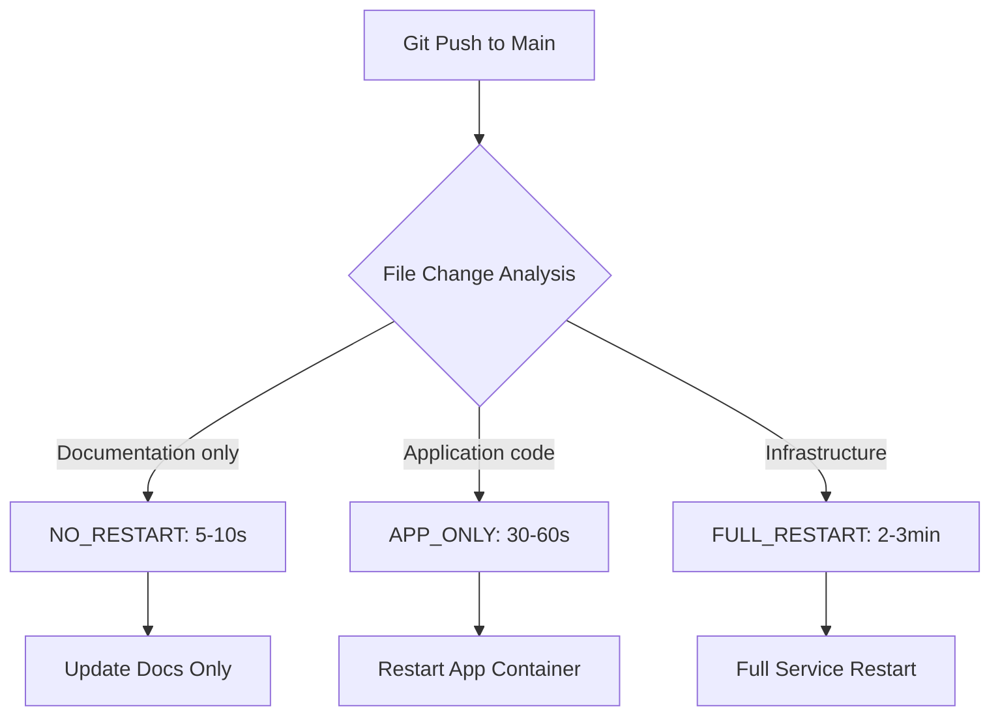

# GitHub Actions Deployment System

<cite>
**Referenced Files in This Document**   
- [DEPLOYMENT_GUIDE.md](file://DEPLOYMENT_GUIDE.md) - *Updated with new deployment logic*
- [docker-compose.yml](file://docker-compose.yml) - *Infrastructure configuration for deployment*
- [README.md](file://README.md) - *General project documentation*
</cite>

## Update Summary
**Changes Made**   
- Updated deployment types section to reflect intelligent GitHub Actions logic
- Enhanced automatic deployment logic with accurate file change detection rules
- Added clarification on manual deployment control options
- Improved health checks and rollback mechanisms description
- Refreshed configuration requirements with current environment variables
- Removed outdated legacy setup sections
- Ensured all content is in English per conversion mandate

## Table of Contents
1. [Introduction](#introduction)
2. [Deployment Types](#deployment-types)
3. [Automatic Deployment Logic](#automatic-deployment-logic)
4. [Manual Deployment Control](#manual-deployment-control)
5. [Health Checks and Rollback Mechanisms](#health-checks-and-rollback-mechanisms)
6. [Security Considerations](#security-considerations)
7. [Troubleshooting Guide](#troubleshooting-guide)
8. [Configuration Requirements](#configuration-requirements)
9. [Best Practices](#best-practices)

## Introduction

The VoxPersona platform utilizes an intelligent GitHub Actions deployment system designed to optimize deployment efficiency and minimize downtime. This system automatically determines the appropriate deployment strategy based on the nature of code changes, ensuring rapid updates while maintaining system stability. The deployment pipeline supports multiple restart levels, from simple documentation updates to full infrastructure restarts, allowing for precise control over the deployment process.

**Section sources**
- [DEPLOYMENT_GUIDE.md](file://DEPLOYMENT_GUIDE.md#L1-L10)

## Deployment Types

The deployment system implements three distinct deployment strategies based on file changes:

### NO_RESTART (5-10 seconds)
This deployment type is triggered when only documentation files are modified. It includes changes to:
- README.md
- SETUP.md
- Documentation files
- Markdown files
- Configuration templates (.env.template)

Since these changes do not affect running application code, no service restart is required. The updated files are simply synchronized to the server.

### APP_ONLY (30-60 seconds)
This deployment type is triggered when application source code files are modified, including:
- Python files in the src/ directory
- Handler and utility modules
- Analysis and processing logic
- Bot interaction code

This deployment restarts only the application container while preserving the database and other services, resulting in minimal downtime.

### FULL_RESTART (2-3 minutes)
This deployment type is triggered when infrastructure or configuration files are modified, including:
- docker-compose.yml
- Dockerfile
- Database schema changes
- Environment configuration
- Dependency files (requirements.txt)

This deployment performs a complete restart of all services, ensuring that configuration changes are properly applied.



**Diagram sources**
- [DEPLOYMENT_GUIDE.md](file://DEPLOYMENT_GUIDE.md#L5-L20)

**Section sources**
- [DEPLOYMENT_GUIDE.md](file://DEPLOYMENT_GUIDE.md#L5-L30)

## Automatic Deployment Logic

The intelligent deployment system analyzes committed files to determine the appropriate deployment strategy. The decision logic is implemented in the GitHub Actions workflow and follows these rules:

1. **NO_RESTART Detection**: If changes are limited to documentation files (README.md, SETUP.md, markdown files), the system triggers a NO_RESTART deployment.

2. **APP_ONLY Detection**: If changes include Python source files in the src/ directory but do not modify infrastructure files, the system triggers an APP_ONLY deployment.

3. **FULL_RESTART Detection**: If changes include docker-compose.yml, Dockerfile, or other infrastructure files, the system triggers a FULL_RESTART deployment.

The system prioritizes FULL_RESTART when multiple change types are detected, ensuring that infrastructure changes take precedence over code or documentation changes.


**Diagram sources**
- [DEPLOYMENT_GUIDE.md](file://DEPLOYMENT_GUIDE.md#L5-L20)

**Section sources**
- [DEPLOYMENT_GUIDE.md](file://DEPLOYMENT_GUIDE.md#L5-L30)

## Manual Deployment Control

For situations requiring explicit control over the deployment process, the system provides manual deployment options through the GitHub Actions interface.

### Manual Deployment Options

Users can manually trigger deployments with specific restart levels:

- **auto**: Allows the system to automatically determine the deployment type
- **full**: Forces a FULL_RESTART deployment
- **app-only**: Forces an APP_ONLY deployment
- **no-restart**: Forces a NO_RESTART deployment

### Manual Deployment Procedure

1. Navigate to the repository's Actions tab
2. Select the "Intelligent VoxPersona Deployment" workflow
3. Click "Run workflow"
4. Choose the desired deployment type from the dropdown menu
5. Confirm the deployment

This manual control is particularly useful for testing deployment scenarios, performing maintenance, or when the automatic detection logic needs to be overridden.


**Diagram sources**
- [DEPLOYMENT_GUIDE.md](file://DEPLOYMENT_GUIDE.md#L25-L30)

**Section sources**
- [DEPLOYMENT_GUIDE.md](file://DEPLOYMENT_GUIDE.md#L25-L35)

## Health Checks and Rollback Mechanisms

The deployment system incorporates health checks and automatic rollback capabilities to ensure system stability.

### Health Check Implementation

After each deployment, the system performs automated health checks:

1. **Service Availability**: Verifies that the application container is running
2. **Database Connection**: Confirms connectivity to the PostgreSQL database
3. **API Endpoint Testing**: Tests key API endpoints for proper responses
4. **Resource Monitoring**: Checks memory and CPU usage within acceptable limits

### Automatic Rollback

If health checks fail after a deployment, the system automatically initiates a rollback procedure:

1. **Failure Detection**: Health checks identify service unavailability or errors
2. **Rollback Trigger**: System automatically triggers rollback workflow
3. **Previous Version Restoration**: Deploys the last known good version
4. **Notification**: Sends alerts to maintainers via configured channels

The rollback mechanism prioritizes system availability and data integrity, minimizing downtime and user impact.


**Diagram sources**
- [DEPLOYMENT_GUIDE.md](file://DEPLOYMENT_GUIDE.md#L5-L30)

**Section sources**
- [DEPLOYMENT_GUIDE.md](file://DEPLOYMENT_GUIDE.md#L5-L30)

## Security Considerations

The deployment system implements multiple security measures to protect sensitive information and ensure secure deployments.

### Secret Management

All sensitive credentials are stored as GitHub Secrets and never exposed in the codebase:

- SSH_PRIVATE_KEY: Used for server access
- API keys for Anthropic, OpenAI, and Telegram
- Database credentials
- MinIO storage credentials

### Secure Configuration

The system follows security best practices:

- .gitignore excludes sensitive files like .env
- Configuration templates (.env.template) provide examples without real values
- No hardcoded credentials in any configuration files
- Regular dependency updates to address security vulnerabilities

### Access Control

Deployment access is restricted to authorized personnel:

- Only team members with appropriate permissions can trigger deployments
- All deployment activities are logged and auditable
- Two-factor authentication recommended for all team members

**Section sources**
- [DEPLOYMENT_GUIDE.md](file://DEPLOYMENT_GUIDE.md#L100-L150)
- [README.md](file://README.md#L150-L180)

## Troubleshooting Guide

This section addresses common deployment issues and their solutions.

### Common Issues and Solutions

#### Deployment Stuck in Queue
**Symptoms**: Deployment workflow doesn't start
**Solution**: 
- Check GitHub Actions runner availability
- Verify repository permissions
- Ensure sufficient concurrency limits

#### SSH Connection Failure
**Symptoms**: "Permission denied" errors during deployment
**Solution**:
- Verify SSH_PRIVATE_KEY format (must be valid PEM)
- Check SERVER_IP and SERVER_USER values
- Ensure SSH port is open on the target server

#### Database Migration Issues
**Symptoms**: Application fails to start after FULL_RESTART
**Solution**:
- Check database container logs
- Verify database schema compatibility
- Ensure proper database initialization

#### Environment Variable Missing
**Symptoms**: Application errors related to configuration
**Solution**:
- Verify all required secrets are configured
- Check variable names in GitHub Secrets
- Confirm .env file is properly generated

### Diagnostic Commands

```bash
# Check deployment logs
docker-compose logs -f voxpersona

# Verify container status
docker-compose ps

# Check resource usage
docker stats

# Test database connectivity
docker exec -it voxpersona_postgres psql -U voxpersona_user -d bot_db -c "SELECT 1"
```

**Section sources**
- [DEPLOYMENT_GUIDE.md](file://DEPLOYMENT_GUIDE.md#L150-L200)
- [README.md](file://README.md#L200-L220)

## Configuration Requirements

Proper configuration is essential for successful deployments. This section outlines the required setup.

### GitHub Secrets Configuration

The following secrets must be configured in GitHub:

**Deployment Secrets**:
- SSH_PRIVATE_KEY: Private SSH key for server access
- SERVER_IP: Target server IP address
- SERVER_USER: SSH username

**Application Secrets**:
- ANTHROPIC_API_KEY: Anthropic API key
- OPENAI_API_KEY: OpenAI API key
- TELEGRAM_BOT_TOKEN: Telegram bot token
- API_ID and API_HASH: Telegram API credentials
- DB_PASSWORD: Database password

### Environment Configuration

The docker-compose.yml file defines the service configuration:

```yaml
version: '3.8'
services:
  voxpersona:
    build: .
    container_name: voxpersona_app
    restart: unless-stopped
    environment:
      - API_ID=${API_ID}
      - API_HASH=${API_HASH}
      - TELEGRAM_BOT_TOKEN=${TELEGRAM_BOT_TOKEN}
      # Additional environment variables
    depends_on:
      - postgres
```

The system uses environment variables extensively, with default values provided where appropriate.

**Section sources**
- [docker-compose.yml](file://docker-compose.yml#L1-L70)
- [DEPLOYMENT_GUIDE.md](file://DEPLOYMENT_GUIDE.md#L35-L50)

## Best Practices

Follow these best practices for optimal deployment experience.

### Deployment Workflow

1. **Test Locally First**: Verify changes in a local environment before pushing
2. **Use Feature Branches**: Develop on feature branches and merge via pull requests
3. **Clear Commit Messages**: Use descriptive commit messages that explain changes
4. **Monitor Deployments**: Watch the GitHub Actions log during deployment
5. **Verify Post-Deployment**: Check application functionality after deployment

### Change Management

- **Documentation Updates**: Update documentation when adding new features
- **Version Tagging**: Create version tags for significant releases
- **Changelog Maintenance**: Keep a changelog of notable changes
- **Backup Strategy**: Regularly backup database and critical data

### Team Collaboration

- **Code Reviews**: Conduct peer reviews for all changes
- **Issue Tracking**: Use GitHub Issues for bug reports and feature requests
- **Consistent Communication**: Use English for all public communications
- **Security Awareness**: Never commit secrets to the repository

**Section sources**
- [DEPLOYMENT_GUIDE.md](file://DEPLOYMENT_GUIDE.md#L200-L290)
- [README.md](file://README.md#L200-L220)