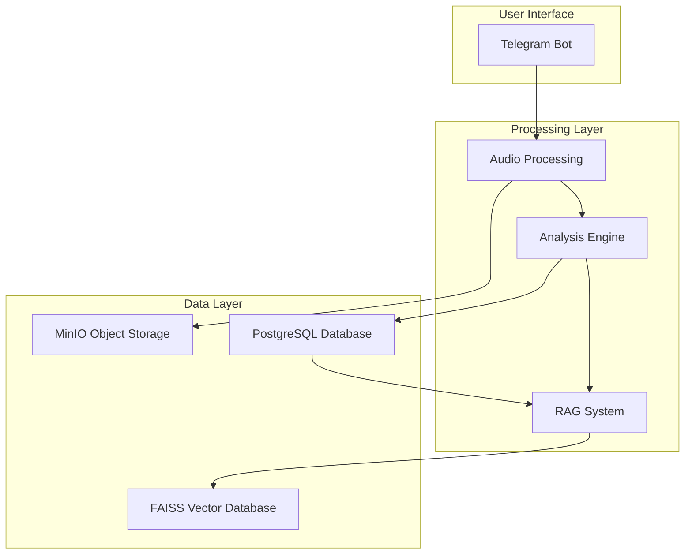
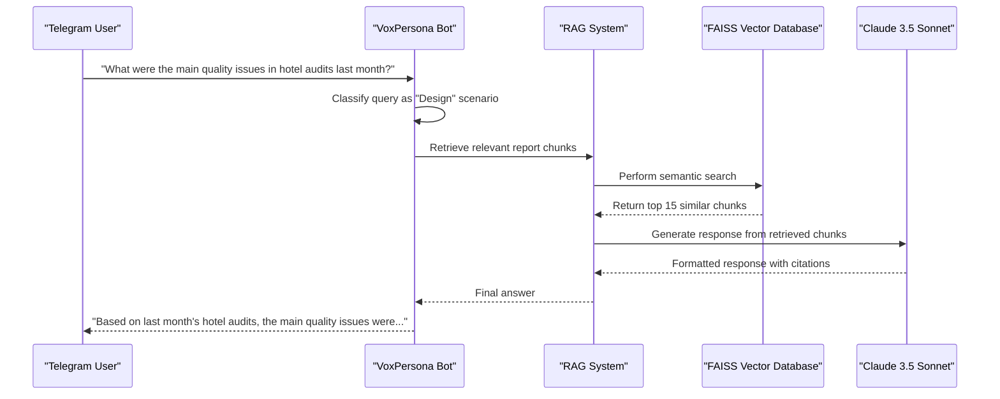
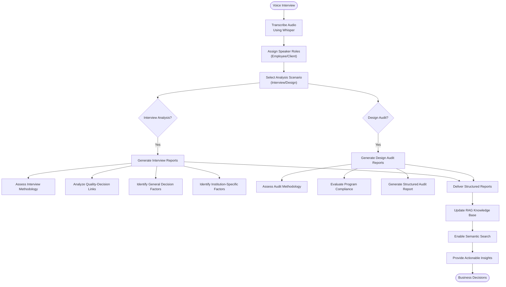

# Project Overview

<cite>
**Referenced Files in This Document**   
- [README.md](file://README.md)
- [main.py](file://src/main.py)
- [bot.py](file://src/bot.py)
- [handlers.py](file://src/handlers.py)
- [run_analysis.py](file://src/run_analysis.py)
- [analysis.py](file://src/analysis.py)
- [rag_persistence.py](file://src/rag_persistence.py)
- [storage.py](file://src/storage.py)
- [config.py](file://src/config.py)
- [db.py](file://src/db_handler/db.py)
</cite>

## Table of Contents
1. [Introduction](#introduction)
2. [Core Functionality](#core-functionality)
3. [System Architecture](#system-architecture)
4. [Event-Driven Processing Flow](#event-driven-processing-flow)
5. [RAG-Powered Search System](#rag-powered-search-system)
6. [State Management and User Interaction](#state-management-and-user-interaction)
7. [LLM Integration and Prompt Engineering](#llm-integration-and-prompt-engineering)
8. [Data Storage and Persistence](#data-storage-and-persistence)
9. [Use Cases and Real-World Scenarios](#use-cases-and-real-world-scenarios)
10. [Modular Design and Extensibility](#modular-design-and-extensibility)

## Introduction

VoxPersona is an AI-powered voice analysis platform designed to transform voice interviews and audit reports into structured, actionable insights for the hospitality sector. The system leverages advanced artificial intelligence technologies to automate the analysis of audio content from hotels, restaurants, and health centers, providing comprehensive compliance reports and decision-making factor assessments.

The platform operates as a Telegram bot, offering a user-friendly interface for uploading voice messages and receiving detailed analytical reports. At its core, VoxPersona combines automatic speech recognition, natural language processing, and retrieval-augmented generation (RAG) to deliver sophisticated analysis capabilities. The system is specifically tailored for hospitality industry professionals who need to evaluate service quality, compliance with audit programs, and customer decision-making factors.

VoxPersona's architecture integrates multiple AI models and services, including OpenAI's Whisper for audio transcription and Anthropic's Claude 3.5 Sonnet for deep content analysis. The platform processes voice messages through a multi-stage pipeline that includes transcription, speaker role assignment, structured report generation, and semantic search capabilities. This comprehensive approach enables organizations to extract valuable insights from qualitative data that would otherwise require extensive manual analysis.

The system supports multiple analysis scenarios, with specialized workflows for interview analysis and design audit evaluation. Each scenario produces detailed reports that can be used for quality assurance, staff performance evaluation, and strategic decision-making. By automating the analysis process, VoxPersona significantly reduces the time and resources required to extract meaningful insights from voice-based interactions.

**Section sources**
- [README.md](file://README.md#L1-L50)

## Core Functionality

VoxPersona delivers a comprehensive suite of AI-driven analysis capabilities centered around voice message processing for hospitality sector audits. The system's primary functionality begins with audio transcription using OpenAI's Whisper model, which converts voice messages into text with high accuracy. This transcription process handles various audio formats and can process recordings up to two hours in length, making it suitable for extended interviews and comprehensive audit sessions.

Following transcription, the system employs a sophisticated speaker role assignment mechanism that distinguishes between different participants in the conversation, such as employees and clients. This role identification is crucial for contextual analysis, as it allows the system to understand the perspective from which statements are made and to analyze interactions more accurately. The role assignment process uses specialized prompts and LLM analysis to identify and label speakers throughout the conversation.

The platform generates multiple types of structured reports based on the analysis scenario selected by the user. For interview analysis, VoxPersona produces reports on interview methodology assessment, quality-decision link analysis, general decision-making factors, and institution-specific factors. For design audits, the system generates reports on audit methodology assessment, compliance with audit programs, and structured audit reports. Each report type follows a consistent format while addressing specific aspects of the hospitality evaluation process.

A key feature of VoxPersona is its ability to handle both audio files and text documents, providing flexibility in data input. Users can upload voice messages directly through Telegram or submit pre-transcribed text files for analysis. The system also includes a storage management interface that allows users to organize and retrieve processed files, creating a comprehensive repository of audit materials and analysis results.

**Section sources**
- [README.md](file://README.md#L51-L100)
- [bot.py](file://src/bot.py#L1-L100)

## System Architecture

VoxPersona employs an event-driven, microservices-inspired architecture that integrates multiple AI models and data storage systems to deliver comprehensive voice analysis capabilities. The system is built on Python 3.10+ and leverages the Pyrogram library for Telegram bot functionality, creating a responsive interface that processes user interactions in real-time. The architecture follows a modular design pattern, with distinct components handling specific aspects of the analysis pipeline.

The core components of the system include the Telegram bot interface, audio processing module, analysis engine, RAG system, and database layer. These components communicate through well-defined interfaces, allowing for independent development and scaling. The bot interface receives voice messages and user commands, triggering the appropriate processing workflows. When a voice message is received, the system initiates a processing chain that begins with audio transcription and progresses through multiple analysis stages.

The system integrates with multiple external services and APIs, including OpenAI for audio transcription and Anthropic's Claude models for content analysis. These AI services are accessed through API keys configured in the system's environment variables, ensuring secure handling of authentication credentials. The architecture also incorporates MinIO for object storage, allowing the system to persist audio files and other media in a scalable, cloud-native storage solution.

PostgreSQL serves as the primary relational database, storing structured data such as audit records, transcriptions, and user inputs. The database schema is designed to capture the complex relationships between different entities in the analysis process, including employees, clients, locations, and audit reports. This structured storage enables comprehensive reporting and facilitates the RAG system's ability to retrieve relevant information across multiple analysis sessions.

**Diagram sources**
- [README.md](file://README.md#L101-L150)
- [main.py](file://src/main.py#L1-L20)
- [config.py](file://src/config.py#L1-L30)

## Event-Driven Processing Flow

VoxPersona implements an event-driven architecture that processes user interactions and system events through a series of coordinated workflows. The processing flow begins when a user sends a voice message or audio file to the Telegram bot, triggering an event that initiates the audio processing pipeline. This event-driven approach ensures that the system responds promptly to user inputs while maintaining a responsive interface through asynchronous processing.

When an audio file is received, the system creates a temporary processing environment where the file is downloaded and prepared for transcription. A loading animation provides visual feedback to the user, indicating that processing is underway. The audio processing module then transcribes the voice message using OpenAI's Whisper model, handling files of various formats and sizes up to the system's 2GB limit. During transcription, the system monitors progress and handles potential errors, such as API connectivity issues or file format incompatibilities.

Following transcription, the system triggers a series of analysis events based on the user's selected scenario. For interview analysis, the system first assigns speaker roles to distinguish between participants, then proceeds through multiple analysis stages as defined by the report type. Each analysis stage is implemented as a separate processing event, allowing the system to chain together multiple analytical operations while maintaining state between steps.

The event processing system incorporates error handling and state persistence mechanisms to ensure reliability. If an analysis step fails, the system logs the error and provides appropriate feedback to the user without disrupting the overall workflow. The system also implements periodic saving of RAG indices to prevent data loss in case of unexpected interruptions. This event-driven approach enables VoxPersona to handle multiple user sessions concurrently while maintaining data integrity and processing efficiency.

**Section sources**
- [main.py](file://src/main.py#L21-L50)
- [handlers.py](file://src/handlers.py#L1-L50)
- [bot.py](file://src/bot.py#L101-L150)

## RAG-Powered Search System

VoxPersona incorporates a sophisticated Retrieval-Augmented Generation (RAG) system that enables semantic search across a knowledge base of audit reports and interview analyses. The RAG system combines vector embeddings with traditional database queries to provide contextually relevant information retrieval, allowing users to search for insights across multiple analysis sessions. This capability transforms the platform from a simple analysis tool into a comprehensive knowledge management system for hospitality quality assessment.

The RAG implementation uses FAISS (Facebook AI Similarity Search) for efficient vector similarity search, combined with SentenceTransformers for generating semantic embeddings of text content. When reports are generated, their content is automatically indexed in the vector database, creating a searchable knowledge base. The system creates separate RAG indices for different analysis scenarios, including "Interview" and "Design" categories, with specialized indices for specific report types such as methodology assessment and compliance analysis.

The search functionality operates in two modes: fast search and deep search. Fast search uses the vector database to quickly retrieve the most relevant reports based on semantic similarity to the user's query. Deep search employs a more comprehensive approach, analyzing multiple report chunks in parallel using multiple Anthropic API keys to overcome rate limiting constraints. This parallel processing capability allows the system to analyze large volumes of historical data efficiently, providing thorough responses to complex queries.

The RAG system is integrated with the dialogue interface, enabling users to ask natural language questions about past audits and interviews. When a query is received, the system first classifies the scenario (interview or design) and then retrieves relevant reports from the knowledge base. The retrieved information is then synthesized into a coherent response using the LLM, with citations to specific reports when appropriate. This approach ensures that responses are grounded in actual data while providing concise, actionable insights.

**Diagram sources**
- [run_analysis.py](file://src/run_analysis.py#L1-L50)
- [analysis.py](file://src/analysis.py#L1-L50)
- [rag_persistence.py](file://src/rag_persistence.py#L1-L10)

## State Management and User Interaction

VoxPersona implements a comprehensive state management system that tracks user interactions and analysis workflows across multiple sessions. The system maintains user state through a combination of in-memory data structures and persistent storage, allowing users to resume analysis processes and maintain context between interactions. This state management approach enables complex multi-step workflows while providing a seamless user experience through the Telegram interface.

The system tracks several key state variables for each user, including the current analysis mode (interview or design), collected metadata (employee name, location, date), and processing progress. When a user begins an analysis session, the system creates a state object that persists throughout the workflow, storing intermediate results and user inputs. This state information is used to guide the user through the analysis process, prompting for missing information and providing appropriate menu options based on the current context.

User interaction is managed through a hierarchical menu system that provides access to different analysis scenarios and report types. The main menu offers options for accessing the storage system, viewing help information, and initiating new analyses. When a user selects an analysis scenario, the system presents a specialized menu with available report types, guiding the user through the selection process. The menu system is dynamically updated based on the user's current state, ensuring that only relevant options are presented at each stage.

The state management system also handles error recovery and session persistence. If a processing step fails, the system preserves the current state, allowing users to retry the operation or adjust their inputs. The system implements periodic saving of RAG indices and user data, ensuring that progress is not lost in case of unexpected interruptions. This robust state management enables VoxPersona to handle complex analysis workflows while maintaining data integrity and user productivity.

**Section sources**
- [handlers.py](file://src/handlers.py#L51-L100)
- [bot.py](file://src/bot.py#L151-L200)
- [config.py](file://src/config.py#L31-L60)

## LLM Integration and Prompt Engineering

VoxPersona leverages advanced Large Language Model (LLM) integration and sophisticated prompt engineering techniques to deliver high-quality analysis results. The system primarily utilizes Anthropic's Claude 3.5 Sonnet model through the VSEGPT API, with OpenAI's models used for specific tasks like audio transcription. This multi-model approach allows the system to optimize performance and cost by using the most appropriate model for each processing stage.

The prompt engineering framework is a critical component of VoxPersona's analytical capabilities, with a comprehensive library of specialized prompts organized in the `prompts` and `prompts-by-scenario` directories. These prompts are carefully crafted to guide the LLM in producing structured, consistent outputs for different analysis tasks. The system uses different prompt types for various report categories, including methodology assessment, compliance analysis, and factor identification, ensuring that each analysis follows a standardized format.

Prompt execution follows a sequential processing model where the output of one prompt serves as input to the next, creating a chain of analytical operations. For complex reports like the "Information about common decision-making factors," the system executes multiple prompts in sequence, first analyzing general factors and then unexplored factors before combining the results into a final JSON-formatted report. This multi-stage approach allows for more thorough analysis while maintaining structured output formats.

The system implements rate limiting and request scheduling to manage API usage efficiently, particularly important given the multiple Anthropic API keys integrated into the system. The analysis module distributes requests across seven different API keys, with sophisticated backoff algorithms that handle rate limit responses and ensure reliable processing even under heavy load. This distributed approach maximizes throughput while respecting API rate limits, enabling the system to process multiple analysis requests concurrently.

**Section sources**
- [analysis.py](file://src/analysis.py#L51-L100)
- [run_analysis.py](file://src/run_analysis.py#L51-L100)
- [db.py](file://src/db_handler/db.py#L1-L50)

## Data Storage and Persistence

VoxPersona implements a comprehensive data storage and persistence architecture that combines relational, object, and vector databases to manage different types of information throughout the analysis process. The system uses PostgreSQL as its primary relational database, storing structured data such as audit records, transcriptions, employee information, and client details. This relational foundation provides data integrity and enables complex queries across multiple entities and relationships.

The database schema is designed to capture the complete context of each analysis session, with tables for audits, transcriptions, employees, clients, locations, and scenarios. The `audit` table stores the final analysis results, while the `transcription` table maintains the original text content. The system uses foreign key relationships to connect these entities, allowing for comprehensive reporting and analysis across multiple dimensions. The `user_road` table specifically tracks the processing path for each analysis, recording the combination of scenario, report type, and building type used in each session.

For object storage, VoxPersona uses MinIO to persist audio files and other media content. This object storage system provides scalable, cloud-native storage for large audio files, with the ability to handle the system's 2GB file size limit. Audio files are stored in a dedicated MinIO bucket, with metadata tracked in the PostgreSQL database. This separation of concerns allows the system to efficiently manage large binary objects while maintaining structured metadata in the relational database.

The system also implements vector storage through FAISS for the RAG system, creating searchable indices of analysis results. These vector indices are persisted to disk in the `rag_indices` directory, allowing the system to maintain its knowledge base across restarts. The `rag_persistence.py` module handles the saving and loading of these indices, ensuring that the RAG system can quickly restore its state when the application starts. This multi-layered storage approach enables VoxPersona to provide both immediate analysis capabilities and long-term knowledge retention.

**Section sources**
- [storage.py](file://src/storage.py#L1-L50)
- [db.py](file://src/db_handler/db.py#L51-L100)
- [config.py](file://src/config.py#L61-L90)

## Use Cases and Real-World Scenarios

VoxPersona addresses several key use cases in the hospitality sector, providing specialized analysis capabilities for hotels, restaurants, and health centers. The system's primary use case involves processing voice interviews with clients to generate comprehensive reports on service quality, compliance with audit programs, and decision-making factors that influence customer satisfaction. These reports enable hospitality managers to identify areas for improvement, track performance over time, and make data-driven decisions about service enhancements.

For hotel operations, VoxPersona analyzes interviews to assess compliance with audit programs, evaluate employee performance, and identify factors that influence guest satisfaction. The system can process interviews with hotel staff and guests, distinguishing between different roles and analyzing interactions from multiple perspectives. This capability allows hotel managers to gain insights into service delivery, identify training needs, and ensure consistency across different departments and shifts.

In restaurant settings, the platform evaluates compliance with food safety standards, service protocols, and customer experience metrics. The system analyzes interviews with restaurant staff and patrons to identify common factors that influence dining decisions, such as food quality, ambiance, and service speed. These insights help restaurant owners optimize their operations, improve menu offerings, and enhance the overall dining experience.

For health centers and spas, VoxPersona assesses compliance with wellness protocols, treatment procedures, and customer care standards. The system analyzes interviews to identify factors that influence client satisfaction and retention, such as treatment effectiveness, staff professionalism, and facility cleanliness. This analysis helps health center managers maintain high service standards, address client concerns, and develop targeted improvement initiatives.

**Diagram sources**
- [README.md](file://README.md#L151-L200)
- [bot.py](file://src/bot.py#L201-L250)

## Modular Design and Extensibility

VoxPersona's architecture embodies a highly modular design that enables easy extensibility across different scenarios and building types. The system's component-based structure separates concerns into distinct modules, each responsible for specific functionality such as audio processing, analysis, storage, and user interaction. This modular approach allows developers to enhance or modify individual components without affecting the overall system stability, facilitating ongoing improvement and adaptation to new requirements.

The extensibility framework is particularly evident in the system's handling of different building types and analysis scenarios. The architecture supports hotels, restaurants, and health centers through a flexible configuration system that can be extended to accommodate additional building types. When a new building type is introduced, developers can create specialized prompts and update the configuration without modifying the core processing logic. This approach ensures that the system can adapt to new hospitality segments while maintaining consistent analysis methodologies.

The prompt management system exemplifies the platform's extensibility, with prompts organized in a hierarchical directory structure that separates general templates from scenario-specific variations. This organization allows for both broad analysis capabilities and specialized assessments tailored to specific contexts. The system can incorporate new prompt templates by simply adding files to the appropriate directory, with the analysis engine automatically detecting and utilizing the new templates based on the selected scenario.

The integration of multiple API keys and models further enhances the system's scalability and reliability. By supporting seven different Anthropic API keys, the architecture can distribute processing load and maintain availability even if individual API endpoints experience issues. This redundancy and load balancing capability ensures consistent performance as the system scales to handle increasing numbers of analysis requests, making it suitable for enterprise-level deployment across multiple hospitality properties.

**Section sources**
- [run_analysis.py](file://src/run_analysis.py#L101-L150)
- [handlers.py](file://src/handlers.py#L101-L150)
- [analysis.py](file://src/analysis.py#L101-L150)