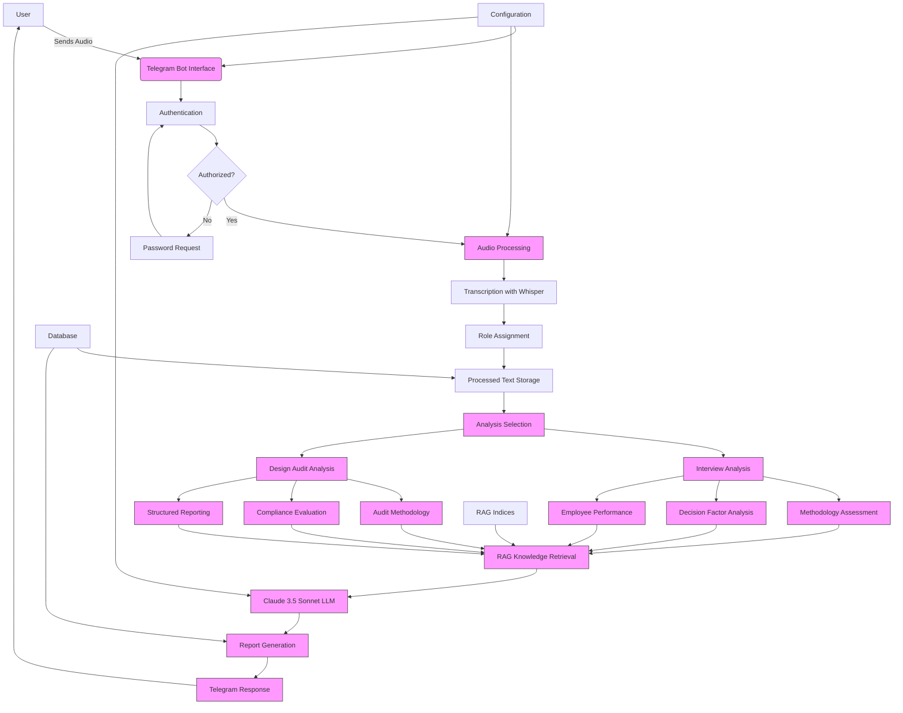
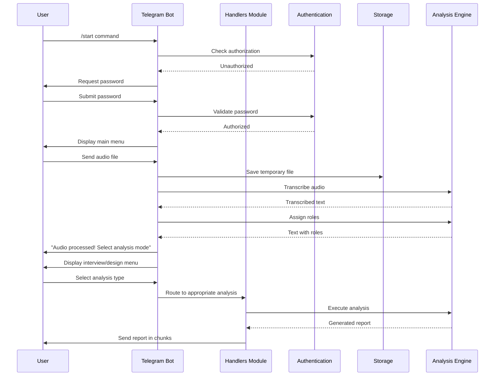
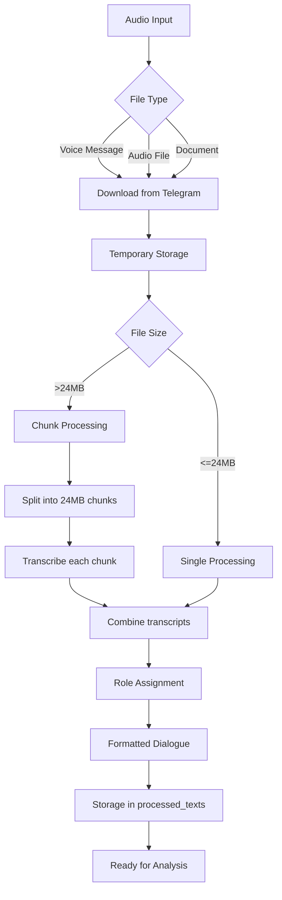
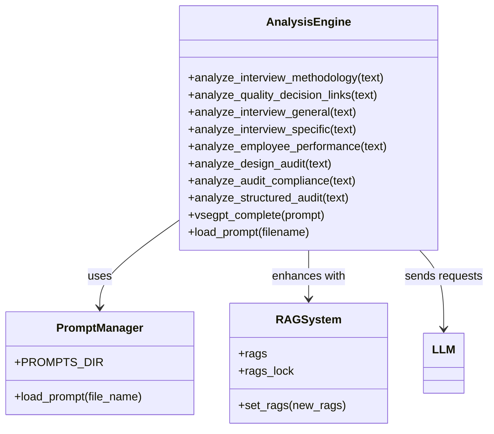
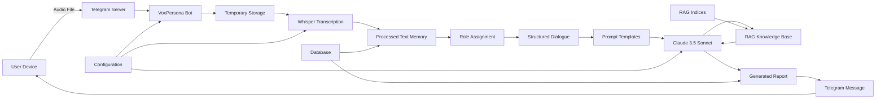

# Project Overview

<cite>
**Referenced Files in This Document**   
- [main.py](file://src/main.py)
- [bot.py](file://src/bot.py)
- [config.py](file://src/config.py)
- [handlers.py](file://src/handlers.py)
- [README.md](file://README.md)
- [DEPLOYMENT_GUIDE.md](file://DEPLOYMENT_GUIDE.md)
- [SETUP.md](file://SETUP.md)
- [audio_utils.py](file://src/audio_utils.py)
- [analysis.py](file://src/analysis.py)
- [run_analysis.py](file://src/run_analysis.py)
- [rag_persistence.py](file://src/rag_persistence.py)
- [storage.py](file://src/storage.py)
- [prompts/design_audit_methodology.txt](file://prompts/design_audit_methodology.txt)
- [prompts/interview_methodology.txt](file://prompts/interview_methodology.txt)
- [prompts/quality_decision_links.txt](file://prompts/quality_decision_links.txt)
- [prompts-by-scenario/interview/Assessment-of-the-interview-methodology/json-prompt/Интервью.  Оценка методологии интервью. Итоговая оценка качества интервью.txt](file://prompts-by-scenario/interview/Assessment-of-the-interview-methodology/json-prompt/Интервью.  Оценка методологии интервью. Итоговая оценка качества интервью.txt)
- [prompts-by-scenario/design/Assessment-of-the-audit-methodology/json-prompt/Дизайн.Оценка методологии аудита. Json.txt](file://prompts-by-scenario/design/Assessment-of-the-audit-methodology/json-prompt/Дизайн.Оценка методологии аудита. Json.txt)
</cite>

## Table of Contents
1. [Introduction](#introduction)
2. [Project Structure](#project-structure)
3. [Core Components](#core-components)
4. [Architecture Overview](#architecture-overview)
5. [Detailed Component Analysis](#detailed-component-analysis)
6. [Analysis Pipeline](#analysis-pipeline)
7. [Data Flow and Processing](#data-flow-and-processing)
8. [Use Cases and Applications](#use-cases-and-applications)
9. [Conclusion](#conclusion)

## Introduction

VoxPersona is an AI-powered voice analysis platform designed to automate quality assessment for hospitality businesses through structured reporting and intelligent analysis of audio interviews and audit recordings. The system functions as a Telegram bot that leverages advanced artificial intelligence technologies to transcribe, analyze, and generate comprehensive reports from audio inputs.

The primary purpose of VoxPersona is to streamline quality assurance processes for hotels, restaurants, and health centers by automating the evaluation of service quality, employee performance, and compliance with audit methodologies. By transforming audio interviews into structured analytical reports, the platform enables quality assurance teams, auditors, and hospitality consultants to make data-driven decisions without manually reviewing lengthy recordings.

Core objectives of the system include:
- Automating quality assessment through AI-powered analysis
- Identifying key decision factors in customer interactions
- Evaluating compliance with established audit programs
- Generating structured audit reports with consistent formatting
- Providing actionable insights for business improvement

The platform integrates several cutting-edge technologies: Whisper for audio transcription, Claude 3.5 Sonnet (accessed via VSEGPT API) for large language model analysis, Retrieval-Augmented Generation (RAG) for knowledge retrieval, and Telegram as the user interface. This combination allows VoxPersona to deliver sophisticated analysis capabilities through a simple, accessible messaging interface.

Target users include quality assurance teams responsible for maintaining service standards, professional auditors conducting facility evaluations, and hospitality consultants providing strategic recommendations to businesses. The system is particularly valuable for organizations that conduct regular interviews or audits across multiple locations, as it standardizes the analysis process and reduces subjectivity in evaluations.

**Section sources**
- [README.md](file://README.md#L1-L50)

## Project Structure

The VoxPersona project follows a modular structure with clear separation of concerns between different functional components. The directory organization reflects a combination of configuration, prompts, source code, and documentation files.

```mermaid
graph TD
A[VoxPersona Root] --> B[prompts]
A --> C[prompts-by-scenario]
A --> D[src]
A --> E[DEPLOYMENT_GUIDE.md]
A --> F[Dockerfile]
A --> G[README.md]
A --> H[SETUP.md]
A --> I[docker-compose.yml]
A --> J[requirements.txt]
B --> K[design_audit_methodology.txt]
B --> L[health_center_audit_compliance.txt]
B --> M[hotel_audit_compliance.txt]
B --> N[interview_employee_performance.txt]
B --> O[interview_factors_restaurant.txt]
B --> P[interview_general_factors_health_center.txt]
B --> Q[interview_general_factors_hotel.txt]
B --> R[interview_general_factors_restaurant.txt]
B --> S[interview_methodology.txt]
B --> T[interview_specific_factors_health_center.txt]
B --> U[interview_specific_factors_hotel.txt]
B --> V[interview_specific_factors_restaurant.txt]
B --> W[quality_decision_links.txt]
B --> X[restaurant_audit_compliance.txt]
B --> Y[structured_health_center_audit.txt]
B --> Z[structured_hotel_audit.txt]
B --> AA[structured_restaurant_audit.txt]
C --> AB[assign_roles]
C --> AC[design]
C --> AD[interview]
C --> AE[sql_prompts]
D --> AF[db_handler]
D --> AG[analysis.py]
D --> AH[audio_utils.py]
D --> AI[auth_utils.py]
D --> AJ[bot.py]
D --> AK[config.py]
D --> AL[datamodels.py]
D --> AM[handlers.py]
D --> AN[main.py]
D --> AO[markups.py]
D --> AP[menus.py]
D --> AQ[parser.py]
D --> AR[rag_persistence.py]
D --> AS[run_analysis.py]
D --> AT[storage.py]
D --> AU[utils.py]
D --> AV[validators.py]
```

The project structure can be categorized into four main areas:

1. **Configuration and Documentation**: Includes README.md, SETUP.md, DEPLOYMENT_GUIDE.md, Dockerfile, docker-compose.yml, and requirements.txt. These files provide installation instructions, deployment guidance, and dependency management.

2. **Prompt Management**: Contains two directories (prompts and prompts-by-scenario) that store the system's prompt templates used for different analysis scenarios. The prompts directory contains general prompt templates, while prompts-by-scenario organizes prompts by specific use cases with a hierarchical structure.

3. **Source Code**: The src directory contains all application logic, organized into modular Python files with specific responsibilities such as bot interaction, audio processing, analysis, and data handling.

4. **Deployment Configuration**: Docker-related files enable containerized deployment, ensuring consistent operation across different environments.

This structure supports maintainability and scalability, allowing for the addition of new analysis scenarios and prompt templates without modifying core application logic.

**Diagram sources**
- [README.md](file://README.md#L20-L50)

**Section sources**
- [README.md](file://README.md#L1-L100)

## Core Components

VoxPersona consists of several interconnected components that work together to deliver its functionality. The core components include the Telegram bot interface, audio processing module, analysis engine, RAG system, and configuration management.

The **Telegram bot** serves as the primary user interface, handling message reception, user authentication, and response delivery. It manages the conversation flow, presenting menus and processing user selections to determine the appropriate analysis path.

The **audio processing module** is responsible for converting voice messages and audio files into text through transcription. This component uses OpenAI's Whisper model to convert speech to text, handling various audio formats and file sizes up to 2GB.

The **analysis engine** leverages the Claude 3.5 Sonnet LLM (accessed via VSEGPT API) to perform deep content analysis on transcribed text. It applies different analytical frameworks based on the selected scenario, generating structured reports on interview methodology, decision factors, and compliance.

The **RAG (Retrieval-Augmented Generation) system** enhances the analysis by incorporating domain-specific knowledge. It loads and maintains vector indices of relevant information that can be retrieved during the analysis process to provide more informed and contextually relevant responses.

The **configuration management** component handles environment variables, API keys, and system settings, ensuring secure storage of sensitive information and flexible configuration for different deployment environments.

These components work in concert to provide a seamless user experience: users upload audio through Telegram, the system transcribes the audio, applies role assignment to distinguish between participants, and then conducts specialized analysis based on the selected scenario, finally delivering comprehensive reports back through the messaging interface.

**Section sources**
- [bot.py](file://src/bot.py#L1-L100)
- [config.py](file://src/config.py#L1-L50)
- [handlers.py](file://src/handlers.py#L1-L100)

## Architecture Overview

VoxPersona follows a modular, service-oriented architecture that integrates multiple AI technologies through a Telegram-based interface. The system architecture is designed for scalability, maintainability, and ease of deployment using containerization technologies.

The architecture follows a clear processing pipeline:
1. **Input Layer**: Telegram serves as the communication channel, receiving audio files and user commands.
2. **Authentication Layer**: Users must authenticate with a password before accessing system functionality.
3. **Processing Layer**: Audio files are transcribed to text using Whisper, with participant roles assigned to structure the conversation.
4. **Analysis Layer**: Based on user selection, the system applies specialized analytical frameworks to the processed text.
5. **Knowledge Layer**: The RAG system provides contextual information to enhance the LLM's analysis.
6. **Generation Layer**: Claude 3.5 Sonnet generates structured reports based on the analysis.
7. **Output Layer**: Reports are delivered back to the user through Telegram messages.

The system is containerized using Docker, with docker-compose.yml orchestrating the application and database services. This ensures consistent deployment across different environments and simplifies dependency management.

External API dependencies include:
- **OpenAI API**: For Whisper-based audio transcription
- **Anthropic API**: For LLM analysis via VSEGPT wrapper
- **Telegram Bot API**: For messaging interface
- **MinIO**: For object storage of audio files

This architecture enables VoxPersona to deliver sophisticated AI analysis through a simple, accessible interface while maintaining separation between components for easier maintenance and updates.

**Diagram sources**
- [README.md](file://README.md#L50-L80)
- [docker-compose.yml](file://docker-compose.yml#L1-L50)

**Section sources**
- [README.md](file://README.md#L1-L100)
- [docker-compose.yml](file://docker-compose.yml#L1-L100)

## Detailed Component Analysis

### Telegram Bot Interface

The Telegram bot interface serves as the primary user interaction point for VoxPersona. Implemented in bot.py and handlers.py, this component manages the entire user experience from authentication to report delivery.

The bot implements a state management system using user_states to track conversation context, allowing for multi-step interactions such as data collection for audit reports. It supports various input types including voice messages, audio files, and documents, with file size limits up to 2GB.

Authentication is handled through a simple password mechanism, with authorized users stored in memory during the session. The interface provides multiple menus for different functions:
- Main menu with storage and help options
- Interview analysis menu with various report types
- Design audit menu with specialized assessments
- Storage management for uploaded files

Error handling is implemented throughout the bot logic, with appropriate user feedback for issues like transcription failures or API errors.

**Diagram sources**
- [bot.py](file://src/bot.py#L1-L100)
- [handlers.py](file://src/handlers.py#L1-L100)

**Section sources**
- [bot.py](file://src/bot.py#L1-L200)
- [handlers.py](file://src/handlers.py#L1-L200)

### Audio Processing Pipeline

The audio processing pipeline converts raw audio inputs into structured text ready for analysis. This critical component bridges the gap between spoken content and AI analysis.

The pipeline begins with audio ingestion from Telegram, supporting voice messages, audio files, and document uploads. Files are temporarily stored and processed using OpenAI's Whisper model through the VSEGPT API.

A key feature is the handling of large files (up to 2GB) by splitting them into 24MB chunks that fit within API limits, then combining the resulting transcripts. This allows analysis of lengthy interview or audit recordings.

After transcription, the system applies role assignment to distinguish between participants in the conversation. This uses a specialized prompt (assign_roles.txt) to identify and label speaker roles, typically "Employee" and "Client" in hospitality contexts.

The processed text is stored in memory (processed_texts dictionary) associated with the user's chat ID, making it available for subsequent analysis steps. The pipeline includes error handling for common issues like API failures, file corruption, or transcription errors.

**Diagram sources**
- [audio_utils.py](file://src/audio_utils.py#L1-L50)
- [bot.py](file://src/bot.py#L300-L400)

**Section sources**
- [audio_utils.py](file://src/audio_utils.py#L1-L100)
- [bot.py](file://src/bot.py#L300-L500)

### Analysis Engine

The analysis engine is the core intelligence of VoxPersona, applying specialized analytical frameworks to transcribed interviews and audit recordings. It leverages the Claude 3.5 Sonnet LLM to generate structured reports based on predefined templates.

The engine implements multiple specialized analysis functions, each corresponding to a specific report type:

1. **Interview Methodology Assessment**: Evaluates the quality and effectiveness of the interview process itself, analyzing questioning techniques, coverage of topics, and overall structure.

2. **Quality-Decision Links Analysis**: Identifies connections between service quality aspects and customer decision-making factors, revealing what influences customer choices.

3. **General Decision Factors**: Extracts common factors that influence customer decisions across similar establishments, providing industry benchmarks.

4. **Specific Establishment Factors**: Identifies unique factors that affect decisions for a particular business, highlighting its distinctive strengths and weaknesses.

5. **Employee Performance Analysis**: Evaluates staff performance based on interaction quality, service delivery, and customer responsiveness.

6. **Audit Methodology Assessment**: Reviews the effectiveness of the audit approach and methodology.

7. **Compliance Evaluation**: Assesses adherence to audit programs and standards.

8. **Structured Audit Reporting**: Generates comprehensive, standardized audit reports.

Each analysis type uses a specific prompt template loaded from the prompts directory. The system selects the appropriate prompt based on the analysis type and business category (hotel, restaurant, or health center).

The engine integrates with the RAG system to incorporate domain-specific knowledge into the analysis, enhancing the relevance and accuracy of generated reports.

**Diagram sources**
- [analysis.py](file://src/analysis.py#L1-L50)
- [bot.py](file://src/bot.py#L500-L700)

**Section sources**
- [analysis.py](file://src/analysis.py#L1-L100)
- [bot.py](file://src/bot.py#L500-L800)

## Analysis Pipeline

The analysis pipeline in VoxPersona represents the end-to-end process from audio input to final report generation. This pipeline orchestrates multiple components to deliver automated, AI-powered insights from voice recordings.

### Step 1: Audio Input and Authentication

The pipeline begins when a user sends an audio file or voice message to the Telegram bot. The system first verifies user authentication by checking if the user's chat ID is in the authorized_users set. Unauthorized users are prompted to enter a password (default: 1243).

### Step 2: Audio Transcription

Once authenticated, the system downloads the audio file and processes it using OpenAI's Whisper model via the VSEGPT API. The transcription function handles large files by splitting them into 24MB chunks, transcribing each chunk separately, and combining the results.

### Step 3: Role Assignment

The raw transcript is processed to identify and label speaker roles. This step uses a specialized prompt (assign_roles.txt) to distinguish between participants, typically labeling them as "Employee" and "Client" in hospitality contexts. This structured dialogue provides better context for subsequent analysis.

### Step 4: Analysis Selection

The user is presented with a choice between "Interview" and "Design" analysis modes, each leading to different sets of report options. This selection determines the analytical framework applied to the content.

### Step 5: Prompt Selection and Context Preparation

Based on the analysis type and business category, the system selects the appropriate prompt template from the prompts directory. For category-specific analyses (hotel, restaurant, health center), the system automatically detects the business type from the transcript content.

### Step 6: RAG-Enhanced Analysis

The prepared text and selected prompt are processed through the RAG system, which retrieves relevant contextual information to augment the analysis. This step enhances the LLM's understanding with domain-specific knowledge.

### Step 7: LLM Analysis and Report Generation

The augmented prompt is sent to Claude 3.5 Sonnet via the VSEGPT API for analysis. The LLM generates a comprehensive report based on the specified analytical framework, following the structure defined in the prompt.

### Step 8: Response Delivery

The generated report is sent back to the user through Telegram. Large reports are split into 4096-character chunks to comply with Telegram's message size limits, ensuring complete delivery of the analysis.

Throughout this pipeline, the system provides visual feedback using a spinner animation during processing stages, improving user experience by indicating that the system is actively working.

**Diagram sources**
- [main.py](file://src/main.py#L1-L50)
- [bot.py](file://src/bot.py#L1-L100)

**Section sources**
- [main.py](file://src/main.py#L1-L100)
- [bot.py](file://src/bot.py#L1-L100)

## Data Flow and Processing

The data flow in VoxPersona follows a structured path from input to output, with careful management of data at each stage of processing. Understanding this flow is essential for comprehending how the system transforms raw audio into actionable insights.

### Data Ingestion

Data enters the system through Telegram as voice messages, audio files, or document uploads. The bot receives these inputs and initiates processing. Audio files up to 2GB are supported, accommodating lengthy interview or audit recordings.

During ingestion, metadata is captured including:
- File format and size
- Duration (estimated from file size)
- User identification (chat ID)
- Timestamp of receipt

### Data Processing

The processing phase transforms raw audio into analyzable text:

1. **Transcription**: Whisper converts speech to text with punctuation and basic formatting.
2. **Chunking**: Large files (>24MB) are split into manageable segments for API processing.
3. **Reassembly**: Transcribed segments are combined into a complete transcript.
4. **Role Assignment**: A specialized LLM prompt identifies and labels speakers in the dialogue.

Processed text is stored in memory (processed_texts dictionary) indexed by user chat ID, making it available for multiple analysis types without reprocessing.

### Data Analysis

The analysis phase applies domain-specific frameworks to the processed text:

- **Interview Analysis**: Focuses on conversation quality, decision factors, and employee performance
- **Design Audit Analysis**: Evaluates compliance, methodology, and structural aspects of audits

Each analysis type uses specific prompt templates that guide the LLM to produce structured, consistent reports. The prompts define:
- Analysis objectives
- Required output format
- Key areas to address
- Depth of analysis

### Data Enrichment

The RAG (Retrieval-Augmented Generation) system enhances analysis by incorporating external knowledge:

- Domain-specific terminology and concepts
- Industry standards and best practices
- Previous audit findings and patterns
- Business-specific information

This enrichment ensures that reports are contextually relevant and grounded in established knowledge.

### Data Output

Final reports are delivered through Telegram with the following characteristics:

- Formatted for readability
- Split into chunks if exceeding 4096 characters
- Delivered with clear labeling of the analysis type
- Accompanied by status indicators (spinner during processing, completion confirmation)

The system maintains data privacy by not storing audio files long-term and by processing data in memory rather than persistent storage when possible.

**Diagram sources**
- [config.py](file://src/config.py#L1-L50)
- [storage.py](file://src/storage.py#L1-L50)

**Section sources**
- [config.py](file://src/config.py#L1-L100)
- [storage.py](file://src/storage.py#L1-L100)

## Use Cases and Applications

VoxPersona serves multiple use cases in the hospitality industry, primarily focused on quality assurance, employee evaluation, and audit methodology improvement. These applications leverage the system's ability to analyze audio interviews and generate structured reports.

### Employee Performance Evaluation

One primary use case is evaluating employee performance through analysis of customer interactions. The system can identify strengths and weaknesses in service delivery by analyzing:

- Communication skills and professionalism
- Problem resolution effectiveness
- Product knowledge demonstration
- Customer empathy and responsiveness
- Adherence to service protocols

For example, when analyzing an employee performance interview, the system uses the interview_employee_performance.txt prompt to generate a comprehensive assessment. This helps managers identify training needs and recognize exemplary service behaviors.

### Audit Methodology Validation

Hospitality auditors can use VoxPersona to evaluate the effectiveness of their audit methodologies. By analyzing recordings of audit interviews, the system assesses:

- Completeness of coverage across key areas
- Quality of questioning techniques
- Balance between open-ended and specific questions
- Effectiveness in uncovering critical issues
- Consistency across different auditors

The "Оценка методологии аудита. Json.txt" prompt (translated as "Assessment of Audit Methodology") provides a structured evaluation of these aspects, helping audit teams refine their approaches.

### Decision Factor Analysis

Understanding what influences customer decisions is crucial for hospitality businesses. VoxPersona can identify both general and specific decision factors by analyzing interview content:

- **General factors**: Common considerations across similar establishments (e.g., cleanliness, staff friendliness, value for money)
- **Specific factors**: Unique aspects that differentiate a particular business (e.g., signature dishes, unique amenities, exceptional staff members)

The quality_decision_links.txt prompt facilitates analysis of the connection between service quality aspects and customer decision-making, revealing which service elements have the greatest impact on customer choices.

### Compliance Assessment

For standardized audit programs, VoxPersona can evaluate compliance with established protocols. The system checks whether audit interviews:

- Cover all required topics and checklist items
- Follow the prescribed methodology
- Maintain consistent standards across different locations
- Document findings appropriately

Category-specific prompts (hotel_audit_compliance.txt, restaurant_audit_compliance.txt, health_center_audit_compliance.txt) enable tailored assessments for different types of hospitality businesses.

### Structured Reporting

The system generates standardized reports that ensure consistency across different audits and analysts. This is particularly valuable for:

- Multi-location hospitality chains
- Franchise operations
- Third-party audit firms
- Internal quality assurance teams

Structured reports facilitate comparison across different properties and time periods, enabling trend analysis and benchmarking.

### Knowledge Management

By processing multiple interviews and audits, VoxPersona contributes to organizational knowledge management. The RAG system can incorporate insights from previous analyses, creating a growing knowledge base that improves the quality of future assessments.

These use cases demonstrate how VoxPersona transforms qualitative audio data into quantitative, actionable insights, supporting data-driven decision-making in the hospitality industry.

**Section sources**
- [prompts/quality_decision_links.txt](file://prompts/quality_decision_links.txt)
- [prompts/interview_employee_performance.txt](file://prompts/interview_employee_performance.txt)
- [prompts/design_audit_methodology.txt](file://prompts/design_audit_methodology.txt)

## Conclusion

VoxPersona represents a sophisticated AI-powered solution for automating the analysis of audio interviews and audits in the hospitality industry. By integrating advanced technologies like Whisper for transcription, Claude 3.5 Sonnet for language understanding, and RAG for knowledge retrieval, the system delivers comprehensive analytical capabilities through a simple Telegram interface.

The platform successfully addresses key challenges in hospitality quality assurance by:
- Automating time-consuming analysis of audio recordings
- Standardizing evaluation criteria across different auditors and locations
- Extracting actionable insights from qualitative data
- Providing consistent, structured reporting
- Making advanced AI analysis accessible through a familiar messaging interface

The modular architecture, with clear separation between components, ensures maintainability and scalability. The use of Docker for deployment simplifies installation and ensures consistent operation across different environments.

While the system demonstrates strong capabilities in interview analysis and audit assessment, potential enhancements could include:
- Integration with additional data sources (customer reviews, operational metrics)
- Advanced sentiment analysis for emotional tone detection
- Multilingual support for international hospitality chains
- Predictive analytics for identifying potential service issues
- Dashboard visualization of trends across multiple audits

VoxPersona exemplifies how AI technologies can be applied to solve practical business problems, transforming unstructured audio data into structured, actionable insights that support quality improvement and strategic decision-making in the hospitality sector.

**Section sources**
- [README.md](file://README.md#L1-L224)
- [DEPLOYMENT_GUIDE.md](file://DEPLOYMENT_GUIDE.md#L1-L243)
- [SETUP.md](file://SETUP.md#L1-L290)