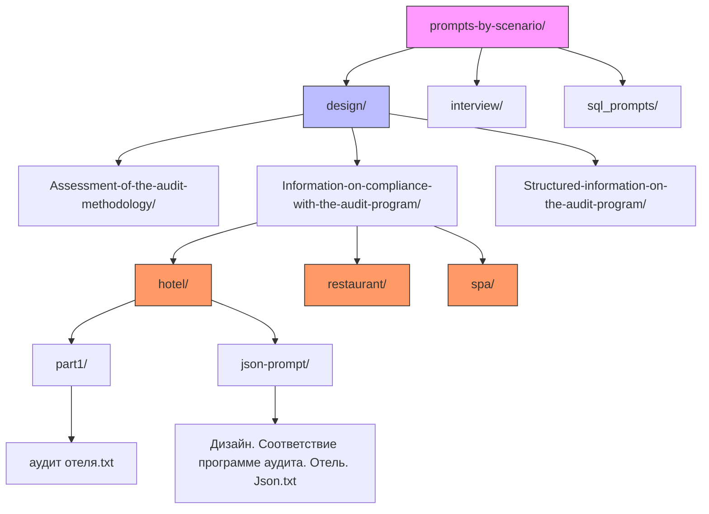
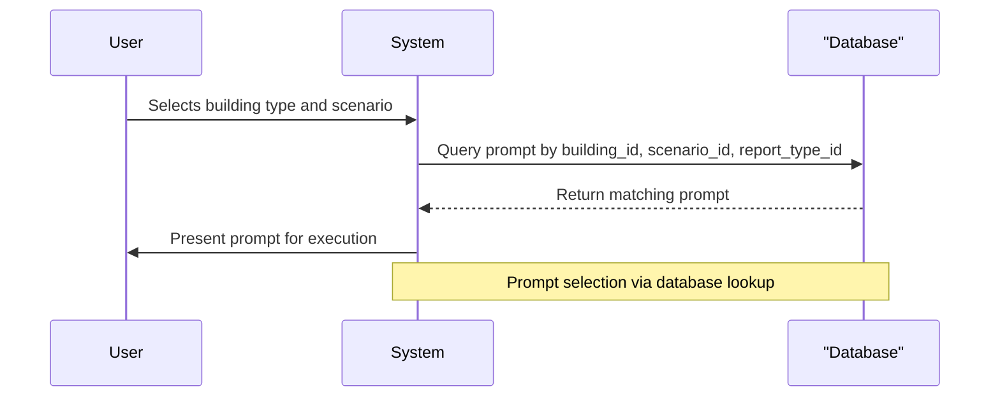

# Building Type Specialization in Prompts

<cite>
**Referenced Files in This Document**   
- [hotel_audit_compliance.txt](file://prompts/hotel_audit_compliance.txt)
- [restaurant_audit_compliance.txt](file://prompts/restaurant_audit_compliance.txt)
- [health_center_audit_compliance.txt](file://prompts/health_center_audit_compliance.txt)
- [аудит отеля.txt](file://prompts-by-scenario/design/Information-on-compliance-with-the-audit-program/hotel/part1/аудит отеля.txt)
- [fill_prompts_table.py](file://src/db_handler/fill_prompts_table.py)
- [datamodels.py](file://src/datamodels.py)
</cite>

## Table of Contents
1. [Introduction](#introduction)
2. [Directory Structure for Prompt Specialization](#directory-structure-for-prompt-specialization)
3. [Domain-Specific Prompt Customization](#domain-specific-prompt-customization)
4. [Rationale for Building-Type Specialization](#rationale-for-building-type-specialization)
5. [Dynamic Prompt Selection Mechanism](#dynamic-prompt-selection-mechanism)
6. [Extending Support for New Building Types](#extending-support-for-new-building-types)
7. [Conclusion](#conclusion)

## Introduction
This document details the architecture and implementation of domain-specific prompt specialization within the VoxPersona system, focusing on three primary building types: hotel, restaurant, and spa (health center). The system leverages a hierarchical directory structure and dynamic database registration to deliver tailored evaluation criteria, terminology, and compliance standards based on the building type under analysis. This approach ensures that audit and interview methodologies are contextually relevant, enhancing the accuracy and practical value of generated reports.

## Directory Structure for Prompt Specialization

The prompt specialization system is organized through a nested directory structure under `prompts-by-scenario`, which categorizes prompts by scenario (e.g., design, interview), report type, building type, and processing stage. This hierarchical layout enables clear separation of concerns and facilitates maintainability and scalability.



**Diagram sources**
- [аудит отеля.txt](file://prompts-by-scenario/design/Information-on-compliance-with-the-audit-program/hotel/part1/аудит отеля.txt)

**Section sources**
- [аудит отеля.txt](file://prompts-by-scenario/design/Information-on-compliance-with-the-audit-program/hotel/part1/аудит отеля.txt)

## Domain-Specific Prompt Customization

Each building type—hotel, restaurant, and spa—has distinct operational, aesthetic, and experiential characteristics that necessitate customized evaluation frameworks. The system reflects these differences through specialized prompts that emphasize industry-relevant compliance criteria and decision-making factors.

### Hotel-Specific Prompts
Hotel audit prompts focus on spatial zoning, brand alignment, guest journey mapping, and emotional impact across diverse areas such as lobbies, rooms, and restaurants. The prompt `аудит отеля.txt` emphasizes holistic analysis of each zone, requiring evaluators to assess completeness, depth, structure, and contextual relevance.

**Key Evaluation Criteria:**
- Zone identification and scope
- Emotional resonance and brand consistency
- Structural completeness of audit sections
- Quality and specificity of recommendations

### Restaurant-Specific Prompts
Restaurant prompts emphasize interior design coherence, customer experience flow, and staff interaction insights. Unlike hotel audits, they place greater weight on ambiance, layout functionality, and sensory elements critical to dining experiences.

**Key Differences:**
- Focus on customer-facing design elements
- Emphasis on service flow and spatial ergonomics
- Integration of guest feedback analysis

### Spa (Health Center)-Specific Prompts
Spa-related prompts incorporate dual considerations: medical functionality and wellness aesthetics. They require auditors to evaluate both clinical compliance and therapeutic atmosphere, balancing hygiene standards with relaxation-inducing design.

**Key Differentiators:**
- Assessment of medical vs. wellness zones
- Integration of health safety protocols
- Sensory and psychological comfort metrics

**Section sources**
- [hotel_audit_compliance.txt](file://prompts/hotel_audit_compliance.txt)
- [restaurant_audit_compliance.txt](file://prompts/restaurant_audit_compliance.txt)
- [health_center_audit_compliance.txt](file://prompts/health_center_audit_compliance.txt)

## Rationale for Building-Type Specialization

The specialization of prompts by building type ensures that evaluations are grounded in domain-specific best practices and regulatory expectations. Generic prompts would fail to capture nuanced requirements such as:
- **Hotels:** Multi-zone operational complexity and brand standardization
- **Restaurants:** High-turnover customer experience design
- **Spas:** Regulatory compliance in health environments combined with aesthetic therapy goals

By tailoring prompts, the system enhances the validity and actionable insight of audit outcomes, enabling stakeholders to make informed decisions aligned with industry benchmarks.

## Dynamic Prompt Selection Mechanism

The system dynamically selects the appropriate prompt based on user input and context through a database-driven routing mechanism. During initialization, the script `fill_prompts_table.py` scans the `prompts-by-scenario` directory and registers all prompts into a PostgreSQL database, associating them with metadata including:
- Scenario type (design, interview)
- Report type (compliance, structured report)
- Building type (hotel, restaurant, spa)
- Processing part (part1, part2, etc.)
- JSON format flag

When a user initiates an analysis, the application queries the `prompts_buildings` table using the selected building type and report scenario to retrieve the correct prompt. This decoupling of logic from content allows for flexible configuration without code changes.



**Diagram sources**
- [fill_prompts_table.py](file://src/db_handler/fill_prompts_table.py)

**Section sources**
- [fill_prompts_table.py](file://src/db_handler/fill_prompts_table.py#L1-L227)
- [datamodels.py](file://src/datamodels.py#L1-L71)

## Extending Support for New Building Types

Adding support for new building types involves two primary steps:

### 1. Directory Structure Extension
Create a new subdirectory under relevant report type folders (e.g., `Information-on-compliance-with-the-audit-program/new_building_type/`) and populate it with part-specific prompt files (`part1/`, `part2/`, etc.) and optional JSON variants.

### 2. Registration via fill_prompts_table.py
Ensure the new building type is mapped in `mapping_building_names` within `datamodels.py`. For example:
```python
mapping_building_names = {
    "hotel": "Отель",
    "spa": "Центр Здоровья",
    "restaurant": "Ресторан",
    "new_building_type": "Новый Тип Здания"
}
```

Once added, running `fill_prompts_table.py` will automatically detect and register the new prompts into the database, linking them to the corresponding building type. No additional code modification is required.

This extensible design ensures that the system can adapt to new domains while maintaining consistency in evaluation methodology and data model integrity.

**Section sources**
- [fill_prompts_table.py](file://src/db_handler/fill_prompts_table.py#L1-L227)
- [datamodels.py](file://src/datamodels.py#L1-L71)

## Conclusion
The VoxPersona system employs a robust, scalable architecture for prompt specialization across building types. By leveraging a hierarchical directory structure and automated database registration, it delivers contextually accurate evaluations tailored to the unique demands of hotels, restaurants, and spas. The dynamic selection mechanism ensures flexibility, while the modular design simplifies extension to new domains. This approach maximizes both analytical precision and operational maintainability, making it a powerful framework for domain-specific AI-driven assessments.