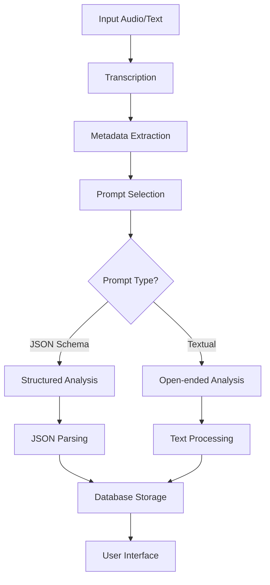
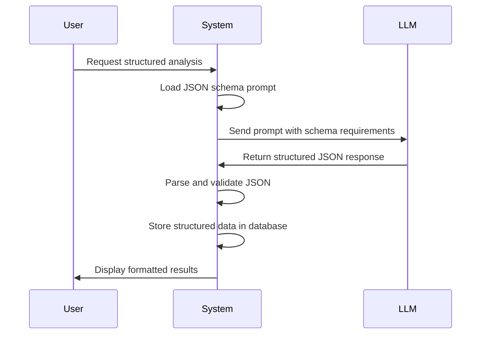
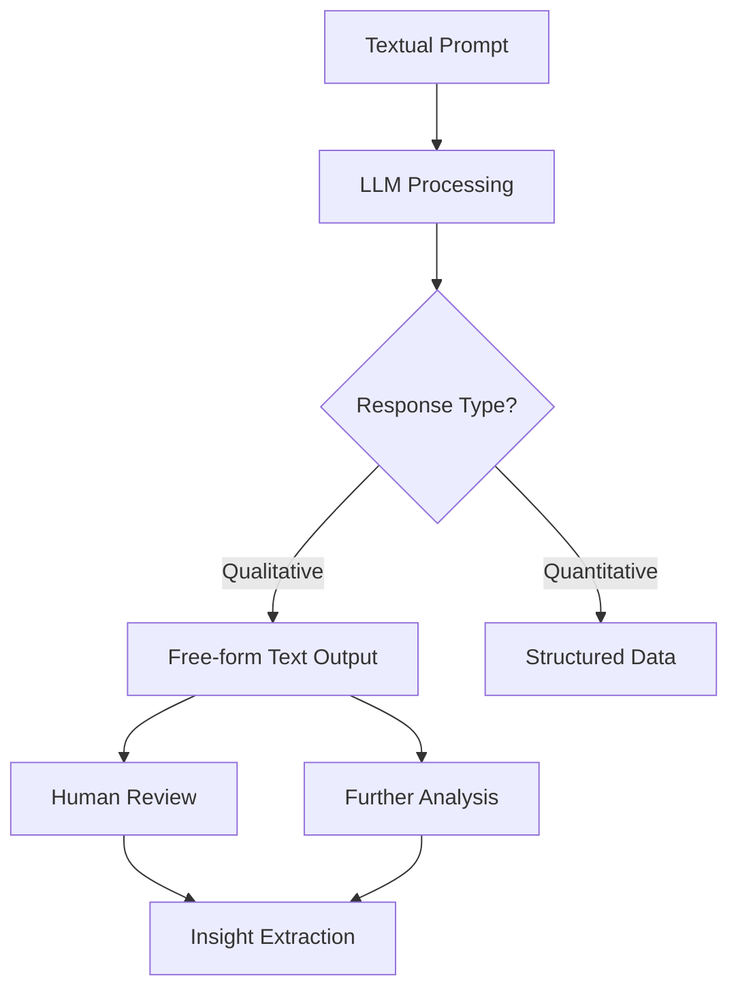
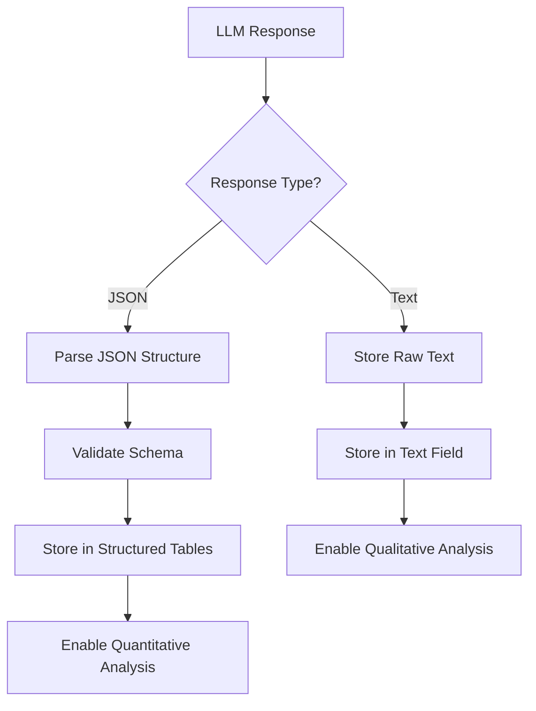

# JSON Schema vs Textual Prompts

<cite>
**Referenced Files in This Document**   
- [analysis.py](file://src/analysis.py)
- [run_analysis.py](file://src/run_analysis.py)
- [db.py](file://src/db_handler/db.py)
- [datamodels.py](file://src/datamodels.py)
- [parser.py](file://src/parser.py)
- [Дизайн.Оценка методологии аудита. Json.txt](file://prompts-by-scenario/design/Assessment-of-the-audit-methodology/json-prompt/Дизайн.Оценка методологии аудита. Json.txt)
- [оценка методологии аудита.txt](file://prompts-by-scenario/design/Assessment-of-the-audit-methodology/non-building/оценка методологии аудита.txt)
- [Интервью.  Оценка методологии интервью. Итоговая оценка качества интервью.txt](file://prompts-by-scenario/interview/Assessment-of-the-interview-methodology/json-prompt/Интервью.  Оценка методологии интервью. Итоговая оценка качества интервью.txt)
- [промпт оценка методологии интервью.txt](file://prompts-by-scenario/interview/Assessment-of-the-interview-methodology/non-building/промпт оценка методологии интервью.txt)
</cite>

## Table of Contents
1. [Introduction](#introduction)
2. [Core Architecture Overview](#core-architecture-overview)
3. [JSON Schema Prompts](#json-schema-prompts)
4. [Textual Prompts](#textual-prompts)
5. [Prompt Selection and Routing](#prompt-selection-and-routing)
6. [Response Processing and Parsing](#response-processing-and-parsing)
7. [Trade-offs Between Structured and Open-ended Prompts](#trade-offs-between-structured-and-open-ended-prompts)
8. [Best Practices for Prompt Design](#best-practices-for-prompt-design)
9. [Conclusion](#conclusion)

## Introduction

The VoxPersona system employs two distinct types of prompts to guide Large Language Models (LLMs) in generating responses: JSON schema prompts and free-text (non-building) prompts. These prompt types serve different analytical purposes and enable different downstream processing workflows. JSON schema prompts enforce strict output structure through predefined schemas, enabling reliable parsing and quantitative analysis. In contrast, textual prompts allow for open-ended, qualitative analysis where flexible output is required to capture nuanced insights. This document compares and contrasts these two approaches, examining their implementation, usage patterns, processing mechanisms, and design considerations within the VoxPersona system.

**Section sources**
- [analysis.py](file://src/analysis.py#L0-L491)
- [run_analysis.py](file://src/run_analysis.py#L0-L344)

## Core Architecture Overview

The VoxPersona system processes audio and text inputs through a multi-stage pipeline that includes transcription, metadata extraction, prompt selection, LLM analysis, and response handling. The system distinguishes between two primary scenarios: "design" audits and "interview" analyses. For each scenario, different report types are supported, and the system dynamically selects appropriate prompts based on the requested analysis type and building category (hotel, restaurant, spa). The architecture supports both structured (JSON) and unstructured (textual) output formats, with different processing paths for each.



**Diagram sources**
- [analysis.py](file://src/analysis.py#L0-L491)
- [run_analysis.py](file://src/run_analysis.py#L0-L344)
- [parser.py](file://src/parser.py#L0-L175)

**Section sources**
- [analysis.py](file://src/analysis.py#L0-L491)
- [run_analysis.py](file://src/run_analysis.py#L0-L344)
- [parser.py](file://src/parser.py#L0-L175)

## JSON Schema Prompts

JSON schema prompts in the VoxPersona system are designed to enforce structured output from LLMs by specifying a predefined response format. These prompts are used when quantitative analysis, reliable parsing, and downstream processing are required. The system leverages JSON schema prompts to generate responses that can be automatically parsed and stored in structured database tables.

The implementation of JSON schema prompts is evident in the file structure, where JSON prompts are stored in dedicated "json-prompt" subdirectories within each scenario and report type. For example, the file `Дизайн.Оценка методологии аудита. Json.txt` contains a prompt that guides the LLM to produce a structured assessment of audit methodology with specific fields and formatting requirements.

When processing JSON schema prompts, the system follows a two-step analysis process. First, it generates an initial analysis using textual prompts, and then it applies the JSON schema prompt to structure and quantify the results. This approach ensures that the final output adheres to the predefined schema while leveraging the depth of initial qualitative analysis.



**Diagram sources**
- [Дизайн.Оценка методологии аудита. Json.txt](file://prompts-by-scenario/design/Assessment-of-the-audit-methodology/json-prompt/Дизайн.Оценка методологии аудита. Json.txt)
- [Интервью.  Оценка методологии интервью. Итоговая оценка качества интервью.txt](file://prompts-by-scenario/interview/Assessment-of-the-interview-methodology/json-prompt/Интервью.  Оценка методологии интервью. Итоговая оценка качества интервью.txt)
- [run_analysis.py](file://src/run_analysis.py#L200-L300)

**Section sources**
- [run_analysis.py](file://src/run_analysis.py#L200-L300)
- [Дизайн.Оценка методологии аудита. Json.txt](file://prompts-by-scenario/design/Assessment-of-the-audit-methodology/json-prompt/Дизайн.Оценка методологии аудита. Json.txt)

## Textual Prompts

Textual prompts in the VoxPersona system are used for open-ended analysis where flexible output is required to capture nuanced insights and qualitative assessments. These prompts allow the LLM to generate free-form text responses that can explore complex topics in depth without being constrained by a predefined structure.

The implementation of textual prompts is evident in the file structure, where they are stored in "non-building" subdirectories within each scenario and report type. For example, the file `оценка методологии аудита.txt` contains a prompt that guides the LLM to provide a comprehensive assessment of audit methodology without requiring a specific output format.

Textual prompts are particularly useful for initial analysis phases where the goal is to extract rich, detailed insights from audio transcripts or text inputs. The system uses these prompts to generate comprehensive assessments that can later be processed and structured using JSON schema prompts. This two-phase approach combines the depth of qualitative analysis with the reliability of structured data.



**Diagram sources**
- [оценка методологии аудита.txt](file://prompts-by-scenario/design/Assessment-of-the-audit-methodology/non-building/оценка методологии аудита.txt)
- [промпт оценка методологии интервью.txt](file://prompts-by-scenario/interview/Assessment-of-the-interview-methodology/non-building/промпт оценка методологии интервью.txt)
- [analysis.py](file://src/analysis.py#L0-L50)

**Section sources**
- [analysis.py](file://src/analysis.py#L0-L50)
- [оценка методологии аудита.txt](file://prompts-by-scenario/design/Assessment-of-the-audit-methodology/non-building/оценка методологии аудита.txt)

## Prompt Selection and Routing

The VoxPersona system implements a sophisticated prompt selection and routing mechanism that determines which prompts to use based on the analysis scenario, report type, and building category. This mechanism is implemented in the `run_analysis_with_spinner` function in `run_analysis.py`, which retrieves appropriate prompts from the database based on the requested analysis type.

The system distinguishes between JSON schema prompts and textual prompts through a boolean flag `is_json_prompt` in the database schema. When retrieving prompts for a specific analysis, the system separates them into JSON prompts and ordinary (textual) prompts:

```python
json_prompts = [(p, rp) for (p, rp, is_json_prompt) in prompts_list if is_json_prompt]
ordinary_prompts = [(p, rp) for (p, rp, is_json_prompt) in prompts_list if not is_json_prompt]
```

For certain report types like "Common Decision-Making Factors," the system implements a multi-phase analysis process. It first processes the input using textual prompts divided into parts (part1, part2), and then applies a JSON schema prompt to structure and quantify the combined results. This approach ensures that the final output is both comprehensive and structured.

The prompt routing logic also handles special cases where multiple reports need to be generated. For example, when analyzing common decision-making factors, the system generates separate reports for known factors and unexplored factors before combining them for quantitative analysis.

**Section sources**
- [run_analysis.py](file://src/run_analysis.py#L200-L300)
- [db.py](file://src/db_handler/db.py#L300-L350)

## Response Processing and Parsing

The VoxPersona system handles responses from JSON schema prompts and textual prompts differently, reflecting their distinct purposes and output formats. Responses from JSON schema prompts are automatically parsed and stored in structured database tables, while responses from textual prompts are processed as free-form text.

For JSON schema prompts, the system relies on the LLM to generate responses that adhere to the predefined schema. These responses are then stored directly in the database without additional parsing, as the structure is guaranteed by the prompt design. The database schema includes fields that correspond to the JSON structure, enabling efficient storage and retrieval.

For textual prompts, the system stores the raw text output in the database. This allows for flexible processing and analysis of the qualitative content. The system may later apply additional processing steps, such as sentiment analysis or keyword extraction, to derive insights from the text.

The `save_user_input_to_db` function in the analysis pipeline demonstrates this dual approach. It stores both the raw audit text (from textual prompts) and the structured data (from JSON schema prompts) in the database, preserving both the qualitative depth and quantitative structure of the analysis.



**Diagram sources**
- [run_analysis.py](file://src/run_analysis.py#L150-L200)
- [db.py](file://src/db_handler/db.py#L200-L250)

**Section sources**
- [run_analysis.py](file://src/run_analysis.py#L150-L200)
- [db.py](file://src/db_handler/db.py#L200-L250)

## Trade-offs Between Structured and Open-ended Prompts

The VoxPersona system demonstrates a thoughtful balance between the trade-offs of structured (JSON schema) prompts and open-ended (textual) prompts. Each approach offers distinct advantages and limitations that are carefully considered in the system design.

Structured prompts provide several key benefits:
- **Reliable parsing**: Responses adhere to a predefined schema, enabling automated processing
- **Consistent formatting**: Output is standardized across analyses
- **Downstream compatibility**: Structured data integrates seamlessly with databases and analytics tools
- **Quantitative analysis**: Enables statistical analysis and aggregation of results

However, structured prompts also have limitations:
- **Reduced flexibility**: May constrain the LLM's ability to explore unexpected insights
- **Potential information loss**: Nuanced details may be omitted to fit the schema
- **Design complexity**: Requires careful schema design to capture relevant information

In contrast, textual prompts offer different advantages:
- **Analytical depth**: Allows for comprehensive, nuanced analysis
- **Flexibility**: Enables the LLM to explore topics in depth without structural constraints
- **Adaptability**: Can capture unexpected insights and edge cases
- **Natural expression**: Supports more natural, conversational output

The main limitations of textual prompts are:
- **Processing complexity**: Requires additional steps for analysis and structuring
- **Inconsistent formatting**: Output varies between analyses
- **Limited automation**: Difficult to automate downstream processing
- **Storage inefficiency**: Text fields may contain redundant or irrelevant information

The VoxPersona system addresses these trade-offs through a hybrid approach that combines both prompt types. It uses textual prompts for initial analysis to capture depth and nuance, followed by JSON schema prompts to structure and quantify the results. This two-phase process leverages the strengths of both approaches while mitigating their weaknesses.

**Section sources**
- [analysis.py](file://src/analysis.py#L0-L491)
- [run_analysis.py](file://src/run_analysis.py#L200-L300)

## Best Practices for Prompt Design

Based on the implementation in the VoxPersona system, several best practices emerge for designing effective JSON schemas and textual prompts:

### Best Practices for JSON Schema Prompts
1. **Define clear field requirements**: Specify exactly what information should be included in each field
2. **Use consistent formatting**: Establish standard formats for dates, numbers, and other data types
3. **Include validation rules**: Define constraints for acceptable values and ranges
4. **Balance completeness and simplicity**: Include all necessary fields without making the schema overly complex
5. **Provide examples**: Include sample responses to guide the LLM

### Best Practices for Textual Prompts
1. **Be specific in instructions**: Clearly define the scope and focus of the analysis
2. **Use guiding questions**: Include specific questions to ensure comprehensive coverage
3. **Set length expectations**: Indicate the desired depth and length of the response
4. **Provide context**: Include relevant background information to inform the analysis
5. **Encourage critical thinking**: Ask for evaluations, comparisons, and recommendations

### General Prompt Design Principles
1. **Align with analysis goals**: Design prompts to support the specific objectives of the analysis
2. **Consider downstream use**: Design with the intended processing and storage requirements in mind
3. **Test and iterate**: Refine prompts based on actual output quality and usability
4. **Maintain consistency**: Use consistent terminology and formatting across related prompts
5. **Support hybrid workflows**: Design prompts to work together in multi-phase analysis processes

The VoxPersona system exemplifies these best practices through its organized prompt structure, clear separation of concerns, and thoughtful integration of structured and unstructured analysis approaches.

**Section sources**
- [Дизайн.Оценка методологии аудита. Json.txt](file://prompts-by-scenario/design/Assessment-of-the-audit-methodology/json-prompt/Дизайн.Оценка методологии аудита. Json.txt)
- [оценка методологии аудита.txt](file://prompts-by-scenario/design/Assessment-of-the-audit-methodology/non-building/оценка методологии аудита.txt)
- [analysis.py](file://src/analysis.py#L0-L491)

## Conclusion

The VoxPersona system effectively leverages both JSON schema prompts and textual prompts to balance the need for structured, reliable output with the requirement for deep, nuanced analysis. By implementing a hybrid approach that combines the strengths of both prompt types, the system achieves a powerful balance between quantitative rigor and qualitative insight.

JSON schema prompts enable the system to generate structured outputs that can be reliably parsed and processed, supporting downstream analytics and database integration. Textual prompts, in contrast, allow for open-ended analysis that captures the full depth and complexity of the subject matter.

The system's architecture demonstrates best practices in prompt design and usage, including clear separation of prompt types, thoughtful routing logic, and a multi-phase analysis process that leverages both approaches in sequence. This design enables the system to deliver both comprehensive qualitative insights and structured quantitative data, providing users with a complete picture of their analysis results.

By understanding the trade-offs between structured and open-ended prompts and implementing them strategically, the VoxPersona system sets a strong example for effective LLM prompt engineering in complex analytical applications.