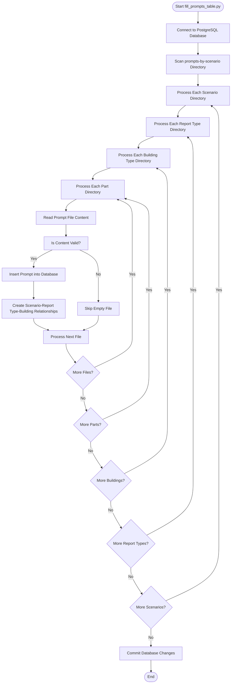
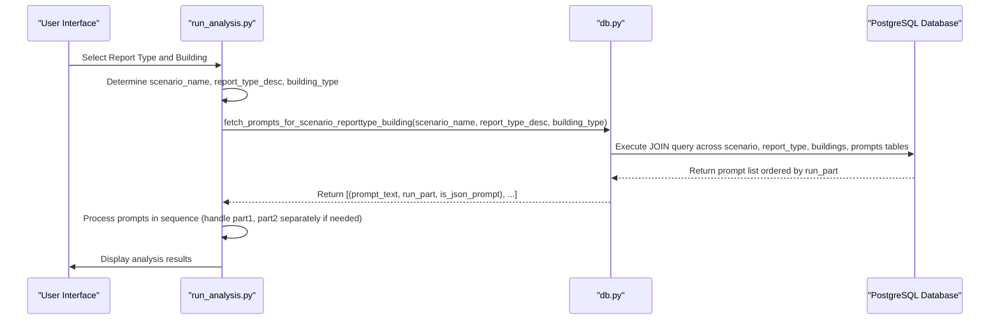
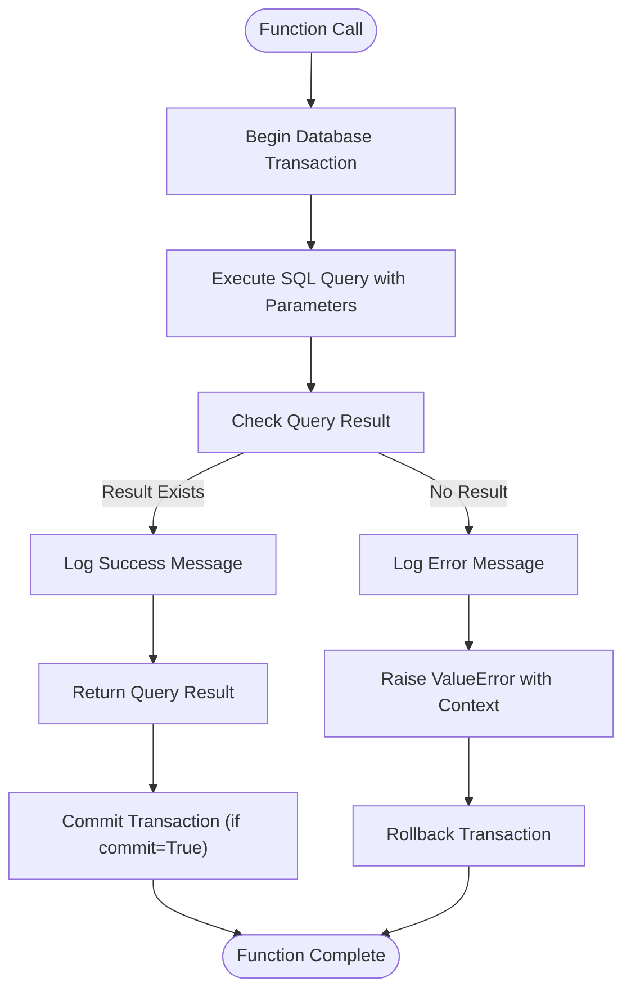

# Prompt Loading and Database Integration

<cite>
**Referenced Files in This Document**   
- [fill_prompts_table.py](file://src/db_handler/fill_prompts_table.py)
- [db.py](file://src/db_handler/db.py)
- [run_analysis.py](file://src/run_analysis.py)
- [datamodels.py](file://src/datamodels.py)
- [step_2_sql_request.txt](file://prompts-by-scenario/sql_prompts/part2/step_2_sql_request.txt)
</cite>

## Table of Contents
1. [Introduction](#introduction)
2. [Prompt File System Structure](#prompt-file-system-structure)
3. [Database Schema for Prompts](#database-schema-for-prompts)
4. [Prompt Loading Mechanism](#prompt-loading-mechanism)
5. [Runtime Prompt Retrieval](#runtime-prompt-retrieval)
6. [SQL Operations and Error Handling](#sql-operations-and-error-handling)
7. [Performance Considerations and Caching](#performance-considerations-and-caching)
8. [Synchronization and Maintenance](#synchronization-and-maintenance)
9. [Troubleshooting Guide](#troubleshooting-guide)
10. [Conclusion](#conclusion)

## Introduction
This document details the mechanism by which prompts are loaded from the filesystem into the PostgreSQL database and retrieved during runtime in the VoxPersona application. The system uses a structured directory hierarchy to organize prompts by scenario, report type, building type, and part number, with a dedicated script (`fill_prompts_table.py`) responsible for scanning this structure and populating the database. During runtime, the application queries the database to retrieve the appropriate prompt sequences based on user context, enabling dynamic and context-aware processing. This documentation covers the complete workflow from prompt file organization through database integration to runtime retrieval, including the underlying database schema, SQL operations, error handling, performance considerations, and troubleshooting guidance.

## Prompt File System Structure
The prompt files are organized in a hierarchical directory structure under the `prompts-by-scenario` directory, with each level representing a specific dimension of the prompt context. The structure follows a consistent pattern: `scenario/report_type/building_type/part_number/filename.txt`. The top-level directories represent scenarios such as "design" and "interview", each containing subdirectories for different report types like "Assessment-of-the-audit-methodology" or "Information-on-compliance-with-the-audit-program". Within each report type, there are directories for specific building types ("hotel", "restaurant", "spa") or "non-building" for scenario-specific prompts. The "part1", "part2", and "part3" directories indicate the sequence in which prompts should be processed, while "json-prompt" directories contain prompts that generate JSON output. This hierarchical organization enables the system to systematically scan and categorize prompts based on their context, ensuring that each prompt is correctly associated with its scenario, report type, building type, and processing sequence.

**Section sources**
- [fill_prompts_table.py](file://src/db_handler/fill_prompts_table.py#L14-L227)

## Database Schema for Prompts
The database schema for storing prompts consists of several interconnected tables that capture the hierarchical relationships between scenarios, report types, buildings, and prompts. The `scenario` table stores scenario names with a primary key `scenario_id`, while the `report_type` table contains report type descriptions linked to scenarios through `scenario_id`. The `buildings` table maintains building types with `building_id` as the primary key. The core `prompts` table stores the actual prompt content with fields for `prompt_id`, `prompt` (the text content), `run_part` (indicating processing sequence), `prompt_name` (filename without extension), and `is_json_prompt` (boolean flag). Relationships between these entities are managed through junction tables: `buildings_report_type` links buildings to report types, and `prompts_buildings` creates the many-to-many relationship between prompts and building-report type combinations, including all three foreign keys (`prompt_id`, `building_id`, `report_type_id`) as a composite primary key. This normalized schema allows for flexible querying based on any combination of scenario, report type, and building type.

```mermaid
erDiagram
scenario {
INTEGER scenario_id PK
VARCHAR scenario_name
}
report_type {
INTEGER report_type_id PK
VARCHAR report_type_desc
INTEGER scenario_id FK
}
buildings {
INTEGER building_id PK
VARCHAR building_type
}
prompts {
INTEGER prompt_id PK
INTEGER run_part
VARCHAR prompt_name
BOOLEAN is_json_prompt
TEXT prompt
}
buildings_report_type {
INTEGER building_id PK FK
INTEGER report_type_id PK FK
}
prompts_buildings {
INTEGER prompt_id PK FK
INTEGER building_id PK FK
INTEGER report_type_id PK FK
}
scenario ||--o{ report_type : "has"
buildings ||--o{ buildings_report_type : "in"
report_type ||--o{ buildings_report_type : "requires"
buildings ||--o{ prompts_buildings : "uses"
report_type ||--o{ prompts_buildings : "requires"
prompts ||--o{ prompts_buildings : "belongs_to"
```

**Diagram sources**
- [step_2_sql_request.txt](file://prompts-by-scenario/sql_prompts/part2/step_2_sql_request.txt#L52-L97)
- [db.py](file://src/db_handler/db.py#L348-L377)

## Prompt Loading Mechanism
The prompt loading mechanism is implemented in `fill_prompts_table.py`, which systematically scans the `prompts-by-scenario` directory structure and populates the database with prompt records. The process begins by establishing a connection to the PostgreSQL database using configuration from `DB_CONFIG`. The script then recursively traverses the directory hierarchy, creating or retrieving database records for scenarios, report types, and building types as it encounters corresponding directories. For each prompt file, it reads the content, extracts the filename (used as `prompt_name`), and inserts a record into the `prompts` table with appropriate values for `run_part` and `is_json_prompt` based on the directory context. The script maintains referential integrity by creating the necessary relationships in the junction tables, ensuring that each prompt is properly linked to its scenario, report type, and building type. Special handling is implemented for edge cases such as the "assign_roles" directory, which contains role assignment prompts processed differently from the main hierarchy. The entire process is transactional, with changes committed only after successful completion, ensuring data consistency.



**Diagram sources**
- [fill_prompts_table.py](file://src/db_handler/fill_prompts_table.py#L147-L227)
- [fill_prompts_table.py](file://src/db_handler/fill_prompts_table.py#L63-L126)

**Section sources**
- [fill_prompts_table.py](file://src/db_handler/fill_prompts_table.py#L14-L227)

## Runtime Prompt Retrieval
During runtime, the application retrieves prompts from the database through the `fetch_prompts_for_scenario_reporttype_building` function in `db.py`, which queries the database based on the current user context. The function takes three parameters: `scenario_name`, `report_type_desc`, and `building_type`, and returns a list of prompt texts ordered by `run_part`. The SQL query joins multiple tables (`scenario`, `report_type`, `buildings_report_type`, `buildings`, `prompts_buildings`, and `prompts`) to traverse the relationship hierarchy and filter prompts based on the provided context. In `run_analysis.py`, this function is called within `run_analysis_with_spinner` to retrieve the appropriate prompt sequence for analysis based on user input and selected report type. The retrieved prompts are then processed in sequence, with special handling for prompts marked as JSON output. The system also supports retrieving individual prompts by name through the `fetch_prompt_by_name` function, which is used for specific prompt retrieval needs. This retrieval mechanism ensures that the correct sequence of prompts is used for each analysis task, maintaining context awareness throughout the application.



**Diagram sources**
- [db.py](file://src/db_handler/db.py#L348-L377)
- [run_analysis.py](file://src/run_analysis.py#L215-L249)

**Section sources**
- [db.py](file://src/db_handler/db.py#L319-L398)
- [run_analysis.py](file://src/run_analysis.py#L215-L275)

## SQL Operations and Error Handling
The SQL operations for prompt management are implemented with comprehensive error handling to ensure data integrity and provide meaningful feedback. The `db_transaction` decorator in `db.py` provides a consistent transaction management framework, automatically handling connection and cursor management while allowing control over commit behavior. For prompt retrieval, the `fetch_prompts_for_scenario_reporttype_building` function includes validation to ensure that at least one prompt is found for the given parameters, raising a `ValueError` with descriptive logging if no prompts match the criteria. The function uses parameterized queries to prevent SQL injection and employs DISTINCT in the SELECT clause to avoid duplicate prompts. For individual prompt retrieval, `fetch_prompt_by_name` similarly validates the existence of the requested prompt and logs appropriate messages. The error handling strategy follows a consistent pattern across functions: validate inputs, execute queries, check results, log operations, and raise descriptive exceptions when issues occur. This approach ensures that database operations are both secure and maintainable, with clear error messages that aid in troubleshooting and debugging.



**Diagram sources**
- [db.py](file://src/db_handler/db.py#L376-L398)
- [db.py](file://src/db_handler/db.py#L1-L398)

**Section sources**
- [db.py](file://src/db_handler/db.py#L1-L398)

## Performance Considerations and Caching
The prompt loading and retrieval system incorporates several performance considerations to ensure efficient operation. The database schema is normalized to minimize data redundancy while maintaining query efficiency through appropriate indexing on primary and foreign keys. The `fetch_prompts_for_scenario_reporttype_building` query uses JOIN operations with specific filtering conditions to quickly locate the relevant prompts, and the results are ordered by `run_part` to maintain processing sequence. Although the current implementation does not include explicit caching mechanisms for prompt retrieval, the transactional nature of database operations and the use of connection pooling (implied by the context manager pattern) help optimize database performance. For large-scale deployments, potential performance improvements could include implementing application-level caching of frequently accessed prompt sequences, optimizing database indexes based on query patterns, and using asynchronous database operations to prevent blocking during prompt retrieval. The system's design allows for such enhancements to be implemented without major architectural changes.

## Synchronization and Maintenance
Prompt synchronization between the filesystem and database is managed through the `fill_prompts_table.py` script, which should be executed whenever prompt files are added, modified, or removed. The script uses idempotent operations to ensure that prompt records are created only if they don't already exist, preventing duplication while allowing updates to be applied by modifying the source files and re-running the script. The `get_or_create_prompt` function checks for existing prompts by content, ensuring that identical prompts are not duplicated in the database. For maintenance, the script should be run as part of the deployment process or whenever prompt content is updated. The system does not currently include automated file monitoring or hot reloading of prompts, so manual execution of the script is required to synchronize changes. This approach provides a controlled and predictable mechanism for prompt updates, ensuring data consistency while allowing for systematic content management.

## Troubleshooting Guide
Common issues with the prompt loading and retrieval system typically involve missing prompts, incorrect routing, or database connectivity problems. For missing prompts, verify that the prompt files are correctly placed in the `prompts-by-scenario` directory structure with the appropriate naming convention and that the `fill_prompts_table.py` script has been executed successfully. Check the database directly to confirm that prompt records exist in the `prompts` table and that the relationships in `prompts_buildings` are correctly established. For incorrect routing, validate that the scenario, report type, and building type parameters passed to `fetch_prompts_for_scenario_reporttype_building` match exactly with the values in the database, noting that these are case-sensitive string comparisons. Database connectivity issues should be addressed by verifying the `DB_CONFIG` settings and ensuring that the PostgreSQL server is accessible. When troubleshooting, examine the application logs for error messages from the `fetch_prompts_for_scenario_reporttype_building` function, which will indicate whether the issue is due to missing prompts, invalid parameters, or database errors. Regularly running the `fill_prompts_table.py` script with verbose output can help identify and resolve synchronization issues before they affect runtime operations.

**Section sources**
- [db.py](file://src/db_handler/db.py#L348-L377)
- [fill_prompts_table.py](file://src/db_handler/fill_prompts_table.py#L93-L126)

## Conclusion
The prompt loading and database integration system in VoxPersona provides a robust mechanism for managing prompt content across different scenarios, report types, and building types. By organizing prompts in a hierarchical filesystem structure and loading them into a normalized PostgreSQL database, the system enables flexible and context-aware retrieval during runtime. The `fill_prompts_table.py` script ensures that prompt content is systematically loaded and relationships are properly established, while the `fetch_prompts_for_scenario_reporttype_building` function allows for precise retrieval based on user context. The implementation includes comprehensive error handling and follows best practices for database operations, ensuring data integrity and providing meaningful feedback for troubleshooting. While the current system meets the core requirements, opportunities for enhancement include implementing caching mechanisms for improved performance and adding automated synchronization to reduce manual maintenance overhead. Overall, this architecture provides a solid foundation for managing complex prompt workflows in a scalable and maintainable manner.