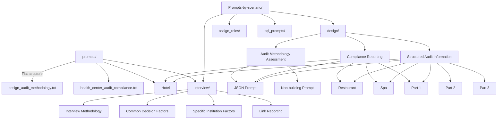
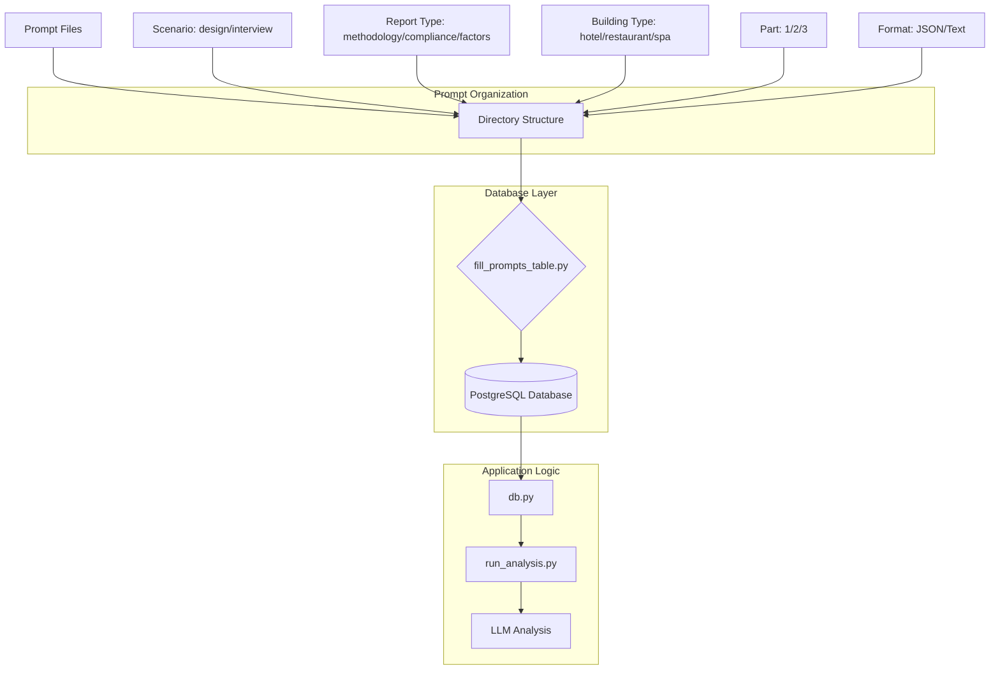
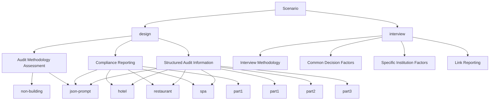
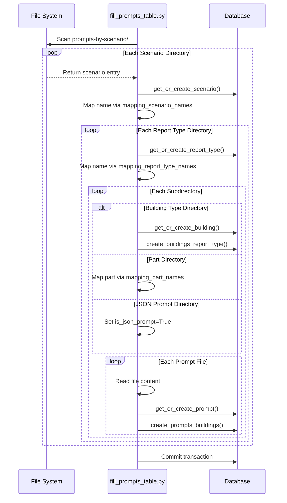
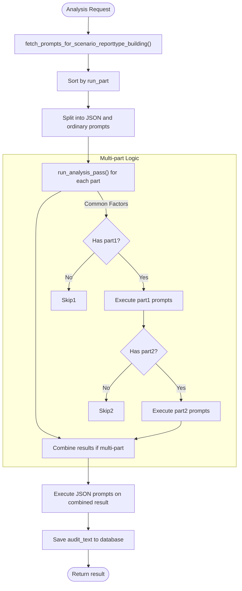
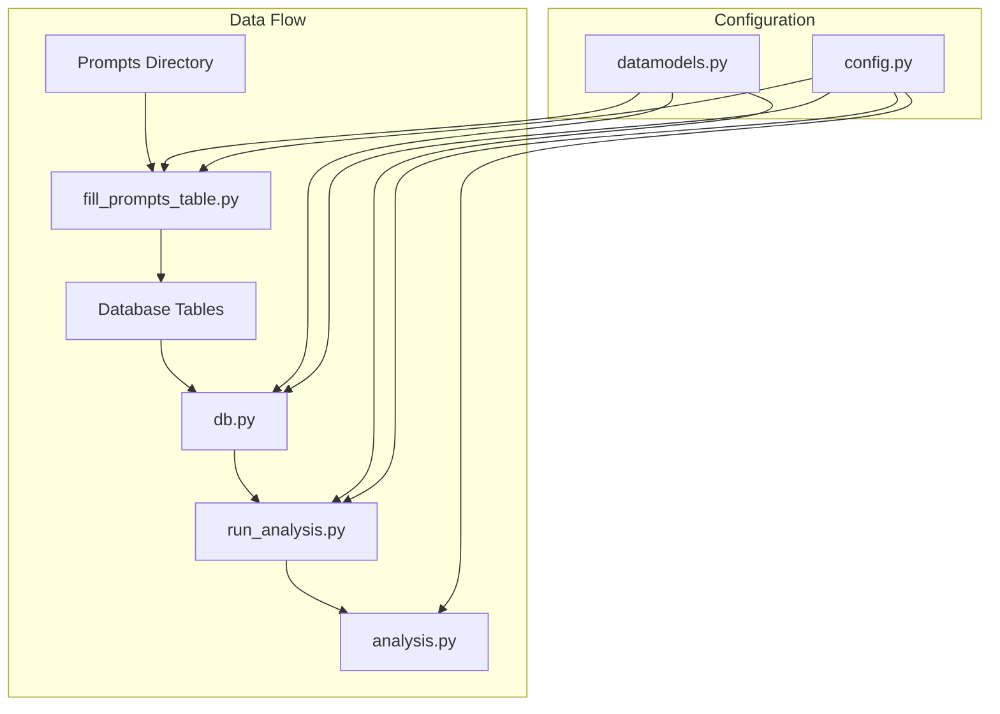

# Prompt Management System

<cite>
**Referenced Files in This Document**   
- [fill_prompts_table.py](file://src/db_handler/fill_prompts_table.py)
- [db.py](file://src/db_handler/db.py)
- [datamodels.py](file://src/datamodels.py)
- [run_analysis.py](file://src/run_analysis.py)
- [analysis.py](file://src/analysis.py)
- [config.py](file://src/config.py)
- [prompts](file://prompts)
- [prompts-by-scenario](file://prompts-by-scenario)
</cite>

## Table of Contents
1. [Introduction](#introduction)
2. [Project Structure](#project-structure)
3. [Core Components](#core-components)
4. [Architecture Overview](#architecture-overview)
5. [Detailed Component Analysis](#detailed-component-analysis)
6. [Dependency Analysis](#dependency-analysis)
7. [Performance Considerations](#performance-considerations)
8. [Troubleshooting Guide](#troubleshooting-guide)
9. [Conclusion](#conclusion)

## Introduction
The Prompt Management System in VoxPersona is a structured framework for organizing, loading, and utilizing prompts across different audit scenarios. This system enables consistent analysis of interviews and design audits through a hierarchical organization of prompts by scenario, report type, and building type. The architecture supports both free-form text prompts and structured JSON output formats, allowing for flexible yet standardized reporting. Prompts are systematically loaded into a PostgreSQL database and retrieved during analysis based on specific criteria, ensuring that the correct prompt set is applied for each combination of scenario, building type, and report category.

## Project Structure

The project organizes prompts in two primary directories: `prompts/` and `prompts-by-scenario/`. The former contains legacy or general-purpose prompts, while the latter implements a hierarchical structure that reflects the system's categorization logic.

**Diagram sources**
- [prompts](file://prompts)
- [prompts-by-scenario](file://prompts-by-scenario)

**Section sources**
- [prompts](file://prompts)
- [prompts-by-scenario](file://prompts-by-scenario)

## Core Components

The core components of the prompt management system include the hierarchical prompt organization, database integration via `fill_prompts_table.py`, retrieval mechanisms in `db.py`, and execution logic in `run_analysis.py`. The system uses mapping dictionaries in `datamodels.py` to translate between English directory names and Russian display names used in the application. Prompts are categorized by scenario (interview/design), report type (methodology, compliance, structured information), and building type (hotel, restaurant, spa). Multi-part prompts allow complex analyses to be broken into sequential steps, while JSON prompts ensure structured output for quantitative analysis.

**Section sources**
- [fill_prompts_table.py](file://src/db_handler/fill_prompts_table.py)
- [db.py](file://src/db_handler/db.py)
- [datamodels.py](file://src/datamodels.py)
- [run_analysis.py](file://src/run_analysis.py)

## Architecture Overview

The prompt management system follows a layered architecture where prompts are organized on disk, loaded into a relational database, and retrieved during runtime based on contextual parameters. The system separates concerns between prompt storage, database operations, and analysis execution.

**Diagram sources**
- [fill_prompts_table.py](file://src/db_handler/fill_prompts_table.py)
- [db.py](file://src/db_handler/db.py)
- [run_analysis.py](file://src/run_analysis.py)

## Detailed Component Analysis

### Prompt Organization and Hierarchy

The system organizes prompts hierarchically by scenario, report type, building type, and part number. This structure enables precise targeting of prompts based on the analysis context.

**Diagram sources**
- [prompts-by-scenario](file://prompts-by-scenario)
- [datamodels.py](file://src/datamodels.py)

**Section sources**
- [prompts-by-scenario](file://prompts-by-scenario)
- [datamodels.py](file://src/datamodels.py)

### Prompt Loading Process

The `fill_prompts_table.py` script systematically processes the `prompts-by-scenario/` directory, creating database records for scenarios, report types, buildings, and prompts. It maintains referential integrity through foreign key relationships.

**Diagram sources**
- [fill_prompts_table.py](file://src/db_handler/fill_prompts_table.py)

**Section sources**
- [fill_prompts_table.py](file://src/db_handler/fill_prompts_table.py)

### Prompt Retrieval and Execution

During analysis, the system retrieves prompts based on scenario, report type, and building type, then executes them in sequence to produce analytical results.

**Diagram sources**
- [run_analysis.py](file://src/run_analysis.py)
- [analysis.py](file://src/analysis.py)
- [db.py](file://src/db_handler/db.py)

**Section sources**
- [run_analysis.py](file://src/run_analysis.py)
- [analysis.py](file://src/analysis.py)
- [db.py](file://src/db_handler/db.py)

## Dependency Analysis

The prompt management system components are tightly integrated, with clear dependencies between file organization, database schema, and application logic.

**Diagram sources**
- [fill_prompts_table.py](file://src/db_handler/fill_prompts_table.py)
- [db.py](file://src/db_handler/db.py)
- [run_analysis.py](file://src/run_analysis.py)
- [analysis.py](file://src/analysis.py)
- [datamodels.py](file://src/datamodels.py)
- [config.py](file://src/config.py)

**Section sources**
- [fill_prompts_table.py](file://src/db_handler/fill_prompts_table.py)
- [db.py](file://src/db_handler/db.py)
- [run_analysis.py](file://src/run_analysis.py)
- [analysis.py](file://src/analysis.py)
- [datamodels.py](file://src/datamodels.py)
- [config.py](file://src/config.py)

## Performance Considerations

The system is designed with performance in mind, particularly in the prompt loading and retrieval processes. The `fill_prompts_table.py` script uses efficient database operations with proper indexing and transaction management. Prompt retrieval is optimized through indexed database queries that quickly locate the appropriate prompts based on scenario, report type, and building type. The use of `run_part` values allows multi-part analyses to be processed sequentially without unnecessary overhead. For high-frequency operations, the system could benefit from caching frequently accessed prompt sets to reduce database queries during analysis.

## Troubleshooting Guide

Common issues in the prompt management system typically relate to file naming, directory structure, or database synchronization. When prompts are not being loaded correctly, verify that directory names match the expected values in `mapping_scenario_names` and `mapping_report_type_names`. Ensure that JSON prompt directories are named exactly "json-prompt" and that part directories follow the "part1", "part2" naming convention. If prompts are not being retrieved during analysis, check that the database has been properly populated by running `fill_prompts_table.py` and verify that the scenario, report type, and building type values match exactly between the application and database. Database connection issues should be verified in `config.py`, particularly the `DB_CONFIG` settings based on the `RUN_MODE`.

**Section sources**
- [fill_prompts_table.py](file://src/db_handler/fill_prompts_table.py)
- [db.py](file://src/db_handler/db.py)
- [config.py](file://src/config.py)

## Conclusion

The Prompt Management System in VoxPersona provides a robust framework for organizing and utilizing analytical prompts across various scenarios and building types. By implementing a clear hierarchical structure in the `prompts-by-scenario/` directory and integrating with a relational database, the system ensures consistent and reliable prompt application during analysis. The separation between multi-part text prompts for complex analyses and JSON prompts for structured output enables both qualitative and quantitative reporting. The system is easily extensible to new scenarios or building types by following the established directory pattern and updating the appropriate mapping dictionaries. This architecture supports the creation of comprehensive, standardized reports while maintaining flexibility for different analysis requirements.