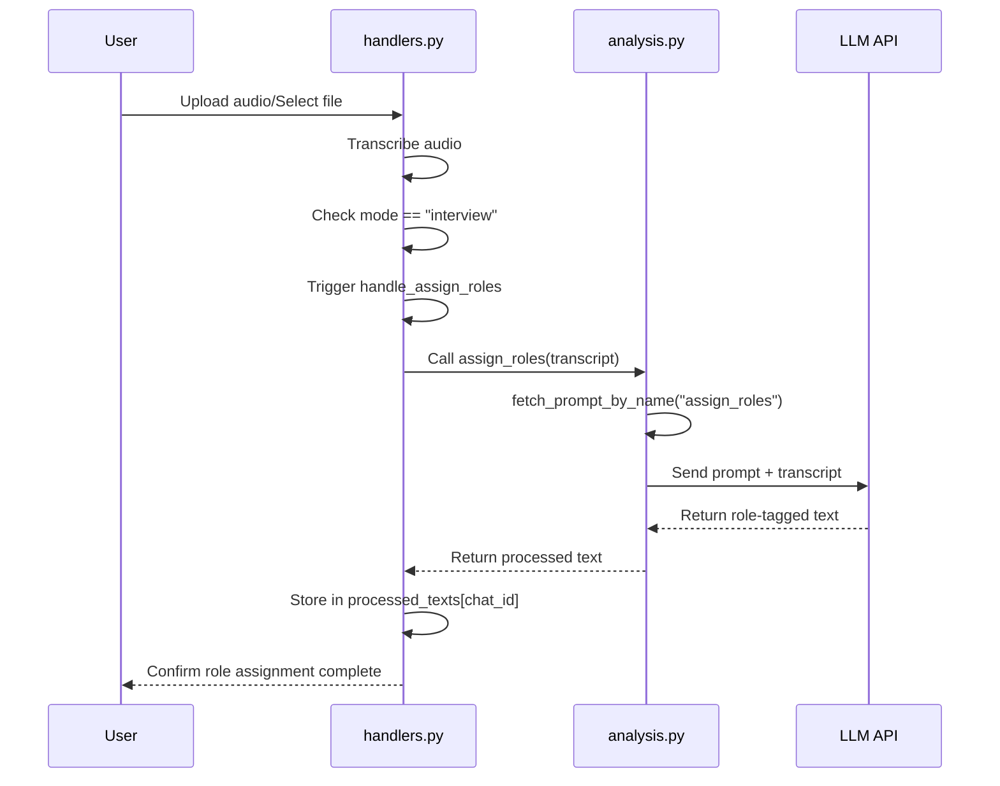

# Assign Roles Scenario: Speaker Role Identification

<cite>
**Referenced Files in This Document**   
- [assign_roles.txt](file://prompts-by-scenario/assign_roles/assign_roles.txt)
- [handlers.py](file://src/handlers.py)
- [analysis.py](file://src/analysis.py)
- [run_analysis.py](file://src/run_analysis.py)
- [config.py](file://src/config.py)
</cite>

## Table of Contents
1. [Introduction](#introduction)
2. [Core Functionality and Pipeline Role](#core-functionality-and-pipeline-role)
3. [Prompt Structure and LLM Instructions](#prompt-structure-and-llm-instructions)
4. [Integration with run_analysis.py](#integration-with-run_analysispy)
5. [Input and Output Formats](#input-and-output-formats)
6. [Code Implementation and Flow](#code-implementation-and-flow)
7. [Error Handling and Fallback Strategies](#error-handling-and-fallback-strategies)
8. [Performance Considerations](#performance-considerations)
9. [Customization and Extension](#customization-and-extension)

## Introduction
The Assign Roles scenario is a critical preprocessing step in the VoxPersona audio analysis pipeline, responsible for identifying and tagging speaker roles in multi-party conversations. This functionality enables downstream analyses to interpret dialogue context accurately by distinguishing between different participant types such as managers, employees, and customers. The role assignment process occurs immediately after transcription and before any scenario-specific analysis, ensuring that subsequent reports can leverage speaker context for more accurate insights. This document details the implementation, integration, and operational characteristics of the Assign Roles functionality.

## Core Functionality and Pipeline Role
The Assign Roles scenario serves as a prerequisite for accurate report generation by establishing speaker context in multi-party conversations. It operates as a mandatory preprocessing step that must complete successfully before any scenario-specific analyses can proceed. When a user selects the "Interview" mode, the system automatically triggers role assignment on the transcribed dialogue. This ensures that all subsequent analyses—such as methodology assessment, decision link reporting, and factor analysis—can interpret the conversation with proper speaker context. The role assignment process is tightly integrated into the audio processing workflow, executing immediately after transcription and before the user is prompted to select specific analysis reports.

**Section sources**
- [handlers.py](file://src/handlers.py#L279-L312)
- [run_analysis.py](file://src/run_analysis.py#L215-L249)

## Prompt Structure and LLM Instructions
The role assignment process is governed by a structured prompt defined in `assign_roles.txt`, which instructs the LLM to classify speakers into specific roles. The prompt explicitly directs the model to label utterances with `[Employee:]` for employee statements and `[Customer:]` for customer statements. Five critical rules are enforced: (1) return only the labeled text without introductions or comments, (2) include the entire interview text without omissions, (3) use contextual analysis to determine speaker identity when unclear, (4) use only the specified role labels, and (5) preserve the original text formatting and structure. The prompt is retrieved from the database using the `fetch_prompt_by_name` function with the identifier "assign_roles" and is incorporated into the API request to the LLM with the raw transcription appended as input text.

**Section sources**
- [assign_roles.txt](file://prompts-by-scenario/assign_roles/assign_roles.txt#L1-L12)
- [analysis.py](file://src/analysis.py#L473-L489)

## Integration with run_analysis.py
The Assign Roles functionality is integrated into the main analysis workflow through the `run_analysis_with_spinner` function in `run_analysis.py`. This integration ensures that role assignment precedes all scenario-specific analyses by processing the raw transcription before any other analytical steps. When audio is processed, the transcribed text is first passed through the `assign_roles` function, and the resulting role-tagged dialogue is stored in the `processed_texts` dictionary. Subsequent analysis functions then access this role-enriched text rather than the raw transcription. The integration is conditional on the selected scenario mode, with role assignment only triggered when the "interview" mode is active, as determined by the `mode` parameter in the user state.

**Section sources**
- [run_analysis.py](file://src/run_analysis.py#L215-L249)
- [handlers.py](file://src/handlers.py#L279-L312)

## Input and Output Formats
The Assign Roles scenario accepts raw transcriptions as input, which consist of unstructured dialogue text from multi-party conversations without any speaker identification. The input format is plain text containing the complete conversation, typically generated by the audio transcription process. The expected output format is role-tagged dialogue, where each utterance is prefixed with a speaker label in the format `[Employee:]` or `[Customer:]`. The output preserves all original content and formatting while adding these role identifiers, ensuring no information is lost during the tagging process. The system maintains the complete text integrity, returning the entire conversation with role labels inserted at the beginning of each relevant utterance, allowing downstream processes to parse speaker turns accurately.

**Section sources**
- [assign_roles.txt](file://prompts-by-scenario/assign_roles/assign_roles.txt#L1-L12)
- [analysis.py](file://src/analysis.py#L473-L489)

## Code Implementation and Flow
The role assignment functionality is implemented across multiple components, with the core logic residing in the `assign_roles` function within `analysis.py`. This function retrieves the role assignment prompt from the database using `fetch_prompt_by_name` and constructs an API request to the LLM with the raw transcription. The implementation in `handlers.py` orchestrates the workflow, where the `handle_assign_roles` function is called when the user selects the interview mode, triggering the role assignment process on the transcribed text. The processed text is then stored in the `processed_texts` dictionary, making it available for subsequent analyses. The system uses threading to manage the asynchronous nature of the LLM request, displaying a loading animation to the user during processing and handling the result through proper error management and logging.

**Diagram sources**
- [handlers.py](file://src/handlers.py#L279-L312)
- [analysis.py](file://src/analysis.py#L473-L489)

**Section sources**
- [handlers.py](file://src/handlers.py#L279-L312)
- [analysis.py](file://src/analysis.py#L473-L489)

## Error Handling and Fallback Strategies
The system implements comprehensive error handling for the role assignment process, with multiple layers of protection against failures. When the LLM cannot confidently determine speaker roles, the system relies on contextual analysis as specified in the prompt, instructing the model to use conversation logic to infer the most probable speaker. The implementation includes try-catch blocks around the LLM API call, with exceptions logged and appropriate user feedback provided. If role assignment fails, the system preserves the original transcription in the `processed_texts` dictionary, allowing limited analysis to proceed without role information. The error handling strategy prioritizes data preservation, ensuring that even if role assignment fails, the raw conversation remains available for manual review or alternative processing methods.

**Section sources**
- [handlers.py](file://src/handlers.py#L279-L312)
- [analysis.py](file://src/analysis.py#L473-L489)

## Performance Considerations
The role assignment process involves a trade-off between processing time and accuracy, as it requires an LLM API call that introduces latency into the overall analysis pipeline. The system manages this by implementing asynchronous processing with a loading animation to maintain user experience during the typically slow LLM response time. Performance is further optimized by minimizing the number of API calls—role assignment occurs only once per conversation, with the results cached in memory for all subsequent analyses. The implementation avoids redundant processing by storing the role-tagged text in the `processed_texts` dictionary, ensuring that downstream analyses access the pre-processed content without requiring additional LLM calls. This design prioritizes efficiency by treating role assignment as a shared prerequisite rather than a repeated operation.

**Section sources**
- [handlers.py](file://src/handlers.py#L279-L312)
- [analysis.py](file://src/analysis.py#L473-L489)

## Customization and Extension
The Assign Roles scenario can be customized for different business contexts by modifying the prompt in `assign_roles.txt` to include additional role categories beyond the default employee and customer classifications. To extend the functionality for additional role types such as "Manager" or "Other," the prompt must be updated to include these new labels and provide clear instructions for their usage. The system architecture supports such extensions without code changes, as the role assignment logic is entirely prompt-driven. Customization can also be achieved by creating scenario-specific prompt variants stored in the database with different prompt names, allowing the system to load context-appropriate role classification instructions based on the business domain or conversation type.

**Section sources**
- [assign_roles.txt](file://prompts-by-scenario/assign_roles/assign_roles.txt#L1-L12)
- [analysis.py](file://src/analysis.py#L473-L489)