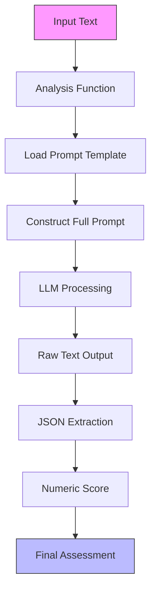
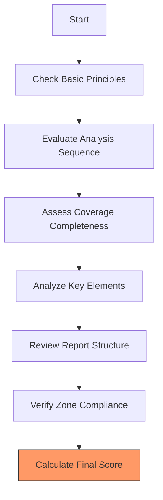
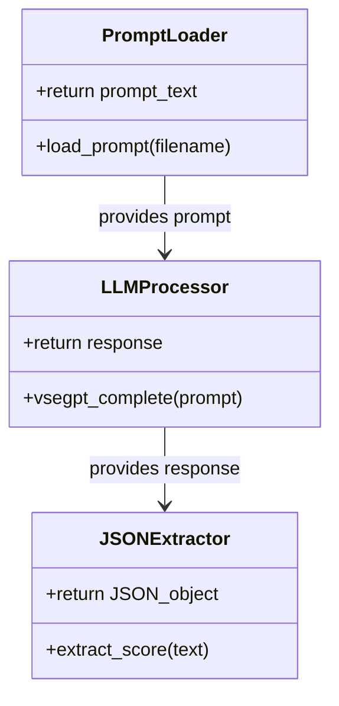
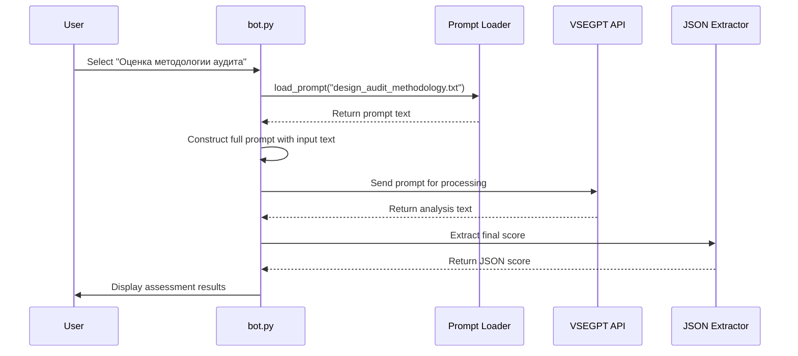

# Design Scenario: Audit Methodology Assessment

<cite>
**Referenced Files in This Document**   
- [design_audit_methodology.txt](file://prompts/design_audit_methodology.txt)
- [Дизайн.Оценка методологии аудита. Json.txt](file://prompts-by-scenario/design/Assessment-of-the-audit-methodology/json-prompt/Дизайн.Оценка методологии аудита. Json.txt)
- [оценка методологии аудита.txt](file://prompts-by-scenario/design/Assessment-of-the-audit-methodology/non-building/оценка методологии аудита.txt)
- [bot.py](file://src/bot.py)
</cite>

## Table of Contents
1. [Introduction](#introduction)
2. [Core Components](#core-components)
3. [Architecture Overview](#architecture-overview)
4. [Detailed Component Analysis](#detailed-component-analysis)
5. [Integration with Analysis Pipeline](#integration-with-analysis-pipeline)
6. [Input Schema and Processing Logic](#input-schema-and-processing-logic)
7. [Output Structure and Parsing](#output-structure-and-parsing)
8. [Handling Ambiguity and Incomplete Data](#handling-ambiguity-and-incomplete-data)
9. [Performance Considerations](#performance-considerations)
10. [Conclusion](#conclusion)

## Introduction
The Audit Methodology Assessment feature evaluates the structural and procedural robustness of audit programs for hospitality establishments. This system analyzes design audit reports against a standardized methodology to ensure comprehensive coverage, logical structure, and actionable recommendations. The assessment focuses on evaluating how well auditors adhere to established protocols when examining interior and architectural spaces in hotels, restaurants, and health centers.

**Section sources**
- [оценка методологии аудита.txt](file://prompts-by-scenario/design/Assessment-of-the-audit-methodology/non-building/оценка методологии аудита.txt)

## Core Components
The Audit Methodology Assessment consists of two primary components: the evaluation prompt that defines the assessment criteria and the JSON extractor that processes the results. These components work together to analyze audit reports and generate structured quality assessments.

**Section sources**
- [design_audit_methodology.txt](file://prompts/design_audit_methodology.txt)
- [Дизайн.Оценка методологии аудита. Json.txt](file://prompts-by-scenario/design/Assessment-of-the-audit-methodology/json-prompt/Дизайн.Оценка методологии аудита. Json.txt)

## Architecture Overview


**Diagram sources**
- [bot.py](file://src/bot.py#L331-L336)
- [Дизайн.Оценка методологии аудита. Json.txt](file://prompts-by-scenario/design/Assessment-of-the-audit-methodology/json-prompt/Дизайн.Оценка методологии аудита. Json.txt)

## Detailed Component Analysis

### Evaluation Prompt Structure
The assessment prompt is structured to evaluate multiple dimensions of audit quality, including adherence to basic principles, analysis sequence, coverage completeness, key element analysis, report structure, and zone-specific methodology compliance. The prompt distinguishes between justified subjective judgments (supported by specific observations) and unjustified subjective judgments (emotional evaluations without explanation).



**Diagram sources**
- [оценка методологии аудита.txt](file://prompts-by-scenario/design/Assessment-of-the-audit-methodology/non-building/оценка методологии аудита.txt)

### JSON Extraction Component
The JSON extraction component processes the LLM's textual output to extract the final quality score. This component specifically looks for the "Итоговая оценка качества отчета" value expressed as a percentage, returning only the numeric value in JSON format. If no score is found, it returns null.



**Diagram sources**
- [Дизайн.Оценка методологии аудита. Json.txt](file://prompts-by-scenario/design/Assessment-of-the-audit-methodology/json-prompt/Дизайн.Оценка методологии аудита. Json.txt)

**Section sources**
- [Дизайн.Оценка методологии аудита. Json.txt](file://prompts-by-scenario/design/Assessment-of-the-audit-methodology/json-prompt/Дизайн.Оценка методологии аудита. Json.txt)

## Integration with Analysis Pipeline
The Audit Methodology Assessment integrates with the run_analysis.py pipeline through the bot.py module. When a user selects the "Оценка методологии аудита" option, the system triggers the analyze_design_audit function, which loads the appropriate prompt and processes the input text through the LLM.



**Diagram sources**
- [bot.py](file://src/bot.py#L331-L349)
- [design_audit_methodology.txt](file://prompts/design_audit_methodology.txt)

**Section sources**
- [bot.py](file://src/bot.py#L331-L349)

## Input Schema and Processing Logic
The system processes transcription data from hospitality establishment audits, expecting input that describes the design and architectural assessment of specific zones. The processing logic involves loading the methodology assessment prompt, combining it with the input text, and submitting the complete prompt to the LLM for analysis.

The input should contain detailed observations about the space, including descriptions of layout, lighting, materials, furniture, navigation, and decoration. The system evaluates whether these elements are analyzed with justified subjective judgments that include specific explanations and connections between observations and conclusions.

**Section sources**
- [оценка методологии аудита.txt](file://prompts-by-scenario/design/Assessment-of-the-audit-methodology/non-building/оценка методологии аудита.txt)
- [bot.py](file://src/bot.py#L331-L336)

## Output Structure and Parsing
The assessment generates a structured output that includes a final quality score as a percentage, along with detailed feedback on strengths, areas for improvement, and section-by-section analysis. The JSON extractor component parses this output to retrieve only the final score value.

The expected output structure includes:
- Overall methodology compliance summary
- Final quality score in percentage format
- Strengths of the report
- Areas for improvement
- Detailed breakdown by assessment criteria
- Final conclusion with recommendations

The JSON extractor returns:
```json
{
  "итоговая_оценка_качества_отчета": <numerical_value_or_null>
}
```

**Section sources**
- [Дизайн.Оценка методологии аудита. Json.txt](file://prompts-by-scenario/design/Assessment-of-the-audit-methodology/json-prompt/Дизайн.Оценка методологии аудита. Json.txt)

## Handling Ambiguity and Incomplete Data
The system addresses incomplete methodology descriptions by evaluating what is present rather than penalizing for missing elements without context. When faced with ambiguity, the assessment focuses on whether the existing analysis is justified and well-supported.

For reports with insufficient information, the system may return a lower score reflecting incomplete coverage. The evaluation specifically looks for justified repetitions of interconnected elements and penalizes general statements that lack specific indications of what aspects were insufficiently described.

The JSON extractor handles missing scores by returning null, allowing the upstream system to manage this case appropriately.

**Section sources**
- [оценка методологии аудита.txt](file://prompts-by-scenario/design/Assessment-of-the-audit-methodology/non-building/оценка методологии аудита.txt)

## Performance Considerations
The system considers token usage efficiency by separating the assessment into two stages: comprehensive analysis and score extraction. This approach allows for detailed evaluation while enabling downstream systems to work with compact numeric results.

The prompt is designed to minimize unnecessary content in the response by instructing the LLM to return only the numerical value in JSON format for the extraction phase. This reduces parsing complexity and bandwidth usage.

Processing time is optimized through the use of spinner animations during analysis, providing user feedback while the LLM processes the request. The system also implements error handling for cases where the VSEGPT API is unavailable or returns unexpected results.

**Section sources**
- [bot.py](file://src/bot.py#L619-L644)
- [Дизайн.Оценка методологии аудита. Json.txt](file://prompts-by-scenario/design/Assessment-of-the-audit-methodology/json-prompt/Дизайн.Оценка методологии аудита. Json.txt)

## Conclusion
The Audit Methodology Assessment feature provides a systematic evaluation of design audit quality in hospitality establishments. By combining a comprehensive assessment prompt with structured output extraction, the system ensures consistent evaluation of audit reports against established methodology. The integration with the analysis pipeline enables seamless processing of transcription data, while the focus on justified subjective judgments promotes high-quality, actionable audit reports.