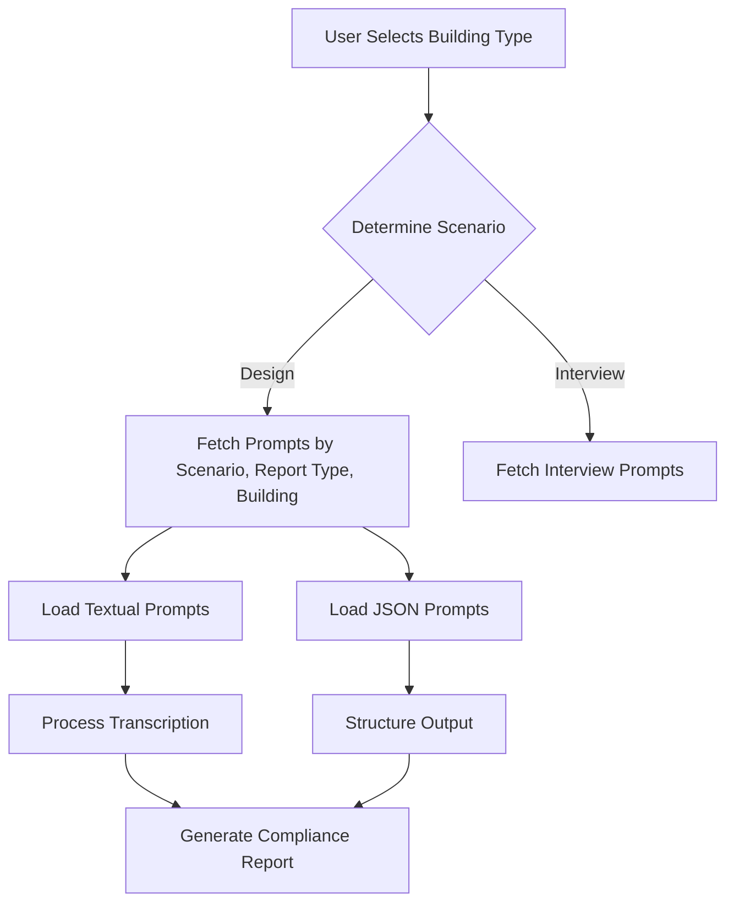
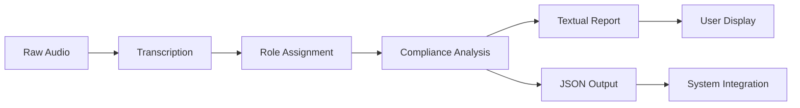
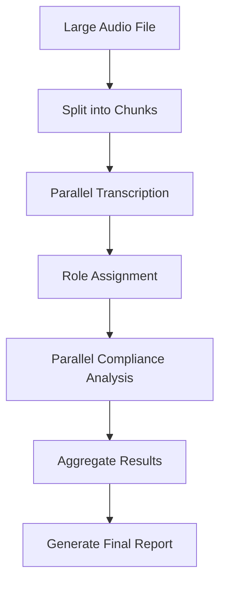

# Design Scenario: Compliance Reporting

<cite>
**Referenced Files in This Document**   
- [run_analysis.py](file://src/run_analysis.py)
- [analysis.py](file://src/analysis.py)
- [datamodels.py](file://src/datamodels.py)
- [аудит отеля.txt](file://prompts-by-scenario/design/Information-on-compliance-with-the-audit-program/hotel/part1/аудит отеля.txt)
- [Промпт рест аудит.txt](file://prompts-by-scenario/design/Information-on-compliance-with-the-audit-program/restaurant/part1/Промпт рест аудит.txt)
- [промпт дизайн спа.txt](file://prompts-by-scenario/design/Information-on-compliance-with-the-audit-program/spa/part1/промпт дизайн спа.txt)
- [Дизайн. Соответствие программе аудита. Отель. Json.txt](file://prompts-by-scenario/design/Information-on-compliance-with-the-audit-program/hotel/json-prompt/Дизайн. Соответствие программе аудита. Отель. Json.txt)
- [Дизайн. Соответствие программе аудита. Ресторан. Json.txt](file://prompts-by-scenario/design/Information-on-compliance-with-the-audit-program/restaurant/json-prompt/Дизайн. Соответствие программе аудита. Ресторан. Json.txt)
- [Дизайн. Соответствие программе аудита. СПА. Json.txt](file://prompts-by-scenario/design/Information-on-compliance-with-the-audit-program/spa/json-prompt/Дизайн. Соответствие программе аудита. СПА. Json.txt)
</cite>

## Table of Contents
1. [Introduction](#introduction)
2. [Compliance Reporting Module Overview](#compliance-reporting-module-overview)
3. [Prompt Structure and JSON Specifications](#prompt-structure-and-json-specifications)
4. [Dynamic Prompt Selection and Loading](#dynamic-prompt-selection-and-loading)
5. [Input and Output Formats](#input-and-output-formats)
6. [Compliance Categorization and Scoring](#compliance-categorization-and-scoring)
7. [Customization and Adaptation](#customization-and-adaptation)
8. [Troubleshooting and Performance Optimization](#troubleshooting-and-performance-optimization)
9. [Conclusion](#conclusion)

## Introduction

The Compliance Reporting module within the VoxPersona system evaluates adherence to predefined audit programs across hotel, restaurant, and spa establishments. This document details how the system leverages multi-part prompts and structured JSON specifications to assess compliance, with dynamic selection based on user-specified building types. The analysis is driven by large language models (LLMs) that process transcribed audio inputs, categorize compliance findings, and generate scored reports. This system supports customization for new compliance rules and different audit standards, ensuring adaptability across diverse scenarios.

**Section sources**
- [run_analysis.py](file://src/run_analysis.py#L1-L343)
- [analysis.py](file://src/analysis.py#L1-L490)

## Compliance Reporting Module Overview

The Compliance Reporting module is designed to evaluate how well audit reports for hotels, restaurants, and spas adhere to established methodologies. Each vertical has distinct compliance criteria embedded in specialized prompts. The system processes user-uploaded audio or text, assigns roles to speakers, and conducts a structured analysis to produce compliance scores and recommendations.

The module operates under the "Design" scenario, specifically handling the "Information-on-compliance-with-the-audit-program" report type. It assesses whether the audit documentation meets methodological requirements, covering aspects such as on-site visual inspection, supplementary information gathering, and report formulation. The evaluation is segmented by building type, ensuring that the criteria are contextually relevant.

For hotels, the audit focuses on zones like lobbies, reception areas, corridors, rooms, and dining areas. Restaurants are evaluated on layout, stylistic choices, lighting, furniture, and ambiance. Spas (referred to as health centers) are assessed on relaxation zones, treatment rooms, and wellness facilities. Each prompt enforces a scoring system where compliance is quantified in percentages across multiple dimensions.

**Section sources**
- [аудит отеля.txt](file://prompts-by-scenario/design/Information-on-compliance-with-the-audit-program/hotel/part1/аудит отеля.txt#L1-L93)
- [Промпт рест аудит.txt](file://prompts-by-scenario/design/Information-on-compliance-with-the-audit-program/restaurant/part1/Промпт рест аудит.txt#L1-L79)
- [промпт дизайн спа.txt](file://prompts-by-scenario/design/Information-on-compliance-with-the-audit-program/spa/part1/промпт дизайн спа.txt)

## Prompt Structure and JSON Specifications

The compliance evaluation relies on a multi-part prompt structure, where each building type has dedicated textual and JSON components. The textual prompts define the analytical framework, while the JSON specifications structure the output format for machine readability.

### Hotel Compliance Prompt Structure

The hotel compliance prompt (аудит отеля.txt) instructs the LLM to evaluate the audit based on:
- Zone identification (e.g., lobby, restaurant, corridors)
- Completeness of analysis across coverage, depth, logic, and context
- Methodology adherence in visual inspection, information gathering, and reporting
- Quality of recommendations

Each criterion is scored from 0–100%, with the final audit quality score (Z%) calculated as the average of methodology compliance (X%) and recommendation quality (Y%).

### Restaurant Compliance Prompt Structure

The restaurant prompt (Промпт рест аудит.txt) emphasizes:
- Analysis of functional zones (bar, dining area, open kitchen)
- Preparation phase (brand concept, location context)
- Design audit (exterior, layout, style, lighting, furniture)
- Atmosphere assessment (visual, acoustic, tactile)
- Reporting quality and audit methodology

Similar to the hotel prompt, it uses percentage-based scoring and calculates an overall audit quality score.

### Spa Compliance Prompt Structure

The spa prompt (промпт дизайн спа.txt) focuses on wellness-specific aspects such as treatment room design, relaxation zones, and sensory experiences. It follows the same scoring logic but tailors the criteria to spa environments.

### JSON Output Specifications

Each building type has a corresponding JSON prompt that structures the output:
- [Дизайн. Соответствие программе аудита. Отель. Json.txt](file://prompts-by-scenario/design/Information-on-compliance-with-the-audit-program/hotel/json-prompt/Дизайн. Соответствие программе аудита. Отель. Json.txt)
- [Дизайн. Соответствие программе аудита. Ресторан. Json.txt](file://prompts-by-scenario/design/Information-on-compliance-with-the-audit-program/restaurant/json-prompt/Дизайн. Соответствие программе аудита. Ресторан. Json.txt)
- [Дизайн. Соответствие программе аудита. СПА. Json.txt](file://prompts-by-scenario/design/Information-on-compliance-with-the-audit-program/spa/json-prompt/Дизайн. Соответствие программе аудита. СПА. Json.txt)

These JSON templates define fields for zone analysis, compliance scores, strengths, weaknesses, and recommendations, ensuring consistent and parseable output.

**Section sources**
- [аудит отеля.txt](file://prompts-by-scenario/design/Information-on-compliance-with-the-audit-program/hotel/part1/аудит отеля.txt#L1-L93)
- [Промпт рест аудит.txt](file://prompts-by-scenario/design/Information-on-compliance-with-the-audit-program/restaurant/part1/Промпт рест аудит.txt#L1-L79)
- [промпт дизайн спа.txt](file://prompts-by-scenario/design/Information-on-compliance-with-the-audit-program/spa/part1/промпт дизайн спа.txt)
- [Дизайн. Соответствие программе аудита. Отель. Json.txt](file://prompts-by-scenario/design/Information-on-compliance-with-the-audit-program/hotel/json-prompt/Дизайн. Соответствие программе аудита. Отель. Json.txt)
- [Дизайн. Соответствие программе аудита. Ресторан. Json.txt](file://prompts-by-scenario/design/Information-on-compliance-with-the-audit-program/restaurant/json-prompt/Дизайн. Соответствие программе аудита. Ресторан. Json.txt)
- [Дизайн. Соответствие программе аудита. СПА. Json.txt](file://prompts-by-scenario/design/Information-on-compliance-with-the-audit-program/spa/json-prompt/Дизайн. Соответствие программе аудита. СПА. Json.txt)

## Dynamic Prompt Selection and Loading

The system dynamically selects the appropriate prompt based on the user-selected establishment type through the `run_analysis_with_spinner` function in `run_analysis.py`. This function determines the scenario (e.g., "Design"), report type (e.g., "Compliance"), and building type (e.g., "Hotel") from user input.

**Diagram sources**
- [run_analysis.py](file://src/run_analysis.py#L200-L300)
- [datamodels.py](file://src/datamodels.py#L10-L70)

The `fetch_prompts_for_scenario_reporttype_building` function retrieves the correct prompt set from the database based on the triplet (scenario_name, report_type_desc, building_type). For example, selecting "Hotel" under "Design" and "Compliance" loads the hotel-specific textual and JSON prompts.

The system supports multi-part prompts, where some analyses require sequential processing (e.g., first analyzing general factors, then specific ones). The `run_part` field in the prompt metadata determines execution order, allowing complex workflows to be orchestrated.

**Section sources**
- [run_analysis.py](file://src/run_analysis.py#L200-L300)
- [datamodels.py](file://src/datamodels.py#L10-L70)

## Input and Output Formats

### Input Format

The system accepts transcribed audio as input, with speaker roles assigned via a dedicated prompt (assign_roles.txt). The expected input is a transcript where each utterance is labeled with a role (e.g., "Auditor", "Manager"). The `assign_roles` function in `analysis.py` processes raw text to identify and tag speakers, ensuring that the compliance analysis can distinguish between different participants.

Audio files must be in supported formats (e.g., MP3, WAV) and are transcribed using OpenAI's Whisper model via the `transcribe_audio` function.

### Output Format

The output is a structured compliance report containing:
- Zone identification
- Percentage scores for each compliance dimension
- Strengths and weaknesses
- Recommendations
- Final audit quality score (Z%)

For JSON-enabled reports, the output is formatted as a JSON object with predefined fields, enabling integration with downstream systems.

**Diagram sources**
- [analysis.py](file://src/analysis.py#L300-L350)
- [run_analysis.py](file://src/run_analysis.py#L100-L150)

**Section sources**
- [analysis.py](file://src/analysis.py#L300-L350)
- [run_analysis.py](file://src/run_analysis.py#L100-L150)

## Compliance Categorization and Scoring

Compliance findings are categorized and scored by the LLM based on predefined criteria in the prompt. The system uses a hierarchical evaluation framework:

1. **Dimension Scoring**: Each compliance dimension (e.g., visual inspection, information gathering) is scored 0–100%.
2. **Aspect Evaluation**: Within each dimension, specific aspects are assessed (e.g., brand elements, emotional response).
3. **Final Calculation**: The overall methodology compliance (X%) is the average of dimension scores. Recommendation quality (Y%) is similarly averaged. The final audit score (Z%) is (X + Y) / 2.

The LLM is instructed to provide justifications for each score, ensuring transparency. Scores below 40% indicate a formal, inadequate audit, while scores above 80% reflect a comprehensive, actionable analysis.

**Section sources**
- [аудит отеля.txt](file://prompts-by-scenario/design/Information-on-compliance-with-the-audit-program/hotel/part1/аудит отеля.txt#L1-L93)
- [Промпт рест аудит.txt](file://prompts-by-scenario/design/Information-on-compliance-with-the-audit-program/restaurant/part1/Промпт рест аудит.txt#L1-L79)

## Customization and Adaptation

The system supports customization for new compliance rules and audit standards:
- **Adding New Rules**: New prompts can be added to the `prompts-by-scenario` directory, following the existing structure. A corresponding JSON template should be created for structured output.
- **Adapting to Standards**: Different audit methodologies can be encoded in new prompt files, allowing the system to support ISO, LEED, or proprietary standards.
- **New Building Types**: The `mapping_building_names` in `datamodels.py` can be extended to support additional verticals (e.g., retail, offices).

To integrate a new building type:
1. Create a new subdirectory under `Information-on-compliance-with-the-audit-program/`
2. Add `part1` and `json-prompt` directories with appropriate text and JSON files
3. Update the database via `fill_prompts_table.py` to register the new prompts

**Section sources**
- [datamodels.py](file://src/datamodels.py#L50-L60)
- [run_analysis.py](file://src/run_analysis.py#L250-L270)

## Troubleshooting and Performance Optimization

### Troubleshooting Misclassified Compliance Items

If compliance items are misclassified:
- Verify the prompt accurately reflects the audit methodology
- Check that the transcription quality is sufficient
- Ensure role assignment is correct (use `assign_roles` prompt)
- Review LLM response for hallucinations or deviations from scoring rules

Logs in `run_analysis.py` can help trace execution flow and identify where misclassification occurs.

### Performance Optimization for Large Transcriptions

For large audio files:
- The system splits audio into 3-minute chunks for transcription
- Uses asynchronous processing via `extract_from_chunk_parallel_async` to handle multiple chunks concurrently
- Implements rate limiting to respect API quotas
- Employs in-memory vector databases for fast retrieval during deep search

To optimize:
- Use `deep_search` mode for detailed analysis of large documents
- Monitor token usage via `count_tokens` to avoid model limits
- Adjust chunk size based on transcription length

**Diagram sources**
- [analysis.py](file://src/analysis.py#L400-L450)
- [run_analysis.py](file://src/run_analysis.py#L150-L200)

**Section sources**
- [analysis.py](file://src/analysis.py#L400-L450)
- [run_analysis.py](file://src/run_analysis.py#L150-L200)

## Conclusion

The Compliance Reporting module effectively evaluates audit adherence across hotel, restaurant, and spa verticals using a dynamic, prompt-driven approach. By leveraging multi-part prompts and JSON specifications, it ensures consistent, structured analysis tailored to each establishment type. The system's ability to dynamically select prompts, process transcribed audio, and generate scored reports makes it a powerful tool for quality assurance in design audits. With support for customization and performance optimization, it is adaptable to evolving audit standards and scalable for large datasets.