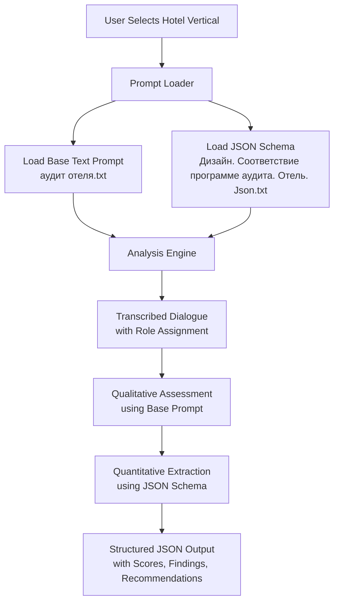
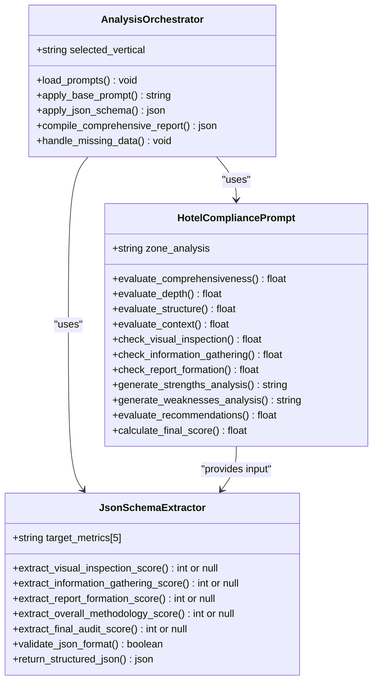
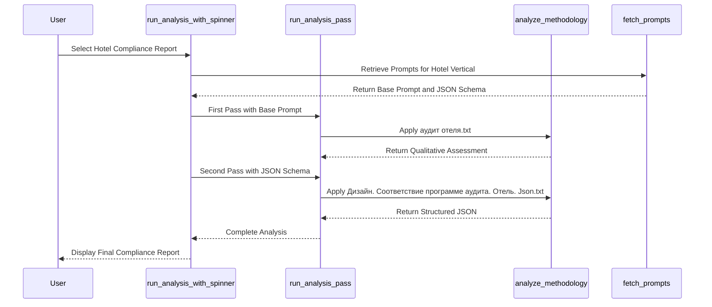
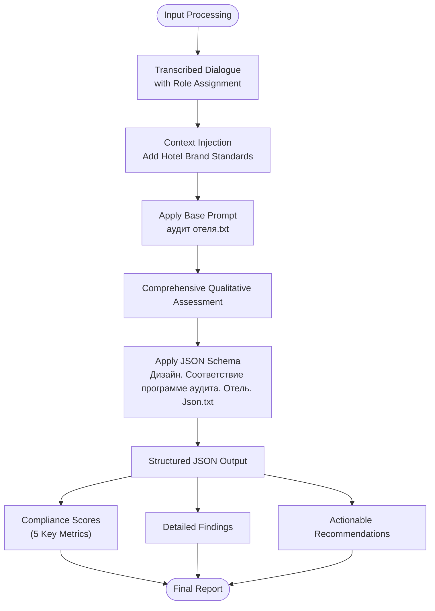

# Hotel Compliance Reporting

<cite>
**Referenced Files in This Document**   
- [аудит отеля.txt](file://prompts-by-scenario/design/Information-on-compliance-with-the-audit-program/hotel/part1/аудит%20отеля.txt)
- [Дизайн. Соответствие программе аудита. Отель. Json.txt](file://prompts-by-scenario/design/Information-on-compliance-with-the-audit-program/hotel/json-prompt/Дизайн.%20Соответствие%20программе%20аудита.%20Отель.%20Json.txt)
- [run_analysis.py](file://src/run_analysis.py)
- [analysis.py](file://src/analysis.py)
- [db.py](file://src/db_handler/db.py)
- [datamodels.py](file://src/datamodels.py)
</cite>

## Table of Contents
1. [Introduction](#introduction)
2. [Core Components](#core-components)
3. [Architecture Overview](#architecture-overview)
4. [Detailed Component Analysis](#detailed-component-analysis)
5. [Dependency Analysis](#dependency-analysis)
6. [Performance Considerations](#performance-considerations)
7. [Troubleshooting Guide](#troubleshooting-guide)
8. [Conclusion](#conclusion)

## Introduction
The Hotel Compliance Reporting sub-feature evaluates adherence to audit programs specifically for hotels, focusing on service standards, facility requirements, and operational procedures. This system uses a two-part prompt structure to assess compliance: a base text prompt (аудит отеля.txt) that defines the evaluation methodology and a JSON schema (Дизайн. Соответствие программе аудита. Отель. Json.txt) that specifies output formatting and scoring logic. The run_analysis.py module dynamically loads and applies these prompts based on user selection of the hotel vertical. The system processes transcribed and role-assigned dialogue as input and generates structured JSON output containing compliance scores, findings, and recommendations. Key compliance categories include check-in process, room cleanliness, staff behavior, and safety protocols.

## Core Components

The Hotel Compliance Reporting system consists of several core components that work together to evaluate hotel audit compliance. The base text prompt (аудит отеля.txt) serves as the primary evaluation framework, defining how auditors should assess various hotel zones including lobby, reception, corridors, rooms, restaurant, bar, and special areas. This prompt establishes evaluation criteria across multiple dimensions: comprehensiveness of coverage, depth of analysis, logical structure, contextual relevance, and methodological adherence. The companion JSON schema (Дизайн. Соответствие программе аудита. Отель. Json.txt) acts as a data extraction tool that parses the audit report to extract quantitative compliance scores. The run_analysis.py module orchestrates the entire process by dynamically loading the appropriate prompts based on user selection and managing the analysis workflow.

**Section sources**
- [аудит отеля.txt](file://prompts-by-scenario/design/Information-on-compliance-with-the-audit-program/hotel/part1/аудит%20отеля.txt#L1-L92)
- [Дизайн. Соответствие программе аудита. Отель. Json.txt](file://prompts-by-scenario/design/Information-on-compliance-with-the-audit-program/hotel/json-prompt/Дизайн.%20Соответствие%20программе%20аудита.%20Отель.%20Json.txt#L1-L35)
- [run_analysis.py](file://src/run_analysis.py#L1-L343)

## Architecture Overview

The Hotel Compliance Reporting system follows a modular architecture where specialized components handle different aspects of the compliance evaluation process. The system begins with user input selection, where the user chooses the hotel vertical for analysis. This triggers the dynamic loading of the appropriate prompt set from the database. The base text prompt guides the qualitative assessment of the audit report, while the JSON schema handles quantitative data extraction. The analysis engine processes the input through these prompts sequentially, first applying the comprehensive evaluation framework and then extracting structured metrics. The results are compiled into a standardized JSON output format that includes compliance scores, findings, and recommendations.



**Diagram sources **
- [run_analysis.py](file://src/run_analysis.py#L1-L343)
- [аудит отеля.txt](file://prompts-by-scenario/design/Information-on-compliance-with-the-audit-program/hotel/part1/аудит%20отеля.txt#L1-L92)

## Detailed Component Analysis

### Prompt System Analysis
The Hotel Compliance Reporting system employs a two-part prompt system that combines qualitative assessment with quantitative data extraction. The base text prompt (аудит отеля.txt) establishes a comprehensive evaluation framework that assesses multiple aspects of hotel design audits. This prompt requires evaluators to determine which hotel zone is being analyzed and then assess the completeness and quality of the analysis across several dimensions: comprehensiveness of coverage, depth of analysis, logical structure, contextual relevance, and methodological adherence. For each dimension, the evaluator must provide a percentage score with justification. The prompt also checks compliance with the audit methodology across three key areas: on-site visual inspection, collection of additional information, and report formation with recommendations.

The companion JSON schema (Дизайн. Соответствие программе аудита. Отель. Json.txt) serves as a structured data extractor that identifies and captures specific quantitative metrics from the audit report. This schema targets five key compliance indicators: visual inspection methodology compliance, information gathering methodology compliance, report formation methodology compliance, overall methodology compliance, and final audit quality score. The JSON schema extracts only the numerical values without percentage signs, returning null for any missing metrics. This two-tiered approach ensures both comprehensive qualitative assessment and precise quantitative measurement of compliance.



**Diagram sources **
- [аудит отеля.txt](file://prompts-by-scenario/design/Information-on-compliance-with-the-audit-program/hotel/part1/аудит%20отеля.txt#L1-L92)
- [Дизайн. Соответствие программе аудита. Отель. Json.txt](file://prompts-by-scenario/design/Information-on-compliance-with-the-audit-program/hotel/json-prompt/Дизайн.%20Соответствие%20программе%20аудита.%20Отель.%20Json.txt#L1-L35)

### Analysis Orchestration
The run_analysis.py module serves as the central orchestrator for the Hotel Compliance Reporting system, managing the entire analysis workflow from prompt retrieval to result generation. When a user selects the hotel compliance reporting option, the system triggers the run_analysis_with_spinner function, which coordinates the analysis process while providing user feedback through a loading animation. The module first determines the appropriate scenario (Design or Interview) based on the user's selection, then retrieves the relevant prompts from the database using the fetch_prompts_for_scenario_reporttype_building function. For hotel compliance reporting, this retrieves both the base text prompt and the JSON schema prompt as a pair.

The analysis process occurs in two sequential passes managed by the run_analysis_pass function. In the first pass, the system applies the base text prompt to the input transcript, generating a comprehensive qualitative assessment of the audit. This intermediate result then serves as input for the second pass, where the JSON schema prompt extracts the quantitative compliance scores. This two-stage approach ensures that the structured data extraction operates on a properly formatted and complete assessment. The system handles both ordinary prompts and JSON prompts separately, processing them in the correct order to maintain the integrity of the analysis pipeline.



**Diagram sources **
- [run_analysis.py](file://src/run_analysis.py#L1-L343)
- [analysis.py](file://src/analysis.py#L1-L490)

### Input Processing and Output Generation
The Hotel Compliance Reporting system processes transcribed dialogue with role assignment as its primary input, transforming this raw data into structured compliance reports. The input typically consists of recorded interactions between auditors and hotel staff or observations made during on-site visits, transcribed into text format with speaker roles identified. This processed text serves as the foundation for the compliance assessment. The system expects the input to contain detailed descriptions of hotel operations, facility conditions, and service interactions that can be evaluated against established standards.

The output consists of structured JSON data containing compliance scores, findings, and recommendations. The JSON schema extractor identifies five key metrics from the qualitative assessment: visual inspection methodology compliance, information gathering methodology compliance, report formation methodology compliance, overall methodology compliance, and final audit quality score. These metrics provide a quantitative overview of compliance levels while the accompanying qualitative analysis offers detailed findings and improvement recommendations. The final output enables stakeholders to quickly understand compliance status while also providing the detailed context needed for remediation planning.



**Diagram sources **
- [run_analysis.py](file://src/run_analysis.py#L1-L343)
- [analysis.py](file://src/analysis.py#L1-L490)
- [аудит отеля.txt](file://prompts-by-scenario/design/Information-on-compliance-with-the-audit-program/hotel/part1/аудит%20отеля.txt#L1-L92)

## Dependency Analysis

The Hotel Compliance Reporting system relies on a network of interdependent components that work together to deliver comprehensive compliance assessments. The core dependency chain begins with the datamodels.py file, which defines the mapping between user interface labels and internal system identifiers. This includes the REPORT_MAPPING dictionary that connects callback data like "report_design_compliance" to human-readable labels like "Соответствие программе аудита". The system also depends on the mapping_building_names dictionary to translate between user selections and database values.

The db.py module provides critical database access functionality, with the fetch_prompts_for_scenario_reporttype_building function serving as a key dependency for retrieving the appropriate prompt set based on the selected scenario, report type, and building type. This function queries the database using the scenario name ("Дизайн"), report type description ("Соответствие программе аудита"), and building type ("Отель") to return the complete prompt set. The run_analysis.py module depends on this database access to load the necessary prompts, while the analysis.py module depends on the prompt content to perform the actual evaluation.

```mermaid
graph TD
datamodels[datamodels.py] --> run_analysis[run_analysis.py]
datamodels --> db[db.py]
db --> run_analysis
run_analysis --> analysis[analysis.py]
analysis --> config[config.py]
config --> analysis
run_analysis --> handlers[handlers.py]
handlers --> run_analysis
datamodels -.-> "Defines REPORT_MAPPING<br/>and mapping_building_names" --> run_analysis
db -.-> "Provides fetch_prompts_for_<br/>scenario_reporttype_building" --> run_analysis
run_analysis -.-> "Uses analyze_methodology" --> analysis
analysis -.-> "Uses send_msg_to_model" --> config
handlers -.-> "Triggers run_analysis_with_spinner" --> run_analysis
```

**Diagram sources **
- [datamodels.py](file://src/datamodels.py#L1-L71)
- [db.py](file://src/db_handler/db.py#L1-L398)
- [run_analysis.py](file://src/run_analysis.py#L1-L343)

## Performance Considerations

The Hotel Compliance Reporting system is designed with performance optimization in mind, particularly in its handling of large text inputs and complex analysis workflows. The run_analysis.py module implements a two-pass analysis process that separates qualitative assessment from quantitative extraction, allowing for more efficient processing and error handling. The system uses threading to manage the loading animation during analysis, preventing interface blocking and providing visual feedback to users during potentially lengthy operations.

The analysis.py module includes performance-conscious implementations of LLM interactions, with the analyze_methodology function processing prompts sequentially and using the output of each prompt as input for the next. This chained approach minimizes redundant processing while maintaining the logical flow of analysis. The system also implements rate limiting and error handling for API calls, with exponential backoff strategies for handling rate limit errors from the LLM provider. These performance considerations ensure that the system can handle complex compliance assessments efficiently while maintaining reliability and responsiveness.

## Troubleshooting Guide

Common issues in the Hotel Compliance Reporting system typically relate to prompt loading, data extraction, and analysis execution. If the system fails to load the appropriate prompts, verify that the database contains the correct entries for the "Дизайн" scenario, "Соответствие программе аудита" report type, and "Отель" building type. Check that the fetch_prompts_for_scenario_reporttype_building function returns the expected prompt pair (base text prompt and JSON schema). For issues with data extraction, ensure that the qualitative assessment generated by the base prompt includes all required percentage scores in the expected format, as the JSON schema extractor depends on these values being present and properly formatted.

False negatives in compliance detection often occur when the input transcript lacks sufficient detail or when speaker roles are incorrectly assigned. Verify that the transcribed dialogue contains comprehensive descriptions of hotel operations and that roles are accurately identified. Misclassification of speaker intent can be addressed by reviewing the role assignment process and ensuring that the assign_roles function is properly configured. If the analysis process fails, check the LLM API keys in config.py and verify that the system has network connectivity to the LLM provider. Monitor the logs for rate limit errors and adjust the API key rotation strategy if necessary.

**Section sources**
- [run_analysis.py](file://src/run_analysis.py#L1-L343)
- [analysis.py](file://src/analysis.py#L1-L490)
- [db.py](file://src/db_handler/db.py#L1-L398)

## Conclusion

The Hotel Compliance Reporting system provides a comprehensive framework for evaluating hotel audit compliance through a sophisticated two-part prompt system. By combining a detailed qualitative assessment prompt with a structured JSON schema for data extraction, the system delivers both rich contextual insights and quantifiable compliance metrics. The architecture, centered around the run_analysis.py orchestrator, efficiently manages the analysis workflow from prompt retrieval to final report generation. This approach enables organizations to systematically evaluate hotel operations against established standards, identify areas for improvement, and track compliance over time. The modular design allows for easy customization to different hotel brands or audit frameworks, making it a versatile tool for quality assurance in the hospitality industry.