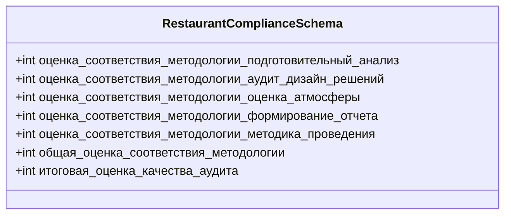
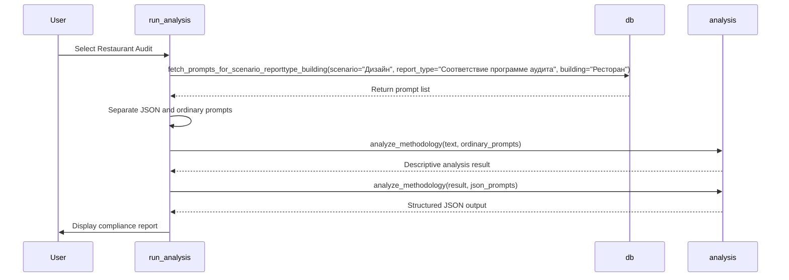
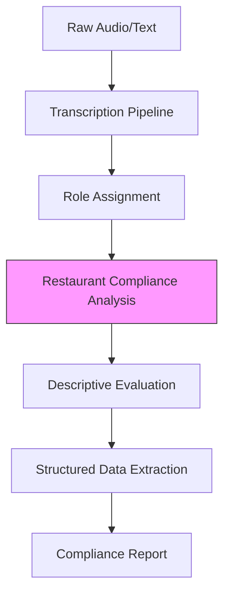
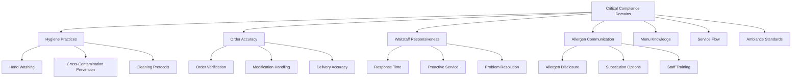
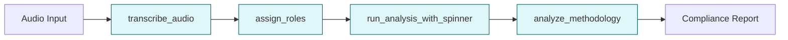
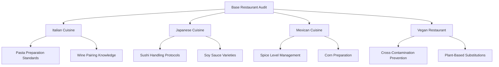
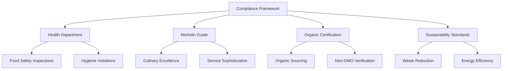
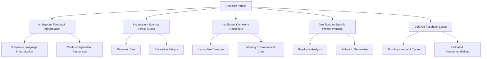
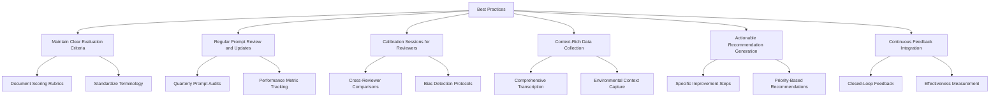

# Restaurant Compliance Reporting

<cite>
**Referenced Files in This Document**   
- [Промпт рест аудит.txt](file://prompts-by-scenario/design/Information-on-compliance-with-the-audit-program/restaurant/part1/Промпт рест аудит.txt)
- [Дизайн. Соответствие программе аудита. Ресторан. Json.txt](file://prompts-by-scenario/design/Information-on-compliance-with-the-audit-program/restaurant/json-prompt/Дизайн. Соответствие программе аудита. Ресторан. Json.txt)
- [run_analysis.py](file://src/run_analysis.py)
- [analysis.py](file://src/analysis.py)
- [db.py](file://src/db_handler/db.py)
- [datamodels.py](file://src/datamodels.py)
</cite>

## Table of Contents
1. [Introduction](#introduction)
2. [Core Components](#core-components)
3. [Two-Component Prompt Structure](#two-component-prompt-structure)
4. [Prompt Loading and Processing Workflow](#prompt-loading-and-processing-workflow)
5. [Input Requirements and Data Flow](#input-requirements-and-data-flow)
6. [Output Structure and Compliance Domains](#output-structure-and-compliance-domains)
7. [Integration with Transcription Pipeline](#integration-with-transcription-pipeline)
8. [Extensibility and Customization](#extensibility-and-customization)
9. [Common Pitfalls and Best Practices](#common-pitfalls-and-best-practices)

## Introduction
The Restaurant Compliance Reporting sub-feature enables systematic evaluation of restaurant-specific audit criteria through a structured LLM-based analysis framework. This system assesses critical domains including food safety, service flow, menu knowledge, and ambiance by leveraging a dual-prompt architecture that combines descriptive analysis with structured data extraction. The implementation supports dynamic configuration for different restaurant types and certification standards, providing consistent, quantifiable compliance assessments based on customer interaction transcripts.

## Core Components

This section analyzes the key components that enable restaurant compliance reporting functionality.

**Section sources**
- [run_analysis.py](file://src/run_analysis.py#L1-L344)
- [analysis.py](file://src/analysis.py#L1-L491)
- [db.py](file://src/db_handler/db.py#L1-L399)

## Two-Component Prompt Structure

### Descriptive Text Prompt (Промпт рест аудит.txt)
The descriptive text prompt serves as the primary instruction set for LLM analysis of restaurant design audits. It defines a comprehensive evaluation framework that assesses multiple aspects of restaurant design and operation:

```mermaid
flowchart TD
A[Restaurant Audit Evaluation Framework] --> B[Zone Identification]
A --> C[Completeness Assessment]
A --> D[Methodology Compliance]
A --> E[Recommendation Quality]
A --> F[Overall Audit Quality]
B --> B1[Exterior & Entrance]
B --> B2[Layout Design]
B --> B3[Stylistic Solutions]
B --> B4[Lighting Design]
B --> B5[Furniture & Equipment]
B --> B6[Details & Accents]
C --> C1[Coverage]
C --> C2[Depth of Analysis]
C --> C3[Logical Structure]
C --> C4[Contextuality]
D --> D1[Preparatory Analysis]
D --> D2[Design Solutions Audit]
D --> D3[Atmosphere Evaluation]
D --> D4[Report Formation]
D --> D5[Methodology Implementation]
E --> E1[Specificity]
E --> E2[Problem Relevance]
E --> E3[Concept Alignment]
E --> E4[Effectiveness]
E --> E5[Visualization]
F --> F1[Final Quality Score]
```



**Diagram sources**
- [Промпт рест аудит.txt](file://prompts-by-scenario/design/Information-on-compliance-with-the-audit-program/restaurant/part1/Промпт рест аудит.txt#L1-L79)

### JSON Schema (Дизайн. Соответствие программе аудита. Ресторан. Json.txt)
The JSON schema prompt enforces consistent output formatting and enables quantitative scoring by extracting specific metrics from the LLM's descriptive analysis:



**Diagram sources**
- [Дизайн. Соответствие программе аудита. Ресторан. Json.txt](file://prompts-by-scenario/design/Information-on-compliance-with-the-audit-program/restaurant/json-prompt/Дизайн. Соответствие программе аудита. Ресторан. Json.txt#L1-L40)

## Prompt Loading and Processing Workflow

### Dynamic Prompt Selection
The system dynamically selects and processes prompt combinations based on the restaurant vertical through a structured workflow:



**Diagram sources**
- [run_analysis.py](file://src/run_analysis.py#L200-L344)
- [db.py](file://src/db_handler/db.py#L350-L399)

### Processing Logic
The `run_analysis_with_spinner` function orchestrates the two-phase analysis process:

1. First pass: Apply descriptive prompts to generate comprehensive audit text
2. Second pass: Apply JSON schema prompts to extract structured metrics from the audit text

This sequential processing ensures that quantitative data is derived from qualitatively rich analysis, maintaining consistency between narrative findings and numerical scores.

**Section sources**
- [run_analysis.py](file://src/run_analysis.py#L200-L344)

## Input Requirements and Data Flow

### Input Specifications
The system requires role-labeled dialogue from customer interactions as input, which typically includes:

- Customer queries about menu items, ingredients, and preparation methods
- Staff responses demonstrating product knowledge
- Service interaction patterns and response times
- Ambiance descriptions and environmental observations
- Hygiene practice observations
- Order accuracy verification

### Data Flow Architecture


The data flows through a pipeline that first transcribes audio inputs, assigns roles to speakers, and then processes the dialogue through the restaurant compliance analysis engine.

**Section sources**
- [analysis.py](file://src/analysis.py#L1-L491)
- [run_analysis.py](file://src/run_analysis.py#L1-L344)

## Output Structure and Compliance Domains

### Structured Output Format
The system produces standardized JSON output containing compliance ratings, violation details, and improvement suggestions:

```json
{
  "оценка_соответствия_методологии_подготовительный_анализ": 85,
  "оценка_соответствия_методологии_аудит_дизайн_решений": 78,
  "оценка_соответствия_методологии_оценка_атмосферы": 92,
  "оценка_соответствия_методологии_формирование_отчета": 88,
  "оценка_соответствия_методологии_методика_проведения": 80,
  "общая_оценка_соответствия_методологии": 84,
  "итоговая_оценка_качества_аудита": 82
}
```

### Critical Compliance Domains
The system evaluates several key compliance areas:



**Section sources**
- [Промпт рест аудит.txt](file://prompts-by-scenario/design/Information-on-compliance-with-the-audit-program/restaurant/part1/Промпт рест аудит.txt#L1-L79)

## Integration with Transcription Pipeline

### System Integration Points
The restaurant compliance reporting feature integrates with the transcription pipeline through several key interfaces:



The `transcribe_audio` function converts audio inputs to text, which is then processed by `assign_roles` to identify speaker roles before being passed to the compliance analysis engine.

### Processing Sequence
1. Audio files are transcribed using OpenAI Whisper
2. Speaker roles are assigned to dialogue segments
3. The processed text is passed to `run_analysis_with_spinner`
4. Prompts are fetched from the database based on scenario parameters
5. Two-phase analysis generates both descriptive and structured outputs

**Section sources**
- [analysis.py](file://src/analysis.py#L1-L491)
- [run_analysis.py](file://src/run_analysis.py#L1-L344)

## Extensibility and Customization

### Supporting Different Cuisines
The system can be extended to support different cuisines by creating cuisine-specific prompt variations that address unique compliance requirements:



### Certification Standard Adaptation
The framework supports different certification standards by modifying the evaluation criteria and scoring methodology:



New standards can be implemented by creating corresponding prompt sets in the `prompts-by-scenario` directory structure, following the established pattern for restaurant audits.

**Section sources**
- [datamodels.py](file://src/datamodels.py#L1-L72)
- [db.py](file://src/db_handler/db.py#L350-L399)

## Common Pitfalls and Best Practices

### Common Implementation Challenges
Several common issues can arise when implementing and using the restaurant compliance reporting system:



### Best Practices for Reliable Compliance Assessment
To ensure consistent and valuable compliance reporting, follow these best practices:



**Section sources**
- [Промпт рест аудит.txt](file://prompts-by-scenario/design/Information-on-compliance-with-the-audit-program/restaurant/part1/Промпт рест аудит.txt#L1-L79)
- [run_analysis.py](file://src/run_analysis.py#L200-L344)