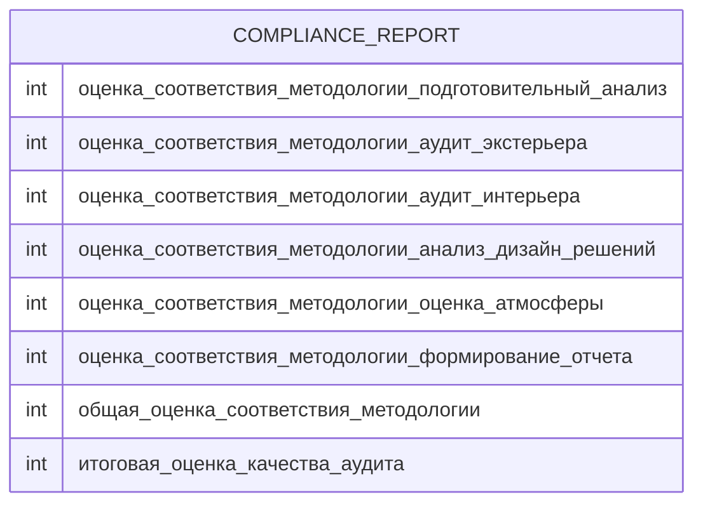
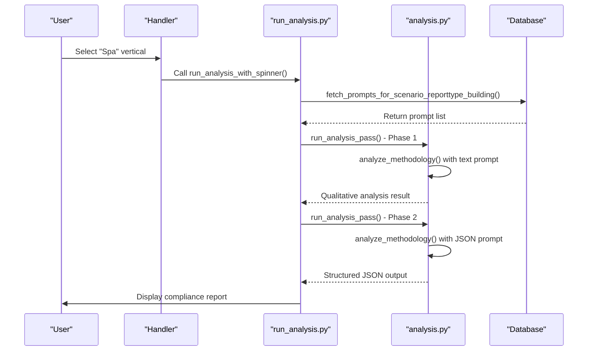
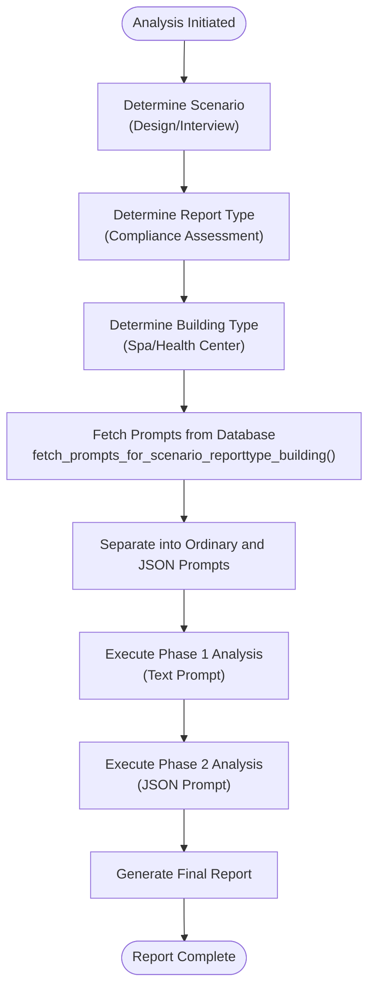
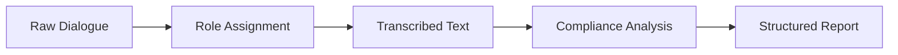
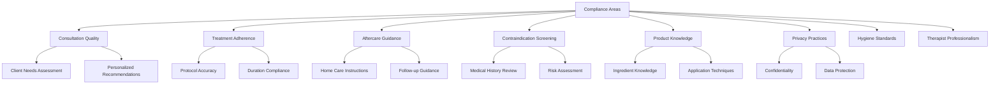
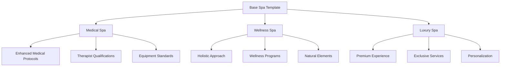
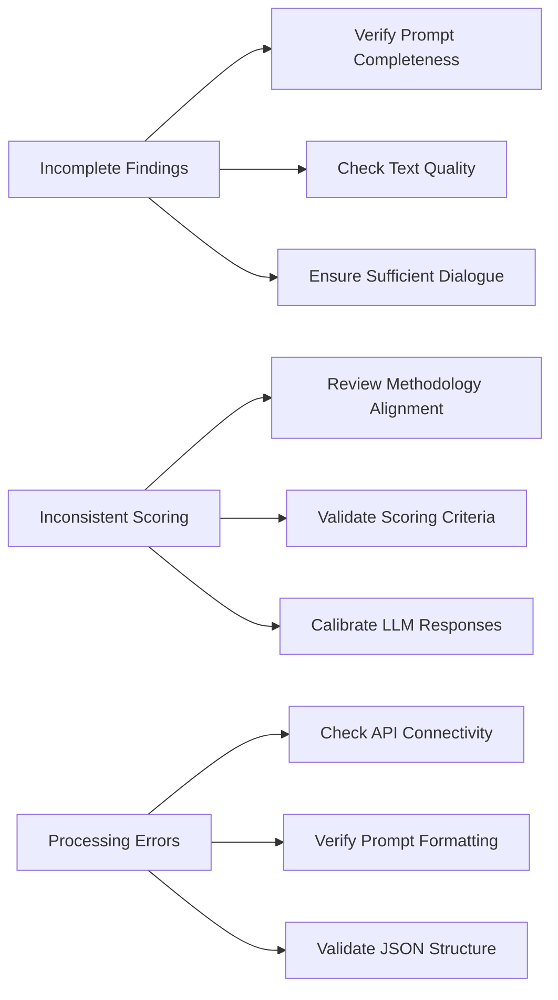

# Spa Compliance Reporting

<cite>
**Referenced Files in This Document**   
- [промпт дизайн спа.txt](file://prompts-by-scenario/design/Information-on-compliance-with-the-audit-program/spa/part1/промпт дизайн спа.txt)
- [Дизайн. Соответствие программе аудита. СПА. Json.txt](file://prompts-by-scenario/design/Information-on-compliance-with-the-audit-program/spa/json-prompt/Дизайн. Соответствие программе аудита. СПА. Json.txt)
- [run_analysis.py](file://src/run_analysis.py)
- [analysis.py](file://src/analysis.py)
- [db.py](file://src/db_handler/db.py)
- [datamodels.py](file://src/datamodels.py)
</cite>

## Table of Contents
1. [Introduction](#introduction)
2. [Core Components](#core-components)
3. [Dual Prompt Architecture](#dual-prompt-architecture)
4. [Analysis Orchestration](#analysis-orchestration)
5. [Input Processing and Output Generation](#input-processing-and-output-generation)
6. [Compliance Assessment Criteria](#compliance-assessment-criteria)
7. [Customization and Troubleshooting](#customization-and-troubleshooting)

## Introduction
The Spa Compliance Reporting sub-feature provides a structured framework for evaluating spa operations against established audit standards. This system leverages a dual-prompt architecture to assess compliance across critical domains including treatment protocols, client consultation, hygiene practices, and therapist professionalism. The solution combines an instructional text prompt that defines analytical criteria with a JSON schema that structures the output, enabling consistent and quantifiable compliance assessments. This document details the implementation of this system, focusing on the spa-specific configuration and its integration within the broader VoxPersona platform.

## Core Components

The Spa Compliance Reporting system is built upon several interconnected components that work together to deliver structured compliance assessments. The core functionality revolves around the analysis of client-therapist interactions through a specialized prompt architecture. The system processes transcribed dialogues and applies spa-specific audit criteria to generate comprehensive compliance reports with quantitative scores. Key components include the instructional prompt that defines the analytical framework, the JSON schema that structures the output, and the orchestration logic that manages the analysis workflow.

**Section sources**
- [промпт дизайн спа.txt](file://prompts-by-scenario/design/Information-on-compliance-with-the-audit-program/spa/part1/промпт дизайн спа.txt)
- [Дизайн. Соответствие программе аудита. СПА. Json.txt](file://prompts-by-scenario/design/Information-on-compliance-with-the-audit-program/spa/json-prompt/Дизайн. Соответствие программе аудита. СПА. Json.txt)
- [run_analysis.py](file://src/run_analysis.py)

## Dual Prompt Architecture

The system employs a dual prompt architecture consisting of an instructional text prompt and a JSON schema prompt, both specifically designed for spa compliance assessment. This architecture enables a two-phase analysis process where qualitative assessment is followed by structured data extraction.

### Instructional Text Prompt
The instructional text prompt (промпт дизайн спа.txt) serves as the analytical framework for spa compliance assessment. It defines a comprehensive methodology for evaluating spa design and operations across multiple dimensions:

```mermaid
flowchart TD
A[Instructional Text Prompt] --> B[Preparatory Analysis]
A --> C[Exterior Audit]
A --> D[Interior Audit]
A --> E[Design Solutions Analysis]
A --> F[Atmosphere Evaluation]
A --> G[Report Formation]
B --> B1[Concept and Positioning]
B --> B2[Location and Environment]
B --> B3[Evaluation Criteria]
C --> C1[Outdoor Space]
C --> C2[Façade Solutions]
D --> D1[Entrance Zone and Reception]
D --> D2[Public Spaces]
D --> D3[Functional Zones]
E --> E1[Layout Solutions]
E --> E2[Stylistic Solutions]
E --> E3[Lighting Design]
E --> E4[Acoustic Comfort]
F --> F1[Sensory Perception]
F --> F2[Psychological Comfort]
G --> G1[Concept Alignment]
G --> G2[Specific Recommendations]
G --> G3[Implementation Plan]
```



**Diagram sources**
- [промпт дизайн спа.txt](file://prompts-by-scenario/design/Information-on-compliance-with-the-audit-program/spa/part1/промпт дизайн спа.txt)

### JSON Schema Prompt
The JSON schema prompt (Дизайн. Соответствие программе аудита. СПА. Json.txt) defines the structure for extracting quantitative data from the analysis. It specifies the exact metrics to be extracted and their format:



**Diagram sources**
- [Дизайн. Соответствие программе аудита. СПА. Json.txt](file://prompts-by-scenario/design/Information-on-compliance-with-the-audit-program/spa/json-prompt/Дизайн. Соответствие программе аудита. СПА. Json.txt)

## Analysis Orchestration

The run_analysis.py module orchestrates the spa compliance assessment process, managing the selection and execution of the appropriate prompt set based on the selected vertical.

### Analysis Workflow
The analysis workflow follows a structured process that ensures consistent application of the dual prompt architecture:



**Diagram sources**
- [run_analysis.py](file://src/run_analysis.py)
- [analysis.py](file://src/analysis.py)

### Prompt Selection Logic
The system uses a sophisticated prompt selection mechanism that identifies the appropriate prompt set based on scenario, report type, and building type:



**Diagram sources**
- [run_analysis.py](file://src/run_analysis.py)
- [db.py](file://src/db_handler/db.py)

**Section sources**
- [run_analysis.py](file://src/run_analysis.py)
- [db.py](file://src/db_handler/db.py)
- [datamodels.py](file://src/datamodels.py)

## Input Processing and Output Generation

The system processes client-therapist interactions to generate structured compliance reports with detailed assessments and quantitative scores.

### Input Format
The system expects transcribed dialogues between clients and spa professionals as input. These dialogues are processed to identify key compliance elements:



The input should include:
- Client consultation dialogues
- Treatment protocol discussions
- Aftercare guidance exchanges
- Therapist-client interactions

### Output Structure
The resulting compliance report includes quantitative scores for various assessment categories:

```json
{
  "оценка_соответствия_методологии_подготовительный_анализ": 85,
  "оценка_соответствия_методологии_аудит_экстерьера": 78,
  "оценка_соответствия_методологии_аудит_интерьера": 92,
  "оценка_соответствия_методологии_анализ_дизайн_решений": 88,
  "оценка_соответствия_методологии_оценка_атмосферы": 95,
  "оценка_соответствия_методологии_формирование_отчета": 80,
  "общая_оценка_соответствия_методологии": 86,
  "итоговая_оценка_качества_аудита": 83
}
```

**Section sources**
- [Дизайн. Соответствие программе аудита. СПА. Json.txt](file://prompts-by-scenario/design/Information-on-compliance-with-the-audit-program/spa/json-prompt/Дизайн. Соответствие программе аудита. СПА. Json.txt)
- [run_analysis.py](file://src/run_analysis.py)

## Compliance Assessment Criteria

The system evaluates spa operations against a comprehensive set of compliance criteria, focusing on key areas critical to spa quality and safety.

### Key Compliance Areas
The assessment covers several critical domains:



**Diagram sources**
- [промпт дизайн спа.txt](file://prompts-by-scenario/design/Information-on-compliance-with-the-audit-program/spa/part1/промпт дизайн спа.txt)

### Scoring Methodology
The system uses a percentage-based scoring methodology to quantify compliance levels:

- **80-100%**: Comprehensive, in-depth, and practically applicable analysis aligned with methodology
- **60-79%**: Sufficiently complete analysis with minor shortcomings
- **40-59%**: Superficial analysis with significant gaps in methodology alignment
- **0-39%**: Formal approach that fails to provide a holistic view of spa design and operations

The final score is calculated as the average of methodology compliance and recommendation quality scores.

**Section sources**
- [промпт дизайн спа.txt](file://prompts-by-scenario/design/Information-on-compliance-with-the-audit-program/spa/part1/промпт дизайн спа.txt)

## Customization and Troubleshooting

The system supports customization for different spa modalities and provides guidance for addressing common issues.

### Modality Customization
The prompt architecture can be adapted for different spa types:



To customize for different modalities, modify the instructional text prompt to emphasize domain-specific criteria while maintaining the core assessment structure.

**Section sources**
- [промпт дизайн спа.txt](file://prompts-by-scenario/design/Information-on-compliance-with-the-audit-program/spa/part1/промпт дизайн спа.txt)

### Troubleshooting Guide
Common issues and their solutions:



**Section sources**
- [run_analysis.py](file://src/run_analysis.py)
- [analysis.py](file://src/analysis.py)