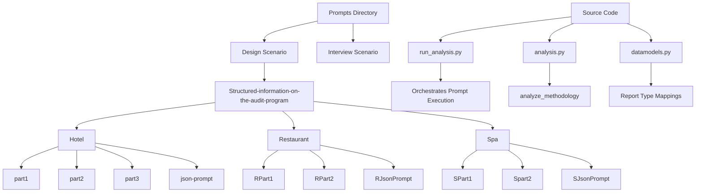
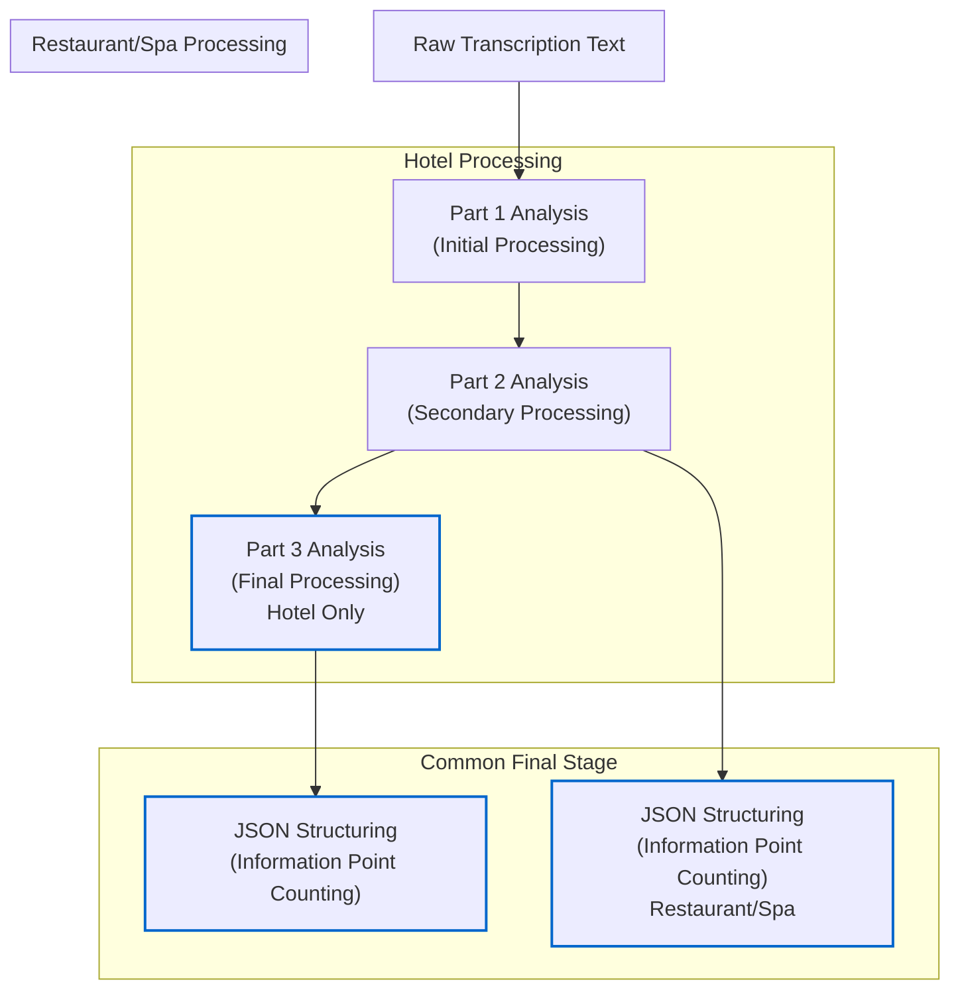
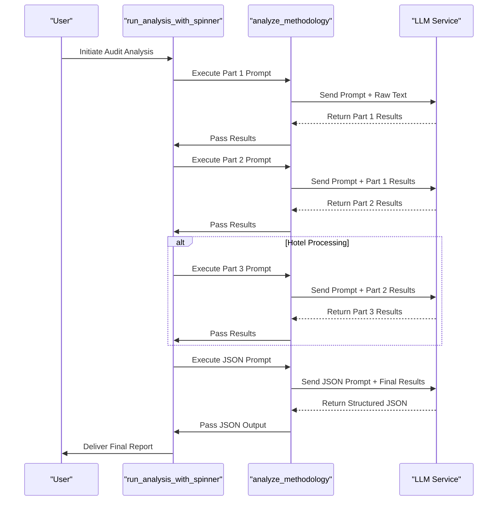
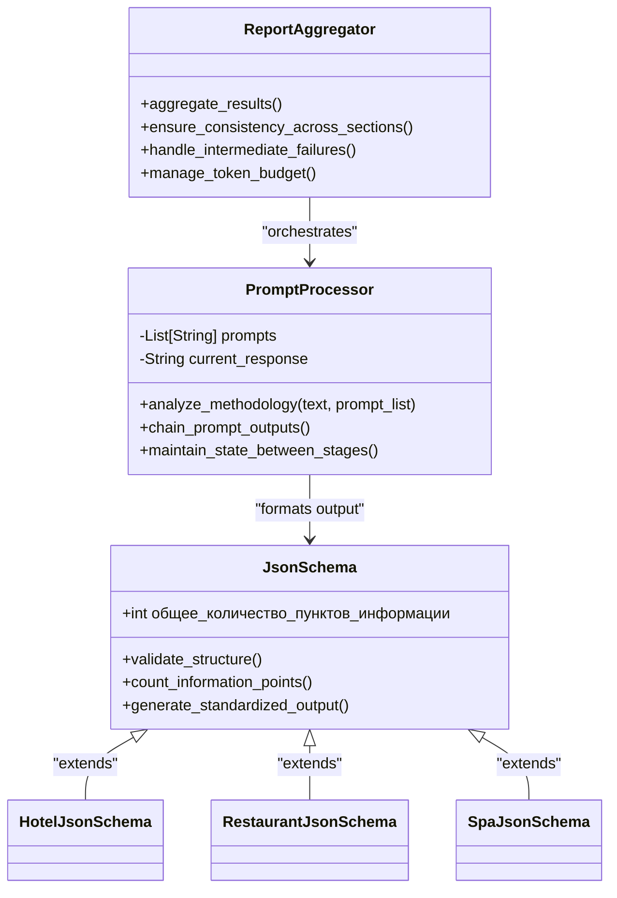
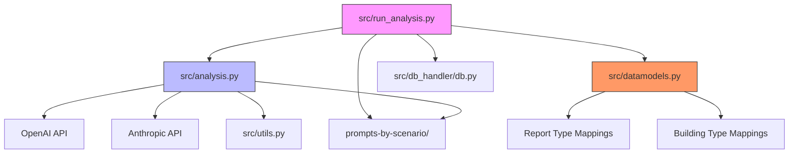

# Design Scenario: Structured Audit Reporting

<cite>
**Referenced Files in This Document**   
- [run_analysis.py](file://src/run_analysis.py)
- [analysis.py](file://src/analysis.py)
- [datamodels.py](file://src/datamodels.py)
- [Дизайн. Структ отчет отель. Подсчет пунктов информации. json.txt](file://prompts-by-scenario/design/Structured-information-on-the-audit-program/hotel/json-prompt/Дизайн. Структ отчет отель. Подсчет пунктов информации. json.txt)
- [аудит отель структ 1.txt](file://prompts-by-scenario/design/Structured-information-on-the-audit-program/hotel/part1/аудит отель структ 1.txt)
- [аудит отель структ ч2.txt](file://prompts-by-scenario/design/Structured-information-on-the-audit-program/hotel/part2/аудит отель структ ч2.txt)
- [аудит отель структ all.txt](file://prompts-by-scenario/design/Structured-information-on-the-audit-program/hotel/part3/аудит отель структ all.txt)
</cite>

## Table of Contents
1. [Introduction](#introduction)
2. [Project Structure](#project-structure)
3. [Core Components](#core-components)
4. [Architecture Overview](#architecture-overview)
5. [Detailed Component Analysis](#detailed-component-analysis)
6. [Dependency Analysis](#dependency-analysis)
7. [Performance Considerations](#performance-considerations)
8. [Troubleshooting Guide](#troubleshooting-guide)
9. [Conclusion](#conclusion)

## Introduction
The Structured Audit Reporting feature enables comprehensive, multi-stage analysis of audit data for hotels, restaurants, and spas. This system leverages a chained prompt pipeline to generate itemized reports with precise information point counting. The architecture supports different processing structures: a three-part sequence for hotels and a two-part flow for restaurants and spas. Each stage processes raw transcription data into increasingly refined outputs, culminating in structured JSON reports suitable for downstream processing and RAG indexing. The orchestration is managed by `run_analysis.py`, which coordinates prompt execution, state management, and result aggregation while handling errors and maintaining consistency across report sections.

## Project Structure
The project organizes its components into distinct directories: `prompts` for base templates, `prompts-by-scenario` for scenario-specific prompt variations, and `src` for core application logic. The structured audit reporting functionality resides primarily in the `design/Structured-information-on-the-audit-program` subdirectory, with separate configurations for hotel, restaurant, and spa audits. Each building type has its own prompt sequence, with hotels using three sequential parts and restaurants/spas using two. The JSON schema prompts are stored in dedicated `json-prompt` subdirectories to standardize output formatting.

**Diagram sources**
- [prompts-by-scenario/design/Structured-information-on-the-audit-program](file://prompts-by-scenario/design/Structured-information-on-the-audit-program)
- [src/run_analysis.py](file://src/run_analysis.py)

**Section sources**
- [prompts-by-scenario/design/Structured-information-on-the-audit-program](file://prompts-by-scenario/design/Structured-information-on-the-audit-program)
- [src/run_analysis.py](file://src/run_analysis.py)

## Core Components
The Structured Audit Reporting system consists of several key components that work together to transform raw transcription data into structured reports. The core functionality is implemented in `run_analysis.py`, which orchestrates the multi-stage analysis pipeline. The `analyze_methodology` function in `analysis.py` handles the sequential execution of prompts, chaining outputs from one stage to the next. The system uses a sophisticated state management approach to maintain context between prompt stages, ensuring consistency across the final report. The JSON schema defined in the json-prompt files enables standardized output formatting for downstream processing and RAG indexing.

**Section sources**
- [src/run_analysis.py](file://src/run_analysis.py#L1-L343)
- [src/analysis.py](file://src/analysis.py#L1-L490)
- [src/datamodels.py](file://src/datamodels.py#L1-L71)

## Architecture Overview
The Structured Audit Reporting architecture follows a multi-stage processing pipeline where each stage refines the output of the previous one. For hotels, the process involves three distinct prompt stages followed by a JSON formatting step. Restaurants and spas follow a similar but shorter two-stage process. The system uses a chaining mechanism where the output of one prompt becomes the input to the next, allowing for progressive refinement of the audit report. The final stage applies a JSON schema to structure the output for consistent downstream consumption.

**Diagram sources**
- [src/run_analysis.py](file://src/run_analysis.py#L200-L300)
- [analysis.py](file://src/analysis.py#L1-L50)

## Detailed Component Analysis

### Structured Audit Pipeline
The structured audit reporting system implements a multi-part prompt chain that progressively transforms raw transcription data into comprehensive audit reports. For hotels, the process follows a three-part structure where each stage builds upon the previous output. Restaurants and spas use a two-part structure, reflecting differences in audit complexity and scope. The system maintains state between stages by passing the output of one prompt as input to the next, creating a coherent narrative throughout the report.

#### For Pipeline Components:

**Diagram sources**
- [src/run_analysis.py](file://src/run_analysis.py#L200-L300)
- [src/analysis.py](file://src/analysis.py#L1-L50)

### JSON Schema and Structured Output
The system employs a standardized JSON schema to ensure consistent output formatting across all audit reports. This schema defines the structure for the final report, including the count of information points. The JSON formatting stage is critical for enabling downstream processing and RAG indexing, as it transforms free-form text into structured data that can be easily queried and analyzed. The schema is implemented in prompt files located in the `json-prompt` subdirectories for each building type.

#### For Structured Output Components:

**Diagram sources**
- [Дизайн. Структ отчет отель. Подсчет пунктов информации. json.txt](file://prompts-by-scenario/design/Structured-information-on-the-audit-program/hotel/json-prompt/Дизайн. Структ отчет отель. Подсчет пунктов информации. json.txt)
- [src/analysis.py](file://src/analysis.py#L1-L50)

**Section sources**
- [Дизайн. Структ отчет отель. Подсчет пунктов информации. json.txt](file://prompts-by-scenario/design/Structured-information-on-the-audit-program/hotel/json-prompt/Дизайн. Структ отчет отель. Подсчет пунктов информации. json.txt)
- [src/analysis.py](file://src/analysis.py#L1-L50)

## Dependency Analysis
The Structured Audit Reporting feature depends on several core modules that work together to process audit data. The `run_analysis.py` module orchestrates the entire process, calling functions from `analysis.py` to execute prompts and manage state. The `datamodels.py` file provides essential mappings that translate between internal codes and human-readable report types. The prompt files in the `prompts-by-scenario` directory contain the actual instructions sent to the LLM, organized by scenario, report type, and building category.

**Diagram sources**
- [src/run_analysis.py](file://src/run_analysis.py#L1-L343)
- [src/analysis.py](file://src/analysis.py#L1-L490)
- [src/datamodels.py](file://src/datamodels.py#L1-L71)

**Section sources**
- [src/run_analysis.py](file://src/run_analysis.py#L1-L343)
- [src/analysis.py](file://src/analysis.py#L1-L490)
- [src/datamodels.py](file://src/datamodels.py#L1-L71)

## Performance Considerations
The multi-stage LLM call architecture presents several performance considerations, particularly regarding token budget management and processing latency. Each prompt stage consumes tokens from the model's context window, requiring careful management to avoid exceeding limits. The system implements rate limiting and retry logic to handle API rate limits gracefully. For large transcriptions, the system may need to process content in chunks, which adds complexity to maintaining coherence across the final report. The asynchronous processing capabilities in `extract_from_chunk_parallel_async` help mitigate some performance bottlenecks by distributing work across multiple API keys.

**Section sources**
- [src/analysis.py](file://src/analysis.py#L300-L400)
- [src/run_analysis.py](file://src/run_analysis.py#L100-L150)

## Troubleshooting Guide
When intermediate steps fail in the structured audit reporting pipeline, the system implements several error handling strategies. The `run_analysis_pass` function includes comprehensive exception handling for API errors, including rate limit retries with exponential backoff. If a prompt stage fails, the system logs the error and attempts to continue with subsequent stages when possible. To maintain consistency across report sections, the system validates the output format at each stage and applies default values when necessary. Token budget management is critical, and the system monitors token usage to prevent exceeding model limits.

**Section sources**
- [src/run_analysis.py](file://src/run_analysis.py#L50-L100)
- [src/analysis.py](file://src/analysis.py#L400-L450)

## Conclusion
The Structured Audit Reporting feature provides a robust framework for generating comprehensive, itemized audit reports for hotels, restaurants, and spas. By implementing a multi-stage prompt pipeline with specialized processing flows for different building types, the system delivers detailed analysis while maintaining consistency and structure. The integration of JSON schema formatting enables downstream processing and RAG indexing, making the reports valuable for both human review and automated analysis. The architecture balances complexity with reliability through careful state management, error handling, and performance optimization.