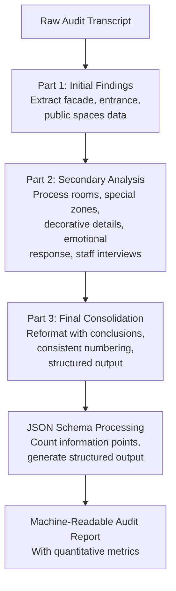
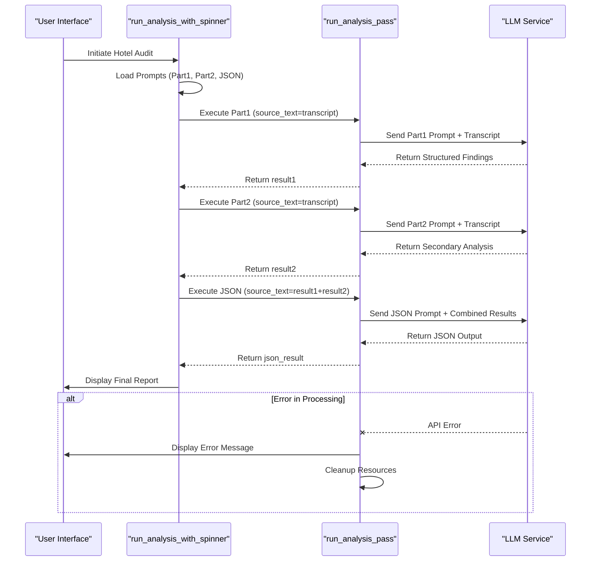
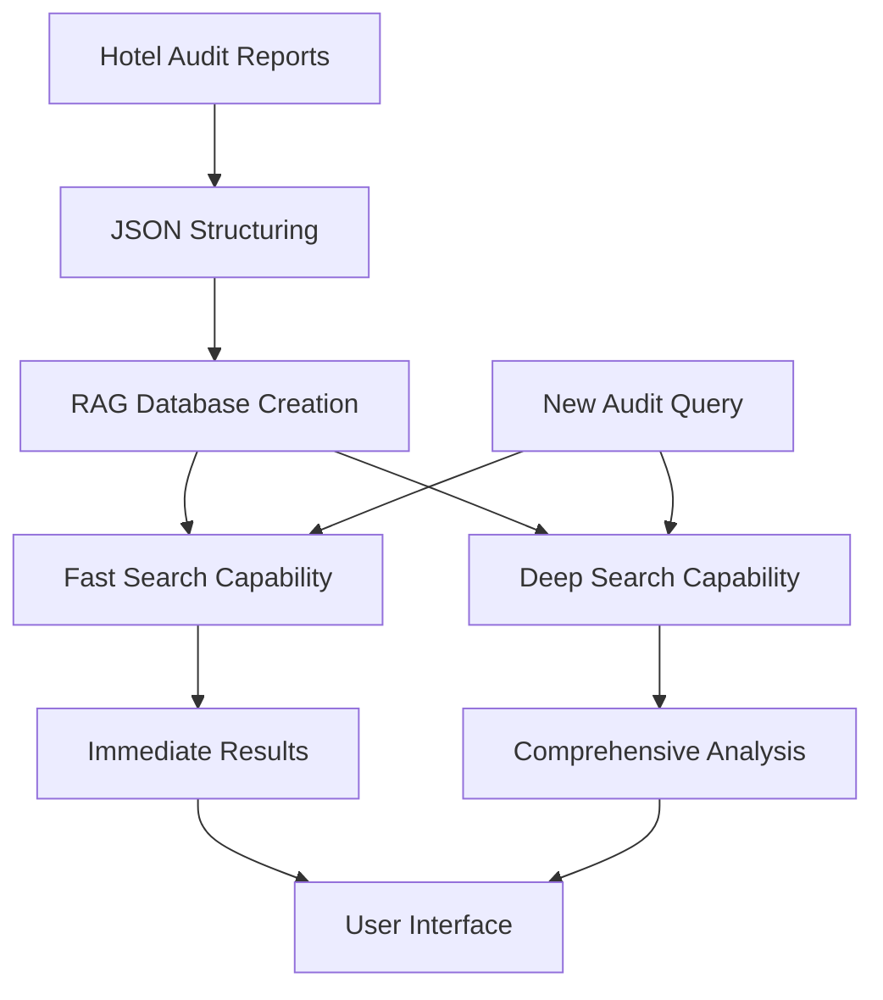

# Hotel: Structured Audit Reporting

<cite>
**Referenced Files in This Document**   
- [run_analysis.py](file://src/run_analysis.py)
- [Дизайн. Структ отчет отель. Подсчет пунктов информации. json.txt](file://prompts-by-scenario/design/Structured-information-on-the-audit-program/hotel/json-prompt/Дизайн. Структ отчет отель. Подсчет пунктов информации. json.txt)
- [аудит отель структ 1.txt](file://prompts-by-scenario/design/Structured-information-on-the-audit-program/hotel/part1/аудит отель структ 1.txt)
- [аудит отель структ ч2.txt](file://prompts-by-scenario/design/Structured-information-on-the-audit-program/hotel/part2/аудит отель структ ч2.txt)
- [аудит отель структ all.txt](file://prompts-by-scenario/design/Structured-information-on-the-audit-program/hotel/part3/аудит отель структ all.txt)
</cite>

## Table of Contents
1. [Introduction](#introduction)
2. [Three-Part Prompt Sequence for Hotel Audit Reporting](#three-part-prompt-sequence-for-hotel-audit-reporting)
3. [JSON Schema for Structured Output](#json-schema-for-structured-output)
4. [State Management and Error Handling in run_analysis.py](#state-management-and-error-handling-in-run_analysispy)
5. [Token Usage Optimization Strategies](#token-usage-optimization-strategies)
6. [RAG Indexing and Search Capabilities](#rag-indexing-and-search-capabilities)
7. [Practical Usage Scenarios and Troubleshooting](#practical-usage-scenarios-and-troubleshooting)

## Introduction
The Hotel Structured Audit Reporting system implements a multi-stage LLM processing pipeline to generate comprehensive, machine-readable audit reports for hotel design assessments. The architecture leverages a three-part prompt sequence to systematically extract, analyze, and consolidate audit information, ensuring structured output that supports downstream retrieval-augmented generation (RAG) indexing and fast search capabilities. This documentation details the implementation of this system, focusing on the prompt sequencing strategy, JSON schema enforcement, state management, and error handling mechanisms.

## Three-Part Prompt Sequence for Hotel Audit Reporting

The structured audit reporting system employs a three-stage processing pipeline for hotel audits, implemented through a sequence of specialized prompts stored in the `prompts-by-scenario` directory. Each stage focuses on a specific aspect of the audit analysis, enabling comprehensive coverage while maintaining processing efficiency.

### Part 1: Initial Findings Extraction
The first stage, defined in `аудит отель структ 1.txt`, focuses on extracting and organizing initial observations from the audit transcript. This prompt instructs the LLM to act as a professional interior design expert specializing in hotel audits, tasked with reorganizing audit information according to a structured methodology. The prompt specifically targets visual inspection data from the facade and entrance zone, as well as public spaces including the lobby/reception, corridors, elevator halls, and restaurant/bar areas. The system extracts all observations related to exterior appearance, entry points, navigation elements, street furniture, lighting, material quality, signage visibility, landscape design, stylistic solutions, ergonomic comfort, registration desk design, furniture comfort, and welcoming materials.

### Part 2: Secondary Analysis and Specialized Zones
The second stage, defined in `аудит отель структ ч2.txt`, extends the analysis to specialized areas and additional information sources. This prompt directs the LLM to process information about guest rooms, special zones (SPA, fitness, conference rooms), decorative details, brand elements, and emotional responses. It also incorporates supplementary data from staff interviews, guest reviews analysis, and documentation review. The prompt specifically structures information about room alignment with marketing materials, layout and furniture arrangement, workspace convenience, storage, lighting, acoustic comfort, color schemes, engineering equipment, bathroom observations, and storage spaces. For special zones, it organizes data on equipment quality, style consistency, and specialized furniture.

### Part 3: Final Consolidation and Output Structuring
The third stage, defined in `аудит отель структ all.txt`, performs the final consolidation and formatting of the audit report. This prompt instructs the LLM to preserve the original structure of audit sections while reformulating information in more accessible language and generating specific conclusions for each section. It enforces consistent numbering of main information points and requires the generation of conclusions after each section containing subsections. The final output must maintain the original document structure without merging or removing sections, while presenting general conclusions grouped into four main blocks: external appearance and style, convenience and functionality, technical aspects, and orientation and identity.

**Section sources**
- [аудит отель структ 1.txt](file://prompts-by-scenario/design/Structured-information-on-the-audit-program/hotel/part1/аудит отель структ 1.txt#L0-L40)
- [аудит отель структ ч2.txt](file://prompts-by-scenario/design/Structured-information-on-the-audit-program/hotel/part2/аудит отель структ ч2.txt#L0-L105)
- [аудит отель структ all.txt](file://prompts-by-scenario/design/Structured-information-on-the-audit-program/hotel/part3/аудит отель структ all.txt#L0-L45)

## JSON Schema for Structured Output

The system enforces structured, machine-readable output through a dedicated JSON schema defined in `Дизайн. Структ отчет отель. Подсчет пунктов информации. json.txt`. This schema serves as the final processing stage, transforming the consolidated audit text into a standardized JSON format that enables quantitative analysis and downstream processing.

The JSON schema defines a single key-value pair structure with the key `общее_количество_пунктов_информации` (total number of information points) mapping to a numeric value. The schema is accompanied by detailed counting instructions that define what constitutes an information point: numbered items, bulleted lists, paragraphs containing separate ideas, and individual observations or statements. The schema explicitly excludes section headers, repeated information, and explanatory text without specific observations from the count.

This structured output mechanism ensures that the final audit report contains a quantifiable metric of information density, which can be used for comparative analysis across different audits or tracking information completeness over time. The JSON format guarantees machine readability, enabling automated processing, aggregation, and integration with other systems.

**Diagram sources**
- [аудит отель структ 1.txt](file://prompts-by-scenario/design/Structured-information-on-the-audit-program/hotel/part1/аудит отель структ 1.txt#L0-L40)
- [аудит отель структ ч2.txt](file://prompts-by-scenario/design/Structured-information-on-the-audit-program/hotel/part2/аудит отель структ ч2.txt#L0-L105)
- [аудит отель структ all.txt](file://prompts-by-scenario/design/Structured-information-on-the-audit-program/hotel/part3/аудит отель структ all.txt#L0-L45)
- [Дизайн. Структ отчет отель. Подсчет пунктов информации. json.txt](file://prompts-by-scenario/design/Structured-information-on-the-audit-program/hotel/json-prompt/Дизайн. Структ отчет отель. Подсчет пунктов информации. json.txt#L0-L32)

## State Management and Error Handling in run_analysis.py

The `run_analysis.py` module implements the orchestration logic for the three-part prompt sequence, managing state across processing stages and handling errors during sequential LLM calls. The core function `run_analysis_with_spinner` coordinates the multi-stage processing pipeline, while `run_analysis_pass` handles individual processing stages with loading indicators and error recovery.

### State Maintenance Across Prompt Stages
The system maintains state through function parameters and return values, chaining outputs from one stage to the next. For the hotel audit sequence, the `run_analysis_with_spinner` function first separates prompts into ordinary prompts (for content extraction) and JSON prompts (for structured output generation). It then processes Part 1 and Part 2 sequentially using `run_analysis_pass`, storing the results in `result1` and `result2` variables. These results are concatenated and passed as input to the final JSON processing stage, effectively chaining the outputs together.

The state is preserved through the `source_text` parameter in `run_analysis_pass`, which receives the output from previous stages. This parameter flows through the processing pipeline, starting with the raw transcript for Part 1, then receiving the processed output from Part 1 for Part 2, and finally receiving the combined outputs from Parts 1 and 2 for the JSON processing stage. The `data` dictionary parameter also maintains contextual information such as the building type and scenario name across stages.

### Error Handling During Sequential Processing
The system implements comprehensive error handling at multiple levels. The `run_analysis_pass` function wraps the core analysis in a try-except block that catches specific exceptions like `OpenAIPermissionError` (indicating API key or regional access issues) and general exceptions. When an error occurs, the system logs the exception, updates the user interface with an appropriate error message, and ensures graceful degradation by setting the `audit_text` to an empty string.

The function also manages UI state through threading primitives, using a `threading.Event` to signal the loading animation thread to stop and joining the thread in the finally block to ensure cleanup. This prevents orphaned UI elements and ensures that the loading spinner is properly removed even if an error occurs. The system attempts to delete the status message in the finally block, with a bare except clause to prevent cleanup errors from propagating.

For the multi-stage hotel audit sequence, the system includes conditional logic to handle the specific requirements of this workflow. When processing "Общие факторы" (General Factors) in the Interview scenario, it explicitly prepares two reports (Part 1 and Part 2) before combining them for JSON processing. For other report types, it follows a simpler two-stage process with a single content extraction pass followed by JSON processing.

**Diagram sources**
- [run_analysis.py](file://src/run_analysis.py#L158-L218)
- [run_analysis.py](file://src/run_analysis.py#L248-L306)

**Section sources**
- [run_analysis.py](file://src/run_analysis.py#L158-L343)

## Token Usage Optimization Strategies

The system implements several strategies to optimize token usage across the multi-stage LLM processing pipeline, addressing the cost and latency implications of sequential LLM calls. These strategies focus on input minimization, processing efficiency, and architectural design to reduce overall token consumption.

The primary optimization strategy is the staged processing approach itself, which breaks down the complex audit analysis task into smaller, focused prompts. By separating the extraction of initial findings, secondary analysis, and final consolidation into distinct stages, the system can use more targeted prompts that require fewer tokens than a single comprehensive prompt would need. Each prompt focuses on a specific subset of the audit methodology, reducing the context length required for effective processing.

The system also optimizes token usage through selective output presentation. The `run_analysis_pass` function includes an `is_show_analysis` parameter that controls whether intermediate results are displayed to the user. For the first two stages of the hotel audit sequence, this parameter is set to `False`, preventing the system from sending potentially lengthy intermediate outputs to the user interface. Only the final JSON-structured output is displayed, minimizing token usage in the response phase.

Additionally, the system leverages asynchronous processing where possible, as evidenced by the `extract_from_chunk_parallel_async` function called within `run_deep_search`. This parallelization reduces the overall processing time and can indirectly optimize token usage by minimizing the duration of API connections and reducing the likelihood of timeouts or retries that would consume additional tokens.

The architecture also supports API key rotation through a list of seven ANTHROPIC_API_KEY variables, allowing the system to distribute requests across multiple keys. This not only provides redundancy but can also help manage rate limits and potentially access different pricing tiers or quotas, contributing to overall cost optimization.

## RAG Indexing and Search Capabilities

The structured audit reporting system is designed to support downstream retrieval-augmented generation (RAG) indexing and fast search capabilities, enabling efficient information retrieval from accumulated audit reports. The JSON-structured output format plays a crucial role in this capability, providing machine-readable data that can be easily indexed and queried.

The system implements RAG functionality through the `init_rags` function, which creates in-memory databases for different report types including "Интервью" (Interview), "Дизайн" (Design), and various subtypes like "Оценка методологии аудита" (Audit Methodology Assessment) and "Структурированный отчет аудита" (Structured Audit Report). These RAG databases are built using the `build_reports_grouped` function, which consolidates reports by scenario and report type, and the `grouped_reports_to_string` function, which converts the structured data into a format suitable for vector indexing.

The system supports two search modes: fast search and deep search. The `run_fast_search` function provides quick retrieval by querying the pre-built RAG database, while `run_deep_search` offers more comprehensive analysis by processing individual report chunks through the LLM. The deep search functionality splits content into chunks using a regular expression pattern, processes each chunk in parallel through the `extract_from_chunk_parallel_async` function, and aggregates the results using a dedicated aggregation prompt.

This architecture enables users to query the accumulated knowledge base of hotel audits, retrieving relevant information based on semantic similarity rather than just keyword matching. The structured JSON output from the audit process ensures that quantitative metrics like the total number of information points are preserved in the indexed data, allowing for both qualitative and quantitative analysis of audit findings across multiple properties and time periods.

**Diagram sources**
- [run_analysis.py](file://src/run_analysis.py#L1-L343)

## Practical Usage Scenarios and Troubleshooting

### Practical Usage Scenarios
The structured audit reporting system supports several practical usage scenarios for hotel management and quality assurance teams:

1. **Multi-Property Comparison**: By standardizing audit reports into a consistent JSON format, the system enables direct comparison of design quality and information completeness across multiple hotel properties. Managers can compare the "общее_количество_пунктов_информации" metric to assess which properties receive more thorough audits.

2. **Trend Analysis**: The system's RAG indexing capabilities allow for longitudinal analysis of audit findings, identifying recurring issues or improvement trends over time. Users can query the knowledge base for specific issues like "lighting problems" or "furniture comfort" across multiple audit reports.

3. **Quality Assurance**: The three-stage processing pipeline ensures comprehensive coverage of all audit methodology components, reducing the risk of important observations being overlooked. The structured output provides a verifiable record of audit completeness.

4. **Training and Onboarding**: The standardized report format serves as a training tool for new auditors, demonstrating the expected level of detail and structure for professional audit reports.

### Troubleshooting Tips for Incomplete or Inconsistent Outputs
When encountering incomplete or inconsistent outputs from the audit reporting system, consider the following troubleshooting steps:

1. **Verify Prompt Completeness**: Ensure that all three prompt files (Part 1, Part 2, and JSON) are present and correctly formatted in the `prompts-by-scenario` directory. Missing or corrupted prompt files can lead to incomplete processing.

2. **Check API Key Availability**: The system uses multiple ANTHROPIC_API_KEY variables for redundancy. If processing fails at any stage, verify that at least one API key is valid and has sufficient quota. The error message "LLM недоступна (ключ/регион)" specifically indicates API key or regional access issues.

3. **Validate Input Transcript Quality**: Poor quality audio transcripts with excessive noise, speaker overlap, or transcription errors can lead to incomplete audit findings. Ensure that the source transcript is clear and accurately represents the audit content.

4. **Monitor Token Limits**: Large audit transcripts may exceed token limits during processing. If the system fails during the JSON processing stage, consider whether the combined output from Parts 1 and 2 has exceeded the model's context window.

5. **Verify Database Connectivity**: The system relies on database functions like `fetch_prompts_for_scenario_reporttype_building` to retrieve prompts. Database connectivity issues can prevent prompt loading and disrupt the processing pipeline.

6. **Check File Encoding**: The prompt files contain Cyrillic characters. Ensure that file encoding is preserved correctly when transferring or editing these files, as encoding issues can corrupt the prompt content.

7. **Review Processing Logs**: The system generates detailed logging output that can help diagnose issues. Look for messages like "Отчет сформирован" (Report formed) and "Проведён количественный анализ" (Quantitative analysis conducted) to verify that all processing stages completed successfully.

**Section sources**
- [run_analysis.py](file://src/run_analysis.py#L1-L343)
- [Дизайн. Структ отчет отель. Подсчет пунктов информации. json.txt](file://prompts-by-scenario/design/Structured-information-on-the-audit-program/hotel/json-prompt/Дизайн. Структ отчет отель. Подсчет пунктов информации. json.txt#L0-L32)