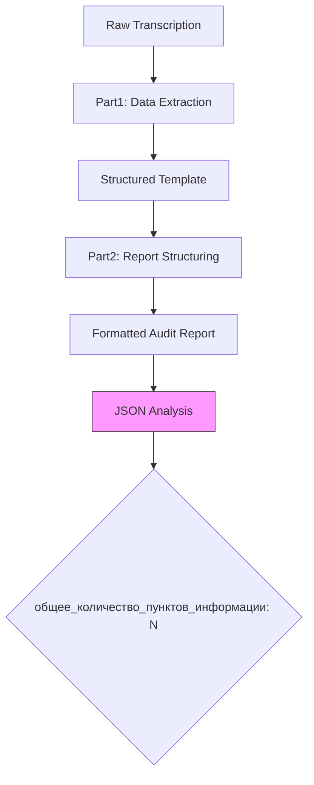
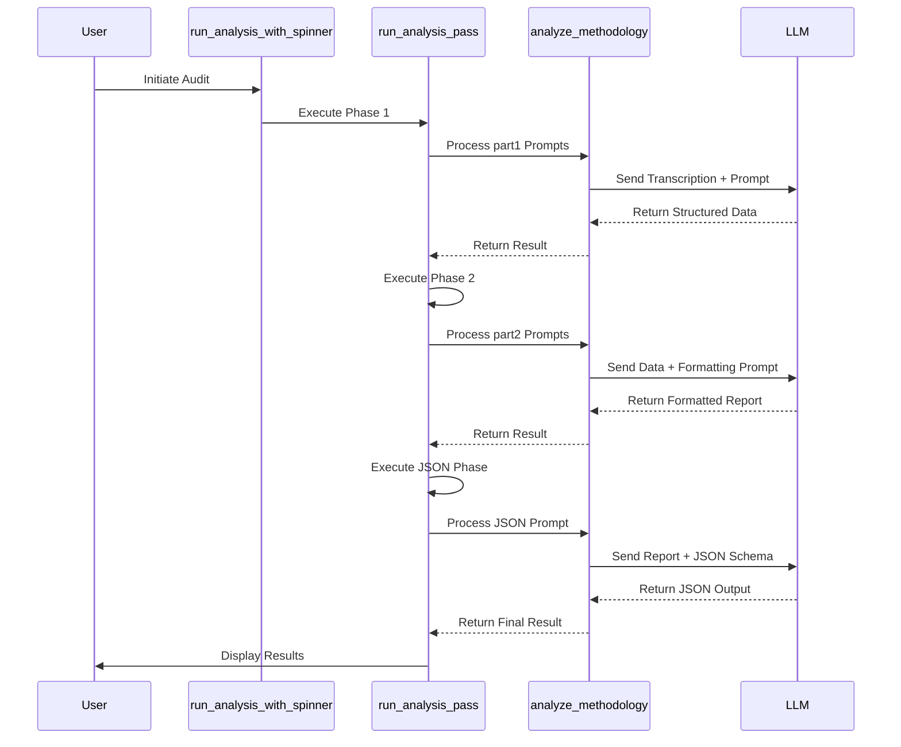
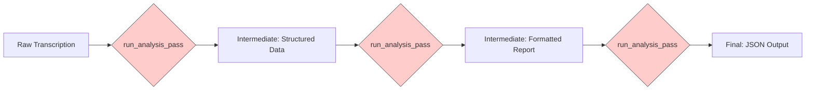

# Restaurant: Structured Audit Reporting

<cite>
**Referenced Files in This Document**   
- [run_analysis.py](file://src/run_analysis.py)
- [analysis.py](file://src/analysis.py)
- [Дизайн. Структ отчет ресторан. Подсчет пунктов информации. json.txt](file://prompts-by-scenario/design/Structured-information-on-the-audit-program/restaurant/json-prompt/Дизайн. Структ отчет ресторан. Подсчет пунктов информации. json.txt)
- [промпт дизайн ресторанов ч1.txt](file://prompts-by-scenario/design/Structured-information-on-the-audit-program/restaurant/part1/промпт дизайн ресторанов ч1.txt)
- [промпт дизайн ресторана ч2.txt](file://prompts-by-scenario/design/Structured-information-on-the-audit-program/restaurant/part2/промпт дизайн ресторана ч2.txt)
</cite>

## Table of Contents
1. [Introduction](#introduction)
2. [Two-Part Prompt Structure for Restaurant Audits](#two-part-prompt-structure-for-restaurant-audits)
3. [JSON Schema Standardization](#json-schema-standardization)
4. [Execution Orchestration via run_analysis.py](#execution-orchestration-via-run_analysispy)
5. [Data Transformation Workflow](#data-transformation-workflow)
6. [Modular Prompt Design and Versioning](#modular-prompt-design-and-versioning)
7. [Performance Considerations](#performance-considerations)
8. [Output Validation and Failure Handling](#output-validation-and-failure-handling)
9. [Conclusion](#conclusion)

## Introduction
The Restaurant Structured Audit Reporting system is designed to transform raw interview transcriptions into standardized, structured JSON reports through a multi-stage LLM orchestration pipeline. This document details the architecture, workflow, and implementation of the audit reporting process, focusing on the two-phase prompt structure, JSON schema enforcement, execution orchestration, and error resilience mechanisms.

**Section sources**
- [run_analysis.py](file://src/run_analysis.py#L1-L344)
- [analysis.py](file://src/analysis.py#L1-L491)

## Two-Part Prompt Structure for Restaurant Audits

The restaurant audit process employs a two-phase prompt structure to ensure comprehensive and structured analysis. The first phase (part1) focuses on extracting and populating audit template data from raw transcription input, while the second phase (part2) transforms this structured data into a coherent, professionally formatted report.

In **part1**, the system uses the prompt from `промпт дизайн ресторанов ч1.txt` to analyze the transcription and populate a structured audit template. The prompt instructs the LLM to act as an interior design analyst with over 30 years of experience, requiring complete data extraction with explicit "no data" entries when information is missing, and mandating direct citation from the source text.

The **part2** phase, governed by `промпт дизайн ресторана ч2.txt`, takes the populated template and restructures it into a professional audit report. This phase enforces strict formatting rules including logical numbering, neutral tone, and conclusion placement after each section with subpoints. The output maintains original section numbering or applies sequential numbering when absent, ensuring consistency across reports.

This two-stage approach enables separation of data extraction from report formatting, allowing independent optimization of each phase and reducing cognitive load on the LLM during complex transformations.

**Section sources**
- [промпт дизайн ресторанов ч1.txt](file://prompts-by-scenario/design/Structured-information-on-the-audit-program/restaurant/part1/промпт дизайн ресторанов ч1.txt#L0-L4)
- [промпт дизайн ресторана ч2.txt](file://prompts-by-scenario/design/Structured-information-on-the-audit-program/restaurant/part2/промпт дизайн ресторана ч2.txt#L0-L19)

## JSON Schema Standardization

The system utilizes a standardized JSON schema defined in `Дизайн. Структ отчет ресторан. Подсчет пунктов информации. json.txt` to ensure consistent output formatting and enable downstream processing. This schema serves as a quantitative analysis tool that counts information points in audit reports, providing a measurable quality metric.

The JSON schema defines a single output field:
```json
{
  "общее_количество_пунктов_информации": <number>
}
```

The schema implementation follows strict counting rules:
- Each numbered or bulleted item counts as one information point
- Each paragraph containing a distinct idea counts as one point
- Section headers, repeated information, and explanatory text without observations are excluded
- All information points are counted equally regardless of length

This standardization enables automated quality assessment by measuring the comprehensiveness of audit reports. The consistent JSON output format facilitates integration with analytics systems, dashboards, and quality assurance workflows, ensuring that all restaurant audit reports can be processed uniformly regardless of their source or specific content.



**Diagram sources**
- [Дизайн. Структ отчет ресторан. Подсчет пунктов информации. json.txt](file://prompts-by-scenario/design/Structured-information-on-the-audit-program/restaurant/json-prompt/Дизайн. Структ отчет ресторан. Подсчет пунктов информации. json.txt#L0-L32)

**Section sources**
- [Дизайн. Структ отчет ресторан. Подсчет пунктов информации. json.txt](file://prompts-by-scenario/design/Structured-information-on-the-audit-program/restaurant/json-prompt/Дизайн. Структ отчет ресторан. Подсчет пунктов информации. json.txt#L0-L32)

## Execution Orchestration via run_analysis.py

The `run_analysis.py` module serves as the central orchestration engine for the restaurant audit reporting pipeline. It manages the execution flow, intermediate results, and error handling across all stages of the audit process.

The core execution function `run_analysis_with_spinner` coordinates the multi-phase analysis by:
1. Determining the scenario type (Design or Interview) from callback data
2. Fetching appropriate prompts from the database based on scenario, report type, and building type
3. Separating JSON and non-JSON prompts for sequential processing
4. Managing the two-phase execution for restaurant audits

For restaurant audits, the system implements a three-stage execution pattern:
1. **First pass**: Processes part1 prompts to extract structured data from raw transcription
2. **Second pass**: Processes part2 prompts to format the structured data into a professional report
3. **Final pass**: Applies JSON schema prompts to generate standardized quantitative analysis

The `run_analysis_pass` function encapsulates each execution phase, providing loading animations, error handling, and automatic result saving to the database. It uses threading to display real-time progress indicators while the LLM processing occurs in the background.

Error handling is comprehensive, catching specific exceptions like `OpenAIPermissionError` for API key issues and general exceptions for other failures, ensuring graceful degradation and user feedback when problems occur.



**Diagram sources**
- [run_analysis.py](file://src/run_analysis.py#L163-L208)
- [analysis.py](file://src/analysis.py#L21-L63)

**Section sources**
- [run_analysis.py](file://src/run_analysis.py#L163-L344)

## Data Transformation Workflow

The data transformation pipeline converts raw transcription text into structured JSON output through a series of orchestrated LLM calls. This workflow follows a progressive refinement approach, where each stage builds upon the output of the previous one.

The transformation begins with raw transcription text being processed by the first prompt in the sequence. The `analyze_methodology` function in `analysis.py` handles this sequential processing, where the output of each prompt becomes the input for the next. This chaining mechanism enables complex multi-step transformations while maintaining context between stages.

For restaurant audits, the workflow follows this specific sequence:
1. **Raw transcription** → **Structured template data** (via part1 prompt)
2. **Structured template** → **Formatted audit report** (via part2 prompt)
3. **Formatted report** → **Quantitative JSON analysis** (via JSON schema prompt)

The system preserves intermediate results throughout this process, allowing for debugging, quality assurance, and selective reprocessing when needed. Each intermediate output is saved to the database via `save_user_input_to_db`, creating a complete audit trail of the transformation process.

The transformation is designed to be idempotent, meaning that the same input will consistently produce the same output, which is critical for quality assurance and version control in audit reporting.



**Diagram sources**
- [run_analysis.py](file://src/run_analysis.py#L163-L208)
- [analysis.py](file://src/analysis.py#L21-L63)

**Section sources**
- [run_analysis.py](file://src/run_analysis.py#L163-L208)
- [analysis.py](file://src/analysis.py#L21-L63)

## Modular Prompt Design and Versioning

The system employs a modular prompt architecture that enables easy updates and versioning of audit methodologies. Prompts are organized in a hierarchical directory structure by scenario, report type, and building type, allowing for targeted modifications without affecting unrelated components.

Each prompt is stored as a separate text file, enabling version control through standard Git workflows. The system can maintain multiple versions of prompts for different restaurant types or audit methodologies by simply adding new prompt files to the appropriate directory.

The database-driven prompt retrieval system (`fetch_prompts_for_scenario_reporttype_building`) allows dynamic selection of prompts based on runtime parameters. This decouples the prompt content from the application logic, enabling prompt updates without code changes or system restarts.

The two-part structure (part1, part2) further enhances modularity by separating concerns:
- **part1 prompts** focus on data extraction and template population
- **part2 prompts** handle report formatting and professional presentation
- **json-prompt** files manage standardized output generation

This modular design allows teams to update specific aspects of the audit process independently. For example, the formatting guidelines can be revised in part2 prompts without affecting the data extraction logic in part1, or the JSON schema can be modified to track additional metrics without changing the core audit methodology.

The system also supports A/B testing of different prompt versions by routing specific audits to alternative prompt sets, enabling data-driven optimization of audit quality.

**Section sources**
- [run_analysis.py](file://src/run_analysis.py#L208-L344)
- [prompts-by-scenario/design/](file://prompts-by-scenario/design/)

## Performance Considerations

The restaurant audit reporting system incorporates several performance optimizations to manage token budget allocation and latency implications of sequential LLM calls.

The system implements a token-aware architecture that considers the cumulative token usage across all stages of the audit process. Each LLM call consumes tokens for both input (prompt + context) and output (response), with the multi-stage process requiring careful budgeting to avoid hitting model limits.

Token allocation is optimized through:
- **Progressive context refinement**: Each stage processes a more focused subset of information, reducing input token requirements in later stages
- **Asynchronous processing**: The system uses `aiohttp` and threading to manage LLM calls efficiently, preventing blocking operations
- **Rate limit management**: The `extract_from_chunk_parallel_async` function implements sophisticated rate limiting that respects both tokens-per-minute and requests-per-minute constraints across multiple API keys

Latency is managed through:
- **Loading animations**: Visual feedback during processing maintains user engagement
- **Parallel processing**: Where possible, independent operations are executed concurrently
- **Caching mechanisms**: The RAG (Retrieval-Augmented Generation) system caches frequently accessed data to reduce redundant LLM calls

The system also implements backoff strategies for rate limiting, with exponential retry delays when encountering 429 (rate limit) responses. This ensures reliable operation even under heavy load or API throttling conditions.

**Section sources**
- [run_analysis.py](file://src/run_analysis.py#L1-L163)
- [analysis.py](file://src/analysis.py#L300-L490)

## Output Validation and Failure Handling

The system implements comprehensive validation and failure handling mechanisms to ensure output completeness and reliability throughout the audit reporting process.

Output validation occurs at multiple levels:
- **Structural validation**: The JSON schema enforces a standardized output format
- **Content validation**: Prompts include explicit instructions for handling missing data ("no data" entries)
- **Sequential validation**: Each stage verifies the successful completion of previous stages before proceeding

Failure handling is implemented through a multi-layered approach:
1. **Try-catch blocks**: Each LLM call is wrapped in exception handling to catch API errors, rate limits, and processing failures
2. **Graceful degradation**: When non-critical errors occur, the system attempts to continue processing with partial results
3. **User feedback**: Clear error messages are displayed to users, explaining the nature of failures and suggesting next steps
4. **Logging**: Comprehensive logging captures detailed information about each processing stage, enabling debugging and quality assurance

The system specifically handles:
- **API permission errors**: Detected and reported with guidance for resolution
- **Rate limiting**: Managed through exponential backoff and retry mechanisms
- **Empty results**: Handled by returning appropriate fallback messages
- **Partial failures**: Addressed by saving available results and reporting the specific stage where failure occurred

The `run_analysis_pass` function exemplifies this approach, using try-except-finally blocks to ensure that loading indicators are properly cleaned up regardless of success or failure, and that intermediate results are preserved for troubleshooting.

**Section sources**
- [run_analysis.py](file://src/run_analysis.py#L163-L208)
- [analysis.py](file://src/analysis.py#L400-L490)

## Conclusion
The Restaurant Structured Audit Reporting system provides a robust framework for transforming raw interview data into standardized, high-quality audit reports. Through its two-phase prompt structure, JSON schema standardization, and sophisticated orchestration in `run_analysis.py`, the system ensures consistent, reliable, and measurable audit outputs. The modular design enables easy updates and versioning, while comprehensive performance optimizations and failure handling mechanisms ensure reliability in production environments. This architecture represents a scalable solution for structured reporting that can be extended to other domains beyond restaurant audits.