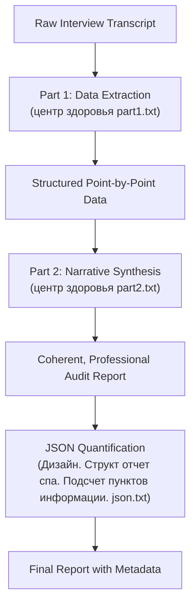
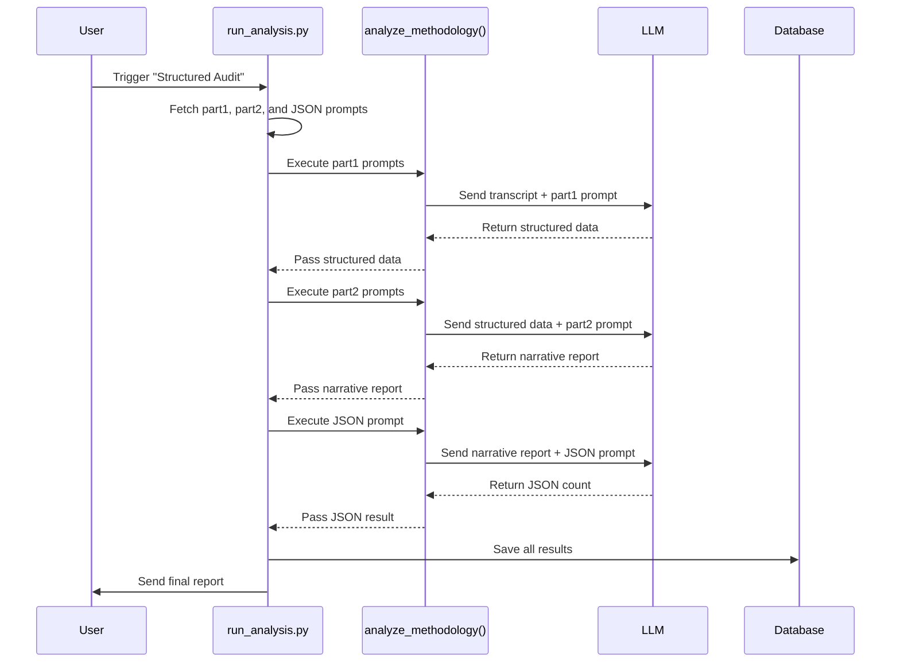

# Spa/Health Center: Structured Audit Reporting

<cite>
**Referenced Files in This Document**   
- [run_analysis.py](file://src/run_analysis.py)
- [analysis.py](file://src/analysis.py)
- [Дизайн. Структ отчет спа. Подсчет пунктов информации. json.txt](file://prompts-by-scenario/design/Structured-information-on-the-audit-program/spa/json-prompt/Дизайн. Структ отчет спа. Подсчет пунктов информации. json.txt)
- [центр здоровья part1.txt](file://prompts-by-scenario/design/Structured-information-on-the-audit-program/spa/part1/центр здоровья part1.txt)
- [центр здоровья part2.txt](file://prompts-by-scenario/design/Structured-information-on-the-audit-program/spa/part2/центр здоровья part2.txt)
</cite>

## Table of Contents
1. [Introduction](#introduction)
2. [Two-Part Prompt Workflow for Spa Audits](#two-part-prompt-workflow-for-spa-audits)
3. [Structured JSON Output Schema](#structured-json-output-schema)
4. [run_analysis.py: Pipeline Coordination and State Management](#run_analysispy-pipeline-coordination-and-state-management)
5. [Error Resilience and State Persistence](#error-resilience-and-state-persistence)
6. [Coherence Across Multi-Step LLM Generation](#coherence-across-multi-step-llm-generation)
7. [Token Efficiency and Processing Cost Trade-offs](#token-efficiency-and-processing-cost-trade-offs)
8. [Output Integrity Validation and Troubleshooting](#output-integrity-validation-and-troubleshooting)
9. [Conclusion](#conclusion)

## Introduction
This document details the structured audit reporting system for spa and health centers within the VoxPersona platform. The system leverages a multi-stage LLM pipeline to transform raw interview transcripts into comprehensive, standardized audit reports. The process is designed to ensure data consistency, maintain context across stages, and produce reliable, analyzable outputs. The core of this system is a two-part prompt workflow that structures the analysis of service quality, facility standards, and compliance metrics, followed by a JSON-based quantification step.

## Two-Part Prompt Workflow for Spa Audits
The audit process for spas and health centers is divided into two distinct phases, implemented through separate prompt files. This workflow ensures a systematic and thorough analysis by separating data extraction from narrative synthesis.

The first phase, defined in `центр здоровья part1.txt`, acts as a data extraction engine. It instructs the LLM to act as an interior design analyst with over 30 years of experience. The model's task is to meticulously populate a predefined audit template with information from a provided interview transcript. The template is highly structured, covering six main sections: Preliminary Analysis, Exterior Audit, Interior Audit, Design Solutions Analysis, Atmosphere Evaluation, and Report Formation. Each section contains numerous sub-points. The prompt enforces strict rules: all information must be cited from the transcript, no data can be invented, and the original structure must be preserved exactly. If a data point is missing, the model must explicitly state "нет данных" (no data). This phase ensures completeness and fidelity to the source material.

The second phase, defined in `центр здоровья part2.txt`, functions as a narrative synthesis engine. It takes the structured, point-by-point output from the first phase and transforms it into a coherent, professional report. The model is instructed to reorganize the information according to the same template but to present it in a flowing, analytical narrative. Key requirements include renumbering all main points for clarity, formulating specific conclusions at the end of each section, and providing a final, consolidated summary that groups findings into thematic blocks such as "Concept, Style," "Design and Comfort," and "Recommendations." This two-step process decouples data gathering from interpretation, ensuring both rigor and readability.



**Diagram sources**
- [центр здоровья part1.txt](file://prompts-by-scenario/design/Structured-information-on-the-audit-program/spa/part1/центр здоровья part1.txt)
- [центр здоровья part2.txt](file://prompts-by-scenario/design/Structured-information-on-the-audit-program/spa/part2/центр здоровья part2.txt)

**Section sources**
- [центр здоровья part1.txt](file://prompts-by-scenario/design/Structured-information-on-the-audit-program/spa/part1/центр здоровья part1.txt)
- [центр здоровья part2.txt](file://prompts-by-scenario/design/Structured-information-on-the-audit-program/spa/part2/центр здоровья part2.txt)

## Structured JSON Output Schema
After the narrative report is generated, a final step ensures data consistency and enables quantitative analysis. This is achieved through a specialized JSON prompt, `Дизайн. Структ отчет спа. Подсчет пунктов информации. json.txt`, which instructs the LLM to count the total number of informational points in the report.

The prompt defines a "point of information" as any distinct, complete statement or observation. This includes numbered or bulleted list items, individual paragraphs with a single idea, and separate observations. Headers, repeated information, and explanatory text without specific observations are excluded. Each valid point is counted as one unit, regardless of length.

The output is strictly formatted as a JSON object with a single key:
```json
{
  "общее_количество_пунктов_информации": <number>
}
```
This schema is critical for data consistency. By enforcing a machine-readable format, it allows the system to programmatically extract the total information count. This metric serves as a quality control indicator, ensuring that reports meet a minimum threshold of detail. It also enables comparative analysis across different audits, providing a standardized measure of report depth that is independent of narrative style. This structured output is essential for data retrieval, aggregation, and long-term trend analysis within the platform's database.

**Section sources**
- [Дизайн. Структ отчет спа. Подсчет пунктов информации. json.txt](file://prompts-by-scenario/design/Structured-information-on-the-audit-program/spa/json-prompt/Дизайн. Структ отчет спа. Подсчет пунктов информации. json.txt)

## run_analysis.py: Pipeline Coordination and State Management
The `run_analysis.py` script is the central orchestrator of the audit pipeline, responsible for coordinating the execution of the two-part prompt workflow, maintaining context, and aggregating results.

The core function, `run_analysis_with_spinner`, manages the entire process. It begins by determining the scenario (e.g., "Design") and the specific report type (e.g., "Structured Audit") from the user's input. It then retrieves the relevant prompts from the database using `fetch_prompts_for_scenario_reporttype_building`. The prompts are separated into "ordinary" prompts (the main analysis prompts) and "JSON prompts" (the quantification prompt).

For the spa audit workflow, the script identifies that the "Structured Audit" report type requires multiple parts. It groups the ordinary prompts by their `run_part` value (1 or 2). It then executes `run_analysis_pass` twice: first with the `part1` prompts and then with the `part2` prompts. The output from the first pass (the structured data) is used as the input source text for the second pass (the narrative synthesis). This sequential execution, where the output of one LLM call becomes the input for the next, is how context is maintained across stages.

Finally, the script runs a third `run_analysis_pass` using the JSON prompt. The source text for this final pass is the concatenated result of the first two passes (i.e., the final narrative report). This produces the structured JSON output containing the information count. The script then saves all intermediate and final results to the database via `save_user_input_to_db`, ensuring state persistence.



**Diagram sources**
- [run_analysis.py](file://src/run_analysis.py)
- [analysis.py](file://src/analysis.py)

**Section sources**
- [run_analysis.py](file://src/run_analysis.py)

## Error Resilience and State Persistence
The system incorporates several mechanisms for error resilience and state persistence to ensure robust operation.

The `run_analysis_pass` function is wrapped in a comprehensive try-except block. It specifically catches `OpenAIPermissionError`, which likely indicates an API key or region issue, and provides a user-friendly error message. All other exceptions are caught generically, logged with full traceback via `logging.exception`, and a generic error message is sent to the user. This prevents the entire application from crashing due to a single failed analysis.

State persistence is achieved through a combination of in-memory state and database storage. The `processed_texts` dictionary in the calling context holds the initial transcript. More importantly, after each successful `run_analysis_pass`, the function calls `save_user_input_to_db`. This function stores the original transcript, the scenario, the data context, the label, and the generated `audit_text` directly into the PostgreSQL database. This means that even if a subsequent step fails, the results of previous steps are not lost and can be retrieved for debugging or reprocessing. The use of threading events (`threading.Event`) and loading animations also ensures a responsive user interface, even during long-running operations, and the final cleanup in the `finally` block ensures resources are released.

**Section sources**
- [run_analysis.py](file://src/run_analysis.py)

## Coherence Across Multi-Step LLM Generation
Ensuring coherence across multiple LLM calls is a fundamental challenge that this system addresses through its architectural design.

The primary mechanism is the sequential chaining of outputs. The output of the first LLM call (the structured data from `part1`) is the primary input for the second call (`part2`). This forces the second model to work within the constraints and context established by the first. The `part2` prompt further enforces coherence by instructing the model to "reorganize" the provided information, which inherently links the narrative to the source data.

The use of a single, consistent template throughout both phases is another key factor. Both prompts use the exact same hierarchical structure (e.g., "1.1 Изучение концепции и позиционирования"). This structural consistency acts as a scaffold, ensuring that the narrative report covers the same topics in the same order as the extracted data, preventing the introduction of new, unrelated sections.

Finally, the final JSON quantification step acts as a validation layer. By counting the informational points, it provides a quantitative measure of the report's completeness. A significant discrepancy between expected and actual counts could indicate a coherence failure, such as a missing section, and can be flagged for review.

**Section sources**
- [центр здоровья part1.txt](file://prompts-by-scenario/design/Structured-information-on-the-audit-program/spa/part1/центр здоровья part1.txt)
- [центр здоровья part2.txt](file://prompts-by-scenario/design/Structured-information-on-the-audit-program/spa/part2/центр здоровья part2.txt)

## Token Efficiency and Processing Cost Trade-offs
The system makes deliberate trade-offs between report depth and processing cost, primarily through its multi-stage design.

The two-part workflow is inherently more token-efficient than a single, monolithic prompt. A single prompt attempting to perform both data extraction and narrative synthesis would be extremely long and complex, consuming a large number of tokens for both input and output. By splitting the task, each prompt can be focused and concise, reducing the overall token count per stage.

However, this efficiency comes at the cost of multiple LLM API calls. Instead of one call, the system makes three (two for the narrative, one for JSON). This increases latency and cost. The system mitigates this by using a stateful approach; the output of one call is reused, avoiding redundant processing of the original transcript.

The `run_deep_search` function demonstrates another trade-off. It uses `extract_from_chunk_parallel_async` to process multiple text chunks in parallel, which is faster but consumes more tokens and API requests. This is reserved for "Deep Search" mode, while "Fast Search" uses a simpler, more token-efficient vector database lookup for quicker queries. This allows users to choose between speed/cost and comprehensiveness.

**Section sources**
- [run_analysis.py](file://src/run_analysis.py)
- [analysis.py](file://src/analysis.py)

## Output Integrity Validation and Troubleshooting
Ensuring the integrity of the generated output is critical. The system employs several validation and troubleshooting strategies.

The most robust validation is the structured JSON output. Because the final count is in a predictable, machine-readable format, it can be easily parsed and validated by the application. If the JSON is malformed or the expected key is missing, the system can immediately flag an error.

The prompt design itself is a form of validation. By requiring the model to state "нет данных" for missing information, it prevents the model from hallucinating facts. The strict instruction to preserve the original structure prevents the model from omitting critical sections.

For troubleshooting, comprehensive logging is used. The `run_analysis.py` script logs the start and completion of each step, the number of chunks processed, and any errors with full stack traces. This allows developers to trace the execution flow and identify where a failure occurred. The `save_user_input_to_db` function ensures that every input and output is stored, providing a complete audit trail for diagnosing issues with specific reports.

**Section sources**
- [run_analysis.py](file://src/run_analysis.py)
- [Дизайн. Структ отчет спа. Подсчет пунктов информации. json.txt](file://prompts-by-scenario/design/Structured-information-on-the-audit-program/spa/json-prompt/Дизайн. Структ отчет спа. Подсчет пунктов информации. json.txt)

## Conclusion
The Spa/Health Center Structured Audit Reporting system is a sophisticated pipeline that transforms unstructured interview data into standardized, high-quality reports. Its two-part prompt workflow ensures a rigorous separation between data extraction and narrative synthesis, while the final JSON quantification step provides a crucial metric for data consistency and retrieval. The `run_analysis.py` script expertly orchestrates this multi-stage process, maintaining context, ensuring state persistence, and handling errors gracefully. The system balances token efficiency with report depth through its modular design and offers robust mechanisms for validating output integrity and troubleshooting issues, making it a reliable tool for comprehensive spa and health center audits.