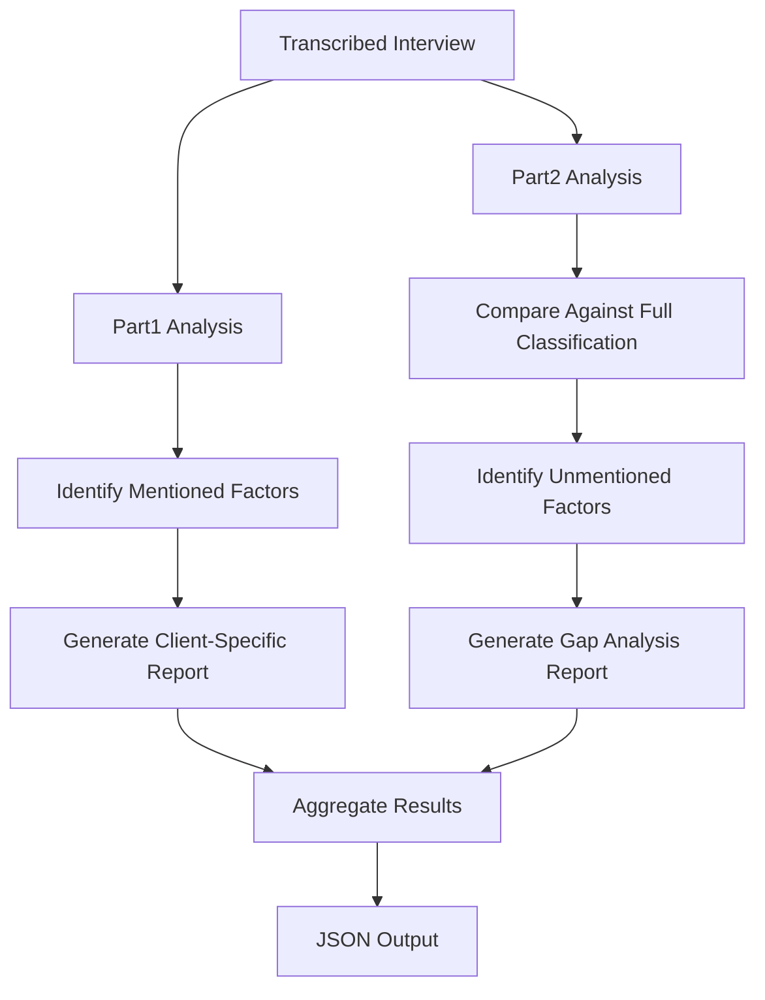
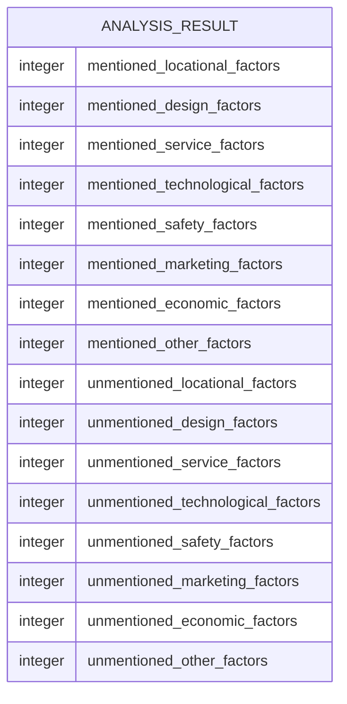
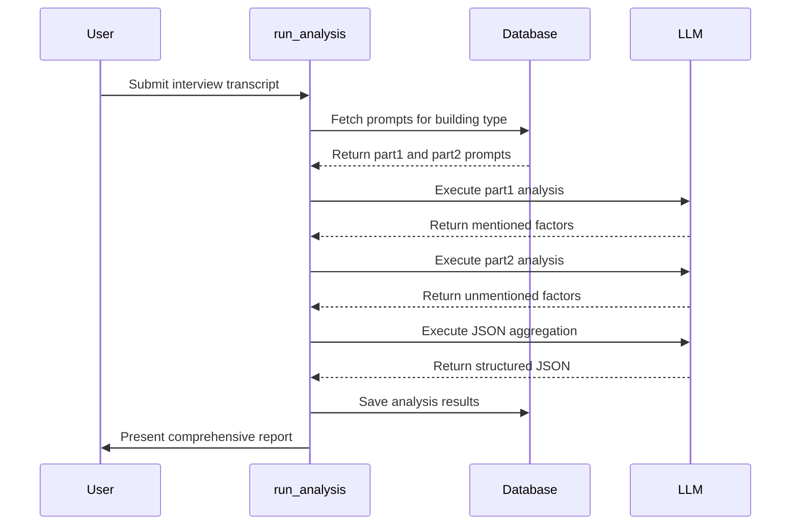

# Common Decision-Making Factors Analysis

<cite>
**Referenced Files in This Document**   
- [run_analysis.py](file://src/run_analysis.py)
- [datamodels.py](file://src/datamodels.py)
- [общ факторы отель 1.txt](file://prompts-by-scenario/interview/Information-about-common-decision-making-factors/hotel/part1/общ факторы отель 1.txt)
- [общ факторы неизуч факторы отель.txt](file://prompts-by-scenario/interview/Information-about-common-decision-making-factors/hotel/part2/общ факторы неизуч факторы отель.txt)
- [общ факторы ресторан 1.txt](file://prompts-by-scenario/interview/Information-about-common-decision-making-factors/restaurant/part1/общ факторы ресторан 1.txt)
- [общ факторы ресторан неизуч факторы.txt](file://prompts-by-scenario/interview/Information-about-common-decision-making-factors/restaurant/part2/общ факторы ресторан неизуч факторы.txt)
- [общ факторы спа 1.txt](file://prompts-by-scenario/interview/Information-about-common-decision-making-factors/spa/part1/общ факторы спа 1.txt)
- [общ факторы неизуч факторы спа.txt](file://prompts-by-scenario/interview/Information-about-common-decision-making-factors/spa/part2/общ факторы неизуч факторы спа.txt)
- [Интервью. Общие факторы отель. Json.txt](file://prompts-by-scenario/interview/Information-about-common-decision-making-factors/hotel/json-prompt/Интервью. Общие факторы отель. Json.txt)
- [Интервью. общие факторы. ресторан. Json.txt](file://prompts-by-scenario/interview/Information-about-common-decision-making-factors/restaurant/json-prompt/Интервью. общие факторы. ресторан. Json.txt)
- [Интервью. общие факторы Спа json.txt](file://prompts-by-scenario/interview/Information-about-common-decision-making-factors/spa/json-prompt/Интервью. общие факторы Спа json.txt)
</cite>

## Table of Contents
1. [Introduction](#introduction)
2. [Establishment-Specific Prompt Hierarchies](#establishment-specific-prompt-hierarchies)
3. [Two-Part Prompt Structure](#two-part-prompt-structure)
4. [JSON Schema Outputs](#json-schema-outputs)
5. [Interview Processing Workflow](#interview-processing-workflow)
6. [Integration with run_analysis.py](#integration-with-run_analysipy)
7. [Customization Strategies](#customization-strategies)
8. [Troubleshooting Guidance](#troubleshooting-guidance)
9. [Performance Optimization](#performance-optimization)

## Introduction
The Common Decision-Making Factors Analysis module systematically identifies industry-wide drivers influencing customer choices across hotels, restaurants, and spas. By leveraging establishment-specific prompt hierarchies, the system extracts standardized factors while preserving domain-specific nuances. The analysis follows a phased approach using a two-part prompt structure (part1 and part2) to separately analyze known and emergent factors. Results are structured in JSON schemas optimized for RAG indexing and cross-institutional comparison. Transcribed interviews are processed through this framework to surface trends such as service speed, ambiance, and pricing sensitivity. The module integrates with run_analysis.py for routing by building type and aggregating multi-part responses.

## Establishment-Specific Prompt Hierarchies
The system employs domain-specific prompt hierarchies tailored to hotels, restaurants, and spas, ensuring relevant factor extraction while maintaining standardization. Each establishment type has a unique classification framework that captures industry-specific decision drivers.

For hotels, the classification includes locational factors, design and architecture, service standards, technological features, safety, marketing communications, and economic considerations. Restaurant analysis focuses on location and exterior, first impressions, interior design, cuisine and beverages, service quality, additional services, hygiene, and economic factors. Spa centers utilize a comprehensive framework covering location, first impressions, interior design, functional zones, personnel, service programs, comfort, hygiene, marketing, and economic aspects.

These hierarchies are implemented through dedicated prompt files organized in the prompts-by-scenario/interview/Information-about-common-decision-making-factors/ directory structure, with separate configurations for each establishment type.

**Section sources**
- [общ факторы отель 1.txt](file://prompts-by-scenario/interview/Information-about-common-decision-making-factors/hotel/part1/общ факторы отель 1.txt)
- [общ факторы ресторан 1.txt](file://prompts-by-scenario/interview/Information-about-common-decision-making-factors/restaurant/part1/общ факторы ресторан 1.txt)
- [общ факторы спа 1.txt](file://prompts-by-scenario/interview/Information-about-common-decision-making-factors/spa/part1/общ факторы спа 1.txt)

## Two-Part Prompt Structure
The analysis employs a two-part prompt structure (part1 and part2) enabling phased examination of decision-making factors. This approach separates the identification of known factors from the discovery of emergent or unmentioned factors.

Part1 prompts initiate the primary analysis by extracting all factors explicitly mentioned in customer interviews. These prompts guide the LLM to identify and categorize factors according to the established classification framework, requiring direct citation from the interview transcript. For example, in hotel analysis, part1 identifies factors like "транспортная доступность" (transport accessibility) or "звукоизоляция" (sound insulation) with supporting client quotes.

Part2 prompts perform a gap analysis by comparing the factors identified in part1 against the complete classification framework. This phase specifically targets unmentioned factors, creating a comprehensive list of "неизученные факторы" (unstudied factors) that exist in the classification but were not referenced by the client. The output preserves the original classification structure, listing only factors absent from the interview.

This two-phase approach ensures both depth in analyzing expressed preferences and breadth in identifying potential blind spots in customer feedback.

**Diagram sources**
- [общ факторы отель 1.txt](file://prompts-by-scenario/interview/Information-about-common-decision-making-factors/hotel/part1/общ факторы отель 1.txt)
- [общ факторы неизуч факторы отель.txt](file://prompts-by-scenario/interview/Information-about-common-decision-making-factors/hotel/part2/общ факторы неизуч факторы отель.txt)

**Section sources**
- [общ факторы отель 1.txt](file://prompts-by-scenario/interview/Information-about-common-decision-making-factors/hotel/part1/общ факторы отель 1.txt)
- [общ факторы неизуч факторы отель.txt](file://prompts-by-scenario/interview/Information-about-common-decision-making-factors/hotel/part2/общ факторы неизуч факторы отель.txt)

## JSON Schema Outputs
The system generates structured JSON outputs that facilitate RAG indexing and cross-institutional comparison. These schemas standardize the representation of both mentioned and unmentioned factors across different establishment types.

For the primary analysis, the JSON schema includes counts of factors by category, providing quantitative insights into customer priorities. The schema contains fields such as "локационные_факторы" (locational_factors), "факторы_дизайна_и_архитектуры" (design_and_architecture_factors), "факторы_сервиса" (service_factors), and "экономические_факторы" (economic_factors), each containing integer values representing the count of mentioned factors in that category.

The comprehensive output schema includes both mentioned and unmentioned factors, enabling gap analysis. It features a nested structure with "упомянутые_факторы" (mentioned_factors) and "неупомянутые_факторы" (unmentioned_factors) objects, each containing the same category breakdown. This allows for direct comparison between expressed preferences and potential improvement areas.

These standardized outputs support trend analysis across multiple institutions, enabling identification of industry-wide patterns and establishment-specific differentiators.

**Diagram sources**
- [Интервью. Общие факторы отель. Json.txt](file://prompts-by-scenario/interview/Information-about-common-decision-making-factors/hotel/json-prompt/Интервью. Общие факторы отель. Json.txt)
- [Интервью. общие факторы. ресторан. Json.txt](file://prompts-by-scenario/interview/Information-about-common-decision-making-factors/restaurant/json-prompt/Интервью. общие факторы. ресторан. Json.txt)

**Section sources**
- [Интервью. Общие факторы отель. Json.txt](file://prompts-by-scenario/interview/Information-about-common-decision-making-factors/hotel/json-prompt/Интервью. Общие факторы отель. Json.txt)
- [Интервью. общие факторы. ресторан. Json.txt](file://prompts-by-scenario/interview/Information-about-common-decision-making-factors/restaurant/json-prompt/Интервью. общие факторы. ресторан. Json.txt)

## Interview Processing Workflow
The system processes transcribed interviews through a structured workflow that surfaces decision-making trends while preserving contextual nuances. When a transcribed interview is received, it is first routed based on the establishment type (hotel, restaurant, or spa) and then processed through the two-part prompt structure.

In the first phase, the system analyzes the transcript to identify all mentioned factors, organizing them according to the domain-specific classification. For example, when processing a hotel interview, factors like "транспортная доступность" (transport accessibility) or "качество уборки" (cleaning quality) are extracted with supporting client quotes. The output follows a standardized format with clear section headings for each factor category.

In the second phase, the system performs a gap analysis by comparing the identified factors against the complete classification framework. This reveals unmentioned factors that may represent potential improvement areas or unstated expectations. For instance, in restaurant analysis, if clients discuss menu variety but don't mention "система бронирования" (reservation system), this factor appears in the gap analysis.

The workflow ensures comprehensive coverage by requiring the output to maintain the original classification structure without omissions or abbreviations. Each factor must be explicitly listed or accounted for, ensuring the analysis is both thorough and transparent.

**Section sources**
- [общ факторы отель 1.txt](file://prompts-by-scenario/interview/Information-about-common-decision-making-factors/hotel/part1/общ факторы отель 1.txt)
- [общ факторы неизуч факторы отель.txt](file://prompts-by-scenario/interview/Information-about-common-decision-making-factors/hotel/part2/общ факторы неизуч факторы отель.txt)
- [общ факторы ресторан 1.txt](file://prompts-by-scenario/interview/Information-about-common-decision-making-factors/restaurant/part1/общ факторы ресторан 1.txt)
- [общ факторы ресторан неизуч факторы.txt](file://prompts-by-scenario/interview/Information-about-common-decision-making-factors/restaurant/part2/общ факторы ресторан неизуч факторы.txt)

## Integration with run_analysis.py
The Common Decision-Making Factors Analysis module integrates with run_analysis.py to enable routing by building type and aggregation of multi-part responses. This integration ensures that interviews are processed with the appropriate domain-specific prompts and that results are properly consolidated.

The run_analysis.py module determines the establishment type from user input and routes the analysis accordingly. It retrieves the relevant prompts based on the scenario (interview), report type (common decision-making factors), and building type (hotel, restaurant, or spa). The system uses mapping dictionaries defined in datamodels.py to translate between user-friendly building names and internal identifiers.

For the two-part analysis, run_analysis.py executes sequential processing passes. First, it processes part1 prompts to generate the initial factor analysis. Then, it processes part2 prompts to identify unmentioned factors. Finally, it aggregates both results and processes them through the JSON prompt to generate structured output.

The integration also handles error cases and provides loading indicators during processing. After completing the analysis, the system saves results to the database and presents users with follow-up options for additional reports.

**Diagram sources**
- [run_analysis.py](file://src/run_analysis.py)
- [datamodels.py](file://src/datamodels.py)

**Section sources**
- [run_analysis.py](file://src/run_analysis.py)
- [datamodels.py](file://src/datamodels.py)

## Customization Strategies
The system supports customization for adding new factor categories and optimizing token usage through configurable prompt structures and classification frameworks. New factor categories can be added by creating corresponding prompt files in the appropriate directory structure within prompts-by-scenario/interview/Information-about-common-decision-making-factors/.

To add a new category, administrators create both part1 and part2 prompt files for each establishment type, following the existing template structure. The part1 prompt defines the new category and its sub-factors, while the part2 prompt ensures gap analysis includes the new category. The JSON schema must also be updated to include the new category for structured output.

Token usage optimization is achieved through several strategies. The two-part analysis separates content processing from gap analysis, preventing redundant processing of the full classification framework during initial factor extraction. Domain-specific prompts ensure only relevant factors are considered for each establishment type, reducing prompt length and processing complexity.

Additionally, the system uses efficient data structures and caching mechanisms to minimize database queries. The prompt retrieval system fetches all necessary prompts in a single operation, and the analysis workflow processes text in optimized chunks to balance comprehensiveness with computational efficiency.

**Section sources**
- [общ факторы отель 1.txt](file://prompts-by-scenario/interview/Information-about-common-decision-making-factors/hotel/part1/общ факторы отель 1.txt)
- [общ факторы неизуч факторы отель.txt](file://prompts-by-scenario/interview/Information-about-common-decision-making-factors/hotel/part2/общ факторы неизуч факторы отель.txt)
- [run_analysis.py](file://src/run_analysis.py)

## Troubleshooting Guidance
Common issues in factor classification typically involve misclassification of factors across categories or incomplete gap analysis. These issues can be addressed through prompt refinement and validation procedures.

For factor misclassification, review the category definitions in the part1 prompt files to ensure clear boundaries between categories. For example, ensure that "звуковое оформление" (sound design) is consistently classified under "сенсорное восприятие" (sensory perception) rather than "сервис" (service). Verify that the prompt provides unambiguous guidance on category distinctions.

Incomplete gap analysis often results from improper synchronization between the full classification framework and the part2 prompt. Ensure that the "Полная классификация факторов" section in each part2 prompt is up-to-date with all current factors. Validate that the output format requirements explicitly prohibit abbreviations and require complete listing of unmentioned factors.

Performance issues during large-scale trend analysis can be mitigated by optimizing database queries and implementing result caching. Monitor the prompt retrieval process to ensure efficient database access patterns, and consider implementing pagination for extensive result sets.

**Section sources**
- [общ факторы отель 1.txt](file://prompts-by-scenario/interview/Information-about-common-decision-making-factors/hotel/part1/общ факторы отель 1.txt)
- [общ факторы неизуч факторы отель.txt](file://prompts-by-scenario/interview/Information-about-common-decision-making-factors/hotel/part2/общ факторы неизуч факторы отель.txt)
- [run_analysis.py](file://src/run_analysis.py)

## Performance Optimization
Performance optimization for large-scale trend analysis involves several strategies to enhance processing efficiency and scalability. The system architecture supports parallel processing of multiple interviews, with each analysis running in its own thread to maximize throughput.

Database optimization is critical for performance at scale. The prompt retrieval system uses indexed queries to quickly fetch relevant prompts based on scenario, report type, and building type. The database schema includes appropriate indexes on frequently queried fields such as scenario_name, report_type_desc, and building_type to accelerate lookups.

Token usage optimization reduces processing time and cost. The two-part analysis structure minimizes redundant processing by separating the extraction of mentioned factors from the identification of unmentioned ones. Domain-specific prompts ensure that only relevant classification frameworks are loaded for each establishment type, reducing prompt length and processing complexity.

For very large datasets, consider implementing batch processing and result aggregation. The system can process multiple interviews in parallel and then aggregate results for cross-institutional comparison. Caching frequently accessed classification frameworks and prompt templates reduces database load and improves response times.

**Section sources**
- [run_analysis.py](file://src/run_analysis.py)
- [db.py](file://src/db_handler/db.py)
- [fill_prompts_table.py](file://src/db_handler/fill_prompts_table.py)