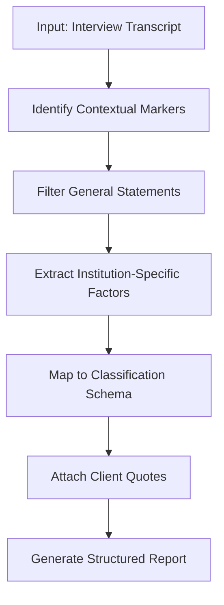

# Institution-Specific Decision Factors

<cite>
**Referenced Files in This Document**   
- [Инд факторы отель.txt](file://prompts-by-scenario/interview/Information-about-the-decision-making-factors-in-this-institution/hotel/part1/Инд факторы отель.txt)
- [Интервью. факторы в этом заведении. отель. json.txt](file://prompts-by-scenario/interview/Information-about-the-decision-making-factors-in-this-institution/hotel/json-prompt/Интервью. факторы в этом заведении. отель. json.txt)
- [инд факторы ресторан.txt](file://prompts-by-scenario/interview/Information-about-the-decision-making-factors-in-this-institution/restaurant/part1/инд факторы ресторан.txt)
- [Интервью. Факторы в этом заведении. Ресторан. Json.txt](file://prompts-by-scenario/interview/Information-about-the-decision-making-factors-in-this-institution/restaurant/json-prompt/Интервью. Факторы в этом заведении. Ресторан. Json.txt)
- [Инд факторы спа.txt](file://prompts-by-scenario/interview/Information-about-the-decision-making-factors-in-this-institution/spa/part1/Инд факторы спа.txt)
- [Интервью. Факторы в этом заведении. Спа. Json.txt](file://prompts-by-scenario/interview/Information-about-the-decision-making-factors-in-this-institution/spa/json-prompt/Интервью. Факторы в этом заведении. Спа. Json.txt)
- [run_analysis.py](file://src/run_analysis.py)
</cite>

## Table of Contents
1. [Introduction](#introduction)
2. [Core Functionality](#core-functionality)
3. [Prompt Design and Structure](#prompt-design-and-structure)
4. [JSON Output Schema and Entity Tagging](#json-output-schema-and-entity-tagging)
5. [Differentiation of Generic vs. Specific Service Behaviors](#differentiation-of-generic-vs-specific-service-behaviors)
6. [Integration with run_analysis.py for Context-Aware Processing](#integration-with-run_analysipy-for-context-aware-processing)
7. [Linkage with Common Factors for Comparative Analysis](#linkage-with-common-factors-for-comparative-analysis)
8. [Configuration Options for Sensitivity Tuning](#configuration-options-for-sensitivity-tuning)
9. [Handling Ambiguous Institutional Traits](#handling-ambiguous-institutional-traits)
10. [Troubleshooting Guidance](#troubleshooting-guidance)
11. [Performance Optimization for High-Cardinality Factor Extraction](#performance-optimization-for-high-cardinality-factor-extraction)

## Introduction

The Institution-Specific Decision Factors module is designed to extract unique operational and experiential attributes that differentiate individual hospitality establishments. Unlike generic analysis modules, this system focuses on identifying distinctive selling points, staff behaviors, facility features, and other institution-specific characteristics that are not captured in common factor analysis. By leveraging building-type-specific prompts, the module enables granular, context-aware extraction of qualitative insights from customer interviews, allowing for precise identification of what makes a particular hotel, restaurant, or spa stand out.

This document details the architecture, functionality, and integration of the module, emphasizing its single-part prompt design, JSON output schema, and mechanisms for distinguishing nuanced service behaviors. It also covers configuration options, troubleshooting strategies, and performance considerations essential for scalable deployment.

**Section sources**
- [Инд факторы отель.txt](file://prompts-by-scenario/interview/Information-about-the-decision-making-factors-in-this-institution/hotel/part1/Инд факторы отель.txt)
- [инд факторы ресторан.txt](file://prompts-by-scenario/interview/Information-about-the-decision-making-factors-in-this-institution/restaurant/part1/инд факторы ресторан.txt)
- [Инд факторы спа.txt](file://prompts-by-scenario/interview/Information-about-the-decision-making-factors-in-this-institution/spa/part1/Инд факторы спа.txt)

## Core Functionality

The Institution-Specific Decision Factors module performs targeted extraction of unique attributes from customer interview transcripts by focusing exclusively on the current establishment being discussed. It filters out general statements about hospitality experiences and isolates only those comments that reference the specific venue—identified through contextual markers such as "this hotel," "here," "in this place," or "the current restaurant."

Each prompt is tailored to a specific building type (hotel, restaurant, spa), ensuring that the classification schema aligns with domain-specific expectations and customer decision-making criteria. The module identifies and categorizes factors into predefined classifications such as location, design, service, technology, safety, marketing, and others, depending on the establishment type.

The system emphasizes precision by requiring direct client quotes to substantiate each identified factor, ensuring authenticity and traceability. This approach enables organizations to uncover actionable insights about what truly differentiates their properties from competitors.

**Section sources**
- [Инд факторы отель.txt](file://prompts-by-scenario/interview/Information-about-the-decision-making-factors-in-this-institution/hotel/part1/Инд факторы отель.txt)
- [инд факторы ресторан.txt](file://prompts-by-scenario/interview/Information-about-the-decision-making-factors-in-this-institution/restaurant/part1/инд факторы ресторан.txt)
- [Инд факторы спа.txt](file://prompts-by-scenario/interview/Information-about-the-decision-making-factors-in-this-institution/spa/part1/Инд факторы спа.txt)

## Prompt Design and Structure

The module employs a single-part prompt design optimized for focused extraction. Each prompt is structured to guide the LLM through a rigorous analytical process, beginning with marker identification and culminating in structured output generation.

Key components of the prompt structure include:

- **Marker Identification**: Instructions to detect contextual indicators ("this," "here," "current") that anchor the discussion to the specific institution.
- **Content Filtering**: Explicit directive to exclude general statements and focus solely on institution-specific observations.
- **Classification Framework**: A detailed taxonomy of decision factors, broken down into primary categories and subcategories (e.g., "Service → Staff Behavior," "Design → Interior Layout").
- **Evidence Requirement**: Mandate to include direct client quotes as evidence for each extracted factor.
- **Output Formatting**: Clear specification of the required output format, including section headers and conclusion requirements.

For example, the hotel-specific prompt includes subcategories under "Service" such as check-in experience, room service, concierge quality, and proactive staff behavior, enabling fine-grained analysis.

This standardized yet adaptable structure ensures consistency across different institution types while preserving domain-specific nuances.



**Diagram sources**
- [Инд факторы отель.txt](file://prompts-by-scenario/interview/Information-about-the-decision-making-factors-in-this-institution/hotel/part1/Инд факторы отель.txt)
- [инд факторы ресторан.txt](file://prompts-by-scenario/interview/Information-about-the-decision-making-factors-in-this-institution/restaurant/part1/инд факторы ресторан.txt)
- [Инд факторы спа.txt](file://prompts-by-scenario/interview/Information-about-the-decision-making-factors-in-this-institution/spa/part1/Инд факторы спа.txt)

## JSON Output Schema and Entity Tagging

Following the qualitative analysis, a secondary JSON-formatted prompt processes the structured report to perform quantitative summarization. This step extracts entity counts per category and outputs them in a machine-readable format.

The JSON schema varies slightly by institution type but maintains a consistent structure:

```json
{
  "локационные_факторы": 3,
  "факторы_дизайна_и_архитектуры": 5,
  "факторы_сервиса": 8,
  "технологические_факторы": 2,
  "факторы_безопасности": 1,
  "маркетинговые_факторы": 2,
  "прочие_факторы": 0,
  "общее_количество_факторов": 21
}
```

Each field corresponds to a top-level category defined in the classification framework. The values represent the count of unique, quote-backed factors identified in the transcript. This schema enables downstream systems to perform comparative analytics, trend tracking, and dashboard visualization.

The use of consistent keys across reports allows for automated aggregation and cross-property benchmarking.

**Section sources**
- [Интервью. факторы в этом заведении. отель. json.txt](file://prompts-by-scenario/interview/Information-about-the-decision-making-factors-in-this-institution/hotel/json-prompt/Интервью. факторы в этом заведении. отель. json.txt)
- [Интервью. Факторы в этом заведении. Ресторан. Json.txt](file://prompts-by-scenario/interview/Information-about-the-decision-making-factors-in-this-institution/restaurant/json-prompt/Интервью. Факторы в этом заведении. Ресторан. Json.txt)
- [Интервью. Факторы в этом заведении. Спа. Json.txt](file://prompts-by-scenario/interview/Information-about-the-decision-making-factors-in-this-institution/spa/json-prompt/Интервью. Факторы в этом заведении. Спа. Json.txt)

## Differentiation of Generic vs. Specific Service Behaviors

A key strength of the module is its ability to distinguish between generic praise ("good service") and specific, observable behaviors that contribute to exceptional customer experiences.

For instance:
- **Generic**: "The staff was friendly."
- **Specific**: "The manager greeted me by name when I entered the lobby."

The prompt explicitly instructs the model to seek out concrete examples and avoid vague attributions. It requires the inclusion of verbatim client statements that describe actual interactions, enabling organizations to identify replicable best practices.

This specificity supports training initiatives, performance evaluations, and operational improvements by highlighting exactly which behaviors drive positive sentiment.

Additionally, the classification schema includes granular subcategories under "Service" that prompt the model to look for distinct dimensions of interaction, such as:
- Proactive problem-solving
- Personalized attention
- Speed and efficiency
- Emotional intelligence

By enforcing this level of detail, the system transforms subjective feedback into objective, actionable data.

**Section sources**
- [Инд факторы отель.txt](file://prompts-by-scenario/interview/Information-about-the-decision-making-factors-in-this-institution/hotel/part1/Инд факторы отель.txt)
- [инд факторы ресторан.txt](file://prompts-by-scenario/interview/Information-about-the-decision-making-factors-in-this-institution/restaurant/part1/инд факторы ресторан.txt)

## Integration with run_analysis.py for Context-Aware Processing

The Institution-Specific Decision Factors module is integrated into the analysis pipeline via `run_analysis.py`, which orchestrates the multi-stage processing of interview data.

The workflow proceeds as follows:
1. Raw transcript is passed to the first analysis pass using the institution-specific prompt.
2. The output—a structured qualitative report—is then fed into a second pass using the corresponding JSON prompt.
3. The final output is a quantified summary in JSON format.

In cases where multiple report types are required (e.g., common factors and institution-specific factors), the system executes sequential passes, combining results before final JSON processing.

Relevant code logic in `run_analysis.py`:
```python
result1 = run_analysis_pass(prompts=part1, ...)
result2 = run_analysis_pass(prompts=part2, ...)
json_result = run_analysis_pass(source_text=result1 + "\n" + result2, prompts=json_prompts, ...)
```

This modular design allows for flexible chaining of analytical stages while maintaining separation between qualitative extraction and quantitative summarization.

**Section sources**
- [run_analysis.py](file://src/run_analysis.py#L248-L306)

## Linkage with Common Factors for Comparative Analysis

The module operates in conjunction with the Common Decision Factors module, enabling comparative analysis between generic industry standards and institution-specific differentiators.

After both analyses are completed, the system can:
- Compare the volume and distribution of factors across categories
- Identify gaps where common expectations are met but unique advantages are lacking
- Highlight outlier strengths that could be leveraged in marketing or staff training

For example, if a hotel scores average on common service metrics but excels in personalized guest recognition (a specific factor), this insight can inform branding strategy or internal recognition programs.

This dual-layered approach provides a comprehensive view of competitive positioning, balancing baseline performance with distinctive excellence.

**Section sources**
- [run_analysis.py](file://src/run_analysis.py#L273-L306)

## Configuration Options for Sensitivity Tuning

While the prompts themselves are static files, sensitivity can be tuned through preprocessing rules and post-processing thresholds. For example:
- Adjusting the minimum quote length required to validate a factor
- Setting minimum frequency thresholds for category inclusion
- Applying filters based on speaker role (e.g., only customer statements)

These configurations are managed externally and influence how the raw output is interpreted, rather than altering the prompt logic directly.

Future enhancements could include dynamic prompt templating with adjustable strictness levels (e.g., "strict," "moderate," "lenient") to control how liberally factors are extracted.

**Section sources**
- [run_analysis.py](file://src/run_analysis.py#L248-L338)

## Handling Ambiguous Institutional Traits

Ambiguity arises when a statement could refer to either the current institution or hospitality in general. To resolve this, the system relies on:
- Strong contextual markers in the prompt
- Temporal and spatial cues in the transcript ("today," "in this room")
- Cross-referencing with researcher questions that anchor the discussion

When ambiguity persists, the default rule is exclusion—only clearly attributable statements are included. This conservative approach ensures data integrity at the cost of potential undercounting, which is preferable to false positives.

The prompt explicitly states: "Include ONLY information related to the current establishment being interviewed."

**Section sources**
- [Инд факторы отель.txt](file://prompts-by-scenario/interview/Information-about-the-decision-making-factors-in-this-institution/hotel/part1/Инд факторы отель.txt)
- [инд факторы ресторан.txt](file://prompts-by-scenario/interview/Information-about-the-decision-making-factors-in-this-institution/restaurant/part1/инд факторы ресторан.txt)

## Troubleshooting Guidance

### Overfitting to Noise
**Symptom**: Extraction of trivial or irrelevant details (e.g., "the chair was blue").
**Solution**: Review prompt clarity on significance; apply post-processing filters to remove low-impact factors; ensure client quotes demonstrate emotional or decisional impact.

### Underextraction
**Symptom**: Missing clear institution-specific comments.
**Cause**: Weak marker detection or overly strict filtering.
**Fix**: Verify that all contextual indicators ("this," "here") are recognized; ensure the model isn't discarding valid statements due to formatting issues.

### Category Misclassification
**Symptom**: Factors placed in incorrect categories.
**Fix**: Refine category definitions in the prompt; add illustrative examples; validate taxonomy alignment across institution types.

### Duplicate Factor Counting
**Symptom**: Same behavior counted multiple times.
**Prevention**: Emphasize uniqueness in instructions; require distinct quotes for each factor; implement deduplication in post-processing.

**Section sources**
- [Инд факторы отель.txt](file://prompts-by-scenario/interview/Information-about-the-decision-making-factors-in-this-institution/hotel/part1/Инд факторы отель.txt)
- [Интервью. факторы в этом заведении. отель. json.txt](file://prompts-by-scenario/interview/Information-about-the-decision-making-factors-in-this-institution/hotel/json-prompt/Интервью. факторы в этом заведении. отель. json.txt)

## Performance Optimization for High-Cardinality Factor Extraction

To handle high-cardinality factor extraction efficiently:
- **Parallel Processing**: Multiple transcripts can be analyzed concurrently using independent worker processes.
- **Prompt Caching**: Frequently used prompts are loaded once and reused across sessions.
- **Streaming Output**: Large reports are generated incrementally to reduce memory pressure.
- **Batched JSON Conversion**: Quantitative summarization is applied in bulk after all qualitative reports are complete.

The single-pass design of the institution-specific analysis minimizes computational overhead compared to iterative methods. However, for large-scale deployments, consider:
- Asynchronous job queues
- Distributed processing frameworks
- Model quantization for faster inference

These optimizations ensure scalability without compromising analytical depth.

**Section sources**
- [run_analysis.py](file://src/run_analysis.py#L303-L338)