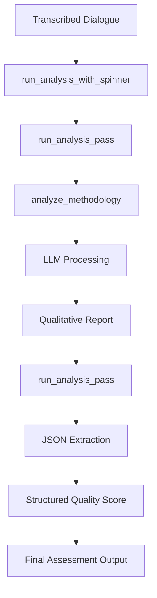
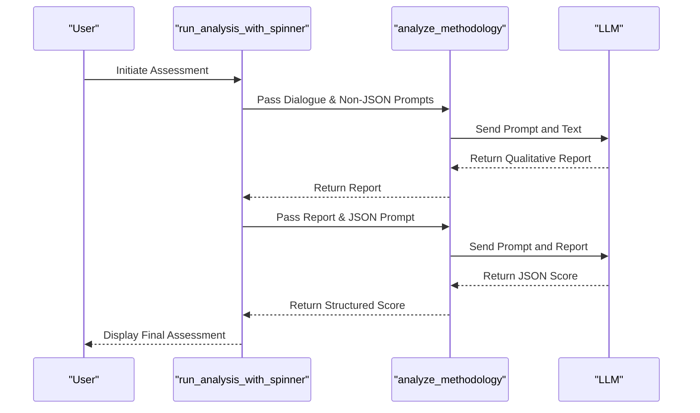

# Interview Methodology Assessment

<cite>
**Referenced Files in This Document**   
- [run_analysis.py](file://src/run_analysis.py#L248-L338)
- [analysis.py](file://src/analysis.py#L1-L490)
- [interview_methodology.txt](file://prompts/interview_methodology.txt)
- [Интервью.  Оценка методологии интервью. Итоговая оценка качества интервью.txt](file://prompts-by-scenario/interview/Assessment-of-the-interview-methodology/json-prompt/Интервью.  Оценка методологии интервью. Итоговая оценка качества интервью.txt)
- [промпт оценка методологии интервью.txt](file://prompts-by-scenario/interview/Assessment-of-the-interview-methodology/non-building/промпт оценка методологии интервью.txt)
</cite>

## Table of Contents
1. [Introduction](#introduction)
2. [Core Components](#core-components)
3. [Architecture Overview](#architecture-overview)
4. [Detailed Component Analysis](#detailed-component-analysis)
5. [Evaluation Criteria and Scoring Logic](#evaluation-criteria-and-scoring-logic)
6. [Input-Output Examples](#input-output-examples)
7. [Configuration and Edge Case Handling](#configuration-and-edge-case-handling)
8. [Troubleshooting and Performance Optimization](#troubleshooting-and-performance-optimization)
9. [Conclusion](#conclusion)

## Introduction
The Interview Methodology Assessment component is a critical quality assurance module within the VoxPersona system, designed to evaluate the structure, depth, and methodological rigor of interviews conducted during hospitality audits. This system leverages Large Language Models (LLMs) to automatically analyze transcribed dialogues between interviewers and clients, generating both structured quality scores and qualitative feedback. The assessment ensures data reliability before downstream processing, such as factor extraction, by validating that interviews adhere to established research protocols. This document details the dual-prompt architecture, integration with the analysis pipeline, evaluation criteria, configuration options, and operational best practices.

## Core Components

The Interview Methodology Assessment relies on a dual-prompt system and a robust backend analysis pipeline. The primary components include specialized prompt templates for qualitative and quantitative analysis, the `run_analysis.py` module for orchestrating the assessment workflow, and the `analysis.py` module for interfacing with the LLM. The system processes transcribed dialogues to evaluate key aspects such as clarity, completeness, and probing depth, ensuring that each interview meets the high standards required for reliable data extraction.

**Section sources**
- [run_analysis.py](file://src/run_analysis.py#L248-L338)
- [analysis.py](file://src/analysis.py#L1-L490)
- [промпт оценка методологии интервью.txt](file://prompts-by-scenario/interview/Assessment-of-the-interview-methodology/non-building/промпт оценка методологии интервью.txt)
- [Интервью.  Оценка методологии интервью. Итоговая оценка качества интервью.txt](file://prompts-by-scenario/interview/Assessment-of-the-interview-methodology/json-prompt/Интервью.  Оценка методологии интервью. Итоговая оценка качества интервью.txt)

## Architecture Overview

The assessment process is orchestrated by the `run_analysis_with_spinner` function in `run_analysis.py`, which manages the entire workflow from input processing to result delivery. The system uses a two-pass approach: the first pass generates a detailed qualitative report using non-JSON prompts, and the second pass extracts a structured quality score from this report using a JSON-specific prompt. This architecture ensures that the final output is both human-readable and machine-parsable.



**Diagram sources**
- [run_analysis.py](file://src/run_analysis.py#L248-L338)
- [analysis.py](file://src/analysis.py#L1-L490)

## Detailed Component Analysis

### Assessment Workflow and Dual Prompt System
The Interview Methodology Assessment employs a dual-prompt strategy to generate comprehensive evaluations. The first prompt, located in `промпт оценка методологии интервью.txt`, is a non-building prompt that instructs the LLM to produce a detailed qualitative report. This report evaluates multiple dimensions of the interview, including rule adherence, violation detection, and overall quality. The second prompt, found in `Интервью. Оценка методологии интервью. Итоговая оценка качества интервью.txt`, is a JSON-specific prompt designed to extract a structured quality score from the qualitative report.

The workflow begins when `run_analysis_with_spinner` is invoked, typically in response to a user request. This function determines the appropriate prompts based on the scenario and report type, then calls `run_analysis_pass` to execute the analysis. The first call to `run_analysis_pass` processes the transcribed dialogue with the non-JSON prompts, generating a comprehensive qualitative assessment. This intermediate result is then passed to a second call to `run_analysis_pass`, which uses the JSON prompt to extract the final quality score in a structured format.

#### For API/Service Components:


**Diagram sources**
- [run_analysis.py](file://src/run_analysis.py#L248-L338)
- [analysis.py](file://src/analysis.py#L1-L490)
- [промпт оценка методологии интервью.txt](file://prompts-by-scenario/interview/Assessment-of-the-interview-methodology/non-building/промпт оценка методологии интервью.txt)
- [Интервью.  Оценка методологии интервью. Итоговая оценка качества интервью.txt](file://prompts-by-scenario/interview/Assessment-of-the-interview-methodology/json-prompt/Интервью.  Оценка методологии интервью. Итоговая оценка качества интервью.txt)

### Integration with run_analysis.py
The `run_analysis.py` module serves as the central orchestrator for the assessment process. The `run_analysis_with_spinner` function manages the user interface, displaying a loading animation while the analysis is performed. It retrieves the appropriate prompts from the database based on the scenario (e.g., "Интервью") and report type (e.g., "Оценка методологии интервью"). The function then processes the prompts in two distinct phases: first with non-JSON prompts to generate a qualitative report, and then with JSON prompts to extract a structured score.

The `run_analysis_pass` function handles the actual interaction with the LLM. It sends the prompt and text to the `analyze_methodology` function, which in turn calls `send_msg_to_model` to communicate with the LLM API. The response is processed and returned to `run_analysis_with_spinner`, which then proceeds to the next phase of the analysis. This two-pass approach ensures that the final output is both detailed and structured, meeting the needs of both human reviewers and automated systems.

**Section sources**
- [run_analysis.py](file://src/run_analysis.py#L248-L338)
- [analysis.py](file://src/analysis.py#L1-L490)

## Evaluation Criteria and Scoring Logic

The system evaluates interviews based on a comprehensive set of criteria, which are grouped into two main categories: rule adherence and violation detection. Each category is assessed on a percentage scale, and the final quality score is calculated as the average of these two categories.

### Rule Adherence
This category evaluates the positive aspects of the interview, focusing on whether the interviewer followed best practices. The criteria include:
- **Presentation and Explanation of Purpose**: The interviewer must clearly introduce themselves and explain the purpose of the research.
- **Friendly Attitude**: The interviewer should create a comfortable atmosphere and demonstrate empathy.
- **Question Format**: The questions should be open-ended and avoid leading or judgmental language.

### Violation Detection
This category identifies potential issues and shortcomings in the interview process. The criteria include:
- **Insufficient Depth of Research**: The interviewer must explore significant topics in depth, using the "window" principle.
- **Lack of Question Sequence**: The interview should follow a logical sequence, starting with identifying key events, analyzing transformations, and exploring decision-making processes.
- **Inadequate Attention to Transformative Events**: The interviewer should identify and explore transformative events in the client's life.
- **Weak Work with Links**: The interviewer should collect and validate "links," which connect personal qualities to decision-making methods.
- **Deviation from Topic**: The interviewer should maintain focus on the main subject and effectively redirect the conversation when it strays.

The final quality score (Z%) is calculated using the formula Z = (X + Y) / 2, where X is the average score for rule adherence and Y is the average score for violation detection. This score is extracted from the qualitative report by the JSON prompt and returned as a structured JSON object.

**Section sources**
- [промпт оценка методологии интервью.txt](file://prompts-by-scenario/interview/Assessment-of-the-interview-methodology/non-building/промпт оценка методологии интервью.txt)

## Input-Output Examples

### Input Transcript Example
```
[Сотрудник:] Здравствуйте, меня зовут Анна, я провожу исследование по улучшению сервиса в отелях. Могу ли я задать вам несколько вопросов?
[Клиент:] Конечно, здравствуйте.
[Сотрудник:] Расскажите, пожалуйста, о вашем последнем опыте проживания в отеле.
[Клиент:] Было неплохо, но уборка была не очень.
[Сотрудник:] Поняла, а что именно вас не устроило в уборке?
[Клиент:] Полотенца не поменяли два дня подряд.
[Сотрудник:] Спасибо за информацию.
```

### Output Assessment Example
```json
{
  "итоговая_оценка_качества_интервью": 65
}
```

The qualitative report for this example might note that the interviewer properly introduced themselves and asked open-ended questions, but failed to explore the client's experience in depth, did not investigate transformative events, and did not collect any "links" between personal qualities and decision-making.

**Section sources**
- [промпт оценка методологии интервью.txt](file://prompts-by-scenario/interview/Assessment-of-the-interview-methodology/non-building/промпт оценка методологии интервью.txt)
- [Интервью.  Оценка методологии интервью. Итоговая оценка качества интервью.txt](file://prompts-by-scenario/interview/Assessment-of-the-interview-methodology/json-prompt/Интервью.  Оценка методологии интервью. Итоговая оценка качества интервью.txt)

## Configuration and Edge Case Handling

The system can be configured to adjust the rigor of the assessment by modifying the prompt templates. For example, the thresholds for what constitutes a "good" or "poor" score can be adjusted in the prompt text. The system also handles edge cases such as incomplete interviews by providing specific feedback in the qualitative report. If an interview is too short or lacks sufficient content, the report will note this and may assign lower scores for depth and completeness.

The `run_analysis.py` module includes error handling for cases where the LLM is unavailable or returns an error. In such cases, the system logs the error and displays a user-friendly message. The system is also designed to handle interviews of varying lengths by processing the text in chunks if necessary, although this is not currently implemented for the interview assessment.

**Section sources**
- [run_analysis.py](file://src/run_analysis.py#L248-L338)
- [analysis.py](file://src/analysis.py#L1-L490)

## Troubleshooting and Performance Optimization

### Troubleshooting Inconsistent Scoring
If the system produces inconsistent scores for similar interviews, the first step is to review the prompt templates for clarity and consistency. Ensure that the criteria are well-defined and that the examples provided in the prompts are representative of the expected output. It may also be helpful to review the LLM's responses to identify any patterns in the inconsistencies.

### Performance Tips for Real-Time Evaluation
To minimize latency during real-time evaluation, ensure that the LLM API is responsive and that the network connection is stable. The system can be optimized by pre-loading the prompt templates and caching frequently used data. Additionally, the `run_analysis.py` module uses a loading animation to provide feedback to the user while the analysis is in progress, which improves the user experience even if the processing takes several seconds.

**Section sources**
- [run_analysis.py](file://src/run_analysis.py#L248-L338)
- [analysis.py](file://src/analysis.py#L1-L490)

## Conclusion
The Interview Methodology Assessment component is a sophisticated system that ensures the quality and reliability of data collected during hospitality audits. By leveraging a dual-prompt architecture and a robust analysis pipeline, the system provides both detailed qualitative feedback and structured quality scores. This dual output format supports both human review and automated processing, making it an essential tool for maintaining high standards in research methodology. The system's modular design allows for easy configuration and adaptation to different assessment criteria, ensuring its continued relevance and effectiveness.