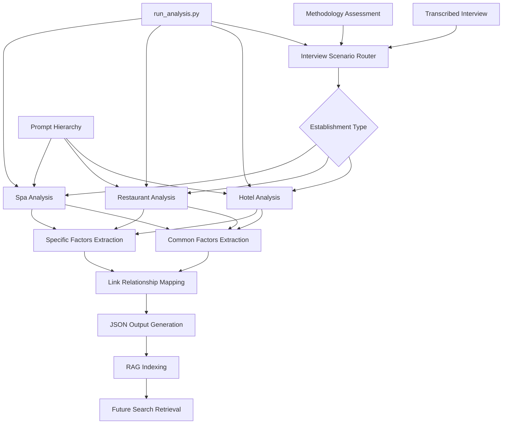
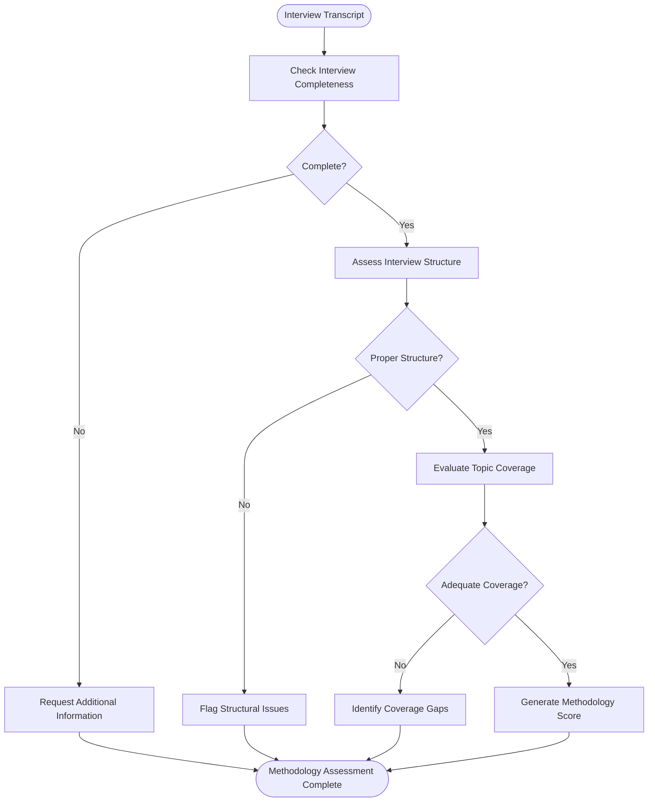
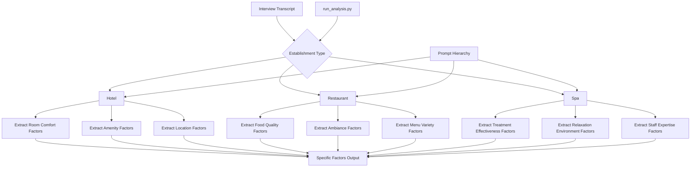
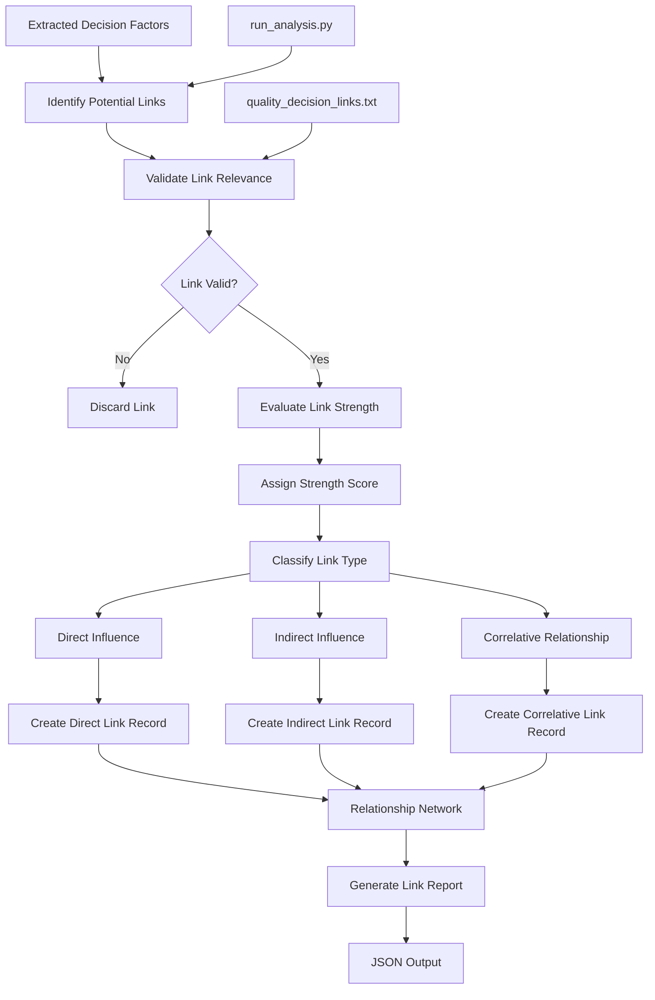
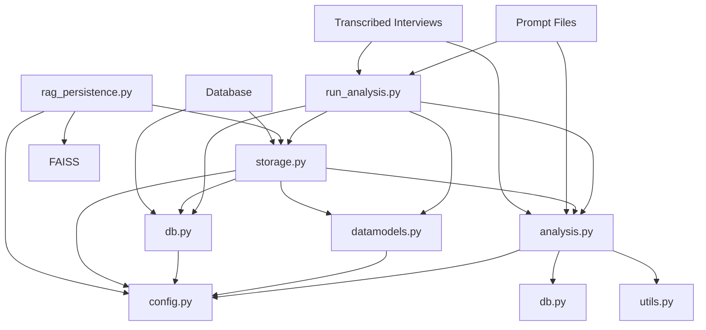

# Interview Scenario: Decision-Making Factor Analysis

<cite>
**Referenced Files in This Document**   
- [run_analysis.py](file://src/run_analysis.py)
- [analysis.py](file://src/analysis.py)
- [datamodels.py](file://src/datamodels.py)
- [db.py](file://src/db_handler/db.py)
- [storage.py](file://src/storage.py)
- [rag_persistence.py](file://src/rag_persistence.py)
- [config.py](file://src/config.py)
- [interview_methodology.txt](file://prompts/interview_methodology.txt)
- [interview_general_factors_hotel.txt](file://prompts/interview_general_factors_hotel.txt)
- [interview_specific_factors_hotel.txt](file://prompts/interview_specific_factors_hotel.txt)
- [quality_decision_links.txt](file://prompts/quality_decision_links.txt)
- [Assessment-of-the-interview-methodology](file://prompts-by-scenario/interview/Assessment-of-the-interview-methodology/non-building/промпт оценка методологии интервью.txt)
- [Information-about-common-decision-making-factors](file://prompts-by-scenario/interview/Information-about-common-decision-making-factors/hotel/part1/общ факторы отель 1.txt)
- [Information-about-the-decision-making-factors-in-this-institution](file://prompts-by-scenario/interview/Information-about-the-decision-making-factors-in-this-institution/hotel/part1/Инд факторы отель.txt)
- [Report-on-links](file://prompts-by-scenario/interview/Report-on-links/non-building/промпт связки.txt)
</cite>

## Table of Contents
1. [Introduction](#introduction)
2. [Core Components](#core-components)
3. [Architecture Overview](#architecture-overview)
4. [Detailed Component Analysis](#detailed-component-analysis)
5. [Dependency Analysis](#dependency-analysis)
6. [Performance Considerations](#performance-considerations)
7. [Troubleshooting Guide](#troubleshooting-guide)
8. [Conclusion](#conclusion)

## Introduction
The Interview Scenario is designed to systematically analyze decision-making factors in hospitality establishments through structured interview analysis. This document details the framework for extracting and understanding customer choice drivers and operational decision patterns across three establishment types: hotels, restaurants, and spas. The system employs a hierarchical prompt structure to assess interview methodology, identify common and institution-specific decision factors, and map relationship links between these factors. The analysis pipeline integrates with run_analysis.py for routing interview-based analyses and processing multi-part responses, enabling comprehensive extraction of decision factors from transcribed interviews. The resulting JSON outputs support Retrieval-Augmented Generation (RAG) indexing for efficient future search and knowledge retrieval.

## Core Components

The Interview Scenario framework consists of four primary sub-components that work together to analyze decision-making patterns in hospitality establishments. These components are orchestrated through a structured analysis pipeline that processes transcribed interviews and generates actionable insights.

### Interview Methodology Assessment
This component evaluates the quality and effectiveness of the interview process itself. It analyzes the structure, flow, and completeness of interviews to ensure they capture sufficient information for meaningful decision factor extraction. The assessment uses dedicated prompts to evaluate interview methodology and identify potential gaps in data collection.

### Common Decision Factors
This component identifies factors that influence customer choices across all establishment types. These universal factors include service quality, cleanliness, staff friendliness, and overall value perception. The analysis extracts these common elements from interview transcripts and categorizes them for cross-establishment comparison.

### Institution-Specific Factors
This component focuses on unique decision drivers specific to each establishment type. For hotels, this might include room comfort and amenities; for restaurants, food quality and ambiance; and for spas, treatment effectiveness and relaxation environment. The system uses specialized prompts tailored to each establishment type to extract these distinctive factors.

### Link Reporting
This component maps relationships between identified decision factors, creating a network of interconnected elements that influence customer choices. It identifies how factors such as staff behavior might link to service quality, which in turn affects overall satisfaction and likelihood of return visits.

**Section sources**
- [interview_methodology.txt](file://prompts/interview_methodology.txt)
- [interview_general_factors_hotel.txt](file://prompts/interview_general_factors_hotel.txt)
- [interview_specific_factors_hotel.txt](file://prompts/interview_specific_factors_hotel.txt)
- [quality_decision_links.txt](file://prompts/quality_decision_links.txt)

## Architecture Overview

The Interview Scenario analysis system follows a modular architecture that processes interview data through a series of coordinated components. The architecture enables hierarchical organization by establishment type and supports specialized analysis for each hospitality category.



**Diagram sources**
- [run_analysis.py](file://src/run_analysis.py)
- [datamodels.py](file://src/datamodels.py)
- [analysis.py](file://src/analysis.py)

## Detailed Component Analysis

### Interview Methodology Assessment Analysis

The interview methodology assessment evaluates the quality of collected interview data before proceeding with factor extraction. This quality control step ensures that subsequent analyses are based on reliable and comprehensive information.



**Diagram sources**
- [Assessment-of-the-interview-methodology](file://prompts-by-scenario/interview/Assessment-of-the-interview-methodology/non-building/промпт оценка методологии интервью.txt)
- [run_analysis.py](file://src/run_analysis.py#L200-L250)

**Section sources**
- [Assessment-of-the-interview-methodology](file://prompts-by-scenario/interview/Assessment-of-the-interview-methodology/non-building/промпт оценка методологии интервью.txt)
- [run_analysis.py](file://src/run_analysis.py#L200-L250)

### Common Decision Factors Analysis

The common decision factors component extracts universal elements that influence customer choices across all hospitality establishment types. This analysis uses a standardized prompt hierarchy to ensure consistent factor identification regardless of establishment type.

```mermaid
classDiagram
class CommonFactorsExtractor {
+string[] serviceQualityIndicators
+string[] cleanlinessMetrics
+string[] staffBehaviorCues
+string[] valuePerceptionSignals
+extractFactors(transcript) Map~string, string~
+normalizeFactors(rawFactors) Map~string, string~
+categorizeFactors(processedFactors) Map~string, string[]
}
class PromptManager {
+string scenarioName
+string reportType
+string buildingType
+getPrompts() tuple[]string, int~~
+organizeByHierarchy(prompts) Map~string, tuple[]string, int~~~
}
class FactorCategorizer {
+Map~string, string[]~ factorTaxonomy
+assignCategory(factor) string
+validateCategoryConsistency(factors) boolean
+resolveCategoryConflicts(factors) Map~string, string~
}
CommonFactorsExtractor --> PromptManager : "uses"
CommonFactorsExtractor --> FactorCategorizer : "delegates"
PromptManager --> "prompts-by-scenario" : "reads from"
FactorCategorizer --> "factor_taxonomy.json" : "references"
```

**Diagram sources**
- [Information-about-common-decision-making-factors](file://prompts-by-scenario/interview/Information-about-common-decision-making-factors/hotel/part1/общ факторы отель 1.txt)
- [analysis.py](file://src/analysis.py#L100-L150)
- [datamodels.py](file://src/datamodels.py#L20-L30)

**Section sources**
- [Information-about-common-decision-making-factors](file://prompts-by-scenario/interview/Information-about-common-decision-making-factors/hotel/part1/общ факторы отель 1.txt)
- [analysis.py](file://src/analysis.py#L100-L150)

### Institution-Specific Factors Analysis

The institution-specific factors component employs specialized prompts for each establishment type, enabling targeted extraction of unique decision drivers. The system's hierarchical organization allows for customization while maintaining a consistent analytical framework.



**Diagram sources**
- [Information-about-the-decision-making-factors-in-this-institution](file://prompts-by-scenario/interview/Information-about-the-decision-making-factors-in-this-institution/hotel/part1/Инд факторы отель.txt)
- [run_analysis.py](file://src/run_analysis.py#L250-L300)
- [datamodels.py](file://src/datamodels.py#L40-L50)

**Section sources**
- [Information-about-the-decision-making-factors-in-this-institution](file://prompts-by-scenario/interview/Information-about-the-decision-making-factors-in-this-institution/hotel/part1/Инд факторы отель.txt)
- [run_analysis.py](file://src/run_analysis.py#L250-L300)

### Link Reporting Analysis

The link reporting component analyzes relationships between identified decision factors, creating a network of interconnected elements that influence customer choices. This relationship mapping provides deeper insights into how various factors interact and compound their effects on customer decisions.



**Diagram sources**
- [Report-on-links](file://prompts-by-scenario/interview/Report-on-links/non-building/промпт связки.txt)
- [run_analysis.py](file://src/run_analysis.py#L150-L200)
- [analysis.py](file://src/analysis.py#L300-L350)

**Section sources**
- [Report-on-links](file://prompts-by-scenario/interview/Report-on-links/non-building/промпт связки.txt)
- [run_analysis.py](file://src/run_analysis.py#L150-L200)

## Dependency Analysis

The Interview Scenario system relies on a network of interdependent components that work together to process interview data and extract decision factors. The dependency structure ensures that each component can access the necessary resources and data to perform its function.



**Diagram sources**
- [run_analysis.py](file://src/run_analysis.py)
- [analysis.py](file://src/analysis.py)
- [datamodels.py](file://src/datamodels.py)
- [db.py](file://src/db_handler/db.py)
- [storage.py](file://src/storage.py)
- [rag_persistence.py](file://src/rag_persistence.py)
- [config.py](file://src/config.py)

**Section sources**
- [run_analysis.py](file://src/run_analysis.py)
- [analysis.py](file://src/analysis.py)
- [datamodels.py](file://src/datamodels.py)

## Performance Considerations

The Interview Scenario system is designed to handle large volumes of interview data efficiently while maintaining high accuracy in decision factor extraction. The performance optimization strategies include parallel processing of interview segments, caching of frequently accessed prompts, and efficient database queries for retrieving analysis results. The system uses asynchronous processing for time-consuming operations such as transcription and factor extraction, allowing for concurrent analysis of multiple interviews. The RAG indexing system enables fast retrieval of historical analysis results, reducing the need for redundant processing of similar interview content. Memory management is optimized through the use of streaming data processing, where large interview transcripts are processed in chunks rather than loaded entirely into memory. The system also implements rate limiting and error handling to ensure stable performance even under heavy load conditions.

## Troubleshooting Guide

When analyzing decision factors in hospitality interviews, several common issues may arise that require troubleshooting. For ambiguous factor extraction, verify that the interview transcript contains sufficient context for the identified factors. If factors are being misclassified, check the prompt hierarchy to ensure the correct establishment-specific prompts are being used. For performance issues with complex relationship mapping, consider breaking down the analysis into smaller segments or adjusting the concurrency settings in run_analysis.py. If JSON output formatting errors occur, validate that the data being processed conforms to the expected schema defined in the system configuration. When integration with run_analysis.py fails, verify that the callback data matches the expected format in REPORT_MAPPING. For missing factor extraction, ensure that the prompt files are properly loaded and that the database contains the necessary prompt records. If RAG indexing fails, check the vector database connection and verify that the embedding model is properly configured in config.py.

**Section sources**
- [run_analysis.py](file://src/run_analysis.py)
- [analysis.py](file://src/analysis.py)
- [config.py](file://src/config.py)

## Conclusion

The Interview Scenario provides a comprehensive framework for analyzing decision-making factors in hospitality establishments. By systematically assessing interview methodology, identifying common and institution-specific factors, and mapping relationship links, the system enables deep insights into customer choice drivers and operational decision patterns. The hierarchical organization by establishment type ensures that analyses are appropriately specialized while maintaining consistency across the hospitality sector. The integration with run_analysis.py facilitates efficient routing of interview-based analyses and processing of multi-part responses. The JSON output format supports RAG indexing for future search, creating a growing knowledge base of customer decision factors. The system's modular architecture allows for easy extension with new interview dimensions by adding to the prompt hierarchy. This comprehensive approach to decision factor analysis provides valuable insights for improving customer experience and operational effectiveness in hotels, restaurants, and spas.