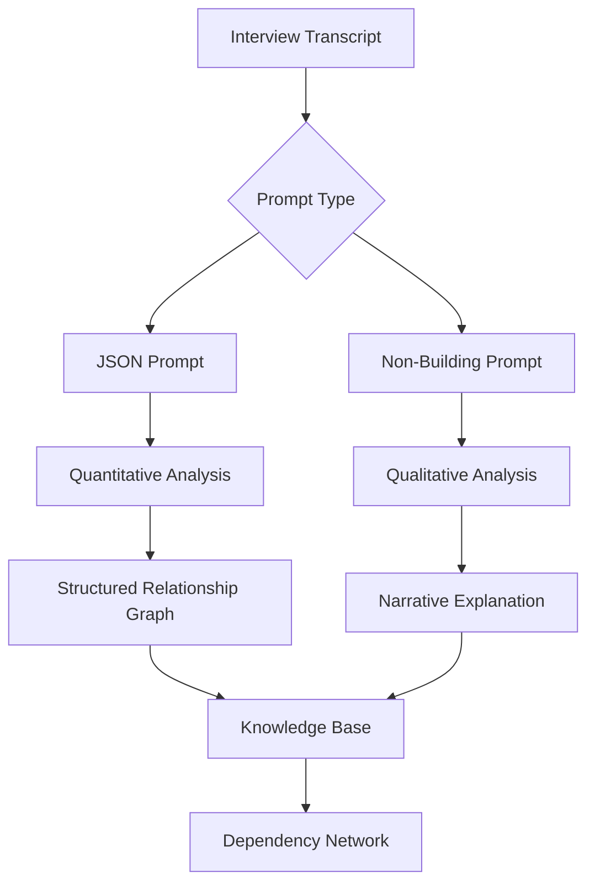
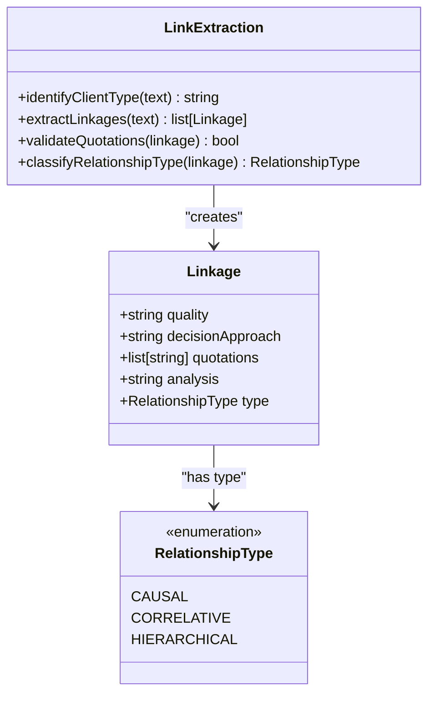
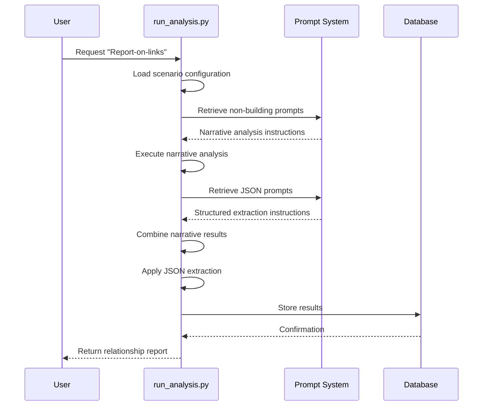

# Relationship Link Reporting

<cite>
**Referenced Files in This Document**   
- [run_analysis.py](file://src/run_analysis.py)
- [bot.py](file://src/bot.py)
- [analysis.py](file://src/analysis.py)
- [storage.py](file://src/storage.py)
- [db_handler/fill_prompts_table.py](file://src/db_handler/fill_prompts_table.py)
- [prompts-by-scenario/interview/Report-on-links/json-prompt/Интервью. Отчет о связках..txt](file://prompts-by-scenario/interview/Report-on-links/json-prompt/Интервью. Отчет о связках..txt)
- [prompts-by-scenario/interview/Report-on-links/non-building/промпт связки.txt](file://prompts-by-scenario/interview/Report-on-links/non-building/промпт связки.txt)
- [sql_prompts/part2/step_2_sql_request.txt](file://prompts-by-scenario/sql_prompts/part2/step_2_sql_request.txt)
</cite>

## Table of Contents
1. [Introduction](#introduction)
2. [Core Functionality](#core-functionality)
3. [Prompt Architecture](#prompt-architecture)
4. [Link Identification and Classification](#link-identification-and-classification)
5. [Integration with run_analysis.py](#integration-with-run_analysispy)
6. [Knowledge Base Representation](#knowledge-base-representation)
7. [Query Capabilities](#query-capabilities)
8. [Configuration Options](#configuration-options)
9. [Troubleshooting and Optimization](#troubleshooting-and-optimization)
10. [Conclusion](#conclusion)

## Introduction

The Relationship Link Reporting component is a specialized module within the VoxPersona system designed to extract, analyze, and represent complex relationships between decision-making factors, institutional attributes, and customer outcomes derived from interview data. This module enables deep insights into how personal qualities influence decision processes in service environments such as hotels, restaurants, and health centers. By leveraging both structured (JSON) and narrative (non-building) prompts, the system constructs comprehensive relationship graphs that reveal causal, correlative, and hierarchical connections between variables like staff friendliness and return intent, or menu variety and price perception.

**Section sources**
- [run_analysis.py](file://src/run_analysis.py#L273-L338)
- [bot.py](file://src/bot.py#L290-L319)

## Core Functionality

The Relationship Link Reporting component analyzes interview transcripts to identify and quantify connections between personal attributes and decision-making behaviors. It operates in two distinct modes: qualitative analysis through narrative prompts and quantitative extraction via JSON-formatted responses. The system first identifies whether a client belongs to TYPE 1 (undergone transformation after a significant adult event) or TYPE 2 (no such transformation), then proceeds to extract specific quality-decision linkages. Each identified link follows the format "Personal Quality - Decision-Making Approach" and is supported by direct client quotations and contextual analysis.

The component's output serves as input for subsequent analytical processes, particularly in constructing dependency networks and enabling sophisticated search queries about factor interactions. This dual-mode approach ensures both depth of insight and statistical tractability in the final analysis.

**Section sources**
- [prompts-by-scenario/interview/Report-on-links/non-building/промпт связки.txt](file://prompts-by-scenario/interview/Report-on-links/non-building/промпт связки.txt#L0-L65)
- [prompts-by-scenario/interview/Report-on-links/json-prompt/Интервью. Отчет о связках..txt](file://prompts-by-scenario/interview/Report-on-links/json-prompt/Интервью. Отчет о связках..txt#L0-L3)

## Prompt Architecture

The system utilizes a dual-prompt architecture for relationship extraction:

### JSON Prompts
The JSON prompt (Интервью. Отчет о связках..txt) is designed for quantitative analysis, instructing the model to count and extract the number of identified "Personal Quality - Decision-Making Approach" linkages from the client report. It specifically focuses on the "Analysis of Personal Qualities and Decision-Making" section, counting only unique, numbered linkages while excluding repetitions or generalizations in conclusions. The output is strictly formatted as JSON with the key "количество_выявленных_связок" (number_of_identified_links).

### Non-Building Prompts
The narrative prompt (промпт связки.txt) performs qualitative analysis in two parts:
1. **Client Typing**: Determines if the client belongs to TYPE 1 (transformed after significant adult event) or TYPE 2 (not transformed)
2. **Linkage Extraction**: Identifies personal qualities and their influence on decision-making, providing direct quotations and analysis for each linkage

This dual approach allows the system to generate both structured metrics and rich narrative insights from the same interview data.

**Diagram sources**
- [prompts-by-scenario/interview/Report-on-links/json-prompt/Интервью. Отчет о связках..txt](file://prompts-by-scenario/interview/Report-on-links/json-prompt/Интервью. Отчет о связках..txt)
- [prompts-by-scenario/interview/Report-on-links/non-building/промпт связки.txt](file://prompts-by-scenario/interview/Report-on-links/non-building/промпт связки.txt)

**Section sources**
- [prompts-by-scenario/interview/Report-on-links/json-prompt/Интервью. Отчет о связках..txt](file://prompts-by-scenario/interview/Report-on-links/json-prompt/Интервью. Отчет о связках..txt)
- [prompts-by-scenario/interview/Report-on-links/non-building/промпт связки.txt](file://prompts-by-scenario/interview/Report-on-links/non-building/промпт связки.txt)

## Link Identification and Classification

The system identifies three primary types of relationships between factors:

### Causal Links
These represent direct cause-and-effect relationships, such as "High Staff Friendliness → Increased Return Intent." The system identifies these through explicit statements in interview transcripts where customers attribute their behavior to specific experiences.

### Correlative Links
These indicate associations between factors without implying causation, such as "Menu Variety ↔ Price Perception." The system detects these through patterns in customer descriptions where multiple factors are consistently mentioned together.

### Hierarchical Links
These represent prioritization relationships, such as "Staff Friendliness > Menu Variety in Decision Hierarchy." The system identifies these through comparative statements and ranking of factors in customer narratives.

The classification process involves analyzing direct quotations to ensure factual accuracy and avoid assumptions. For example, the link between "staff friendliness" and "return intent" would be supported by quotations like "I keep coming back because the staff remembers my name," while "menu variety" connecting to "price perception" might be evidenced by "With so many options, I expect to pay more."

**Diagram sources**
- [prompts-by-scenario/interview/Report-on-links/non-building/промпт связки.txt](file://prompts-by-scenario/interview/Report-on-links/non-building/промпт связки.txt#L0-L65)
- [prompts-by-scenario/sql_prompts/part2/step_2_sql_request.txt](file://prompts-by-scenario/sql_prompts/part2/step_2_sql_request.txt#L0-L18)

**Section sources**
- [prompts-by-scenario/interview/Report-on-links/non-building/промпт связки.txt](file://prompts-by-scenario/interview/Report-on-links/non-building/промпт связки.txt#L0-L65)
- [prompts-by-scenario/sql_prompts/part2/step_2_sql_request.txt](file://prompts-by-scenario/sql_prompts/part2/step_2_sql_request.txt#L0-L18)

## Integration with run_analysis.py

The Relationship Link Reporting component is tightly integrated with the run_analysis.py module, which orchestrates the entire analysis workflow. When processing interview data, the system follows a multi-pass approach:

1. **Initial Processing**: The system first processes general and specific decision-making factors
2. **Link Extraction**: It then applies the relationship link reporting prompts to extract quality-decision linkages
3. **Quantitative Analysis**: Finally, it uses JSON prompts to generate structured metrics

The run_analysis_with_spinner function coordinates this process, handling the loading of appropriate prompts based on scenario, report type, and building type. For the "Report-on-links" scenario, it specifically loads prompts from the interview/Report-on-links directory, applying both narrative and JSON prompts in sequence.

The integration follows a pattern where narrative results are combined and fed into the JSON processing stage, allowing the quantitative analysis to operate on consolidated qualitative findings. This two-stage approach ensures that the final structured output is grounded in rich, contextually accurate narrative analysis.

**Diagram sources**
- [src/run_analysis.py](file://src/run_analysis.py#L273-L338)
- [src/handlers.py](file://src/handlers.py#L518-L556)

**Section sources**
- [src/run_analysis.py](file://src/run_analysis.py#L273-L338)
- [src/handlers.py](file://src/handlers.py#L518-L556)

## Knowledge Base Representation

Extracted relationships are stored in the knowledge base with rich metadata that enables sophisticated querying and analysis. Each linkage is represented as a structured entity with the following attributes:

| Field | Type | Description |
|-------|------|-------------|
| quality | string | The personal quality identified (e.g., "Attention to Detail") |
| decision_approach | string | The decision-making approach influenced |
| quotations | array[string] | Direct client quotations supporting the linkage |
| analysis | string | Brief analysis of how the quality affects decisions |
| relationship_type | enum | Causal, Correlative, or Hierarchical |
| confidence_score | float | System-generated confidence in the linkage |
| source_transcript_id | integer | ID of the source interview transcript |

The knowledge base is implemented using PostgreSQL with the storage.py module handling data persistence. The build_reports_grouped function constructs comprehensive reports by joining data from multiple tables (audit, scenario, report_type, buildings) through the central user_road table, which maintains relationships between audits, scenarios, report types, and building types.

This structured representation enables the construction of dependency networks that visualize how various factors interconnect across multiple interviews and institutions.

**Section sources**
- [src/storage.py](file://src/storage.py#L262-L309)
- [src/db_handler/fill_prompts_table.py](file://src/db_handler/fill_prompts_table.py#L212-L226)

## Query Capabilities

The Relationship Link Reporting component enables deep search queries about factor interactions through its integration with the dialog mode functionality. Users can query the system to discover patterns and connections across the entire knowledge base. The system supports two search modes:

### Fast Search
Uses vector similarity to quickly find relevant relationships based on keyword matching and semantic similarity. This mode leverages the RAG (Retrieval-Augmented Generation) system initialized in the init_rags function, which creates in-memory databases for each scenario type.

### Deep Search
Conducts comprehensive analysis across all available reports by:
1. Splitting content into chunks by transcription_id
2. Processing each chunk in parallel using multiple API keys
3. Aggregating citations to form comprehensive answers

The system can answer complex queries such as:
- "Show all causal links between staff behavior and customer loyalty"
- "Find hierarchical relationships in restaurant decision-making"
- "Compare correlation patterns between hotel and health center clients"

This capability transforms the relationship data into an interactive knowledge exploration tool, allowing users to uncover insights that would be difficult to detect through manual analysis.

**Section sources**
- [src/run_analysis.py](file://src/run_analysis.py#L273-L338)
- [src/analysis.py](file://src/analysis.py#L399-L425)

## Configuration Options

The Relationship Link Reporting component offers several configuration options to fine-tune its behavior:

### Confidence Thresholds
The system allows setting confidence thresholds for link detection, though the specific implementation details are not exposed in the provided code. This enables filtering out weak or speculative relationships, focusing analysis on the most robust connections.

### Contradictory Relationship Handling
When contradictory relationships are detected (e.g., some clients associate menu variety with higher prices while others don't), the system preserves both perspectives in the knowledge base rather than forcing reconciliation. This maintains the authenticity of diverse customer experiences while allowing analysts to study patterns of disagreement.

### Scenario and Building Type Configuration
The system is configured to handle multiple scenarios ("Интервью" and "Дизайн") and building types ("отель", "ресторан", "центр-здоровья", "non-buildings"). The mapping_building_names dictionary in handlers.py maps short names to full building type names, enabling consistent processing across different institutional contexts.

These configuration options are managed through the callback system in handle_choose_building, which captures user selections and passes them to the analysis pipeline.

**Section sources**
- [src/handlers.py](file://src/handlers.py#L518-L556)
- [prompts-by-scenario/sql_prompts/part2/step_2_sql_request.txt](file://prompts-by-scenario/sql_prompts/part2/step_2_sql_request.txt#L220-L264)

## Troubleshooting and Optimization

### Spurious Link Detection
To address spurious link detection, implement the following strategies:
1. **Quotation Validation**: Ensure each identified linkage is supported by at least two direct client quotations
2. **Cross-Validation**: Compare linkages across multiple similar interviews to identify outliers
3. **Confidence Scoring**: Implement explicit confidence scoring based on quotation clarity and consistency

### Performance Optimization
For large-scale graph construction, consider these optimizations:
1. **Parallel Processing**: Utilize the existing parallel extraction framework to process multiple transcripts simultaneously
2. **Batched Database Operations**: Group database writes to minimize transaction overhead
3. **Caching Layer**: Implement caching for frequently accessed relationship patterns
4. **Incremental Updates**: Process only new transcripts rather than re-analyzing the entire dataset

### Common Issues and Solutions
- **Issue**: Missing linkages in output
  - **Solution**: Verify that both narrative and JSON prompts are properly loaded and that the narrative results contain the expected section headers
  
- **Issue**: Inconsistent client typing
  - **Solution**: Review the transformation event criteria and ensure clear documentation of what constitutes a "significant adult event"
  
- **Issue**: Performance degradation with large datasets
  - **Solution**: Implement pagination in the deep search functionality and consider database indexing on frequently queried fields

**Section sources**
- [src/run_analysis.py](file://src/run_analysis.py#L273-L338)
- [src/storage.py](file://src/storage.py#L262-L309)

## Conclusion

The Relationship Link Reporting component provides a sophisticated framework for extracting and analyzing complex relationships from interview data. By combining narrative analysis with structured data extraction, it creates a rich knowledge base that captures both the qualitative depth and quantitative rigor needed for meaningful insights. The integration with run_analysis.py enables automated processing of large volumes of interview data, while the dual-prompt architecture ensures that findings are both contextually grounded and statistically tractable.

This system excels at revealing how personal qualities influence decision-making in service environments, with applications ranging from customer experience optimization to staff training program development. The ability to identify causal, correlative, and hierarchical links between factors like staff friendliness and return intent provides actionable intelligence for business improvement. With proper configuration and optimization, the component can scale to handle large datasets while maintaining analytical precision.