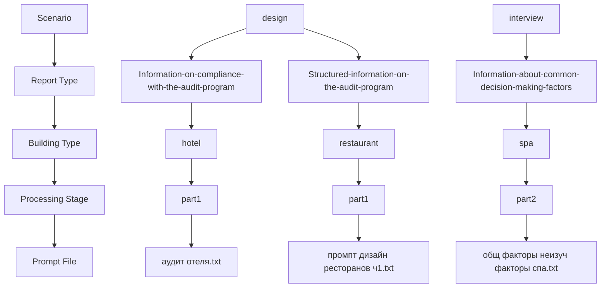
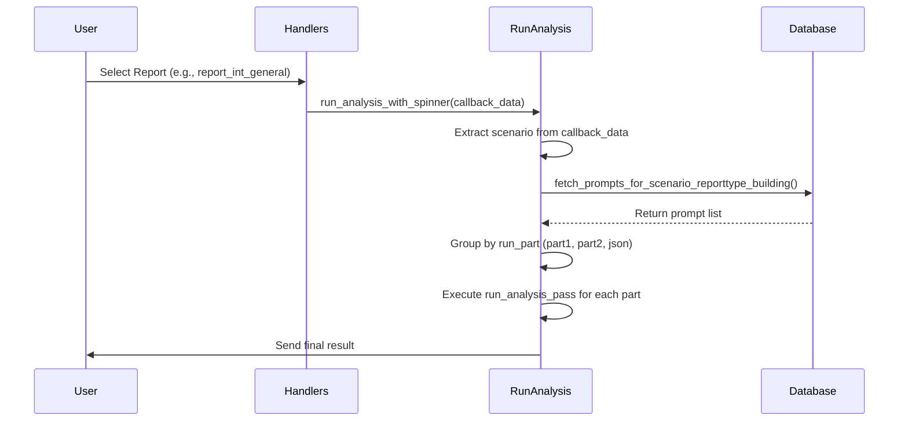

# Prompt Organization by Scenario

<cite>
**Referenced Files in This Document**   
- [run_analysis.py](file://src/run_analysis.py)
- [handlers.py](file://src/handlers.py)
- [datamodels.py](file://src/datamodels.py)
- [analysis.py](file://src/analysis.py)
- [prompts-by-scenario/design](file://prompts-by-scenario/design)
- [prompts-by-scenario/interview](file://prompts-by-scenario/interview)
- [prompts-by-scenario/assign_roles/assign_roles.txt](file://prompts-by-scenario/assign_roles/assign_roles.txt)
</cite>

## Table of Contents
1. [Introduction](#introduction)
2. [Core Scenarios: Design and Interview](#core-scenarios-design-and-interview)
3. [Auxiliary Scenario: Assign Roles](#auxiliary-scenario-assign-roles)
4. [Directory Structure and Report Types](#directory-structure-and-report-types)
5. [Scenario-Based Routing in Analysis Pipeline](#scenario-based-routing-in-analysis-pipeline)
6. [Integration Between Handlers and Prompt Loading](#integration-between-handlers-and-prompt-loading)
7. [Example: Scenario Selection and Execution Flow](#example-scenario-selection-and-execution-flow)
8. [Extending the System with New Scenarios](#extending-the-system-with-new-scenarios)
9. [Conclusion](#conclusion)

## Introduction
The VoxPersona system organizes its analytical capabilities around distinct user intents, represented as scenarios. These scenarios determine the type of analysis performed, the prompts used, and the structure of the output. The primary scenarios are 'design' for audit-focused assessments and 'interview' for decision-making behavior analysis. This document details how these scenarios are structured, how they influence the processing pipeline, and how new scenarios can be integrated into the system.

## Core Scenarios: Design and Interview

The VoxPersona system is built around two primary analytical scenarios: **design** and **interview**. Each scenario corresponds to a different mode of data analysis and serves a distinct business purpose.

The **design** scenario focuses on evaluating compliance and methodology within physical spaces such as hotels, restaurants, and health centers. It is used to assess whether design audits adhere to established programs and standards. This scenario supports structured reporting on audit compliance and methodology effectiveness.

The **interview** scenario analyzes customer interviews to understand decision-making factors. It identifies both general and institution-specific factors that influence client choices. This scenario enables deep qualitative insights into customer behavior and preferences.

These scenarios are implemented as top-level directories under `prompts-by-scenario/`, each containing specialized subdirectories for different report types. The scenario selection directly determines which set of prompts will be loaded and executed during analysis.

**Section sources**
- [datamodels.py](file://src/datamodels.py#L1-L10)
- [run_analysis.py](file://src/run_analysis.py#L100-L120)

## Auxiliary Scenario: Assign Roles

An auxiliary scenario, **assign_roles**, supports preprocessing within the interview workflow. Unlike the primary analysis scenarios, this scenario does not generate final reports but prepares input data for subsequent analysis.

When audio transcripts are processed, the raw text contains unstructured dialogue between a client and an employee. The `assign_roles.txt` prompt, located in `prompts-by-scenario/assign_roles/`, is used to label each utterance with the appropriate speaker tag: `[Client:]` or `[Employee:]`. This role assignment is critical for accurate downstream analysis, as it allows the system to distinguish between customer statements and staff responses.

This functionality is invoked in `handlers.py` when a user uploads an audio file and has selected the interview mode. The `assign_roles` function in `analysis.py` executes this preprocessing step before any report generation occurs.

```mermaid
flowchart TD
A[Raw Interview Transcript] --> B{Scenario: Interview?}
B --> |Yes| C[Apply assign_roles Prompt]
C --> D[Labeled Dialogue<br>[Client:] ...<br>[Employee:] ...]
D --> E[Generate Interview Reports]
B --> |No| F[Proceed to Direct Analysis]
```

**Diagram sources**
- [prompts-by-scenario/assign_roles/assign_roles.txt](file://prompts-by-scenario/assign_roles/assign_roles.txt)
- [handlers.py](file://src/handlers.py#L500-L520)
- [analysis.py](file://src/analysis.py#L450-L490)

**Section sources**
- [prompts-by-scenario/assign_roles/assign_roles.txt](file://prompts-by-scenario/assign_roles/assign_roles.txt)
- [handlers.py](file://src/handlers.py#L500-L520)
- [analysis.py](file://src/analysis.py#L450-L490)

## Directory Structure and Report Types

The `prompts-by-scenario/` directory uses a hierarchical structure to organize prompts by scenario, report type, building type, and processing stage.

Each scenario directory (e.g., `design/`, `interview/`) contains subdirectories corresponding to specific report types:
- `Assessment-of-the-audit-methodology`
- `Information-on-compliance-with-the-audit-program`
- `Structured-information-on-the-audit-program`
- `Information-about-common-decision-making-factors`
- `Information-about-the-decision-making-factors-in-this-institution`
- `Report-on-links`

Within each report type, prompts are further organized by building type (`hotel/`, `restaurant/`, `spa/`) when applicable. Some reports use a `non-building` directory when building-specific variations are not needed.

Each building-specific directory may contain multiple prompt files organized into stages:
- `part1`, `part2`, `part3`: Sequential processing steps for complex analyses
- `json-prompt`: Final structured output generation using JSON formatting

This structure aligns with the application's workflow stages: initial analysis, intermediate processing, and final structured reporting. The system loads prompts based on the selected scenario, report type, and building type, ensuring that the correct analytical path is followed.



**Diagram sources**
- [prompts-by-scenario/design](file://prompts-by-scenario/design)
- [prompts-by-scenario/interview](file://prompts-by-scenario/interview)

**Section sources**
- [prompts-by-scenario/design](file://prompts-by-scenario/design)
- [prompts-by-scenario/interview](file://prompts-by-scenario/interview)

## Scenario-Based Routing in Analysis Pipeline

The scenario selection drives the entire analysis pipeline through conditional logic in `run_analysis.py`. When a user selects a report type, the `run_analysis_with_spinner` function determines the appropriate scenario and loads corresponding prompts from the database.

The function uses the `callback_data` parameter to identify the requested report. Based on prefixes like `report_int_` (interview) or `report_design_`, it sets the `scenario_name` to either "Интервью" or "Дизайн". This scenario name is then used to query the database for relevant prompts via `fetch_prompts_for_scenario_reporttype_building`.

For complex reports like "Общие факторы" (Common Factors) in the interview scenario, the system performs multiple analysis passes. It first processes `part1` and `part2` prompts separately, then combines their outputs for final JSON structured reporting. This multi-stage execution is conditional on the report type and scenario.

The `run_analysis_pass` function executes each stage, showing a loading spinner and saving results to the database. This modular design allows different scenarios to share the same execution framework while maintaining distinct analytical logic.



**Diagram sources**
- [run_analysis.py](file://src/run_analysis.py#L200-L340)
- [handlers.py](file://src/handlers.py#L400-L450)

**Section sources**
- [run_analysis.py](file://src/run_analysis.py#L200-L340)

## Integration Between Handlers and Prompt Loading

The integration between user interaction in `handlers.py` and prompt execution in `run_analysis.py` is mediated through callback data and state management.

When a user selects a scenario (e.g., "Interview" or "Design") via a callback query, `handle_mode_selection` in `handlers.py` sets the user's mode in `user_states`. Later, when a report is selected, `handle_report` determines whether building type selection is required and either processes immediately or prompts the user for additional input.

Once all required parameters are collected, `preprocess_report_without_buildings` calls `run_analysis_with_spinner`, passing the `callback_data` that identifies the specific report. This string (e.g., `report_int_general`) is mapped to a human-readable label via `REPORT_MAPPING` in `datamodels.py` and used to retrieve the correct prompts.

The `data` dictionary passed to `run_analysis_with_spinner` contains all contextual information (employee, place, building type, etc.) needed to personalize the analysis. This seamless integration ensures that user intent expressed through the interface is accurately translated into the appropriate analytical workflow.

**Section sources**
- [handlers.py](file://src/handlers.py#L350-L450)
- [datamodels.py](file://src/datamodels.py#L30-L40)
- [run_analysis.py](file://src/run_analysis.py#L200-L220)

## Example: Scenario Selection and Execution Flow

Consider a user selecting the "Common Factors" report for a restaurant interview:

1. User selects "Interview" mode → `mode` set to "interview" in `user_states`
2. User selects "Common Factors" report → `callback_data = "report_int_general"`
3. System detects building-specific report → prompts user to select "restaurant"
4. User selects "restaurant" → `building_type = "restaurant"` stored in `data`
5. `preprocess_report_without_buildings` calls `run_analysis_with_spinner`
6. `run_analysis_with_spinner` extracts `scenario_name = "Интервью"`
7. `fetch_prompts_for_scenario_reporttype_building` retrieves:
   - `part1` prompt: "общ факторы ресторан 1.txt"
   - `part2` prompt: "общ факторы ресторан неизуч факторы.txt"
   - `json-prompt`: "Интервью. общие факторы. ресторан. Json.txt"
8. System executes `run_analysis_pass` for `part1`, then `part2`
9. Combines results and runs final pass with `json-prompt`
10. Returns structured analysis of common decision-making factors

This flow demonstrates how scenario selection cascades through the system, determining prompt retrieval, processing sequence, and final output format.

**Section sources**
- [handlers.py](file://src/handlers.py#L400-L450)
- [run_analysis.py](file://src/run_analysis.py#L250-L300)

## Extending the System with New Scenarios

New scenarios can be added by following the existing architectural pattern:

1. **Create a new directory** under `prompts-by-scenario/` using lowercase English (e.g., `new_scenario/`)
2. **Define report types** as subdirectories, mirroring the naming convention (e.g., `Assessment-of-X`)
3. **Organize prompts** by building type and processing stage (`part1`, `json-prompt`, etc.)
4. **Add mapping entries** in `datamodels.py`:
   - Extend `mapping_scenario_names` with new key-value pair
   - Define new report type mappings if needed
5. **Register handlers** in `handlers.py`:
   - Add new callback data identifiers
   - Implement selection logic in `handle_mode_selection` or similar
6. **Update routing logic** in `run_analysis.py` to recognize new scenario prefixes

The system's modular design ensures that new scenarios can leverage existing execution infrastructure (`run_analysis_with_spinner`, `run_analysis_pass`) without modifying core analysis functions. The database-driven prompt loading mechanism automatically supports new scenarios once their entries are added to the prompts table.

**Section sources**
- [datamodels.py](file://src/datamodels.py#L1-L20)
- [run_analysis.py](file://src/run_analysis.py#L200-L220)
- [handlers.py](file://src/handlers.py#L300-L350)

## Conclusion
The VoxPersona system's prompt organization by scenario provides a flexible and scalable framework for conducting different types of analyses. By clearly separating concerns through the 'design' and 'interview' scenarios, and supporting auxiliary functions like role assignment, the system maintains clarity while enabling complex multi-stage processing. The hierarchical directory structure, combined with dynamic prompt loading and scenario-based routing, allows for easy extension and maintenance of analytical capabilities.