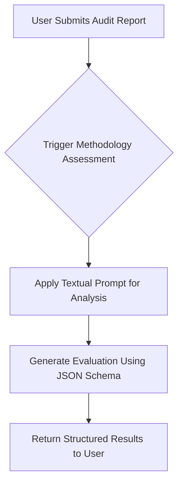
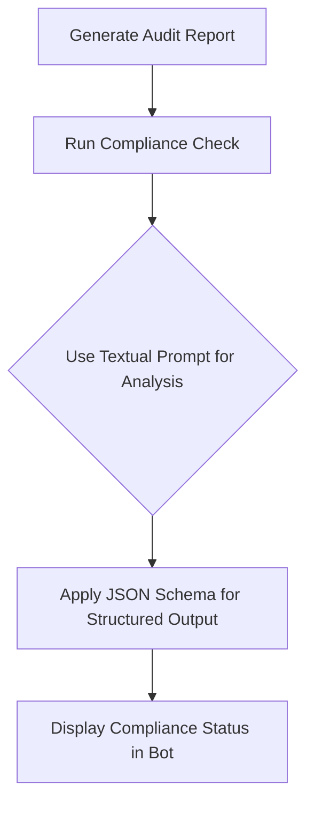
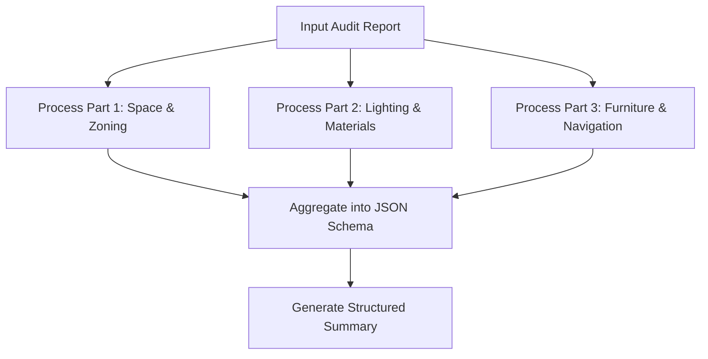
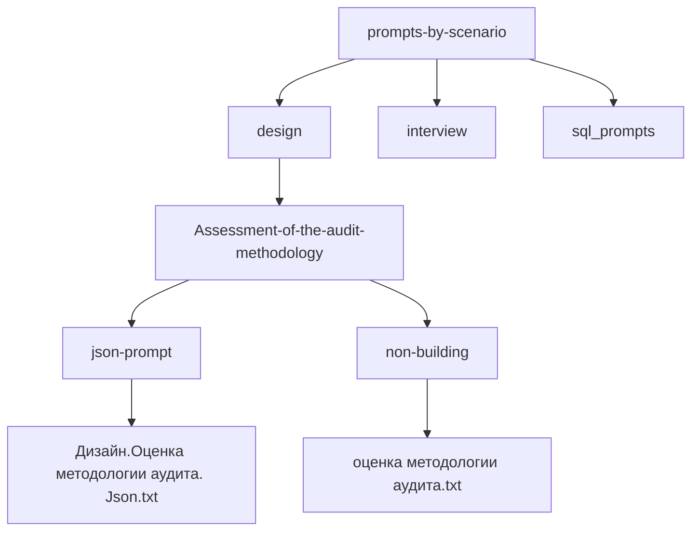

# Prompt Types and Directory Structure

<cite>
**Referenced Files in This Document**   
- [design_audit_methodology.txt](file://prompts/design_audit_methodology.txt)
- [hotel_audit_compliance.txt](file://prompts/hotel_audit_compliance.txt)
- [structured_hotel_audit.txt](file://prompts/structured_hotel_audit.txt)
- [interview_methodology.txt](file://prompts/interview_methodology.txt)
- [interview_general_factors_hotel.txt](file://prompts/interview_general_factors_hotel.txt)
- [interview_specific_factors_hotel.txt](file://prompts/interview_specific_factors_hotel.txt)
- [Дизайн.Оценка методологии аудита. Json.txt](file://prompts-by-scenario/design/Assessment-of-the-audit-methodology/json-prompt/Дизайн.Оценка методологии аудита. Json.txt)
- [Дизайн. Соответствие программе аудита. Отель. Json.txt](file://prompts-by-scenario/design/Information-on-compliance-with-the-audit-program/hotel/json-prompt/Дизайн. Соответствие программе аудита. Отель. Json.txt)
- [Дизайн. Структ отчет отель. Подсчет пунктов информации. json.txt](file://prompts-by-scenario/design/Structured-information-on-the-audit-program/hotel/json-prompt/Дизайн. Структ отчет отель. Подсчет пунктов информации. json.txt)
- [Интервью.  Оценка методологии интервью. Итоговая оценка качества интервью.txt](file://prompts-by-scenario/interview/Assessment-of-the-interview-methodology/json-prompt/Интервью.  Оценка методологии интервью. Итоговая оценка качества интервью.txt)
- [Интервью. Общие факторы отель. Json.txt](file://prompts-by-scenario/interview/Information-about-common-decision-making-factors/hotel/json-prompt/Интервью. Общие факторы отель. Json.txt)
- [Интервью. факторы в этом заведении. отель. json.txt](file://prompts-by-scenario/interview/Information-about-the-decision-making-factors-in-this-institution/hotel/json-prompt/Интервью. факторы в этом заведении. отель. json.txt)
- [Интервью. Отчет о связках..txt](file://prompts-by-scenario/interview/Report-on-links/json-prompt/Интервью. Отчет о связках..txt)
</cite>

## Table of Contents
1. [Introduction](#introduction)
2. [Prompt Categories Overview](#prompt-categories-overview)
3. [Methodology Assessment Prompts](#methodology-assessment-prompts)
4. [Compliance Reporting Prompts](#compliance-reporting-prompts)
5. [Structured Audit Reporting Prompts](#structured-audit-reporting-prompts)
6. [Common Decision Factors Prompts](#common-decision-factors-prompts)
7. [Institution-Specific Factors Prompts](#institution-specific-factors-prompts)
8. [Link Reporting Prompts](#link-reporting-prompts)
9. [Directory Structure and Organization](#directory-structure-and-organization)
10. [Best Practices for Prompt Design](#best-practices-for-prompt-design)

## Introduction
VoxPersona utilizes a structured prompt system to guide LLM-based analysis across multiple domains, including design audits and customer interviews. These prompts are categorized by purpose and scenario, enabling consistent, high-quality output across different institutional types such as hotels, restaurants, and health centers. This document details the six primary prompt categories used in the system: methodology assessment, compliance reporting, structured audit reporting, common decision factors, institution-specific factors, and link reporting. Each category serves a distinct analytical function and is implemented through a combination of textual instructions and JSON schema prompts to ensure structured, reliable responses.

**Section sources**
- [design_audit_methodology.txt](file://prompts/design_audit_methodology.txt)
- [interview_methodology.txt](file://prompts/interview_methodology.txt)

## Prompt Categories Overview
The VoxPersona prompt system is organized into six core categories, each designed to extract specific types of insights from LLMs. These categories are mapped to user workflows in the Telegram bot interface and support both qualitative and structured data extraction. The system uses two primary formats: free-text prompts for narrative analysis and JSON schema prompts for standardized, machine-readable output. This dual approach ensures flexibility in analysis while maintaining consistency in data structure.

The directory structure reflects this categorization, with prompts organized under `prompts` for simplified versions and `prompts-by-scenario` for detailed, scenario-specific implementations. Each prompt type is tailored to a specific phase of the research workflow, from evaluating interview quality to extracting decision-making factors.

## Methodology Assessment Prompts
Methodology assessment prompts are used to evaluate the quality of audit or interview processes against predefined standards. These prompts analyze whether the methodology was followed correctly, focusing on completeness, depth, and adherence to procedural guidelines.

### Structure
These prompts are multi-part, combining a textual analysis component with a JSON schema output requirement. The textual part provides detailed guidance to the LLM on what aspects to evaluate, while the JSON schema ensures standardized output.

### Textual Prompts
Located in `non-building` subdirectories, these prompts provide comprehensive instructions for assessing methodology. For example, `оценка методологии аудита.txt` evaluates design audits by checking for on-site visual inspection, supplementary information gathering, and report structure.

### JSON Schema Prompts
Found in `json-prompt` directories, these enforce structured output. For instance, `Дизайн.Оценка методологии аудита. Json.txt` defines a JSON schema that requires fields such as `compliance_score`, `strengths`, `improvement_areas`, and `overall_assessment`.

### Example Usage
When a user submits an audit report via the Telegram bot, the system triggers the methodology assessment workflow. The LLM evaluates the report using the textual prompt and returns a structured JSON response that can be parsed and displayed in the interface.

**Diagram sources**
- [design_audit_methodology.txt](file://prompts/design_audit_methodology.txt)
- [Дизайн.Оценка методологии аудита. Json.txt](file://prompts-by-scenario/design/Assessment-of-the-audit-methodology/json-prompt/Дизайн.Оценка методологии аудита. Json.txt)

**Section sources**
- [design_audit_methodology.txt](file://prompts/design_audit_methodology.txt)
- [Дизайн.Оценка методологии аудита. Json.txt](file://prompts-by-scenario/design/Assessment-of-the-audit-methodology/json-prompt/Дизайн.Оценка методологии аудита. Json.txt)

## Compliance Reporting Prompts
Compliance reporting prompts assess whether a given report adheres to the required methodological framework. They are used to verify that all necessary components of an audit or interview were executed.

### Structure
These are typically single-part prompts, either textual or JSON-based, depending on the output format needed.

### Textual Prompts
Files like `hotel_audit_compliance.txt` contain instructions for checking compliance with audit methodology across key sections: on-site visual inspection, supplementary information gathering, and report formation. The prompt requires the LLM to cite specific passages from the input to justify its evaluation.

### JSON Schema Prompts
The corresponding JSON prompt, `Дизайн. Соответствие программе аудита. Отель. Json.txt`, structures the output with fields such as `visual_inspection_compliance`, `information_gathering_compliance`, and `report_formation_compliance`, each expecting values like "fully_compliant", "partially_compliant", or "non_compliant".

### Integration with Bot Interface
In the Telegram bot, compliance reports are generated automatically after a methodology assessment. Users receive both a narrative summary and a structured compliance scorecard.

**Diagram sources**
- [hotel_audit_compliance.txt](file://prompts/hotel_audit_compliance.txt)
- [Дизайн. Соответствие программе аудита. Отель. Json.txt](file://prompts-by-scenario/design/Information-on-compliance-with-the-audit-program/hotel/json-prompt/Дизайн. Соответствие программе аудита. Отель. Json.txt)

**Section sources**
- [hotel_audit_compliance.txt](file://prompts/hotel_audit_compliance.txt)
- [Дизайн. Соответствие программе аудита. Отель. Json.txt](file://prompts-by-scenario/design/Information-on-compliance-with-the-audit-program/hotel/json-prompt/Дизайн. Соответствие программе аудита. Отель. Json.txt)

## Structured Audit Reporting Prompts
Structured audit reporting prompts are used to extract standardized information from audit reports, enabling quantitative analysis and comparison across multiple audits.

### Structure
These are multi-part prompts, often split into several text files (e.g., `part1`, `part2`, `part3`) that guide the LLM through different aspects of the audit.

### Textual Prompts
Files like `аудит отель структ 1.txt` and `аудит отель структ ч2.txt` break down the audit into components such as space zoning, lighting, materials, furniture, navigation, and decoration. Each part focuses on a specific aspect of the audit.

### JSON Schema Prompts
The file `Дизайн. Структ отчет отель. Подсчет пунктов информации. json.txt` defines a comprehensive JSON schema that includes fields for each audit component, with subfields for positive aspects, negative aspects, and recommendations.

### Use Case
This prompt type is used when generating structured summaries of audits for management review. The multi-part structure ensures thorough coverage, while the JSON output enables integration with data dashboards.

**Diagram sources**
- [structured_hotel_audit.txt](file://prompts/structured_hotel_audit.txt)
- [Дизайн. Структ отчет отель. Подсчет пунктов информации. json.txt](file://prompts-by-scenario/design/Structured-information-on-the-audit-program/hotel/json-prompt/Дизайн. Структ отчет отель. Подсчет пунктов информации. json.txt)

**Section sources**
- [structured_hotel_audit.txt](file://prompts/structured_hotel_audit.txt)
- [Дизайн. Структ отчет отель. Подсчет пунктов информации. json.txt](file://prompts-by-scenario/design/Structured-information-on-the-audit-program/hotel/json-prompt/Дизайн. Структ отчет отель. Подсчет пунктов информации. json.txt)

## Common Decision Factors Prompts
These prompts extract general factors that influence customer decisions across a category (e.g., hotels, restaurants).

### Structure
Multi-part, with separate textual and JSON components.

### Textual Prompts
`interview_general_factors_hotel.txt` instructs the LLM to identify factors such as location, appearance, atmosphere, and pricing. It requires citation of specific quotes from the interview transcript.

### JSON Schema Prompts
`Интервью. Общие факторы отель. Json.txt` structures the output with fields like `location_and_accessibility`, `visual_appearance`, `emotional_perception`, and `price_expectations`, each containing a list of supporting quotes.

### Application
Used in market research to identify industry-wide trends. The structured output allows for aggregation across multiple interviews.

**Section sources**
- [interview_general_factors_hotel.txt](file://prompts/interview_general_factors_hotel.txt)
- [Интервью. Общие факторы отель. Json.txt](file://prompts-by-scenario/interview/Information-about-common-decision-making-factors/hotel/json-prompt/Интервью. Общие факторы отель. Json.txt)

## Institution-Specific Factors Prompts
These prompts focus on unique aspects that influence the choice of a particular establishment.

### Structure
Single-part textual prompt with corresponding JSON schema.

### Textual Prompts
`interview_specific_factors_hotel.txt` directs the LLM to identify unique features, local conditions, and emotional/practical aspects specific to the interviewed venue.

### JSON Schema Prompts
`Интервью. факторы в этом заведении. отель. json.txt` captures findings in structured fields such as `unique_features`, `local_conditions`, and `emotional_aspects`, each with supporting quotes.

### Purpose
Enables comparative analysis between venues by highlighting differentiating factors.

**Section sources**
- [interview_specific_factors_hotel.txt](file://prompts/interview_specific_factors_hotel.txt)
- [Интервью. факторы в этом заведении. отель. json.txt](file://prompts-by-scenario/interview/Information-about-the-decision-making-factors-in-this-institution/hotel/json-prompt/Интервью. факторы в этом заведении. отель. json.txt)

## Link Reporting Prompts
Link reporting prompts are used to extract causal relationships ("связки") from interview transcripts.

### Structure
Combines a textual prompt (`промпт связки.txt`) with a JSON schema (`Интервью. Отчет о связках..txt`).

### Functionality
The LLM identifies cause-effect pairs in customer narratives, such as "Because the lobby was crowded, I felt uncomfortable, so I chose a different hotel."

### Output Format
The JSON schema includes fields for `cause`, `effect`, `emotion`, and `decision_impact`, enabling systematic analysis of customer behavior.

**Section sources**
- [Интервью. Отчет о связках..txt](file://prompts-by-scenario/interview/Report-on-links/json-prompt/Интервью. Отчет о связках..txt)
- [промпт связки.txt](file://prompts-by-scenario/interview/Report-on-links/non-building/промпт связки.txt)

## Directory Structure and Organization
The prompt system is organized into two main directories: `prompts` and `prompts-by-scenario`.

### `prompts` Directory
Contains simplified, general-purpose prompt templates used across scenarios.

### `prompts-by-scenario` Directory
Organized hierarchically:
- Top-level: `design`, `interview`, `sql_prompts`
- Second level: specific task (e.g., `Assessment-of-the-audit-methodology`)
- Third level: `json-prompt` and `non-building` (for textual prompts)
- Fourth level: scenario-specific subdirectories (e.g., `hotel`, `restaurant`)

This structure enables reuse of common logic while allowing customization for specific use cases.

**Diagram sources**
- [prompts-by-scenario](file://prompts-by-scenario)

## Best Practices for Prompt Design
To maintain consistency and effectiveness across prompt types:

1. **Clear Role Definition**: Always begin with "Ты – эксперт..." to establish the LLM's role.
2. **Structured Output**: Use JSON schemas for any data that will be processed programmatically.
3. **Citation Requirement**: Require direct quotes from input to justify analytical conclusions.
4. **Scenario-Specific Customization**: Tailor prompts to the unique characteristics of each institution type.
5. **Multi-Part Design**: Break complex analyses into sequential parts for better focus.
6. **Avoid Redundancy**: Ensure each prompt has a distinct purpose and does not overlap unnecessarily with others.
7. **Consistent Naming**: Use a standardized naming convention that reflects category, scenario, and format.

These practices ensure that prompts are effective, maintainable, and aligned with the overall research objectives of VoxPersona.

**Section sources**
- [design_audit_methodology.txt](file://prompts/design_audit_methodology.txt)
- [interview_methodology.txt](file://prompts/interview_methodology.txt)
- [structured_hotel_audit.txt](file://prompts/structured_hotel_audit.txt)