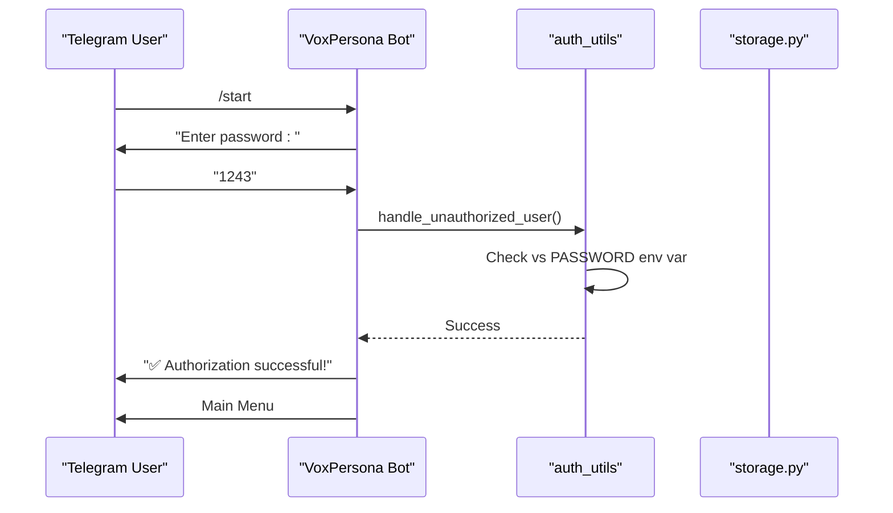
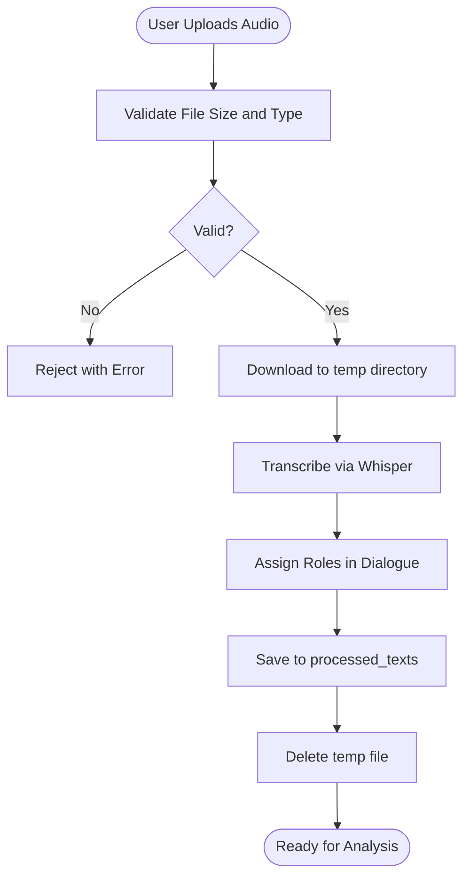

# Security Considerations

<cite>
**Referenced Files in This Document**   
- [config.py](file://src/config.py)
- [auth_utils.py](file://src/auth_utils.py)
- [audio_utils.py](file://src/audio_utils.py)
- [validators.py](file://src/validators.py)
- [storage.py](file://src/storage.py)
- [db_handler/db.py](file://src/db_handler/db.py)
- [handlers.py](file://src/handlers.py)
- [analysis.py](file://src/analysis.py)
- [DEPLOYMENT_GUIDE.md](file://DEPLOYMENT_GUIDE.md) - *Updated in recent commit*
- [.github/DEPLOYMENT_SETUP.md](file://.github/DEPLOYMENT_SETUP.md) - *Added in recent commit*
</cite>

## Update Summary
**Changes Made**   
- Added new section on GitHub Actions deployment security
- Updated API key management section with GitHub Secrets integration
- Enhanced recommendations for production deployment security
- Added references to new deployment-related files
- Updated document sources to reflect new and modified files

## Table of Contents
1. [API Key Management](#api-key-management)
2. [Data Protection for Audio and Transcriptions](#data-protection-for-audio-and-transcriptions)
3. [Access Control and Authentication](#access-control-and-authentication)
4. [Privacy and Regulatory Compliance](#privacy-and-regulatory-compliance)
5. [Secure Coding Practices](#secure-coding-practices)
6. [Recommendations for PostgreSQL and MinIO Security](#recommendations-for-postgresql-and-minio-security)
7. [GitHub Actions Deployment Security](#github-actions-deployment-security)

## API Key Management

The VoxPersona application securely manages API keys for external services such as OpenAI and Anthropic. These keys are not hardcoded into the source code but are instead loaded from environment variables using the `python-dotenv` library. This approach ensures that sensitive credentials are kept outside the codebase and can be managed independently per deployment environment.

In `config.py`, the following environment variables are used to retrieve API keys:
- `OPENAI_API_KEY`: For Whisper-based audio transcription.
- `ANTHROPIC_API_KEY`, `ANTHROPIC_API_KEY_2`, ..., `ANTHROPIC_API_KEY_7`: Multiple keys for Claude models, enabling load balancing and rate limit management.
- `TELEGRAM_BOT_TOKEN`, `API_ID`, `API_HASH`: For Telegram bot integration via Pyrogram.

A validation check at startup ensures that essential keys are defined:
```python
if not all([OPENAI_API_KEY, ANTHROPIC_API_KEY, TELEGRAM_BOT_TOKEN, API_ID, API_HASH]):
    raise ValueError("Not all keys (OPENAI_API_KEY, ANTHROPIC_API_KEY, TELEGRAM_BOT_TOKEN, API_ID, API_HASH) are defined!")
```

This prevents the application from starting with missing credentials, reducing the risk of misconfiguration in production. Additionally, the deployment process now leverages GitHub Secrets to securely store and manage these API keys, eliminating the need for manual configuration and reducing exposure risk.

**Section sources**
- [config.py](file://src/config.py#L1-L93)
- [DEPLOYMENT_GUIDE.md](file://DEPLOYMENT_GUIDE.md#L57-L109) - *Updated in recent commit*

## Data Protection for Audio and Transcriptions

### Encryption in Transit
All audio files and transcriptions are transmitted over secure channels:
- Audio files are uploaded to MinIO using HTTP(S), with the connection secured via TLS.
- Communication with OpenAI and Anthropic APIs occurs over HTTPS, ensuring end-to-end encryption during external service calls.

### Encryption at Rest
While the current implementation does not explicitly encrypt stored audio or text files on disk, the application uses MinIO as an object storage backend. MinIO supports server-side encryption (SSE) which can be enabled in production to encrypt data at rest. The application stores audio files in a dedicated MinIO bucket (`MINIO_AUDIO_BUCKET_NAME`) and text files in local directories defined in `STORAGE_DIRS`.

Audio files are stored in `/root/Vox/VoxPersona/audio_files`, and transcriptions are saved in structured directories. To enhance security, these directories should be configured with strict file system permissions and, optionally, full-disk encryption.

The application also temporarily stores processed audio in a `temp_audio` directory during transcription, which is cleaned up after processing using `delete_tmp_dir` and `delete_tmp_file` functions in `storage.py`.

**Section sources**
- [config.py](file://src/config.py#L1-L93)
- [storage.py](file://src/storage.py#L1-L309)
- [handlers.py](file://src/handlers.py#L1-L799)

## Access Control and Authentication

### Telegram Bot Authentication
The application implements a simple password-based authentication mechanism for Telegram users. When a user sends `/start`, they are prompted to enter a password. If the password matches the value of the `PASSWORD` environment variable, the user is added to the `authorized_users` set.

This logic is handled in `auth_utils.py`:
```python
def handle_unauthorized_user(authorized_users: set, message: Message, app: Client):
    if message.text.strip() == PASSWORD:
        authorize_user(authorized_users, message.chat.id, app)
    else:
        request_password(message.chat.id, app)
```

Once authorized, the user gains access to the main menu and analysis features. The `authorized_users` set resides in memory, meaning access control state is lost on restart. For enhanced security, this could be persisted to a database with session tokens.

### Role-Based Access Via State Management
The application uses a `user_states` dictionary to track user interaction states, including mode (`interview` or `design`), input data, and confirmation steps. This prevents unauthorized access to report generation unless all required fields are validated.

Input validation is enforced through the `validators.py` module, which includes checks for:
- Valid building types (`validate_building_type`)
- Correct date formats (`validate_date_format`)
- Authorized user status (`check_authorized`)

These validations ensure that only authenticated and properly guided users can trigger analysis workflows.



**Diagram sources**
- [auth_utils.py](file://src/auth_utils.py#L1-L17)
- [handlers.py](file://src/handlers.py#L1-L799)

**Section sources**
- [auth_utils.py](file://src/auth_utils.py#L1-L17)
- [handlers.py](file://src/handlers.py#L1-L799)

## Privacy and Regulatory Compliance

### Processing of Personal Data
The application processes personal data during hospitality interviews, including:
- Employee names (`employee_name`)
- Client names (`client_name`)
- Audio recordings of conversations

This data is stored in PostgreSQL in tables such as `employee`, `client`, and `transcription`. To comply with GDPR and similar regulations, the following practices should be implemented:

1. **Data Minimization**: Only collect necessary fields. The current implementation allows optional city and zone fields, which aligns with this principle.
2. **Purpose Limitation**: Data is used solely for audit and interview analysis. No secondary usage is evident in the code.
3. **Storage Limitation**: Implement automated data retention policies. Currently, data is stored indefinitely unless manually deleted.
4. **Right to Erasure**: Users can delete files via the storage menu, but database records are not automatically purged. A GDPR-compliant deletion workflow should be added.

### Anonymization and Pseudonymization
The application does not currently anonymize transcriptions. For enhanced privacy, consider:
- Automatically redacting names and identifiers from transcriptions before storage.
- Using pseudonyms in reports instead of real names.
- Storing audio files with obfuscated filenames using `safe_filename`, which transliterates Cyrillic characters.

### Consent and Transparency
The application lacks an explicit consent mechanism for recording and processing interviews. In a production environment, users should be prompted to confirm consent before audio processing begins.

**Section sources**
- [db_handler/db.py](file://src/db_handler/db.py#L1-L398)
- [storage.py](file://src/storage.py#L1-L309)

## Secure Coding Practices

### Input Validation
The `validators.py` module enforces strict input validation:
- `validate_date_format()` uses regex to ensure dates follow `YYYY-MM-DD`.
- `check_audio_file_size()` prevents denial-of-service via large file uploads (limit: 2GB).
- `validate_building_type()` sanitizes user input for building types, mapping variations to standard values.

These checks are integrated into the handler flow, ensuring that invalid data does not proceed to analysis or storage.

### Error Handling and Logging
The application uses structured logging via Python’s `logging` module. Sensitive information such as full API keys is not logged. However, error messages may expose internal logic. To improve:
- Avoid exposing stack traces to users.
- Use generic error messages in production.
- Log only sanitized data.

### Protection Against Injection Attacks
- **SQL Injection**: All database queries use parameterized statements via `psycopg2`. For example, in `db.py`:
  ```python
  cursor.execute('SELECT "client_id" FROM "client" WHERE "client_name" = %s', (client_name,))
  ```
  This prevents SQL injection by separating code from data.
- **Prompt Injection**: The application uses predefined prompts from the database or files. User input is passed as content, not as part of the prompt structure, reducing injection risk.

### Secure File Handling
- Filenames are sanitized using `safe_filename()` to prevent path traversal.
- Temporary files are deleted after processing.
- File uploads are restricted to authorized users only.



**Diagram sources**
- [validators.py](file://src/validators.py#L1-L49)
- [handlers.py](file://src/handlers.py#L1-L799)

**Section sources**
- [validators.py](file://src/validators.py#L1-L49)
- [handlers.py](file://src/handlers.py#L1-L799)

## Recommendations for PostgreSQL and MinIO Security

### PostgreSQL
1. **Use Strong Credentials**: Ensure `DB_USER` and `DB_PASSWORD` are complex and rotated regularly.
2. **Network Isolation**: Run PostgreSQL in a private network, not exposed to the internet.
3. **Enable SSL/TLS**: Configure PostgreSQL to require encrypted connections.
4. **Role-Based Access Control**: Limit database user permissions to only required operations (e.g., `SELECT`, `INSERT`).
5. **Regular Backups and Auditing**: Enable logging of login attempts and data changes.

### MinIO
1. **Enable Server-Side Encryption (SSE)**: Use SSE-S3 or SSE-KMS to encrypt data at rest.
2. **Use Strong Access Keys**: Generate long, random `MINIO_ACCESS_KEY` and `MINIO_SECRET_KEY`.
3. **Bucket Policies**: Restrict bucket access by IP or service account.
4. **Enable TLS**: Serve MinIO over HTTPS only.
5. **Regular Updates**: Keep MinIO updated to patch security vulnerabilities.

Both services should be deployed using Docker with non-root users and minimal privileges, as defined in the `docker-compose.yml` and `Dockerfile`.

**Section sources**
- [config.py](file://src/config.py#L1-L93)
- [handlers.py](file://src/handlers.py#L1-L799)

## GitHub Actions Deployment Security

The VoxPersona application now features an intelligent GitHub Actions deployment system that enhances security by replacing webhook endpoints with SSH key authentication. This new deployment system uses GitHub Secrets to securely manage sensitive data, eliminating the risk of exposure through configuration files.

The deployment process automatically determines the optimal strategy based on file changes:
- **NO_RESTART** (5-10s): Documentation changes only
- **APP_ONLY** (30-60s): Application code changes
- **FULL_RESTART** (2-3min): Infrastructure changes

Required deployment secrets include:
- `SSH_PRIVATE_KEY`: SSH key for server access
- `SERVER_IP`: Deployment server IP address
- `SERVER_USER`: SSH username for server access

Application secrets are also securely stored in GitHub Secrets, including:
- `ANTHROPIC_API_KEY`
- `OPENAI_API_KEY`
- `TELEGRAM_BOT_TOKEN`
- `API_ID`
- `API_HASH`
- `DB_PASSWORD`

This approach ensures that all sensitive credentials are protected and never exposed in the codebase or deployment logs.

**Section sources**
- [DEPLOYMENT_GUIDE.md](file://DEPLOYMENT_GUIDE.md#L0-L55) - *Updated in recent commit*
- [.github/DEPLOYMENT_SETUP.md](file://.github/DEPLOYMENT_SETUP.md) - *Added in recent commit*