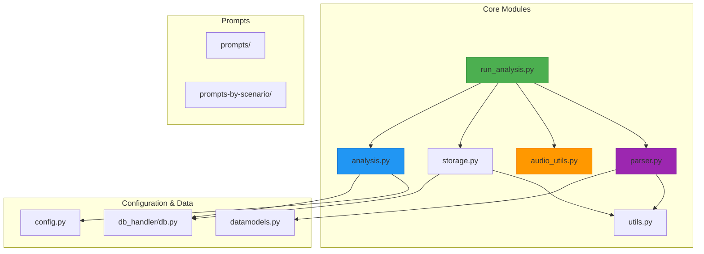
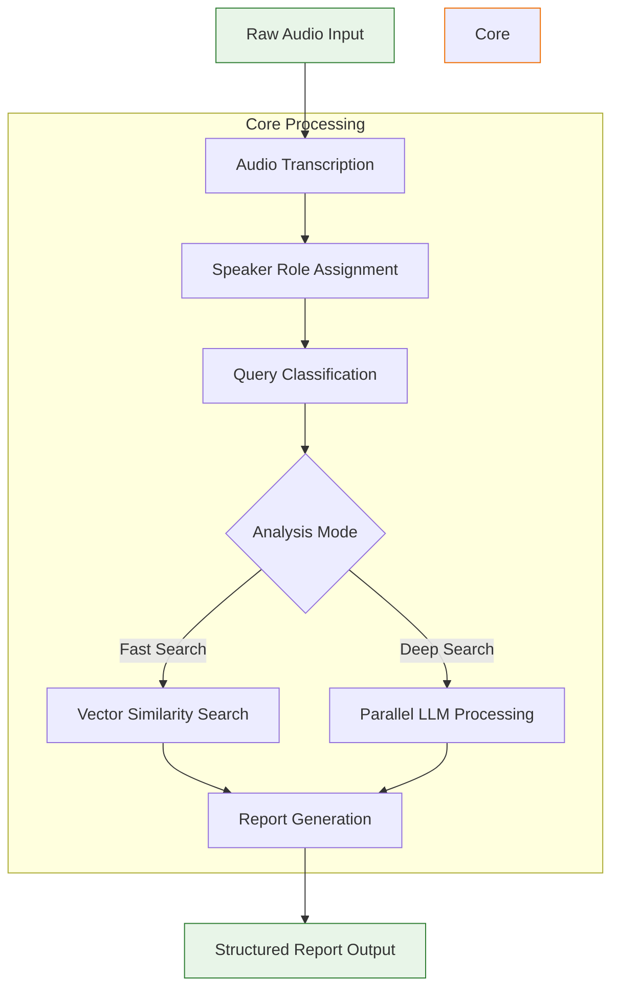
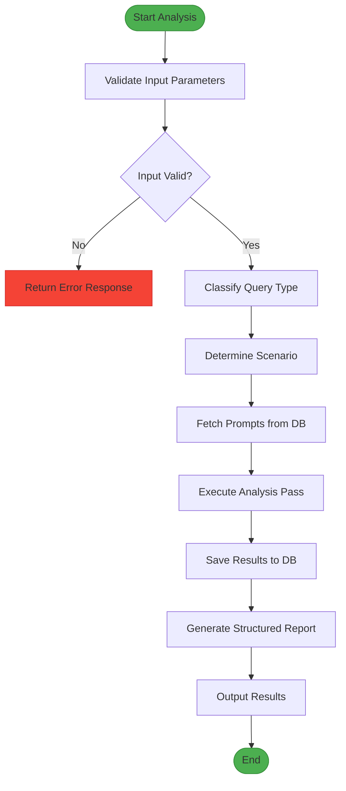
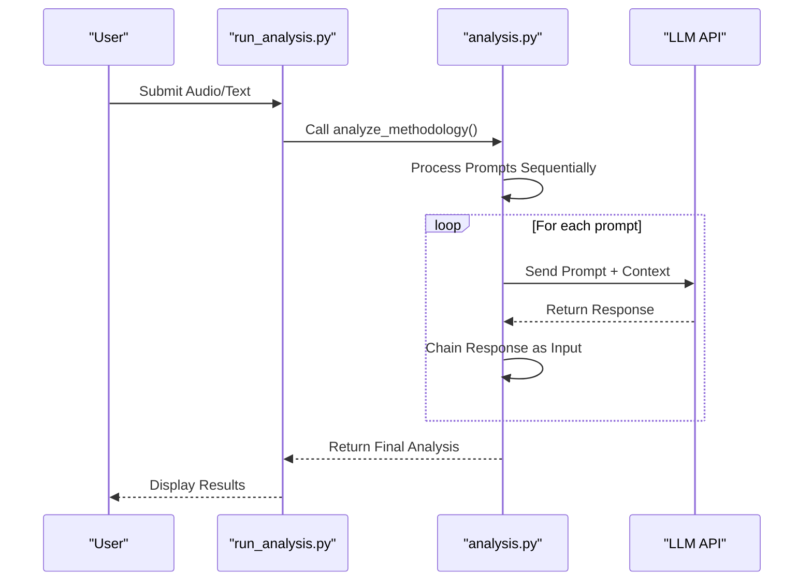
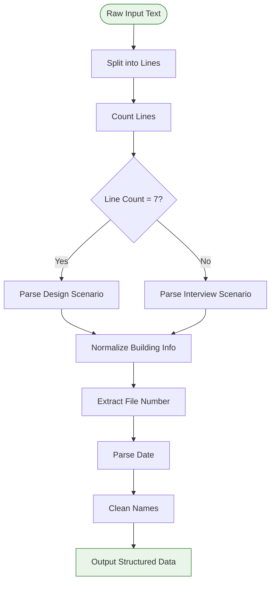
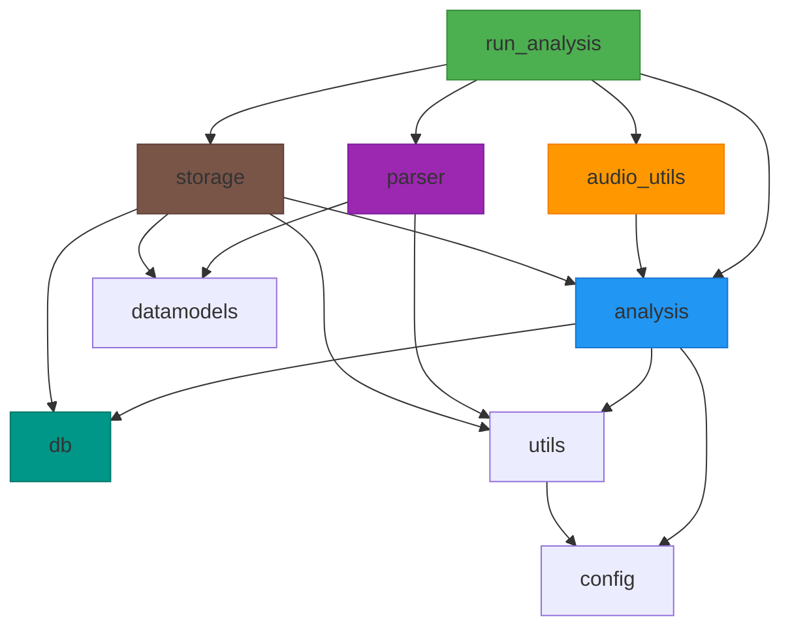

# Analysis Pipeline

<cite>
**Referenced Files in This Document**   
- [run_analysis.py](file://src/run_analysis.py)
- [analysis.py](file://src/analysis.py)
- [audio_utils.py](file://src/audio_utils.py)
- [parser.py](file://src/parser.py)
- [config.py](file://src/config.py)
- [datamodels.py](file://src/datamodels.py)
- [db.py](file://src/db_handler/db.py)
- [storage.py](file://src/storage.py)
- [utils.py](file://src/utils.py)
</cite>

## Table of Contents
1. [Introduction](#introduction)
2. [Project Structure](#project-structure)
3. [Core Components](#core-components)
4. [Architecture Overview](#architecture-overview)
5. [Detailed Component Analysis](#detailed-component-analysis)
6. [Dependency Analysis](#dependency-analysis)
7. [Performance Considerations](#performance-considerations)
8. [Troubleshooting Guide](#troubleshooting-guide)
9. [Conclusion](#conclusion)

## Introduction
The VoxPersona analysis pipeline is a modular system designed to process audio interviews and design audits through a multi-stage orchestration workflow. The pipeline begins with audio transcription, proceeds through speaker role assignment and structured analysis, and culminates in comprehensive report generation. At its core, the system leverages LLM orchestration to extract insights from transcribed content using prompt-based classification and structured data extraction. The architecture supports both fast search (vector-based retrieval) and deep search (parallel LLM processing) modes, enabling flexible analysis strategies. This document details the end-to-end workflow, component interactions, error handling mechanisms, and performance optimization strategies that define the pipeline's operation.

## Project Structure
The VoxPersona project follows a modular structure with clear separation of concerns across functional domains. The core analysis components reside in the `src` directory, while prompts are organized by scenario in dedicated directories. Configuration and environment settings are centralized, and database interactions are abstracted through dedicated handlers.

**Diagram sources**
- [src/run_analysis.py](file://src/run_analysis.py)
- [src/analysis.py](file://src/analysis.py)
- [src/audio_utils.py](file://src/audio_utils.py)
- [src/parser.py](file://src/parser.py)
- [src/storage.py](file://src/storage.py)
- [src/db_handler/db.py](file://src/db_handler/db.py)

**Section sources**
- [src/run_analysis.py](file://src/run_analysis.py)
- [src/analysis.py](file://src/analysis.py)
- [src/audio_utils.py](file://src/audio_utils.py)
- [src/parser.py](file://src/parser.py)
- [src/storage.py](file://src/storage.py)

## Core Components
The analysis pipeline consists of four primary components that work in concert to process audio content and generate structured reports. The `run_analysis.py` module serves as the orchestrator, coordinating the workflow between transcription, analysis, and reporting stages. The `analysis.py` module contains the core logic for LLM interactions, including methodology analysis, transcription, and classification functions. The `audio_utils.py` module handles audio preprocessing and transcription tasks, while the `parser.py` module is responsible for extracting structured data from user inputs and normalizing it for downstream processing. These components interact through well-defined interfaces, enabling modular execution and independent testing.

**Section sources**
- [src/run_analysis.py](file://src/run_analysis.py#L1-L343)
- [src/analysis.py](file://src/analysis.py#L1-L490)
- [src/audio_utils.py](file://src/audio_utils.py#L1-L49)
- [src/parser.py](file://src/parser.py#L1-L174)

## Architecture Overview
The VoxPersona analysis pipeline follows a layered architecture that processes audio content through sequential stages of transcription, role assignment, classification, and report generation. The system is designed to handle both real-time interactive analysis and batch processing workflows. At the orchestration layer, `run_analysis.py` manages the overall workflow, while specialized modules handle domain-specific tasks. The architecture supports two distinct analysis modes: fast search, which uses vector similarity search for rapid retrieval, and deep search, which employs parallel LLM processing for comprehensive analysis. Error handling and retry mechanisms are implemented throughout the pipeline to ensure robustness in the face of API failures or transient issues.

**Diagram sources**
- [src/run_analysis.py](file://src/run_analysis.py#L1-L343)
- [src/analysis.py](file://src/analysis.py#L1-L490)
- [src/audio_utils.py](file://src/audio_utils.py#L1-L49)

## Detailed Component Analysis

### run_analysis.py: Pipeline Orchestration
The `run_analysis.py` module serves as the central orchestrator for the analysis pipeline, managing the end-to-end workflow from input processing to report generation. It implements three primary functions: `init_rags` for initializing retrieval-augmented generation (RAG) databases, `run_dialog_mode` for handling interactive analysis sessions, and `run_analysis_with_spinner` for executing structured analysis workflows. The module supports both fast and deep search modes, allowing users to choose between rapid retrieval and comprehensive analysis. Error handling is implemented through try-except blocks that log exceptions and provide user feedback, while threading is used to display loading animations during processing.

**Section sources**
- [src/run_analysis.py](file://src/run_analysis.py#L1-L343)

#### Pipeline Workflow

**Diagram sources**
- [src/run_analysis.py](file://src/run_analysis.py#L1-L343)

### analysis.py: Core Analysis Logic
The `analysis.py` module contains the core analysis functions that drive the pipeline's intelligence. The `analyze_methodology` function processes text through a sequence of prompts, chaining the output of one prompt as the input to the next, enabling multi-stage analysis. The `transcribe_audio_raw` function handles audio transcription by splitting files into chunks and processing them through the Whisper API. The module implements both synchronous and asynchronous versions of the `extract_from_chunk_parallel` function, supporting both threaded and async/await processing models for handling multiple text chunks. Rate limiting is carefully managed to respect API quotas, with token and request rate calculations ensuring compliance with service limits.

**Section sources**
- [src/analysis.py](file://src/analysis.py#L1-L490)

#### Analysis Methodology Flow

**Diagram sources**
- [src/analysis.py](file://src/analysis.py#L1-L490)

### audio_utils.py: Audio Processing
The `audio_utils.py` module handles audio preprocessing and transcription tasks, serving as the pipeline's interface with raw audio content. The `transcribe_audio_and_save` function coordinates the transcription process, calling into `analysis.py` for actual transcription while managing the storage of results. The module includes utility functions for extracting audio filenames from messages and determining file sizes, supporting integration with the Telegram bot interface. Audio files are processed using the Whisper API, with large files automatically split into manageable chunks to accommodate API limitations.

**Section sources**
- [src/audio_utils.py](file://src/audio_utils.py#L1-L49)

### parser.py: Data Extraction and Normalization
The `parser.py` module is responsible for parsing user inputs and normalizing data for consistent processing throughout the pipeline. It implements functions for extracting structured information from free-form text, including file numbers, dates, employee names, and location details. The module handles linguistic normalization, converting declined forms of building types (e.g., "отеле" to "отель") and removing prepositions to ensure consistent data representation. Zone parsing is supported, allowing the system to handle complex location descriptions like "о центре здоровья при отеле". The parser integrates with validation functions to ensure data integrity before storage.

**Section sources**
- [src/parser.py](file://src/parser.py#L1-L174)

#### Data Parsing Flow

**Diagram sources**
- [src/parser.py](file://src/parser.py#L1-L174)

## Dependency Analysis
The analysis pipeline components are interconnected through a well-defined dependency graph that enables modular operation while maintaining data flow integrity. The `run_analysis.py` module serves as the primary entry point, depending on `analysis.py` for core processing functions, `audio_utils.py` for audio handling, and `parser.py` for data extraction. The `analysis.py` module depends on `config.py` for API keys and model settings, and on `db.py` for prompt retrieval. The `storage.py` module provides database persistence capabilities and depends on multiple components for data processing. Circular dependencies are avoided through careful interface design, with each module exposing well-defined functions that can be called without requiring knowledge of internal implementation details.

**Diagram sources**
- [src/run_analysis.py](file://src/run_analysis.py)
- [src/analysis.py](file://src/analysis.py)
- [src/audio_utils.py](file://src/audio_utils.py)
- [src/parser.py](file://src/parser.py)
- [src/storage.py](file://src/storage.py)
- [src/db_handler/db.py](file://src/db_handler/db.py)

**Section sources**
- [src/run_analysis.py](file://src/run_analysis.py)
- [src/analysis.py](file://src/analysis.py)
- [src/audio_utils.py](file://src/audio_utils.py)
- [src/parser.py](file://src/parser.py)
- [src/storage.py](file://src/storage.py)
- [src/db_handler/db.py](file://src/db_handler/db.py)

## Performance Considerations
The analysis pipeline incorporates several performance optimization strategies to handle large audio files and complex analysis tasks efficiently. Audio files are processed in chunks to accommodate API limitations and enable parallel processing. The deep search mode implements rate limiting based on both token and request quotas, ensuring compliance with API service levels while maximizing throughput. Token usage is carefully monitored, with logging that reports token counts for system prompts, documents, and queries. The system supports parallel processing through both threading and async/await models, allowing it to handle multiple analysis tasks concurrently. For fast search operations, vector similarity search provides rapid retrieval without the computational cost of LLM processing.

**Section sources**
- [src/analysis.py](file://src/analysis.py#L1-L490)
- [src/utils.py](file://src/utils.py#L1-L105)
- [src/config.py](file://src/config.py#L1-L93)

## Troubleshooting Guide
The analysis pipeline includes comprehensive error handling and logging to facilitate troubleshooting and debugging. Common issues include API key authentication failures, rate limiting, and database connectivity problems. The system logs detailed error messages with stack traces, enabling rapid diagnosis of issues. When API calls fail, the system implements retry mechanisms with exponential backoff to handle transient issues. For audio processing, file format compatibility is validated, and appropriate error messages are returned for unsupported formats. Database operations are wrapped in transaction decorators that ensure data consistency and provide meaningful error messages for constraint violations or connection issues.

**Section sources**
- [src/analysis.py](file://src/analysis.py#L1-L490)
- [src/db_handler/db.py](file://src/db_handler/db.py#L1-L398)
- [src/run_analysis.py](file://src/run_analysis.py#L1-L343)

## Conclusion
The VoxPersona analysis pipeline represents a sophisticated system for processing audio content and generating structured reports through LLM orchestration. Its modular architecture enables flexible deployment and independent testing of components, while its comprehensive error handling ensures robust operation in production environments. The pipeline's support for both fast and deep search modes provides users with options for balancing speed and comprehensiveness in their analysis. Through careful attention to performance optimization and token usage, the system delivers efficient processing of audio content while maintaining high-quality output. The clear separation of concerns across components makes the system maintainable and extensible, providing a solid foundation for future enhancements.