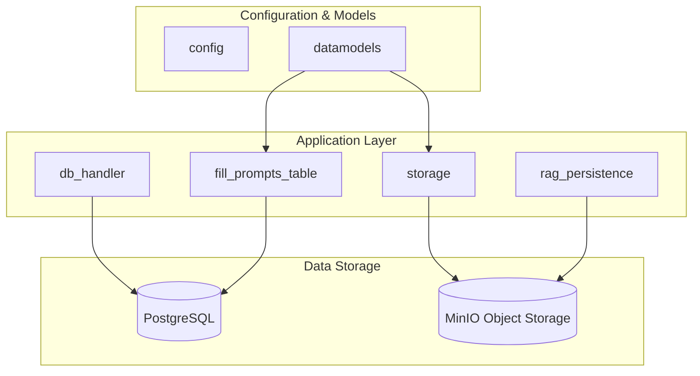
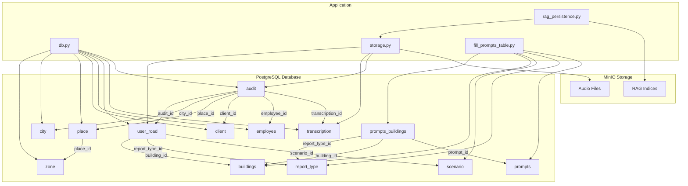
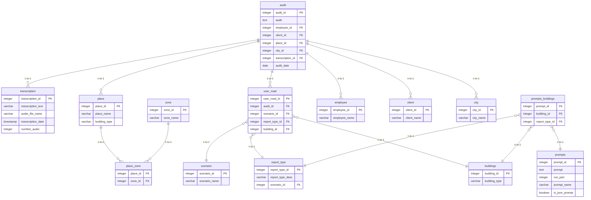
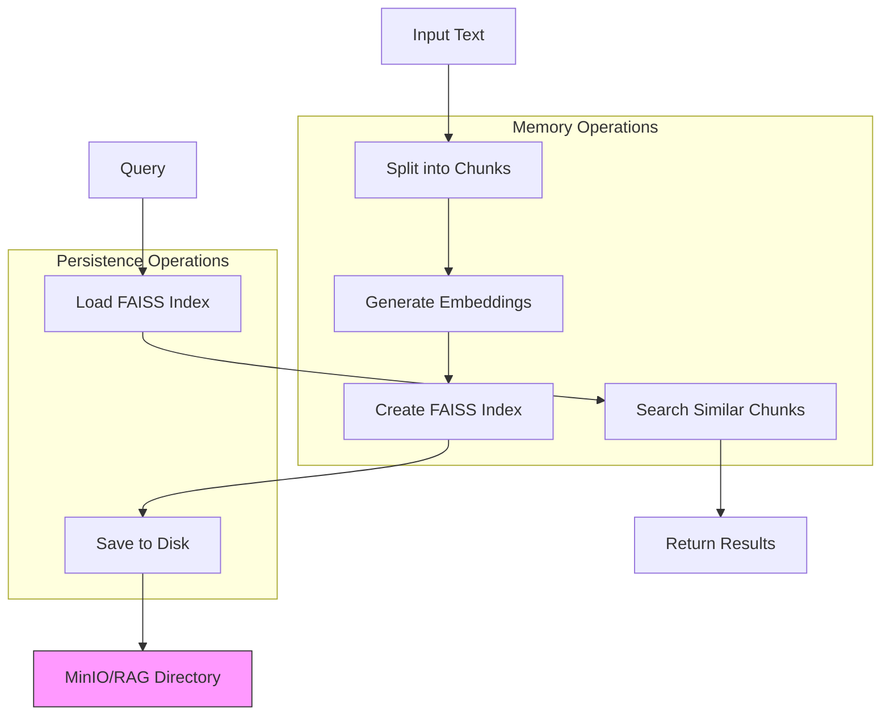
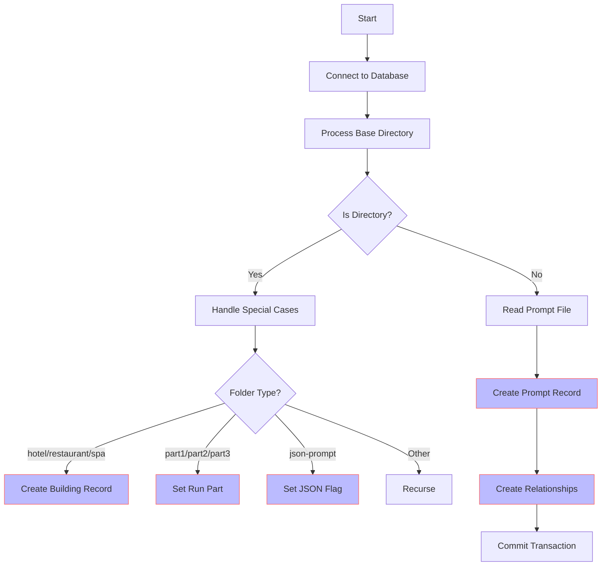

# Data Persistence Layer

<cite>
**Referenced Files in This Document**   
- [db.py](file://src/db_handler/db.py)
- [storage.py](file://src/storage.py)
- [rag_persistence.py](file://src/rag_persistence.py)
- [fill_prompts_table.py](file://src/db_handler/fill_prompts_table.py)
- [datamodels.py](file://src/datamodels.py)
- [step_2_sql_request.txt](file://prompts-by-scenario/sql_prompts/part2/step_2_sql_request.txt)
</cite>

## Table of Contents
1. [Introduction](#introduction)
2. [Project Structure](#project-structure)
3. [Core Components](#core-components)
4. [Architecture Overview](#architecture-overview)
5. [Detailed Component Analysis](#detailed-component-analysis)
6. [Dependency Analysis](#dependency-analysis)
7. [Performance Considerations](#performance-considerations)
8. [Troubleshooting Guide](#troubleshooting-guide)
9. [Conclusion](#conclusion)

## Introduction
This document provides comprehensive documentation for the data persistence architecture in VoxPersona, a system designed to analyze audio interviews and audit reports across different business types including hotels, restaurants, and health centers. The system employs a hybrid storage approach combining PostgreSQL for structured data and MinIO for binary audio files, with an additional RAG (Retrieval-Augmented Generation) index layer for fast semantic search. This documentation details the schema design, data flow, initialization processes, and performance characteristics of the persistence layer.

## Project Structure



**Diagram sources**
- [db.py](file://src/db_handler/db.py)
- [storage.py](file://src/storage.py)
- [rag_persistence.py](file://src/rag_persistence.py)
- [fill_prompts_table.py](file://src/db_handler/fill_prompts_table.py)

**Section sources**
- [db.py](file://src/db_handler/db.py)
- [storage.py](file://src/storage.py)
- [rag_persistence.py](file://src/rag_persistence.py)
- [fill_prompts_table.py](file://src/db_handler/fill_prompts_table.py)

## Core Components

The persistence architecture in VoxPersona consists of three main components: PostgreSQL for structured data storage, MinIO for binary object storage, and FAISS-based RAG indices for semantic search capabilities. The system uses a decorator-based transaction management pattern in `db.py` to ensure data consistency, with functions like `@db_transaction` handling connection lifecycle and commit operations. The storage layer in `storage.py` manages audio file processing and report generation, while `rag_persistence.py` handles the serialization and deserialization of vector indices. The initialization process in `fill_prompts_table.py` populates the prompts database from template files organized in a hierarchical directory structure.

**Section sources**
- [db.py](file://src/db_handler/db.py#L1-L399)
- [storage.py](file://src/storage.py#L1-L310)
- [rag_persistence.py](file://src/rag_persistence.py#L1-L37)
- [fill_prompts_table.py](file://src/db_handler/fill_prompts_table.py#L1-L228)

## Architecture Overview



**Diagram sources**
- [db.py](file://src/db_handler/db.py)
- [storage.py](file://src/storage.py)
- [rag_persistence.py](file://src/rag_persistence.py)
- [fill_prompts_table.py](file://src/db_handler/fill_prompts_table.py)

## Detailed Component Analysis

### PostgreSQL Schema Design

The PostgreSQL schema in VoxPersona follows a normalized design with referential integrity constraints to maintain data consistency. The core entity is the `audit` table which stores structured audit reports, linked to `transcription` records that contain the original text from audio processing. The system uses a flexible scenario-based architecture where `scenario` (either "Интервью" or "Дизайн") determines the type of analysis, with `report_type` specifying the specific report category within that scenario. The `user_road` table serves as a junction entity connecting audits to their corresponding scenario, report type, and building type, enabling complex queries across different dimensions of analysis.



**Diagram sources**
- [db.py](file://src/db_handler/db.py)
- [step_2_sql_request.txt](file://prompts-by-scenario/sql_prompts/part2/step_2_sql_request.txt)

**Section sources**
- [db.py](file://src/db_handler/db.py#L1-L399)

### MinIO Binary Storage

The MinIO object storage system in VoxPersona handles binary audio files, providing scalable and durable storage for media assets. The `storage.py` module manages the interaction with MinIO, using the `process_stored_file` function to retrieve and process audio files for transcription. Audio files are stored with safe filenames generated by the `safe_filename` function, which transliterates Cyrillic characters and sanitizes special characters to ensure filesystem compatibility. The system supports various audio formats defined in `OPENAI_AUDIO_EXTS` in `datamodels.py`, including MP3, WAV, and M4A files. This separation of binary and structured data follows the principle of using the right storage system for each data type, with PostgreSQL handling metadata and text while MinIO manages large binary objects.

**Section sources**
- [storage.py](file://src/storage.py#L1-L310)
- [datamodels.py](file://src/datamodels.py#L1-L72)

### RAG Index Persistence

The RAG (Retrieval-Augmented Generation) persistence mechanism in `rag_persistence.py` enables fast semantic search capabilities by storing vector indices on disk. The system uses FAISS (Facebook AI Similarity Search) to create and manage these indices, which are serialized to and deserialized from the filesystem using the `save_rag_indices` and `load_rag_indices` functions. The indices are stored in the directory specified by `RAG_INDEX_DIR` in the configuration, with each index saved in a subdirectory named using the `safe_filename` function for filesystem compatibility. This persistence layer allows the system to maintain pre-computed embeddings for prompts and other textual data, significantly reducing the computational overhead during query time. The use of custom `CustomSentenceTransformerEmbeddings` ensures consistency in the embedding model across different sessions.



**Diagram sources**
- [rag_persistence.py](file://src/rag_persistence.py)
- [storage.py](file://src/storage.py)

**Section sources**
- [rag_persistence.py](file://src/rag_persistence.py#L1-L37)

### Prompts Database Initialization

The `fill_prompts_table.py` script initializes the prompts database by populating it from template files stored in the `prompts-by-scenario` directory hierarchy. The script recursively processes this directory structure, creating database records for scenarios, report types, buildings, and prompts based on the folder and file organization. It uses mapping dictionaries from `datamodels.py` to translate folder names into human-readable labels (e.g., "design" to "Дизайн"). The initialization process establishes the complex many-to-many relationships between prompts, buildings, and report types through the `prompts_buildings` junction table. This hierarchical approach to prompt management allows for easy updates and additions by simply modifying the template files without changing the application code, providing a flexible system for managing different types of audit and interview prompts across various business domains.



**Diagram sources**
- [fill_prompts_table.py](file://src/db_handler/fill_prompts_table.py)
- [datamodels.py](file://src/datamodels.py)

**Section sources**
- [fill_prompts_table.py](file://src/db_handler/fill_prompts_table.py#L1-L228)
- [datamodels.py](file://src/datamodels.py#L1-L72)

## Dependency Analysis

```mermaid
graph TD
FP[fill_prompts_table.py] --> DB[db.py]
FP --> DM[datamodels.py]
ST[storage.py] --> DB[db.py]
ST --> DM[datamodels.py]
ST --> AN[analysis.py]
RP[rag_persistence.py] --> ST[storage.py]
RP --> UT[utils.py]
DB[db.py] --> CFG[config.py]
ST[storage.py] --> CFG[config.py]
RP[rag_persistence.py] --> CFG[config.py]
FP[fill_prompts_table.py] --> CFG[config.py]
DB -.->|Uses| PG[PostgreSQL]
ST -.->|Uses| MINIO[MinIO]
RP -.->|Uses| MINIO[MinIO]
class FP,DB,ST,RP,DM,CFG,AN,UT,Datamodels,Storage,RAG,Prompts,Config,Analysis,Utils class
class PG,MINIO external
```

**Diagram sources**
- [db.py](file://src/db_handler/db.py)
- [storage.py](file://src/storage.py)
- [rag_persistence.py](file://src/rag_persistence.py)
- [fill_prompts_table.py](file://src/db_handler/fill_prompts_table.py)

**Section sources**
- [db.py](file://src/db_handler/db.py)
- [storage.py](file://src/storage.py)
- [rag_persistence.py](file://src/rag_persistence.py)
- [fill_prompts_table.py](file://src/db_handler/fill_prompts_table.py)

## Performance Considerations

The data persistence architecture in VoxPersona makes several performance-oriented design decisions. Large text storage in PostgreSQL is optimized through the use of appropriate indexes on frequently queried fields such as `scenario_name`, `report_type_desc`, and `building_type`. The separation of binary audio files to MinIO reduces database bloat and improves query performance on the structured data. The RAG index persistence mechanism enables fast semantic search by pre-computing and storing vector embeddings, avoiding the computational cost of real-time embedding generation. The use of connection pooling and transaction decorators in `db.py` ensures efficient database resource utilization. For large-scale deployments, the architecture supports horizontal scaling of the MinIO storage layer and vertical scaling of the PostgreSQL database, with potential for read replicas to handle reporting workloads.

**Section sources**
- [db.py](file://src/db_handler/db.py)
- [storage.py](file://src/storage.py)
- [rag_persistence.py](file://src/rag_persistence.py)

## Troubleshooting Guide

Common issues in the persistence layer typically involve database connection problems, missing prompt templates, or corrupted RAG indices. Connection issues can be diagnosed by checking the `DB_CONFIG` in `config.py` and verifying network connectivity to the PostgreSQL server. Missing prompts can occur if the `fill_prompts_table.py` script fails to execute properly, which can be resolved by verifying the `prompts-by-scenario` directory structure and file permissions. Corrupted RAG indices may cause semantic search failures and can be addressed by deleting the contents of the `RAG_INDEX_DIR` and allowing the system to regenerate them. Audio processing issues are often related to unsupported file formats or corrupted audio files, which can be validated against the `OPENAI_AUDIO_EXTS` tuple in `datamodels.py`. All components include comprehensive logging to aid in troubleshooting, with error messages providing specific guidance for resolution.

**Section sources**
- [db.py](file://src/db_handler/db.py)
- [storage.py](file://src/storage.py)
- [rag_persistence.py](file://src/rag_persistence.py)
- [fill_prompts_table.py](file://src/db_handler/fill_prompts_table.py)
- [datamodels.py](file://src/datamodels.py)

## Conclusion

The data persistence architecture in VoxPersona effectively combines relational, object, and vector storage to support a comprehensive audit and interview analysis system. The PostgreSQL database provides a robust foundation for structured data with referential integrity and complex querying capabilities, while MinIO offers scalable storage for binary audio files. The RAG index persistence layer enables fast semantic search, enhancing the system's analytical capabilities. The initialization process in `fill_prompts_table.py` demonstrates a thoughtful approach to configuration management, allowing for easy updates through template files. This hybrid architecture balances performance, scalability, and maintainability, providing a solid foundation for the VoxPersona application's data management needs.