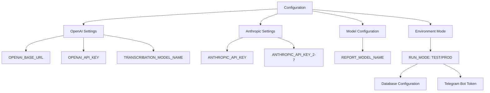
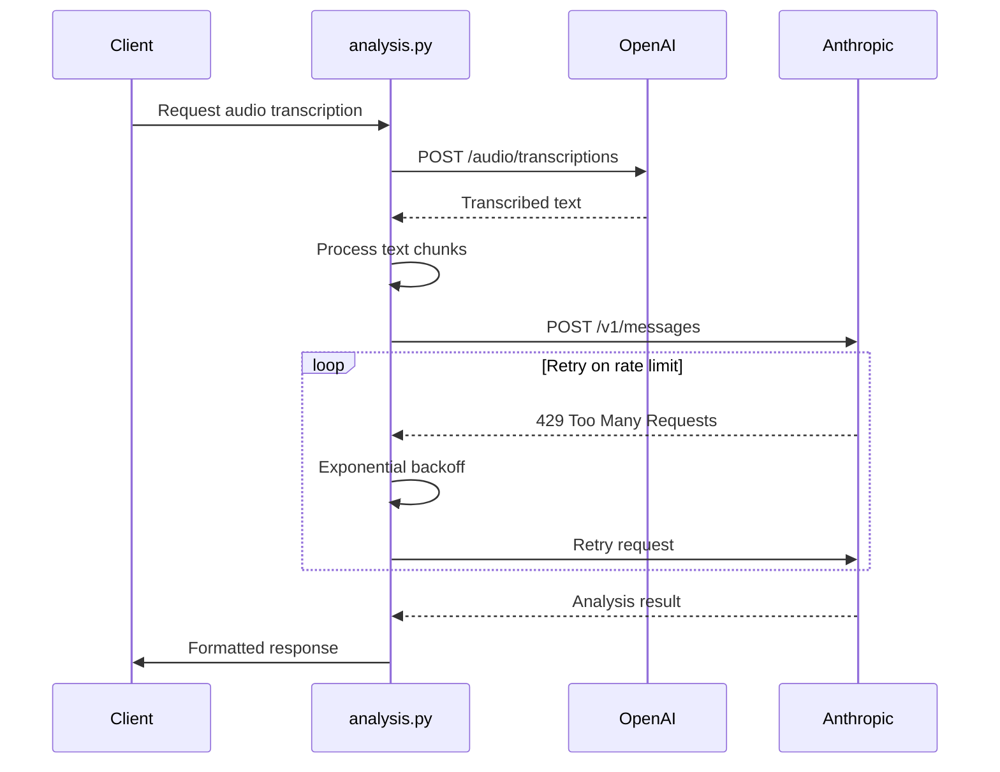
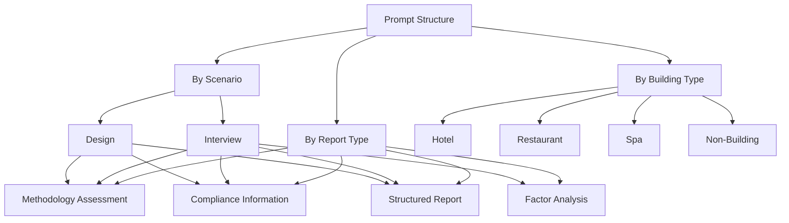
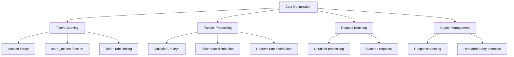
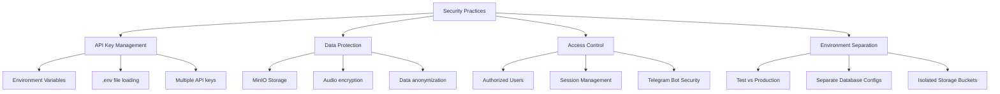
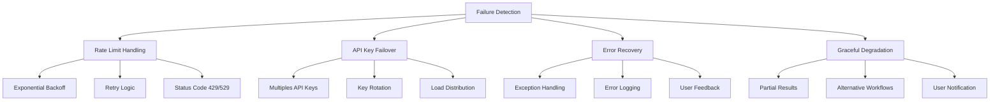

# External AI Integration

<cite>
**Referenced Files in This Document**   
- [config.py](file://src/config.py)
- [analysis.py](file://src/analysis.py)
- [run_analysis.py](file://src/run_analysis.py)
- [db.py](file://src/db_handler/db.py)
- [fill_prompts_table.py](file://src/db_handler/fill_prompts_table.py)
</cite>

## Table of Contents
1. [Introduction](#introduction)
2. [AI Service Configuration](#ai-service-configuration)
3. [API Request Handling](#api-request-handling)
4. [Prompt Management System](#prompt-management-system)
5. [Cost Optimization Strategies](#cost-optimization-strategies)
6. [Security Practices](#security-practices)
7. [Fallback Mechanisms](#fallback-mechanisms)
8. [Conclusion](#conclusion)

## Introduction
VoxPersona integrates with external AI services from OpenAI and Anthropic to perform transcription and analysis tasks on audio content. The system processes interviews and design audits for various building types including hotels, restaurants, and health centers. This documentation details the architecture of the AI integration, covering configuration management, request handling, prompt templating, cost optimization, and security practices. The system is designed to handle large volumes of audio data, extract meaningful insights, and provide structured reports through a sophisticated multi-stage analysis pipeline.

## AI Service Configuration

The AI service configuration is managed through environment variables loaded in config.py, providing flexibility between test and production environments. The system supports multiple API keys for Anthropic services, enabling load distribution and redundancy.

**Diagram sources**
- [config.py](file://src/config.py#L15-L40)

**Section sources**
- [config.py](file://src/config.py#L15-L70)

## API Request Handling

The system implements robust request handling for both OpenAI and Anthropic APIs with comprehensive retry logic and error handling. Transcription tasks are performed using OpenAI's Whisper model, while analysis tasks utilize Anthropic's Claude models.

The request handling system includes:
- **Transcription**: Audio files are split into 3-minute chunks and processed through OpenAI Whisper
- **Analysis**: Text analysis is performed using Anthropic's API with exponential backoff for rate limiting
- **Parallel Processing**: Multiple API keys are used to distribute load and increase throughput
- **Token Management**: Request size is monitored to prevent exceeding model limits

**Diagram sources**
- [analysis.py](file://src/analysis.py#L197-L231)
- [analysis.py](file://src/analysis.py#L36-L65)

**Section sources**
- [analysis.py](file://src/analysis.py#L36-L149)
- [analysis.py](file://src/analysis.py#L197-L231)

## Prompt Management System

The prompt management system organizes templates by scenario (interview/design) and building type (hotel/restaurant/spa), storing them in a database for efficient retrieval. Prompts are structured to support sequential processing and JSON output formatting.

The system supports multi-stage analysis workflows where the output of one prompt serves as input to the next, enabling complex analysis pipelines. JSON-formatted prompts are processed separately to ensure structured output for downstream processing.

**Diagram sources**
- [run_analysis.py](file://src/run_analysis.py#L215-L249)
- [db.py](file://src/db_handler/db.py#L319-L351)

**Section sources**
- [run_analysis.py](file://src/run_analysis.py#L215-L249)
- [db.py](file://src/db_handler/db.py#L319-L351)
- [fill_prompts_table.py](file://src/db_handler/fill_prompts_table.py#L147-L172)

## Cost Optimization Strategies

VoxPersona implements several cost optimization strategies to minimize API expenses while maintaining performance. The system carefully manages token usage through counting, caching, and parallel processing optimization.

Key cost optimization features include:
- **Token Counting**: Uses tiktoken to estimate token usage before API calls
- **Rate Limit Management**: Implements token and request rate limits for each API key
- **Parallel Processing**: Distributes work across multiple API keys with different rate limits
- **Chunked Processing**: Splits large documents into manageable chunks to optimize token usage

The system calculates delays based on both token rates and request rates, ensuring compliance with API limits while maximizing throughput.

**Diagram sources**
- [analysis.py](file://src/analysis.py#L265-L305)
- [analysis.py](file://src/analysis.py#L300-L338)

**Section sources**
- [analysis.py](file://src/analysis.py#L265-L305)
- [analysis.py](file://src/analysis.py#L300-L338)
- [utils.py](file://src/utils.py#L57-L91)

## Security Practices

The system implements comprehensive security practices to protect API credentials and sensitive audio content. Security measures are integrated at multiple levels of the application architecture.

Security features include:
- **API Key Protection**: Keys are stored in environment variables and never hard-coded
- **Environment Separation**: Different configurations for test and production modes
- **Access Control**: User states and authorization mechanisms limit access to functionality
- **Data Storage**: Audio files are stored in MinIO with separate buckets for test and production

The system validates that all required API keys are present at startup, preventing operation with incomplete configuration.

**Diagram sources**
- [config.py](file://src/config.py#L38-L70)
- [config.py](file://src/config.py#L72-L75)

**Section sources**
- [config.py](file://src/config.py#L38-L75)
- [docker-compose.yml](file://docker-compose.yml#L0-L37)

## Fallback Mechanisms

The system implements multiple fallback mechanisms to ensure reliability during service outages or API failures. These mechanisms provide resilience against various failure modes.

The fallback mechanisms include:
- **Exponential Backoff**: Implemented for rate limit errors with progressive delay increases
- **Multiple API Keys**: Seven Anthropic API keys allow for failover and load distribution
- **Comprehensive Error Handling**: Specific handling for rate limits, permission errors, and general exceptions
- **Graceful Degradation**: The system continues operation with reduced functionality when possible

When a request fails, the system logs detailed error information and provides appropriate feedback to users while attempting recovery.

**Diagram sources**
- [analysis.py](file://src/analysis.py#L197-L231)
- [analysis.py](file://src/analysis.py#L367-L401)

**Section sources**
- [analysis.py](file://src/analysis.py#L197-L231)
- [analysis.py](file://src/analysis.py#L367-L401)
- [run_analysis.py](file://src/run_analysis.py#L0-L24)

## Conclusion
VoxPersona's external AI integration architecture demonstrates a sophisticated approach to leveraging multiple AI services for transcription and analysis tasks. The system effectively manages configuration through environment variables, implements robust request handling with comprehensive retry logic, and organizes prompts according to a structured taxonomy of scenarios and building types. Cost optimization is achieved through careful token management, parallel processing across multiple API keys, and intelligent rate limiting. Security practices protect sensitive API credentials and user data, while fallback mechanisms ensure system resilience during service disruptions. The architecture balances performance, reliability, and cost efficiency, making it well-suited for processing large volumes of audio content and generating structured analytical reports.