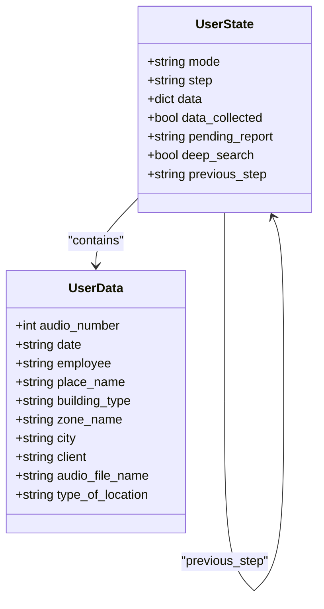
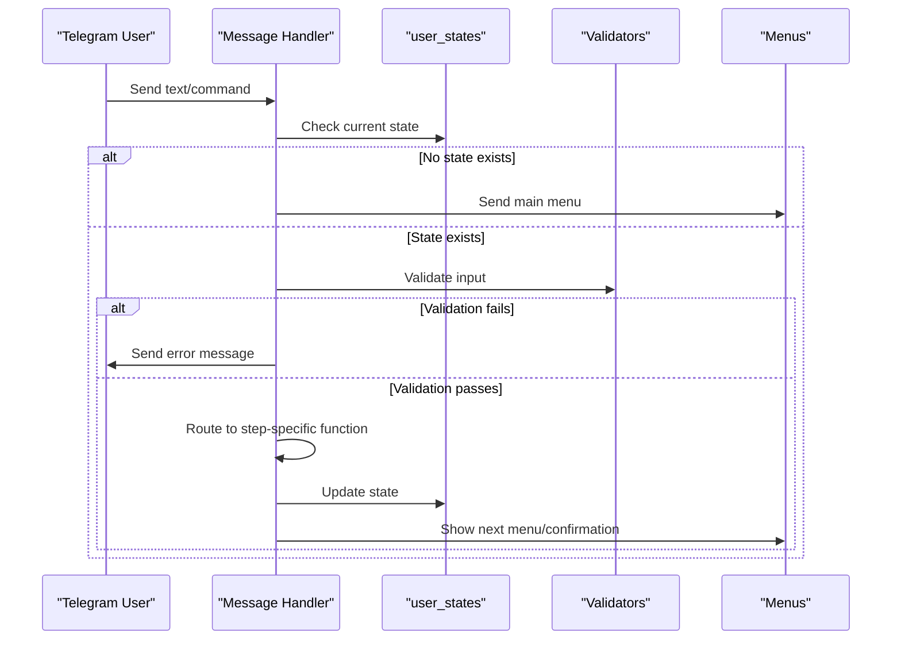
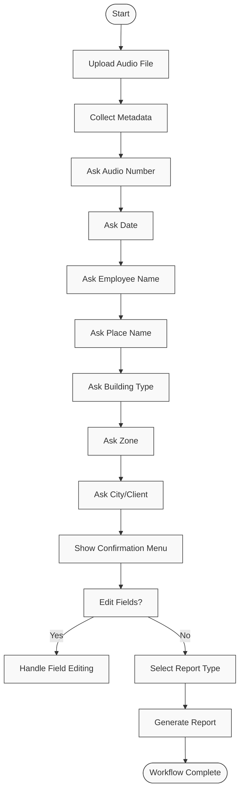
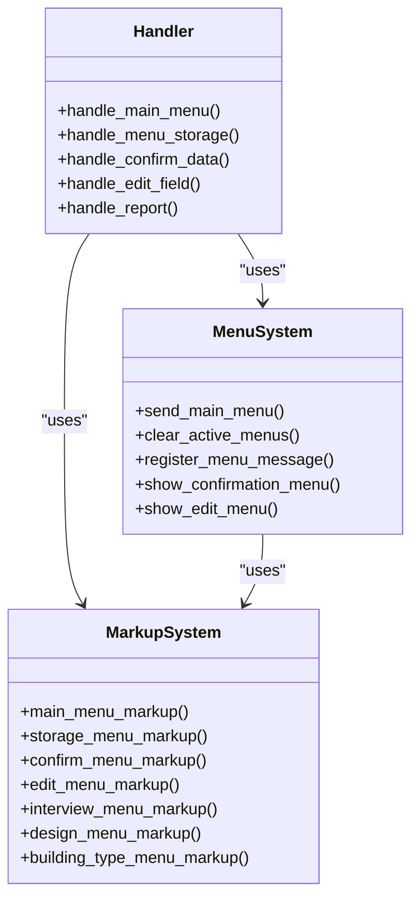
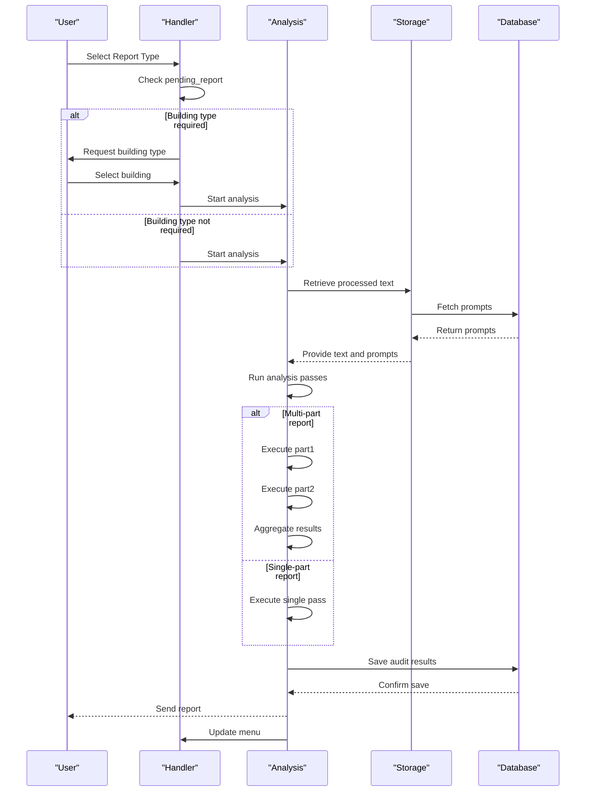
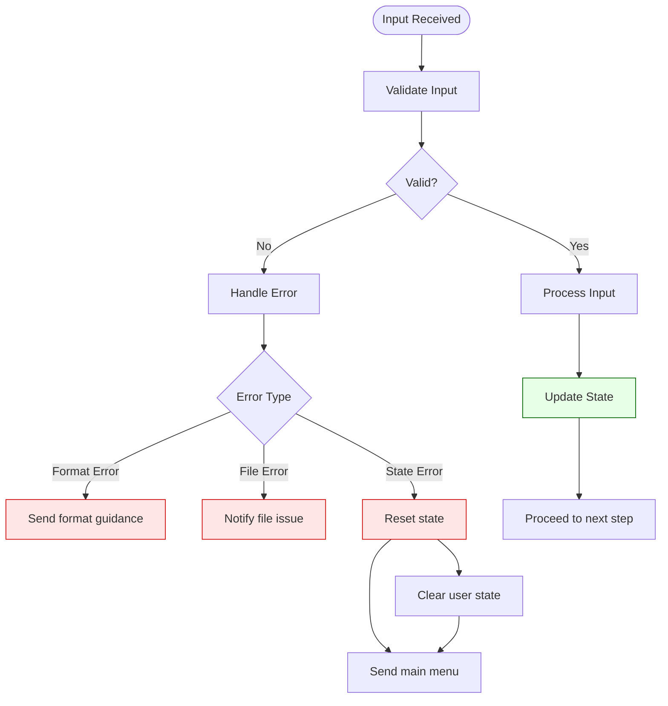

# Message Handling Layer

<cite>
**Referenced Files in This Document**   
- [handlers.py](file://src/handlers.py)
- [config.py](file://src/config.py)
- [menus.py](file://src/menus.py)
- [markups.py](file://src/markups.py)
- [validators.py](file://src/validators.py)
- [datamodels.py](file://src/datamodels.py)
- [run_analysis.py](file://src/run_analysis.py)
- [audio_utils.py](file://src/audio_utils.py)
- [storage.py](file://src/storage.py)
</cite>

## Table of Contents
1. [Introduction](#introduction)
2. [State Management Architecture](#state-management-architecture)
3. [Message Dispatching Mechanism](#message-dispatching-mechanism)
4. [User Interaction Workflow](#user-interaction-workflow)
5. [Menu System Integration](#menu-system-integration)
6. [Report Generation Workflow](#report-generation-workflow)
7. [Error Handling and Edge Cases](#error-handling-and-edge-cases)
8. [Performance Considerations](#performance-considerations)
9. [Best Practices for Extension](#best-practices-for-extension)
10. [Conclusion](#conclusion)

## Introduction
The message handling layer in the VoxPersona system manages user interactions through a state-driven model implemented in handlers.py. This document details how the system tracks conversation context across multiple steps including audio upload, metadata input, and report generation. The handler system integrates with menus.py and markups.py for dynamic menu rendering and inline keyboard generation, providing a seamless user experience for audit and interview scenarios.

## State Management Architecture

The core of the message handling system revolves around the `user_states` dictionary which tracks conversation context for each user session. This in-memory state storage maintains user interaction context across multiple steps in the workflow.

**Diagram sources**
- [handlers.py](file://src/handlers.py#L25-L805)
- [config.py](file://src/config.py#L80-L85)

**Section sources**
- [handlers.py](file://src/handlers.py#L25-L805)
- [config.py](file://src/config.py#L80-L85)

## Message Dispatching Mechanism

The system dispatches callback queries and text commands to appropriate functions based on the current state. The `register_handlers` function in handlers.py sets up the routing mechanism for different message types and user interactions.

**Diagram sources**
- [handlers.py](file://src/handlers.py#L500-L805)
- [validators.py](file://src/validators.py#L10-L50)

**Section sources**
- [handlers.py](file://src/handlers.py#L500-L805)
- [validators.py](file://src/validators.py#L10-L50)

## User Interaction Workflow

The user interaction workflow follows a step-by-step process for collecting metadata and generating reports. The system guides users through audio upload, metadata input, and report selection phases.

**Diagram sources**
- [handlers.py](file://src/handlers.py#L100-L400)
- [menus.py](file://src/menus.py#L50-L90)

**Section sources**
- [handlers.py](file://src/handlers.py#L100-L400)
- [menus.py](file://src/menus.py#L50-L90)

## Menu System Integration

The handler system integrates with menus.py and markups.py to provide dynamic menu rendering and inline keyboard generation. This integration enables context-sensitive user interfaces that adapt to the current state of the conversation.

**Diagram sources**
- [handlers.py](file://src/handlers.py#L400-L500)
- [menus.py](file://src/menus.py#L1-L94)
- [markups.py](file://src/markups.py#L1-L133)

**Section sources**
- [handlers.py](file://src/handlers.py#L400-L500)
- [menus.py](file://src/menus.py#L1-L94)
- [markups.py](file://src/markups.py#L1-L133)

## Report Generation Workflow

The report generation workflow demonstrates state transitions during the analysis process. The system handles both simple and complex reports, with special handling for multi-part analyses.

**Diagram sources**
- [handlers.py](file://src/handlers.py#L300-L400)
- [run_analysis.py](file://src/run_analysis.py#L1-L344)
- [storage.py](file://src/storage.py#L1-L310)

**Section sources**
- [handlers.py](file://src/handlers.py#L300-L400)
- [run_analysis.py](file://src/run_analysis.py#L1-L344)

## Error Handling and Edge Cases

The system implements comprehensive error handling for various edge cases including invalid input, timeout handling, and state reset mechanisms. The validation system ensures data integrity throughout the workflow.

**Diagram sources**
- [handlers.py](file://src/handlers.py#L200-L300)
- [validators.py](file://src/validators.py#L10-L50)
- [utils.py](file://src/utils.py#L1-L106)

**Section sources**
- [handlers.py](file://src/handlers.py#L200-L300)
- [validators.py](file://src/validators.py#L10-L50)

## Performance Considerations

The current implementation uses in-memory state storage which presents both advantages and limitations for scalability. The system maintains user states in a global dictionary, which is efficient for individual sessions but may present challenges in distributed environments.

### Performance Characteristics
- **Memory Usage**: O(n) where n is the number of concurrent user sessions
- **State Persistence**: Transient (lost on restart)
- **Scalability**: Limited to single-instance deployment
- **Latency**: Minimal overhead for state access

### Scalability Limitations
- No built-in mechanism for state synchronization across instances
- Memory consumption grows linearly with active users
- No automatic state cleanup for inactive sessions
- Potential memory leaks if users abandon workflows

For high-traffic scenarios, consider implementing a persistent state store such as Redis with TTL-based cleanup to address these limitations while maintaining performance.

**Section sources**
- [config.py](file://src/config.py#L80-L85)
- [handlers.py](file://src/handlers.py#L25-L805)

## Best Practices for Extension

When extending the handler system with new interaction patterns, follow these best practices to maintain code quality and system stability:

### State Management
- Always validate state existence before processing
- Use descriptive step names that reflect the user's progress
- Implement proper cleanup of temporary states
- Maintain consistency in data structure across states

### Error Prevention
- Validate all user inputs against expected formats
- Implement graceful degradation for failed operations
- Provide clear error messages that guide users toward correction
- Log errors for debugging while showing user-friendly messages

### Code Organization
- Group related handlers by functionality
- Use descriptive function names that indicate purpose
- Maintain separation between business logic and presentation
- Document state transitions and expected data structures

### Integration Patterns
- Leverage existing menu and markup systems for consistency
- Reuse validation functions where applicable
- Follow the same pattern for callback data structure
- Maintain consistent user experience across features

**Section sources**
- [handlers.py](file://src/handlers.py#L1-L805)
- [validators.py](file://src/validators.py#L1-L50)
- [markups.py](file://src/markups.py#L1-L133)

## Conclusion

The message handling layer in VoxPersona provides a robust state-driven framework for managing complex user interactions. By leveraging the user_states dictionary, the system effectively tracks conversation context across multiple steps including audio upload, metadata collection, and report generation. The integration with menus.py and markups.py enables dynamic interface rendering that adapts to the current state. While the in-memory state storage provides excellent performance for individual sessions, consideration should be given to persistent storage solutions for production deployments requiring high availability and horizontal scaling. The modular design allows for straightforward extension of the system with new interaction patterns while maintaining consistency in user experience.