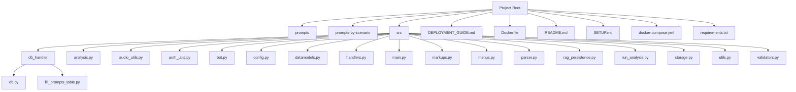
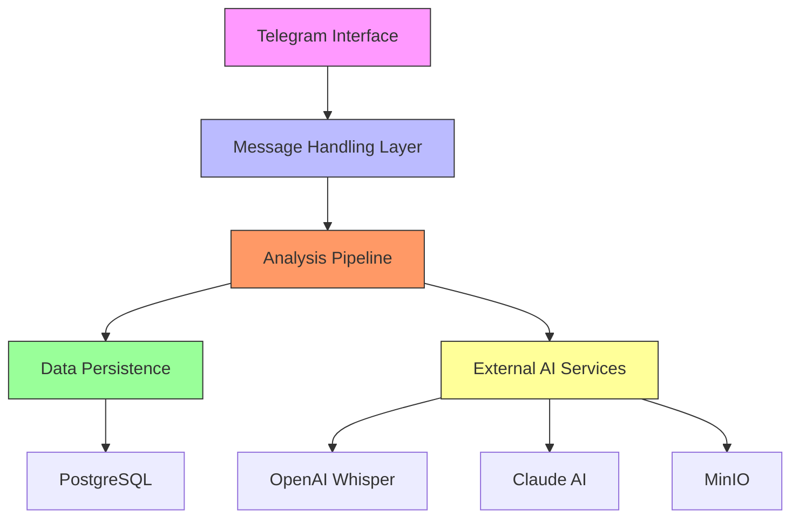
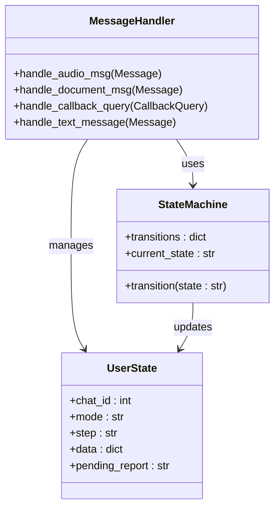
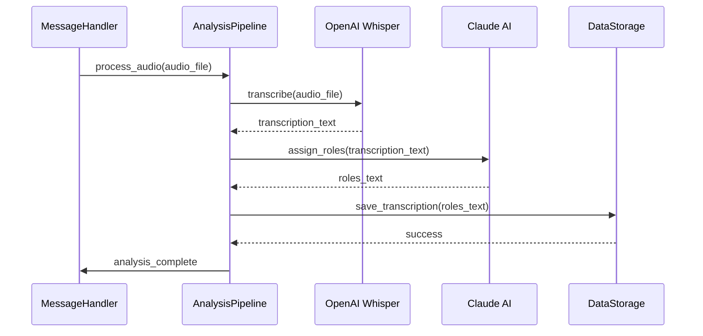
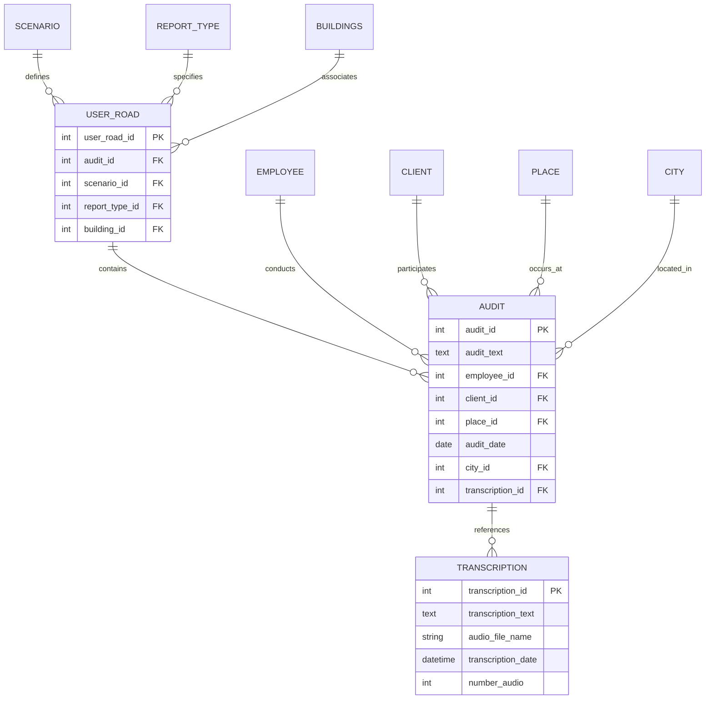
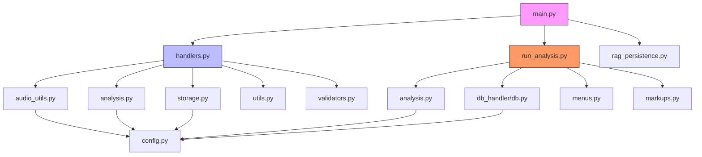

# System Architecture

<cite>
**Referenced Files in This Document**   
- [main.py](file://src/main.py)
- [handlers.py](file://src/handlers.py)
- [run_analysis.py](file://src/run_analysis.py)
- [config.py](file://src/config.py)
- [audio_utils.py](file://src/audio_utils.py)
- [analysis.py](file://src/analysis.py)
- [db_handler/db.py](file://src/db_handler/db.py)
- [rag_persistence.py](file://src/rag_persistence.py)
- [datamodels.py](file://src/datamodels.py)
- [storage.py](file://src/storage.py)
</cite>

## Table of Contents
1. [Introduction](#introduction)
2. [Project Structure](#project-structure)
3. [Core Components](#core-components)
4. [Architecture Overview](#architecture-overview)
5. [Detailed Component Analysis](#detailed-component-analysis)
6. [Dependency Analysis](#dependency-analysis)
7. [Performance Considerations](#performance-considerations)
8. [Troubleshooting Guide](#troubleshooting-guide)
9. [Conclusion](#conclusion)

## Introduction
The VoxPersona system is an AI-powered voice analysis platform that processes voice messages from Telegram users to generate structured reports. The system integrates multiple AI services, including transcription, role assignment, and report generation, using a layered architecture. It supports two primary scenarios: "Interview" and "Design", each with specific report types. The system uses a RAG (Retrieval-Augmented Generation) approach for knowledge retrieval and leverages PostgreSQL for data persistence. The architecture is designed to be modular, scalable, and fault-tolerant, with asynchronous processing and state management for multi-step workflows.

## Project Structure
The project is organized into several directories, each serving a specific purpose:
- `prompts`: Contains prompt templates for different scenarios and report types.
- `prompts-by-scenario`: Organizes prompts by scenario, including JSON prompts and non-building prompts.
- `src`: Contains the main source code, including handlers, analysis logic, and utilities.
- Root files include deployment configurations, documentation, and requirements.

**Diagram sources**
- [src/main.py](file://src/main.py#L1-L95)
- [src/handlers.py](file://src/handlers.py#L1-L799)
- [src/run_analysis.py](file://src/run_analysis.py#L1-L343)

**Section sources**
- [src/main.py](file://src/main.py#L1-L95)
- [src/handlers.py](file://src/handlers.py#L1-L799)
- [src/run_analysis.py](file://src/run_analysis.py#L1-L343)

## Core Components
The core components of the VoxPersona system include the Telegram interface (Pyrogram), message handling layer, analysis pipeline, data persistence, and external AI services. The system is initialized by `main.py`, which sets up the bot and RAG system. The `handlers.py` file manages user state and dispatches requests, while `run_analysis.py` orchestrates transcription, role assignment, and report generation. The system uses a state machine pattern for multi-step workflows, with user states stored in memory. The modular design separates concerns between different components, allowing for independent development and testing.

**Section sources**
- [main.py](file://src/main.py#L1-L95)
- [handlers.py](file://src/handlers.py#L1-L799)
- [run_analysis.py](file://src/run_analysis.py#L1-L343)

## Architecture Overview
The VoxPersona system follows a layered architecture with clear separation of concerns. The system is event-driven, with voice messages triggering a sequence of processing steps that culminate in report generation. The architecture consists of five main layers: Telegram interface, message handling, analysis pipeline, data persistence, and external AI services.

**Diagram sources**
- [main.py](file://src/main.py#L1-L95)
- [handlers.py](file://src/handlers.py#L1-L799)
- [run_analysis.py](file://src/run_analysis.py#L1-L343)

## Detailed Component Analysis
The VoxPersona system consists of several key components that work together to process voice messages and generate reports. Each component has a specific responsibility and interacts with other components through well-defined interfaces.

### Message Handling Layer Analysis
The message handling layer is responsible for receiving and processing user inputs from Telegram. It manages user state, validates inputs, and dispatches requests to the appropriate analysis components.

**Diagram sources**
- [handlers.py](file://src/handlers.py#L1-L799)

**Section sources**
- [handlers.py](file://src/handlers.py#L1-L799)

### Analysis Pipeline Analysis
The analysis pipeline is responsible for orchestrating the transcription, role assignment, and report generation processes. It uses a modular service separation pattern to ensure maintainability and extensibility.

**Diagram sources**
- [run_analysis.py](file://src/run_analysis.py#L1-L343)
- [analysis.py](file://src/analysis.py#L1-L490)

**Section sources**
- [run_analysis.py](file://src/run_analysis.py#L1-L343)
- [analysis.py](file://src/analysis.py#L1-L490)

### Data Persistence Analysis
The data persistence layer is responsible for storing and retrieving data from the PostgreSQL database. It uses a repository pattern to abstract database operations and ensure separation of concerns.

**Diagram sources**
- [db_handler/db.py](file://src/db_handler/db.py#L1-L398)
- [storage.py](file://src/storage.py#L1-L309)

**Section sources**
- [db_handler/db.py](file://src/db_handler/db.py#L1-L398)
- [storage.py](file://src/storage.py#L1-L309)

## Dependency Analysis
The VoxPersona system has a well-defined dependency structure that ensures loose coupling between components. The main.py file serves as the entry point and depends on handlers.py and run_analysis.py. The handlers.py file depends on various utility modules, including audio_utils.py, analysis.py, and storage.py. The run_analysis.py file depends on analysis.py and db_handler/db.py for database operations.

**Diagram sources**
- [main.py](file://src/main.py#L1-L95)
- [handlers.py](file://src/handlers.py#L1-L799)
- [run_analysis.py](file://src/run_analysis.py#L1-L343)

**Section sources**
- [main.py](file://src/main.py#L1-L95)
- [handlers.py](file://src/handlers.py#L1-L799)
- [run_analysis.py](file://src/run_analysis.py#L1-L343)

## Performance Considerations
The VoxPersona system is designed with performance in mind, using asynchronous processing and periodic saving of RAG indices to minimize latency. The system uses threading for loading animations and background tasks, ensuring that the main event loop remains responsive. The analysis pipeline is optimized for parallel processing, with multiple API keys used to distribute load across different models. The system also implements rate limiting and backoff strategies to handle API rate limits gracefully.

**Section sources**
- [main.py](file://src/main.py#L1-L95)
- [run_analysis.py](file://src/run_analysis.py#L1-L343)
- [analysis.py](file://src/analysis.py#L1-L490)

## Troubleshooting Guide
The VoxPersona system includes comprehensive error handling and logging to facilitate troubleshooting. Common issues include API key errors, database connection problems, and file size limitations. The system logs detailed error messages to help diagnose issues, and implements retry mechanisms for transient failures. When encountering issues, check the following:
- Ensure all required environment variables are set in the .env file.
- Verify that the PostgreSQL database is accessible and the schema is properly initialized.
- Check that the MinIO storage service is running and accessible.
- Ensure that the OpenAI and Claude API keys are valid and have sufficient quota.

**Section sources**
- [config.py](file://src/config.py#L1-L93)
- [handlers.py](file://src/handlers.py#L1-L799)
- [analysis.py](file://src/analysis.py#L1-L490)

## Conclusion
The VoxPersona system is a sophisticated voice analysis platform that combines multiple AI services to generate structured reports from voice messages. The layered architecture provides clear separation of concerns, making the system modular, maintainable, and extensible. The use of state machines for multi-step workflows, modular service separation, and asynchronous processing ensures a responsive and scalable user experience. The system's design prioritizes fault tolerance and robust error handling, making it suitable for production use. Future enhancements could include support for additional languages, improved voice activity detection, and more sophisticated report templates.