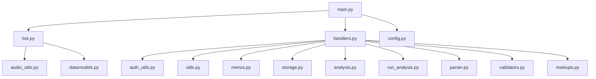
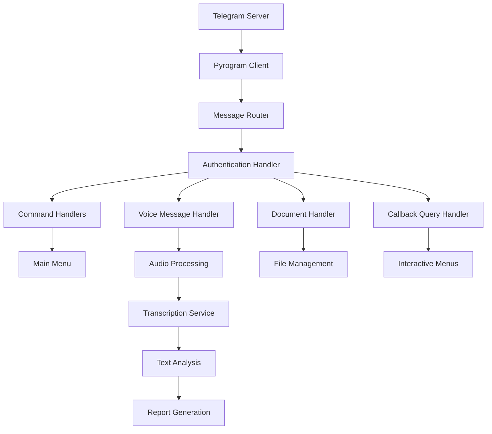
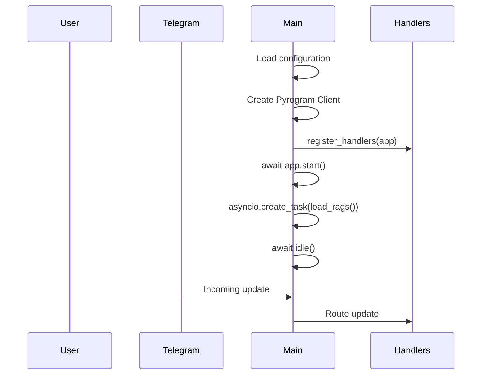
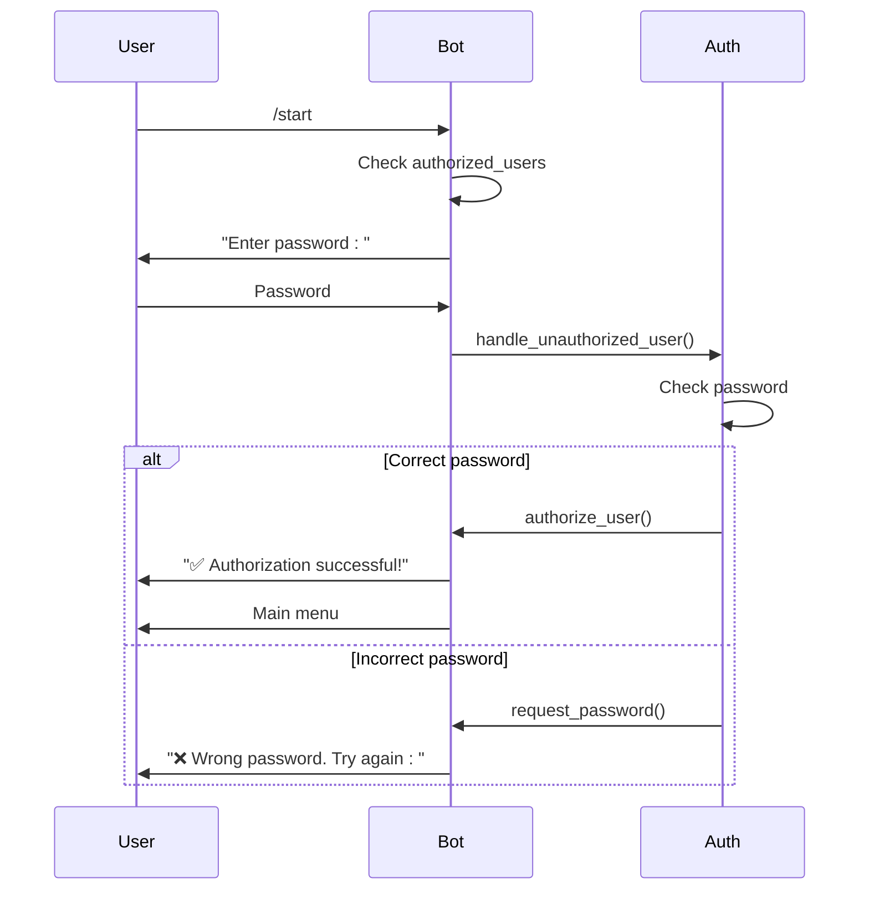
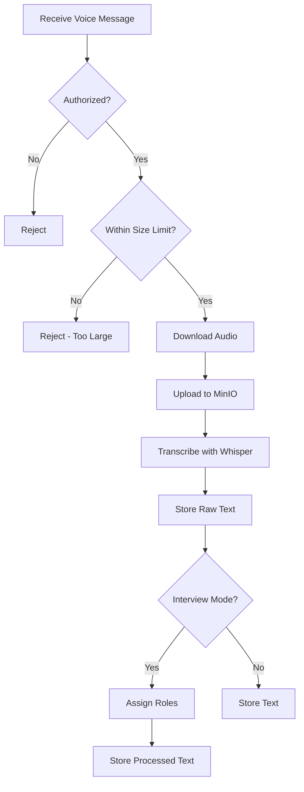
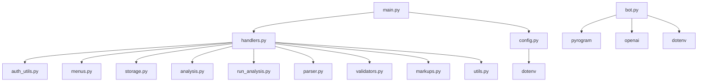

# Telegram Interface

<cite>
**Referenced Files in This Document**   
- [main.py](file://src/main.py)
- [bot.py](file://src/bot.py)
- [handlers.py](file://src/handlers.py)
- [auth_utils.py](file://src/auth_utils.py)
- [config.py](file://src/config.py)
</cite>

## Table of Contents
1. [Introduction](#introduction)
2. [Project Structure](#project-structure)
3. [Core Components](#core-components)
4. [Architecture Overview](#architecture-overview)
5. [Detailed Component Analysis](#detailed-component-analysis)
6. [Dependency Analysis](#dependency-analysis)
7. [Performance Considerations](#performance-considerations)
8. [Troubleshooting Guide](#troubleshooting-guide)
9. [Conclusion](#conclusion)

## Introduction
This document provides comprehensive architectural documentation for the Telegram interface layer in VoxPersona. It explains how Pyrogram is used to establish the bot connection, handle incoming voice messages, and manage user interactions. The documentation covers the initialization process in main.py, including bot client setup and event loop configuration. It details the role of bot.py in encapsulating Telegram-specific logic and how handlers.py receives and routes updates based on message type and user state. The integration between the Telegram API and internal services is documented, including error handling for network interruptions and message parsing. Examples of command handling (e.g., /start) and voice message reception are included. Security considerations such as user authentication via auth_utils.py and rate limiting are addressed. A sequence diagram illustrates the message flow from Telegram server to internal processing pipeline.

## Project Structure
The VoxPersona project structure is organized to separate concerns and facilitate maintainability. The core Telegram interface components are located in the src directory, with specific files handling different aspects of the bot functionality. The main.py file serves as the entry point, initializing the application and starting the event loop. The bot.py file contains the primary bot logic and Pyrogram client configuration. The handlers.py file manages the routing of incoming messages and callback queries to appropriate handler functions. Configuration values are stored in config.py, while authentication utilities are separated into auth_utils.py. This modular structure allows for clear separation of concerns between initialization, message handling, business logic, and configuration management.

**Diagram sources**
- [main.py](file://src/main.py)
- [bot.py](file://src/bot.py)
- [handlers.py](file://src/handlers.py)

**Section sources**
- [main.py](file://src/main.py)
- [bot.py](file://src/bot.py)
- [handlers.py](file://src/handlers.py)

## Core Components
The core components of the Telegram interface in VoxPersona include the bot client initialization in main.py, the message handling system in handlers.py, and the authentication mechanism in auth_utils.py. The system uses Pyrogram as the Telegram API client library to establish and maintain the connection with Telegram servers. The bot is configured to handle various message types including voice messages, audio files, documents, and text commands. User state management is implemented through the user_states dictionary, which tracks the current interaction state for each user. The processed_texts dictionary stores transcribed audio content for subsequent analysis. The system implements a callback query handler to manage interactions with inline keyboards and menus.

**Section sources**
- [main.py](file://src/main.py#L1-L95)
- [handlers.py](file://src/handlers.py#L1-L799)
- [auth_utils.py](file://src/auth_utils.py#L1-L17)

## Architecture Overview
The Telegram interface architecture in VoxPersona follows a layered approach with clear separation between the Telegram API integration layer, message processing layer, and business logic layer. The architecture is event-driven, with Pyrogram handling incoming updates from Telegram and routing them to appropriate handlers based on message type and content. The system implements a state machine pattern for managing user interactions, with user state stored in memory and updated as users progress through different workflows. Authentication is handled at the message processing level, ensuring only authorized users can access bot functionality. The architecture supports both direct message handling and callback query processing for interactive menus and forms.

**Diagram sources**
- [main.py](file://src/main.py#L1-L95)
- [handlers.py](file://src/handlers.py#L1-L799)
- [bot.py](file://src/bot.py#L1-L670)

## Detailed Component Analysis

### Bot Initialization and Event Loop
The bot initialization process begins in main.py where the application entry point is defined. The main() function creates a Pyrogram Client instance with configuration values loaded from environment variables via config.py. The client is configured with the bot token, API ID, and API hash required for authentication with Telegram's servers. After client creation, the system registers all message handlers through handlers.register_handlers(app). The event loop is started with app.start(), followed by the creation of a background task for loading RAG (Retrieval-Augmented Generation) models. The idle() function is called to keep the bot running and listening for incoming updates, with proper cleanup performed when the application stops.

**Diagram sources**
- [main.py](file://src/main.py#L69-L94)

**Section sources**
- [main.py](file://src/main.py#L1-L95)

### Message Handling and Routing
The message handling system is implemented in handlers.py, which defines a comprehensive set of handlers for different message types and user interactions. The system uses Pyrogram's decorator-based approach to register handlers for specific message types. The register_handlers() function sets up handlers for /start commands, text messages, voice/audio messages, documents, and callback queries. Each handler function is responsible for processing a specific type of interaction and updating the application state accordingly. The system implements a state machine using the user_states dictionary to track user progress through multi-step workflows such as data entry forms and report generation processes.

**Section sources**
- [handlers.py](file://src/handlers.py#L585-L772)

### Authentication and Security
The authentication system in VoxPersona implements a simple password-based authorization mechanism. When a user sends the /start command, the system checks if their chat ID is in the authorized_users set. Unauthorized users are prompted to enter a password, which is validated against the PASSWORD value from config.py. Upon successful authentication, the user's chat ID is added to the authorized_users set, and they are granted access to the main menu. The auth_utils.py module contains the core authentication functions, including handle_unauthorized_user() which processes password attempts and manages the authentication flow. This approach provides basic security while maintaining a simple user experience.

**Diagram sources**
- [auth_utils.py](file://src/auth_utils.py#L1-L17)
- [handlers.py](file://src/handlers.py#L585-L608)

**Section sources**
- [auth_utils.py](file://src/auth_utils.py#L1-L17)
- [handlers.py](file://src/handlers.py#L585-L772)

### Voice Message Processing
The voice message processing pipeline handles incoming voice messages and audio files from users. When a voice message is received, the system first verifies the user's authorization status and checks that the file size does not exceed the 2GB limit. The audio file is downloaded to a temporary directory and uploaded to MinIO for persistent storage. The system then transcribes the audio using Whisper via the OpenAI API, with large files processed in chunks to avoid size limitations. After transcription, the raw text is stored in processed_texts for further analysis. For interview scenarios, the system automatically assigns roles (client/employee) to dialogue segments using the assign_roles functionality.

**Diagram sources**
- [handlers.py](file://src/handlers.py#L608-L642)
- [audio_utils.py](file://src/audio_utils.py#L25-L49)

**Section sources**
- [handlers.py](file://src/handlers.py#L608-L772)
- [audio_utils.py](file://src/audio_utils.py#L1-L49)

## Dependency Analysis
The Telegram interface components have well-defined dependencies that follow a clear hierarchy. The main.py module depends on handlers.py for message handler registration and on config.py for configuration values. The handlers.py module depends on multiple utility modules including auth_utils.py for authentication, menus.py for menu management, storage.py for file operations, and analysis.py for text processing. The bot.py module has direct dependencies on Pyrogram components for message handling and on external APIs for transcription and analysis. Configuration values are centralized in config.py, which is imported by multiple components. This dependency structure ensures loose coupling between components while maintaining clear responsibility boundaries.

**Diagram sources**
- [main.py](file://src/main.py)
- [handlers.py](file://src/handlers.py)
- [bot.py](file://src/bot.py)

**Section sources**
- [main.py](file://src/main.py)
- [handlers.py](file://src/handlers.py)
- [bot.py](file://src/bot.py)

## Performance Considerations
The Telegram interface implementation includes several performance optimizations to handle large audio files and maintain responsiveness. Audio files up to 2GB are supported through chunked processing, with large files divided into 24MB segments for transcription to avoid API size limits. The system uses threading for long-running operations such as audio processing, with a spinner animation providing visual feedback to users during processing. RAG models are loaded asynchronously in the background to prevent blocking bot startup. The system implements periodic saving of RAG indices every 15 minutes to balance data persistence with performance. Error handling is implemented for network interruptions and API failures, with appropriate user feedback provided in case of processing errors.

**Section sources**
- [main.py](file://src/main.py#L10-L35)
- [handlers.py](file://src/handlers.py#L608-L642)
- [bot.py](file://src/bot.py#L200-L250)

## Troubleshooting Guide
Common issues with the Telegram interface typically involve authentication failures, audio processing errors, and configuration problems. Authentication issues may occur if the PASSWORD environment variable is not set correctly in config.py or if users enter incorrect passwords. Audio processing failures can result from invalid API keys, network connectivity issues, or files exceeding the 2GB size limit. Configuration problems may arise if required environment variables (TELEGRAM_BOT_TOKEN, API_ID, API_HASH, etc.) are missing or incorrect. The system logs detailed error messages that can be used for diagnosis. For persistent issues, verifying the configuration values and checking the bot's authorization status on the Telegram platform may resolve the problem.

**Section sources**
- [auth_utils.py](file://src/auth_utils.py#L1-L17)
- [handlers.py](file://src/handlers.py#L608-L642)
- [config.py](file://src/config.py#L1-L93)

## Conclusion
The Telegram interface in VoxPersona provides a robust and scalable solution for handling voice messages and user interactions through the Telegram platform. By leveraging Pyrogram as the API client, the system efficiently manages the connection with Telegram servers and processes various message types. The architecture follows sound design principles with clear separation of concerns between initialization, message handling, authentication, and business logic. The implementation includes comprehensive error handling, performance optimizations for large audio files, and a user-friendly interface with interactive menus. The system's modular design allows for easy maintenance and extension, making it well-suited for the voice message processing and analysis requirements of the VoxPersona application.