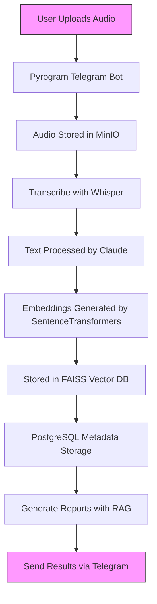

# Technology Stack & Dependencies

<cite>
**Referenced Files in This Document**   
- [config.py](file://src/config.py#L1-L93)
- [analysis.py](file://src/analysis.py#L1-L490)
- [rag_persistence.py](file://src/rag_persistence.py#L1-L36)
- [storage.py](file://src/storage.py#L1-L309)
- [utils.py](file://src/utils.py#L1-L105)
- [db.py](file://src/db_handler/db.py#L1-L398)
- [requirements.txt](file://requirements.txt#L1-L130)
</cite>

## Table of Contents
1. [Backend Core: Python 3.10+](#backend-core-python-310)
2. [Telegram Integration: Pyrogram](#telegram-integration-pyrogram)
3. [Relational Data Storage: PostgreSQL](#relational-data-storage-postgresql)
4. [Audio File Storage: MinIO](#audio-file-storage-minio)
5. [Speech-to-Text: OpenAI Whisper](#speech-to-text-openai-whisper)
6. [LLM Analysis: Anthropic Claude 3.5 Sonnet](#llm-analysis-anthropic-claude-35-sonnet)
7. [Vector Similarity Search: FAISS](#vector-similarity-search-faiss)
8. [Embedding Generation: SentenceTransformers](#embedding-generation-sentencetransformers)
9. [Integration Architecture](#integration-architecture)
10. [Performance and Scalability](#performance-and-scalability)
11. [Technology Selection Rationale](#technology-selection-rationale)

## Backend Core: Python 3.10+

The VoxPersona platform is built on **Python 3.10+**, leveraging its modern syntax features, type hints, and robust ecosystem for AI/ML development. Python serves as the foundational language for all backend logic, including Telegram bot interaction, audio processing, database operations, and orchestration of AI services.

The codebase utilizes Python's asynchronous capabilities through `asyncio` and `aiohttp` for non-blocking operations, particularly in handling concurrent API requests to LLMs. The use of type hints (e.g., `list[tuple[str, int]]`, `dict[int, list[str]]`) enhances code maintainability and reduces runtime errors.

Key configuration is managed through the `config.py` module, which loads environment variables and sets up global parameters for the application, including API keys, database credentials, and storage paths.

```python
# Example from config.py: Environment-based configuration
if RUN_MODE == "TEST":
    DB_CONFIG = {
        "dbname": os.getenv("TEST_DB_NAME"),
        "user": os.getenv("TEST_DB_USER"),
        "password": os.getenv("TEST_DB_PASSWORD"),
        "host": os.getenv("TEST_DB_HOST"),  
        "port": os.getenv("TEST_DB_PORT"),       
    }
    MINIO_BUCKET_NAME = os.getenv("MINIO_BUCKET_TEST_NAME")
else:
    DB_CONFIG = {
        "dbname": os.getenv("DB_NAME"),
        "user": os.getenv("DB_USER"),
        "password": os.getenv("DB_PASSWORD"),
        "host": os.getenv("DB_HOST"),  
        "port": os.getenv("DB_PORT"),     
    }
```

Python's extensive package management via `pip` and `requirements.txt` ensures reproducible environments, with version pinning for critical dependencies to maintain stability.

**Section sources**
- [config.py](file://src/config.py#L1-L93)
- [requirements.txt](file://requirements.txt#L1-L130)

## Telegram Integration: Pyrogram

VoxPersona uses **Pyrogram 2.0.106** as its Telegram Bot API client for seamless interaction with Telegram users. Pyrogram provides a high-level, Pythonic interface for sending and receiving messages, handling media files, and managing user sessions.

The bot functionality is implemented in `bot.py` and `handlers.py`, where Pyrogram's event-driven architecture is used to respond to user commands and file uploads. The library's support for both synchronous and asynchronous operations allows for efficient handling of long-running tasks like audio transcription and analysis.

Authentication with Telegram is configured using `API_ID`, `API_HASH`, and `TELEGRAM_BOT_TOKEN` from environment variables, ensuring secure access without hardcoding credentials.

```python
# Example from config.py: Telegram credentials
API_ID = os.getenv("API_ID")
API_HASH = os.getenv("API_HASH")
TELEGRAM_BOT_TOKEN = os.getenv("TELEGRAM_BOT_TOKEN")
SESSION_NAME = os.getenv("SESSION_BOT_NAME")
```

Pyrogram's file handling capabilities are crucial for receiving audio files from users, which are then processed for transcription and analysis. The library's reliability and active maintenance make it a preferred choice over alternatives like python-telegram-bot.

**Section sources**
- [config.py](file://src/config.py#L1-L93)
- [requirements.txt](file://requirements.txt#L1-L130)

## Relational Data Storage: PostgreSQL

**PostgreSQL 14** is used as the primary relational database for structured data storage in VoxPersona. It stores audit records, transcriptions, client and employee information, and metadata about analysis scenarios.

The database schema includes tables such as `audit`, `transcription`, `client`, `employee`, `place`, and `scenario`, which are managed through `psycopg2-binary 2.9.10` for Python connectivity. The `db_handler/db.py` module contains database operations with proper transaction management using decorators.

```python
# Example from db.py: Database transaction decorator
def db_transaction(commit=True):
    def decorator(func):
        @wraps(func)
        def wrapper(*args, **kwargs):
            with get_db_connection() as conn:
                with conn.cursor() as cursor:
                    result = func(cursor, *args, **kwargs)
                if commit:
                    conn.commit()
            return result
        return wrapper
    return decorator
```

The system uses parameterized queries to prevent SQL injection and employs connection pooling for performance. Database configuration is environment-aware, supporting different settings for development, testing, and production.

**Section sources**
- [db.py](file://src/db_handler/db.py#L1-L398)
- [config.py](file://src/config.py#L1-L93)

## Audio File Storage: MinIO

**MinIO** serves as the object storage solution for audio files in VoxPersona. It provides a scalable, S3-compatible storage layer for preserving original audio recordings and processed files.

Configuration for MinIO is defined in `config.py`, including endpoint, access keys, and bucket names:

```python
# Example from config.py: MinIO configuration
MINIO_ENDPOINT = os.getenv("MINIO_ENDPOINT")
MINIO_ACCESS_KEY = os.getenv("MINIO_ACCESS_KEY")
MINIO_SECRET_KEY = os.getenv("MINIO_SECRET_KEY")
MINIO_AUDIO_BUCKET_NAME = os.getenv("MINIO_AUDIO_BUCKET_NAME", "voxpersona-audio")
```

MinIO enables efficient storage and retrieval of audio files, decoupling media storage from the application logic. This separation enhances scalability and allows for independent management of storage resources.

**Section sources**
- [config.py](file://src/config.py#L1-L93)

## Speech-to-Text: OpenAI Whisper

**OpenAI Whisper** is employed for automatic speech recognition (ASR), converting uploaded audio files into text transcripts. The system uses the `openai` Python library to interface with Whisper API, configured through environment variables.

The transcription process is implemented in `analysis.py`, where audio files are segmented into 3-minute chunks to comply with API limitations and processed sequentially:

```python
# Example from analysis.py: Audio transcription
def transcribe_audio_raw(file_path: str, chunk_length_ms: int = 3 * 60_000) -> str:
    sound = AudioSegment.from_file(file_path)
    duration_ms = len(sound)
    out_texts = []
    
    for start_ms in range(0, duration_ms, chunk_length_ms):
        end_ms = min(start_ms + chunk_length_ms, duration_ms)
        chunk = sound[start_ms:end_ms]
        
        # Convert to MP3 and send to Whisper
        chunk_io = io.BytesIO()
        chunk.export(chunk_io, format="mp3")
        chunk_io.seek(0)
        
        response = client.audio.transcriptions.create(
            model=TRANSCRIBATION_MODEL_NAME,
            file=chunk_io
        )
        out_texts.append(response.text)
    
    return " ".join(out_texts).strip()
```

Supported audio formats include MP3, WAV, M4A, and OGG, with file size limits enforced to maintain system performance.

**Section sources**
- [analysis.py](file://src/analysis.py#L1-L490)
- [config.py](file://src/config.py#L1-L93)

## LLM Analysis: Anthropic Claude 3.5 Sonnet

**Anthropic Claude 3.5 Sonnet** is the primary large language model used for deep content analysis, report generation, and insight extraction. The system leverages multiple API keys for load balancing and rate limit management.

The `analysis.py` module contains the core logic for sending messages to Claude, with retry mechanisms for handling rate limits:

```python
# Example from analysis.py: Claude API interaction
def send_msg_to_model(messages: list, system: str = None, api_key: str = ANTHROPIC_API_KEY) -> str:
    client = anthropic.Anthropic(api_key=api_key)
    
    model_args = {
        "model": REPORT_MODEL_NAME,
        "max_tokens": 20000,
        "temperature": 0.1,
        "messages": messages
    }
    
    if system:
        model_args["system"] = system

    backoff = 1
    while True:
        try:
            response = client.messages.create(**model_args)
            return response.content[0].text
        except RateLimitError:
            logging.warning(f"Rate limit hit, waiting {backoff}s before retry...")
            time.sleep(backoff)
            backoff *= 2
```

The system supports parallel processing across multiple API keys to increase throughput, with token and request rate limiting to stay within service quotas.

**Section sources**
- [analysis.py](file://src/analysis.py#L1-L490)
- [config.py](file://src/config.py#L1-L93)

## Vector Similarity Search: FAISS

**FAISS (Facebook AI Similarity Search)** is used for efficient vector similarity search in the Retrieval-Augmented Generation (RAG) system. The CPU-optimized version (`faiss-cpu==1.11.0`) is employed to enable semantic search over stored knowledge.

FAISS indices are created from document embeddings and stored on disk for persistence. The `rag_persistence.py` module handles saving and loading of these indices:

```python
# Example from rag_persistence.py: FAISS persistence
def save_rag_indices(rags: dict) -> None:
    """Persist FAISS indices to disk."""
    for name, index in rags.items():
        if not hasattr(index, "save_local"):
            continue
        path = os.path.join(RAG_INDEX_DIR, safe_filename(name))
        shutil.rmtree(path, ignore_errors=True)
        index.save_local(path)

def load_rag_indices() -> dict:
    """Load FAISS indices from disk."""
    model = get_embedding_model()
    embeddings = CustomSentenceTransformerEmbeddings(model)
    rags = {}

    for name in os.listdir(RAG_INDEX_DIR):
        path = os.path.join(RAG_INDEX_DIR, name)
        if not os.path.isdir(path):
            continue
        try:
            rags[name] = FAISS.load_local(path, embeddings)
        except Exception:
            continue

    return rags
```

The system uses FAISS for retrieving relevant audit reports and analysis templates based on semantic similarity to user queries.

**Section sources**
- [rag_persistence.py](file://src/rag_persistence.py#L1-L36)
- [storage.py](file://src/storage.py#L1-L309)
- [utils.py](file://src/utils.py#L1-L105)

## Embedding Generation: SentenceTransformers

**SentenceTransformers** with the `all-MiniLM-L6-v2` model is used to generate text embeddings for the RAG system. The embeddings are created using the `sentence-transformers` library and serve as the foundation for semantic search.

The embedding model is initialized in `utils.py` and cached globally to avoid reloading:

```python
# Example from utils.py: Embedding model initialization
def get_embedding_model():
    global EMBEDDING_MODEL
    if EMBEDDING_MODEL is None:
        logging.info("Loading local embedding model...")
        EMBEDDING_MODEL = SentenceTransformer('all-MiniLM-L6-v2', device='cpu')
    return EMBEDDING_MODEL

class CustomSentenceTransformerEmbeddings(Embeddings):
    def __init__(self, model):
        self.model = model

    def embed_documents(self, texts: list[str]) -> list[list[float]]:
        embeddings = self.model.encode(texts, normalize_embeddings=True, convert_to_numpy=True)
        return embeddings.tolist()

    def embed_query(self, text: str) -> list[float]:
        embedding = self.model.encode([text], normalize_embeddings=True, convert_to_numpy=True)[0]
        return embedding.tolist()
```

These embeddings are used to create vector representations of text chunks, which are then indexed in FAISS for efficient similarity search.

**Section sources**
- [utils.py](file://src/utils.py#L1-L105)
- [rag_persistence.py](file://src/rag_persistence.py#L1-L36)

## Integration Architecture

The technologies in VoxPersona are integrated into a cohesive pipeline for voice analysis. The following diagram illustrates the data flow and component interactions:



**Diagram sources**
- [bot.py](file://src/bot.py)
- [analysis.py](file://src/analysis.py#L1-L490)
- [storage.py](file://src/storage.py#L1-L309)
- [rag_persistence.py](file://src/rag_persistence.py#L1-L36)
- [db.py](file://src/db_handler/db.py#L1-L398)

The integration follows a microservices-like pattern within a monolithic application, with clear separation of concerns between components. Configuration is centralized in `config.py`, while data flows through a well-defined pipeline from ingestion to analysis to reporting.

## Performance and Scalability

VoxPersona's architecture incorporates several performance and scalability considerations:

- **Concurrency**: The use of `asyncio` and thread pools allows for concurrent processing of multiple user requests.
- **Rate Limiting**: Multiple API keys for Claude enable load distribution and increased throughput.
- **Caching**: Embedding models are cached in memory to avoid reloading, and FAISS indices are persisted to disk.
- **Chunking**: Large audio files are processed in chunks to manage memory usage and API constraints.
- **Database Optimization**: PostgreSQL is used with proper indexing and connection pooling.

The system is containerized with Docker and Docker Compose, enabling easy deployment and scaling. Resource requirements include at least 4GB RAM (8GB recommended), a multi-core CPU, and sufficient disk space for audio storage.

Performance bottlenecks are primarily in the LLM API calls, which are mitigated through asynchronous processing and rate limit handling. The CPU-optimized versions of FAISS and SentenceTransformers ensure efficient vector operations without requiring GPU resources.

## Technology Selection Rationale

The technology stack for VoxPersona was selected based on the following criteria:

- **Python**: Chosen for its dominant position in AI/ML development, extensive library ecosystem, and rapid prototyping capabilities.
- **Pyrogram**: Selected over alternatives for its modern API, active maintenance, and superior documentation.
- **PostgreSQL**: Preferred for its reliability, advanced features, and strong support for complex queries and transactions.
- **MinIO**: Chosen as a self-hosted, S3-compatible solution that provides control over data storage without vendor lock-in.
- **OpenAI Whisper**: Selected for its state-of-the-art speech recognition accuracy and ease of integration.
- **Anthropic Claude**: Chosen for its strong reasoning capabilities, long context window, and ethical AI principles.
- **FAISS**: Selected for its efficiency in similarity search and strong performance with CPU-only deployments.
- **SentenceTransformers**: Chosen for its ease of use, high-quality pre-trained models, and seamless integration with the LangChain ecosystem.

The stack balances cutting-edge AI capabilities with practical considerations for deployment, maintenance, and cost-effectiveness. The use of open-source components where possible reduces licensing costs while maintaining flexibility.