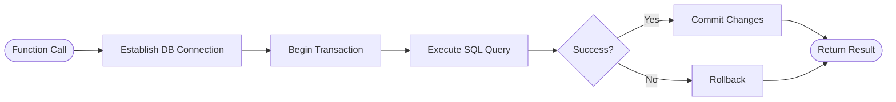

# Technology Stack & Dependencies

<cite>
**Referenced Files in This Document**   
- [requirements.txt](file://requirements.txt)
- [config.py](file://src/config.py)
- [bot.py](file://src/bot.py)
- [db_handler/db.py](file://src/db_handler/db.py)
- [storage.py](file://src/storage.py)
- [analysis.py](file://src/analysis.py)
- [utils.py](file://src/utils.py)
- [datamodels.py](file://src/datamodels.py)
- [handlers.py](file://src/handlers.py)
</cite>

## Table of Contents
1. [Introduction](#introduction)
2. [Core Technology Stack](#core-technology-stack)
3. [Configuration Management](#configuration-management)
4. [Database Integration](#database-integration)
5. [Object Storage with MinIO](#object-storage-with-minio)
6. [External LLM API Integration](#external-llm-api-integration)
7. [Tokenization and Text Processing](#tokenization-and-text-processing)
8. [Asynchronous Operations and Concurrency](#asynchronous-operations-and-concurrency)
9. [Dependency Management](#dependency-management)
10. [Security Considerations](#security-considerations)
11. [Performance Implications](#performance-implications)
12. [Best Practices](#best-practices)

## Introduction
VoxPersona is a sophisticated application designed to process audio interviews and audits, extract meaningful insights using large language models (LLMs), and store structured data for analysis. The system integrates multiple technologies to handle audio transcription, text analysis, data persistence, and user interaction via Telegram. This document details the technology stack, explaining how each component contributes to the overall functionality, their integration patterns, version compatibility, and operational best practices.

## Core Technology Stack

### Python as Primary Language
Python serves as the foundation of VoxPersona, chosen for its extensive ecosystem of libraries for AI, data processing, and web services. The codebase leverages modern Python features and follows structured programming patterns to ensure maintainability and scalability.

### Pyrogram for Telegram Bot Interactions
Pyrogram is used to create and manage the Telegram bot interface, enabling users to upload audio files, receive transcriptions, and request analytical reports. It handles real-time messaging, file transfers, and interactive menus through callback queries.


**Diagram sources**
- [bot.py](file://src/bot.py#L1-L670)
- [handlers.py](file://src/handlers.py#L1-L805)

**Section sources**
- [bot.py](file://src/bot.py#L1-L670)
- [handlers.py](file://src/handlers.py#L1-L805)

### PostgreSQL via psycopg2 for Relational Data Storage
PostgreSQL is used as the primary relational database for storing structured metadata about audits, employees, clients, locations, and analysis results. The `psycopg2` library provides efficient and secure connectivity between the Python application and the PostgreSQL instance.

The database schema includes tables such as `audit`, `transcription`, `employee`, `client`, `place`, and `report_type`, which are interconnected through foreign key relationships to maintain data integrity.


**Diagram sources**
- [db_handler/db.py](file://src/db_handler/db.py#L1-L399)
- [storage.py](file://src/storage.py#L1-L310)

**Section sources**
- [db_handler/db.py](file://src/db_handler/db.py#L1-L399)
- [storage.py](file://src/storage.py#L1-L310)

### MinIO for Object Storage
MinIO is employed for scalable object storage of audio files and processed text documents. It allows the system to decouple file storage from application logic, supporting large file uploads (up to 2GB) and efficient retrieval.

Audio files are uploaded to a dedicated bucket (`voxpersona-audio`) upon receipt, ensuring persistence and enabling reprocessing if needed. This integration uses the official MinIO Python SDK for secure S3-compatible operations.


**Diagram sources**
- [handlers.py](file://src/handlers.py#L1-L805)
- [config.py](file://src/config.py#L1-L94)

**Section sources**
- [handlers.py](file://src/handlers.py#L1-L805)
- [config.py](file://src/config.py#L1-L94)

## Configuration Management

### python-dotenv for Environment Configuration
The `python-dotenv` library is used to load environment variables from a `.env` file, centralizing configuration settings such as API keys, database credentials, and service endpoints. This approach enhances security by keeping sensitive data out of the source code.

The `config.py` module loads these variables at runtime, allowing different configurations for test and production environments based on the `RUN_MODE` setting.

```python
load_dotenv(override=True)

OPENAI_API_KEY = os.getenv("OPENAI_API_KEY")
TELEGRAM_BOT_TOKEN = os.getenv("TELEGRAM_BOT_TOKEN")
DB_CONFIG = {
    "dbname": os.getenv("DB_NAME"),
    "user": os.getenv("DB_USER"),
    "password": os.getenv("DB_PASSWORD"),
    "host": os.getenv("DB_HOST"),
    "port": os.getenv("DB_PORT"),
}
```

This pattern ensures that configuration changes do not require code modifications and supports seamless deployment across environments.

**Section sources**
- [config.py](file://src/config.py#L1-L94)

## Database Integration

### Connection Handling and Transaction Management
Database interactions are abstracted through a decorator-based transaction management system. The `@db_transaction` decorator ensures that each database operation runs within a proper connection context and automatically commits or rolls back based on success.

Functions like `get_or_create_employee`, `get_or_create_place_with_zone`, and `save_audit` encapsulate common CRUD operations, reducing code duplication and improving reliability.



**Diagram sources**
- [db_handler/db.py](file://src/db_handler/db.py#L1-L399)

**Section sources**
- [db_handler/db.py](file://src/db_handler/db.py#L1-L399)

## External LLM API Integration

### OpenAI and Anthropic for Transcription and Analysis
VoxPersona leverages external LLM APIs for two primary purposes:
- **OpenAI Whisper** for audio transcription
- **Anthropic Claude** for advanced text analysis and report generation

API keys for both services are securely stored in environment variables and accessed through the configuration system. The application uses the `openai` and `anthropic` Python libraries to communicate with these services.

Multiple Anthropic API keys are supported for load balancing and rate limit management, allowing parallel processing of large documents across several models.


**Diagram sources**
- [analysis.py](file://src/analysis.py#L1-L491)
- [bot.py](file://src/bot.py#L1-L670)

**Section sources**
- [analysis.py](file://src/analysis.py#L1-L491)
- [bot.py](file://src/bot.py#L1-L670)

## Tokenization and Text Processing

### tiktoken for Token Counting
The `tiktoken` library is used to accurately count tokens in text inputs before sending them to LLMs. This is critical for staying within model context limits and managing costs effectively.

Token counting is integrated into the analysis pipeline, particularly when processing large documents split into chunks for retrieval-augmented generation (RAG).

```python
try:
    ENC = tiktoken.encoding_for_model(REPORT_MODEL_NAME)
except KeyError:
    ENC = tiktoken.get_encoding("cl100k_base")

def count_tokens(text: str) -> int:
    return len(ENC.encode(text)) + 10
```

This ensures that all prompts and inputs are properly sized for the target model, preventing truncation or rejection due to excessive length.

**Section sources**
- [config.py](file://src/config.py#L1-L94)
- [utils.py](file://src/utils.py#L1-L106)

## Asynchronous Operations and Concurrency

### Async Support for Concurrent User Interactions
While the core application uses threading for background tasks like loading animations, it also incorporates asynchronous patterns for handling concurrent API requests to LLMs.

The `send_msg_to_model_async` function enables non-blocking communication with Anthropic's API, allowing multiple analysis tasks to proceed in parallel when using different API keys. Rate limiting is carefully managed per key based on token and request quotas.


This design maximizes throughput while respecting API rate limits and preventing service disruptions.

**Section sources**
- [analysis.py](file://src/analysis.py#L1-L491)

## Dependency Management

### pip and requirements.txt for Version Control
Dependencies are managed through `requirements.txt`, which specifies exact versions of all packages used in the project. This ensures reproducible builds and consistent behavior across development, testing, and production environments.

Key dependencies include:
- `Pyrogram==2.0.106`: Telegram client library
- `psycopg2-binary==2.9.10`: PostgreSQL adapter
- `minio==7.2.15`: S3-compatible storage client
- `anthropic==0.49.0`: Anthropic API client
- `openai==1.77.0`: OpenAI API client
- `tiktoken==0.9.0`: Tokenizer for OpenAI models

Regular updates should be performed to address security vulnerabilities while maintaining compatibility.

**Section sources**
- [requirements.txt](file://requirements.txt#L1-L130)

## Security Considerations

### Secure Handling of External APIs
All external API keys are loaded from environment variables rather than hardcoded values. The application validates the presence of required keys at startup, preventing accidental exposure.

```python
if not all([OPENAI_API_KEY, ANTHROPIC_API_KEY, TELEGRAM_BOT_TOKEN, API_ID, API_HASH]):
    raise ValueError("Not all required keys are defined!")
```

Additionally, MinIO access is secured through access and secret keys, with buckets created programmatically if they don't exist.

### Input Validation and Error Handling
User inputs are validated at multiple levels:
- Audio file size is checked before processing
- Date formats are validated using regex patterns
- Building types are normalized through mapping dictionaries
- SQL queries use parameterized statements to prevent injection

These measures protect the system from malformed inputs and potential attacks.

**Section sources**
- [config.py](file://src/config.py#L1-L94)
- [validators.py](file://src/validators.py)
- [handlers.py](file://src/handlers.py#L1-L805)

## Performance Implications

### Efficient Text Chunking and Embedding
Large documents are split into manageable chunks using `RecursiveCharacterTextSplitter` before being processed by the embedding model. This allows for effective retrieval-augmented generation without exceeding context windows.

The `CustomSentenceTransformerEmbeddings` class wraps a local embedding model (`all-MiniLM-L6-v2`) for generating vector representations of text segments, enabling semantic search over historical reports.

Processing pipelines are optimized to minimize redundant operations, with intermediate results cached where appropriate.

**Section sources**
- [utils.py](file://src/utils.py#L1-L106)
- [analysis.py](file://src/analysis.py#L1-L491)

## Best Practices

### Dependency Updates and Vulnerability Management
Dependencies should be regularly audited using tools like `pip-audit` or `safety check`. Critical libraries like `psycopg2`, `openai`, and `anthropic` should be monitored for security advisories.

When updating dependencies:
1. Test in a staging environment first
2. Verify compatibility with existing code
3. Update `requirements.txt` with new versions
4. Rebuild and redeploy containers

### Environment-Specific Configurations
Use separate `.env` files for different environments (development, testing, production) with appropriate values for:
- Database connection strings
- API keys
- Storage bucket names
- Logging levels

This separation prevents accidental use of production credentials during development and allows tailored performance tuning per environment.