# Navigation and Interface

<cite>
**Referenced Files in This Document**   
- [menus.py](file://src/menus.py)
- [markups.py](file://src/markups.py)
- [handlers.py](file://src/handlers.py)
- [datamodels.py](file://src/datamodels.py)
- [config.py](file://src/config.py)
- [storage.py](file://src/storage.py)
- [validators.py](file://src/validators.py)
- [parser.py](file://src/parser.py)
</cite>

## Table of Contents
1. [Introduction](#introduction)
2. [Project Structure](#project-structure)
3. [Core Components](#core-components)
4. [Architecture Overview](#architecture-overview)
5. [Detailed Component Analysis](#detailed-component-analysis)
6. [Dependency Analysis](#dependency-analysis)
7. [Performance Considerations](#performance-considerations)
8. [Troubleshooting Guide](#troubleshooting-guide)
9. [Conclusion](#conclusion)
10. [Appendices](#appendices) (if necessary)

## Introduction
This document provides comprehensive documentation for the Telegram bot's user interface components and navigation structure. It details all menu hierarchies generated by menus.py, including main menu, scenario selection, building type selection, and search mode dialogs. The document explains how markups.py constructs inline keyboards and reply markups for each interaction state, describes the visual flow and state-dependent rendering of buttons and options, and provides text-based representations of UI layouts at each stage. It also covers how handlers.py maps callback queries to menu actions and maintains context, offering guidelines for users to navigate complex workflows without errors.

## Project Structure
The project structure is organized into several key directories:
- `prompts`: Contains various prompt files for different scenarios and methodologies.
- `prompts-by-scenario`: Organized prompts by specific scenarios such as design, interview, and SQL prompts.
- `src`: Contains the source code for the application, including handlers, menus, markups, and other core components.
- Root files include deployment guides, Docker configuration, and requirements.

The source code is modular, with clear separation of concerns between UI components (menus.py, markups.py), business logic (handlers.py), data models (datamodels.py), and configuration (config.py).


**Diagram sources**
- [src/menus.py](file://src/menus.py)
- [src/markups.py](file://src/markups.py)
- [src/handlers.py](file://src/handlers.py)

**Section sources**
- [src/menus.py](file://src/menus.py)
- [src/markups.py](file://src/markups.py)
- [src/handlers.py](file://src/handlers.py)

## Core Components
The core components of the Telegram bot's interface include:
- **menus.py**: Manages menu display, state tracking, and message lifecycle
- **markups.py**: Constructs all inline keyboard layouts and button configurations
- **handlers.py**: Processes user interactions and maintains application state
- **datamodels.py**: Defines mapping between internal codes and display labels
- **config.py**: Contains configuration settings and global state management

These components work together to create a cohesive navigation experience that guides users through complex analysis workflows.

**Section sources**
- [src/menus.py](file://src/menus.py#L1-L93)
- [src/markups.py](file://src/markups.py#L1-L132)
- [src/handlers.py](file://src/handlers.py#L1-L799)

## Architecture Overview
The interface architecture follows a clear separation between presentation (markups), navigation control (menus), and business logic (handlers). The system uses a state machine pattern to manage user interactions, with each state corresponding to a specific menu or data entry phase.


**Diagram sources**
- [src/handlers.py](file://src/handlers.py#L1-L799)
- [src/markups.py](file://src/markups.py#L1-L132)
- [src/menus.py](file://src/menus.py#L1-L93)

## Detailed Component Analysis

### Menu System Analysis
The menu system is designed to guide users through a structured workflow for voice-driven analysis tasks. It maintains active menu messages to prevent clutter and ensures clean transitions between states.

#### Menu State Management


**Diagram sources**
- [src/menus.py](file://src/menus.py#L1-L93)
- [src/config.py](file://src/config.py#L1-L93)

**Section sources**
- [src/menus.py](file://src/menus.py#L1-L93)
- [src/config.py](file://src/config.py#L1-L93)

### Markup Construction Analysis
The markup system dynamically constructs inline keyboards based on the current interaction state, providing appropriate navigation options at each step.

#### Main Menu Structure

```mermaid
graph TD
A[Main Menu] --> B["📁 Storage"]
A --> C["Dialog Mode"]
A --> D["❓ Help"]
B --> E[Scenario Selection]
C --> F[Dialog Interface]
D --> G[Help Information]
style A fill:#f9f,stroke:#333
```


**Diagram sources**
- [src/markups.py](file://src/markups.py#L1-L132)

#### Scenario Selection Flow


**Diagram sources**
- [src/markups.py](file://src/markups.py#L1-L132)

#### Confirmation Workflow


**Diagram sources**
- [src/handlers.py](file://src/handlers.py#L1-L799)
- [src/menus.py](file://src/menus.py#L1-L93)
- [src/markups.py](file://src/markups.py#L1-L132)

### User Interface Layouts
Text-based representations of UI layouts at each stage:

#### Main Menu Layout
```
🏠 Main Menu:
[📁 Storage] [Dialog Mode] [❓ Help]
```

#### Storage Menu Layout
```
What are we analyzing?:
[INTERVIEW]
[DESIGN]
[Back]
```

#### Building Type Selection
```
Select Building Type:
[Hotel] [Restaurant] [Health Center]
```

#### Confirmation Screen
```
**Data Verification**

**Scenario**: Interview
**File Number**: 123
**Date**: 2025-01-01
**Employee Name**: John Doe
**Establishment**: Grand Hotel
**Building Type**: Hotel
**Zone**: Front Desk
**Client Name**: Jane Smith

Confirm or Edit?
[✅ Confirm] [✏️ Edit]
```

#### Edit Menu
```
Which field would you like to change?
[File Number]
[Date]
[Employee Name]
[Establishment]
[Building Type]
[Zone]
[Client Name]
[« Back]
```

**Section sources**
- [src/markups.py](file://src/markups.py#L1-L132)
- [src/menus.py](file://src/menus.py#L1-L93)

## Dependency Analysis
The interface components have a clear dependency hierarchy, with higher-level components depending on lower-level utilities.


**Diagram sources**
- [src/handlers.py](file://src/handlers.py#L1-L799)
- [src/menus.py](file://src/menus.py#L1-L93)
- [src/markups.py](file://src/markups.py#L1-L132)

**Section sources**
- [src/handlers.py](file://src/handlers.py#L1-L799)
- [src/menus.py](file://src/menus.py#L1-L93)
- [src/markups.py](file://src/markups.py#L1-L132)

## Performance Considerations
The interface design prioritizes responsiveness and clarity:
- Menu messages are properly cleaned up to prevent chat clutter
- Loading animations provide feedback during processing
- State is maintained efficiently using dictionaries
- Error handling prevents application crashes
- Input validation occurs at multiple levels

The system uses threading for long-running operations to maintain responsiveness, with spinner animations indicating processing status.

## Troubleshooting Guide
Common issues and solutions for interface navigation:

### State Management Issues
- **Problem**: Menu buttons don't respond
- **Solution**: Return to main menu using /start command
- **Prevention**: Always complete workflows or explicitly return to main menu

### Data Entry Errors
- **Problem**: Invalid date format
- **Solution**: Use YYYY-MM-DD format (e.g., 2025-01-01)
- **Validation**: System checks format before accepting

### Authorization Problems
- **Problem**: Cannot access menu options
- **Solution**: Enter correct password when prompted
- **Note**: Only authorized users can access functionality

### File Processing Issues
- **Problem**: Audio file too large
- **Solution**: Files must be under 2GB
- **Supported Formats**: WAV, MP3, FLAC, M4A, and other Whisper-compatible formats

**Section sources**
- [src/handlers.py](file://src/handlers.py#L1-L799)
- [src/validators.py](file://src/validators.py#L1-L49)
- [src/parser.py](file://src/parser.py#L1-L174)

## Conclusion
The Telegram bot's interface provides a structured, user-friendly navigation system for voice-driven analysis tasks. The menu hierarchy guides users through complex workflows with clear state transitions and appropriate feedback. The separation of concerns between markup generation, menu management, and business logic handlers creates a maintainable architecture that supports the bot's analytical capabilities. Users can navigate between different scenarios (Interview and Design) and building types (Hotel, Restaurant, Health Center) with consistent interface patterns, reducing cognitive load and minimizing errors in data entry and analysis workflows.