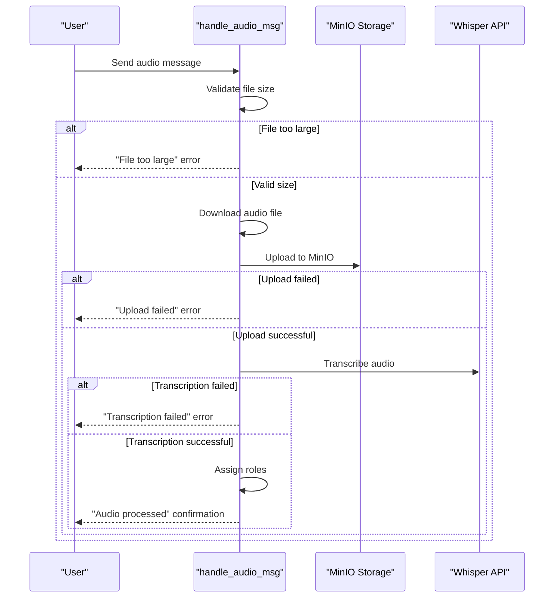
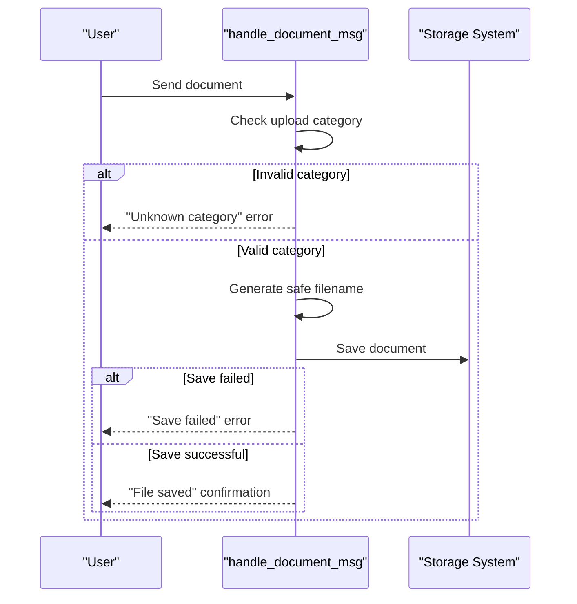
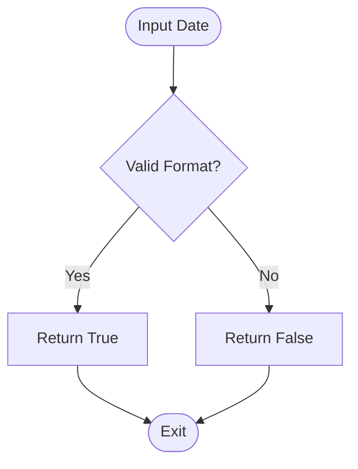
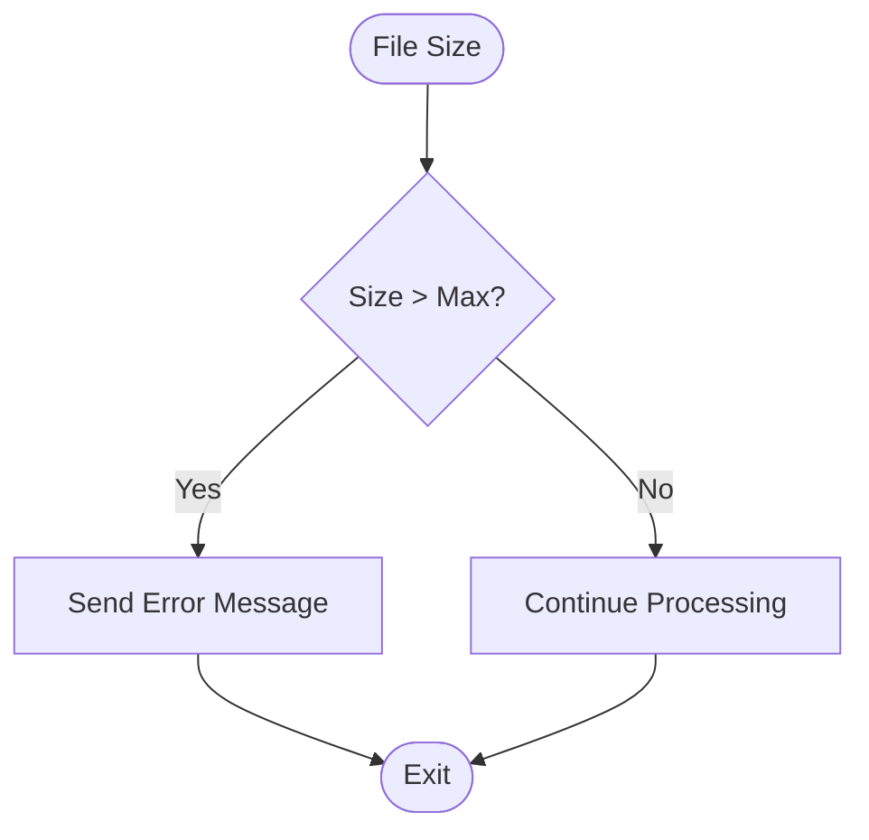
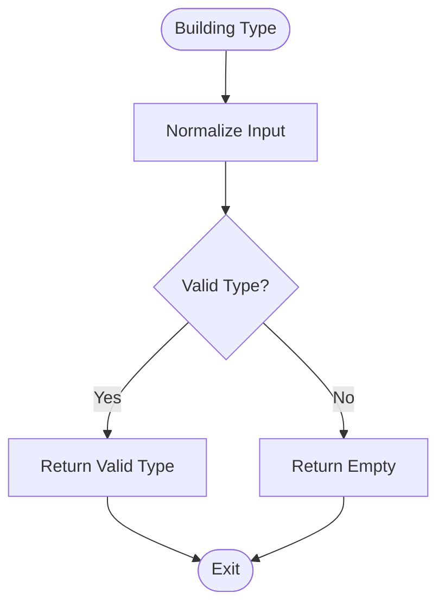
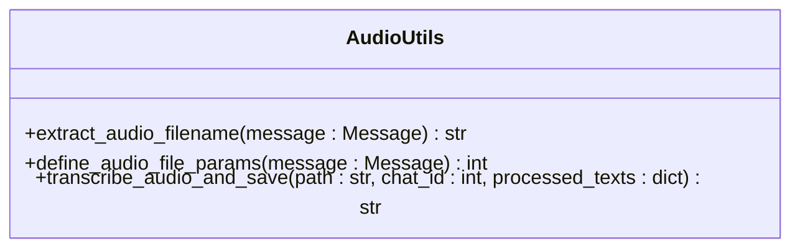
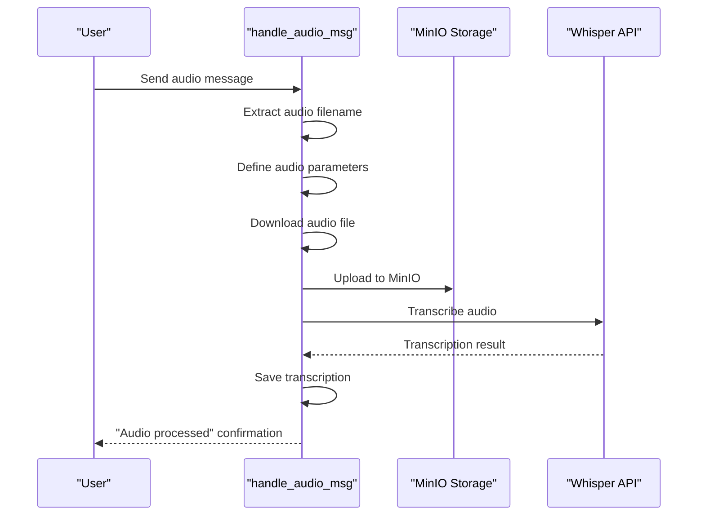
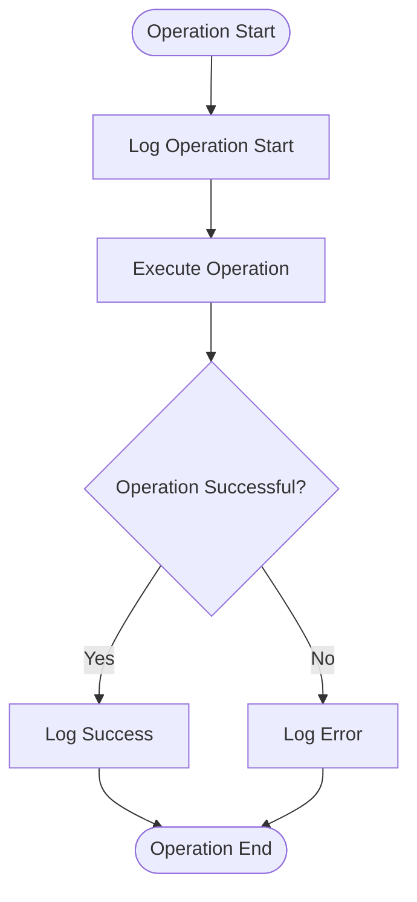

# Troubleshooting and Support

<cite>
**Referenced Files in This Document**   
- [handlers.py](file://src/handlers.py)
- [validators.py](file://src/validators.py)
- [utils.py](file://src/utils.py)
- [audio_utils.py](file://src/audio_utils.py)
- [config.py](file://src/config.py)
- [parser.py](file://src/parser.py)
- [run_analysis.py](file://src/run_analysis.py)
- [storage.py](file://src/storage.py)
</cite>

## Table of Contents
1. [Introduction](#introduction)
2. [Common User Issues and Solutions](#common-user-issues-and-solutions)
3. [Error Handling in Handlers](#error-handling-in-handlers)
4. [Validation Logic in Validators](#validation-logic-in-validators)
5. [Audio Processing and Transcription](#audio-processing-and-transcription)
6. [System Logs and Error Messages](#system-logs-and-error-messages)
7. [Best Practices for Preventing Issues](#best-practices-for-preventing-issues)
8. [Known Limitations and Workarounds](#known-limitations-and-workarounds)

## Introduction
This document provides comprehensive troubleshooting guidance for the VoxPersona system. It addresses common user issues such as failed voice message uploads, transcription errors, role assignment failures, and stalled report generation. The document explains the error handling mechanisms in handlers.py, validation logic in validators.py, and how system logs and error messages are generated in utils.py. It also offers best practices for preventing common issues and provides solutions for incorrect metadata entry, unsupported audio formats, and timeout issues.

## Common User Issues and Solutions

### Failed Voice Message Uploads
Failed voice message uploads can occur due to several reasons, including file size limitations, unsupported audio formats, or network issues. The system supports audio files up to 2GB in size. If a file exceeds this limit, the upload will fail with an error message indicating the file is too large.

**Solutions:**
- Check the audio file size and ensure it is within the 2GB limit.
- Verify the audio format is supported (MP3, OGG, WAV).
- Ensure a stable internet connection during upload.
- Restart the bot with /start if the issue persists.

**Section sources**
- [handlers.py](file://src/handlers.py#L540-L580)
- [audio_utils.py](file://src/audio_utils.py#L15-L30)
- [config.py](file://src/config.py#L80-L90)

### Transcription Errors
Transcription errors may occur if the audio quality is poor, the audio file is corrupted, or the Whisper API is unavailable. The system uses OpenAI's Whisper model for transcription, which requires a valid API key and proper network connectivity.

**Solutions:**
- Ensure the audio quality is clear and free from background noise.
- Verify the audio file is not corrupted by playing it locally.
- Check the OpenAI API key and network connectivity.
- Retry the transcription process after ensuring the above conditions are met.

**Section sources**
- [handlers.py](file://src/handlers.py#L540-L580)
- [audio_utils.py](file://src/audio_utils.py#L35-L50)
- [run_analysis.py](file://src/run_analysis.py#L200-L250)

### Role Assignment Failures
Role assignment failures can happen when the system fails to correctly identify and assign roles in the transcribed audio. This may be due to ambiguous speech, overlapping voices, or insufficient context.

**Solutions:**
- Ensure clear separation of speakers in the audio.
- Provide additional context or metadata to aid role assignment.
- Manually correct role assignments if necessary.
- Restart the bot with /start to reset the state.

**Section sources**
- [handlers.py](file://src/handlers.py#L560-L570)
- [analysis.py](file://src/analysis.py#L450-L490)
- [run_analysis.py](file://src/run_analysis.py#L150-L180)

### Stalled Report Generation
Stalled report generation can occur due to timeouts, large data processing, or system resource limitations. The system may take longer to generate reports for large audio files or complex analyses.

**Solutions:**
- Ensure the system has sufficient resources (CPU, memory).
- Break large audio files into smaller segments for processing.
- Monitor system logs for any timeout or resource-related errors.
- Restart the bot with /start to clear any stalled processes.

**Section sources**
- [handlers.py](file://src/handlers.py#L700-L750)
- [run_analysis.py](file://src/run_analysis.py#L300-L340)
- [utils.py](file://src/utils.py#L50-L70)

## Error Handling in Handlers

### Audio Message Handling
The `handle_audio_msg` function in handlers.py is responsible for processing audio messages. It includes error handling for file size, audio format, and API connectivity issues.

**Diagram sources**
- [handlers.py](file://src/handlers.py#L540-L580)
- [audio_utils.py](file://src/audio_utils.py#L35-L50)

### Document Message Handling
The `handle_document_msg` function handles document uploads, including validation of file categories and storage.

**Diagram sources**
- [handlers.py](file://src/handlers.py#L580-L620)
- [storage.py](file://src/storage.py#L250-L300)

## Validation Logic in Validators

### Date Format Validation
The `validate_date_format` function in validators.py ensures that date inputs follow the YYYY-MM-DD format.

**Diagram sources**
- [validators.py](file://src/validators.py#L15-L25)

### Audio File Size Validation
The `check_audio_file_size` function validates that audio files do not exceed the maximum allowed size.

**Diagram sources**
- [validators.py](file://src/validators.py#L40-L50)

### Building Type Validation
The `validate_building_type` function normalizes and validates building type inputs.

**Diagram sources**
- [validators.py](file://src/validators.py#L5-L15)
- [parser.py](file://src/parser.py#L50-L70)

## Audio Processing and Transcription

### Audio Extraction and Parameters
The `extract_audio_filename` and `define_audio_file_params` functions in audio_utils.py handle audio file metadata extraction and parameter definition.

**Diagram sources**
- [audio_utils.py](file://src/audio_utils.py#L1-L50)

### Transcription Process
The transcription process involves downloading the audio file, uploading it to MinIO, and sending it to the Whisper API for transcription.

**Diagram sources**
- [handlers.py](file://src/handlers.py#L540-L580)
- [audio_utils.py](file://src/audio_utils.py#L35-L50)

## System Logs and Error Messages

### Log Generation
The system generates logs for various operations, including audio processing, transcription, and report generation. Logs are generated using the Python logging module and include timestamps, log levels, and messages.

**Diagram sources**
- [handlers.py](file://src/handlers.py#L540-L580)
- [utils.py](file://src/utils.py#L1-L20)
- [run_analysis.py](file://src/run_analysis.py#L200-L250)

### Error Message Interpretation
Support teams can interpret error messages by checking the log files for specific error codes and messages. Common error messages include "File too large," "Upload failed," and "Transcription failed."

**Section sources**
- [handlers.py](file://src/handlers.py#L540-L580)
- [utils.py](file://src/utils.py#L1-L20)
- [run_analysis.py](file://src/run_analysis.py#L200-L250)

## Best Practices for Preventing Issues

### Audio Quality
Ensure high audio quality by using clear microphones, minimizing background noise, and speaking clearly.

### File Management
Manage audio files by keeping them within the 2GB limit, using supported formats, and organizing them properly.

### System Maintenance
Regularly maintain the system by updating dependencies, monitoring logs, and ensuring sufficient resources.

### User Training
Train users on proper usage, including how to upload files, enter metadata, and interpret error messages.

**Section sources**
- [handlers.py](file://src/handlers.py#L540-L580)
- [validators.py](file://src/validators.py#L1-L50)
- [utils.py](file://src/utils.py#L1-L20)

## Known Limitations and Workarounds

### File Size Limitation
The system has a 2GB file size limit. Workarounds include breaking large files into smaller segments or using external storage solutions.

### Unsupported Audio Formats
Unsupported audio formats may cause upload failures. Convert files to supported formats (MP3, OGG, WAV) before uploading.

### Timeout Issues
Timeout issues can occur during long processing tasks. Increase timeout settings or break tasks into smaller chunks.

### Network Connectivity
Network connectivity issues can disrupt uploads and processing. Ensure a stable internet connection and retry failed operations.

**Section sources**
- [handlers.py](file://src/handlers.py#L540-L580)
- [config.py](file://src/config.py#L80-L90)
- [utils.py](file://src/utils.py#L50-L70)