# User Manual

<cite>
**Referenced Files in This Document**   
- [bot.py](file://src/bot.py)
- [handlers.py](file://src/handlers.py)
- [menus.py](file://src/menus.py)
- [markups.py](file://src/markups.py)
- [datamodels.py](file://src/datamodels.py)
- [storage.py](file://src/storage.py)
- [run_analysis.py](file://src/run_analysis.py)
- [analysis.py](file://src/analysis.py)
- [config.py](file://src/config.py)
</cite>

## Table of Contents
1. [Introduction](#introduction)
2. [Authentication and Access](#authentication-and-access)
3. [Main Menu Navigation](#main-menu-navigation)
4. [Audio Processing Workflow](#audio-processing-workflow)
5. [Metadata Entry and Confirmation](#metadata-entry-and-confirmation)
6. [Report Generation](#report-generation)
7. [Dialog Search Functionality](#dialog-search-functionality)
8. [File Storage Management](#file-storage-management)
9. [Common Issues and Troubleshooting](#common-issues-and-troubleshooting)
10. [Best Practices](#best-practices)

## Introduction

The VoxPersona Telegram bot is designed to analyze voice interviews and design audits through advanced AI processing. The system transcribes audio, assigns speaker roles, and generates structured reports based on predefined scenarios. Users can interact with the bot through a menu-driven interface to upload audio files, enter metadata, select analysis scenarios, and retrieve comprehensive reports. This manual provides complete guidance on using all available features, including voice message processing, dialog search functionality, and navigation through the bot's interface.

**Section sources**
- [bot.py](file://src/bot.py#L1-L50)
- [handlers.py](file://src/handlers.py#L1-L50)

## Authentication and Access

To begin using the VoxPersona bot, users must first authenticate by sending the `/start` command. The bot will prompt for a password if the user is not already authorized. The default password is `1243`. Upon successful authentication, the user gains access to the main menu and all bot functionalities.

Unauthorized users attempting to interact with the bot will be prompted to enter the correct password. Once authenticated, users remain authorized for the duration of their session. The authentication system ensures that only approved personnel can access sensitive interview and audit data.

**Diagram sources**
- [bot.py](file://src/bot.py#L300-L320)
- [handlers.py](file://src/handlers.py#L400-L420)

## Main Menu Navigation

After successful authentication, users are presented with the main menu interface. The menu provides access to all core functionalities through clearly labeled buttons. The main menu contains the following options:

- **📁 Хранилище (Storage)**: Access stored audio files and documents
- **Режим диалога (Dialog Mode)**: Initiate search queries against processed reports
- **❓ Помощь (Help)**: View information about report structures and system capabilities

The menu system uses callback queries to navigate between different sections, ensuring a responsive and intuitive user experience. Each menu transition clears previous messages to maintain a clean interface.

```mermaid
graph TB
Main[Main Menu] --> Storage["📁 Хранилище"]
Main --> Dialog["Режим диалога"]
Main --> Help["❓ Помощь"]
Storage --> AudioFiles["Audio Files"]
Storage --> Upload["Upload File"]
Dialog --> FastSearch["Fast Search (RAG)"]
Dialog --> DeepSearch["Deep Search"]
Help --> ReportStructure["Report Structure Info"]
Help --> FileLimits["File Size Limits"]
```

**Diagram sources**
- [markups.py](file://src/markups.py#L5-L25)
- [menus.py](file://src/menus.py#L50-L60)

**Section sources**
- [markups.py](file://src/markups.py#L5-L30)
- [menus.py](file://src/menus.py#L50-L70)

## Audio Processing Workflow

The audio processing workflow begins when a user sends a voice message or audio file to the bot. The system supports voice messages and audio files up to 2GB in size. Supported audio formats include MP3, M4A, WAV, OGG, and other Whisper-compatible formats.

When an audio file is received, the bot initiates a processing sequence:
1. Display a loading animation with spinner characters
2. Download the audio file to a temporary directory
3. Transcribe the audio using OpenAI's Whisper model
4. Assign speaker roles (Employee/Client) using AI analysis
5. Store the processed text for further analysis

The transcription process automatically handles large files by splitting them into 24MB chunks, processing each chunk separately, and combining the results. This ensures reliable processing of long interview recordings.

```mermaid
flowchart TD
Start([User sends audio]) --> ValidateSize{"File size ≤ 2GB?"}
ValidateSize --> |No| Reject["Send size error"]
ValidateSize --> |Yes| ShowLoading["Show loading animation"]
ShowLoading --> Download["Download to temp directory"]
Download --> Transcribe["Transcribe with Whisper"]
Transcribe --> Split{"File > 24MB?"}
Split --> |Yes| ChunkProcess["Process in 24MB chunks"]
Split --> |No| SingleProcess["Process entire file"]
ChunkProcess --> Combine["Combine transcription parts"]
SingleProcess --> AssignRoles["Assign speaker roles"]
Combine --> AssignRoles
AssignRoles --> StoreText["Store processed text"]
StoreText --> ShowMenu["Send interview/design menu"]
```

**Diagram sources**
- [bot.py](file://src/bot.py#L400-L480)
- [handlers.py](file://src/handlers.py#L500-L580)
- [analysis.py](file://src/analysis.py#L100-L150)

**Section sources**
- [bot.py](file://src/bot.py#L400-L500)
- [handlers.py](file://src/handlers.py#L500-L600)
- [analysis.py](file://src/analysis.py#L100-L200)

## Metadata Entry and Confirmation

After audio processing, users must enter metadata to contextualize the interview or audit. The metadata entry process follows a structured sequence:

1. **File Number**: Enter the audio file identification number
2. **Date**: Input the recording date in YYYY-MM-DD format
3. **Employee Name**: Provide the full name of the employee
4. **Place Name**: Specify the establishment name
5. **Building Type**: Select from Hotel, Restaurant, or Health Center
6. **Zone**: Enter the specific zone within the establishment
7. **Client Name** (Interview only): Provide the client's full name
8. **City** (Design only): Specify the city location

The system validates date format and building type during entry. After all required fields are completed, the bot displays a confirmation menu showing all entered data. Users can either confirm the data or edit any field before proceeding to report generation.

**Diagram sources**
- [handlers.py](file://src/handlers.py#L100-L300)
- [markups.py](file://src/markups.py#L50-L80)

**Section sources**
- [handlers.py](file://src/handlers.py#L100-L400)
- [markups.py](file://src/markups.py#L50-L100)

## Report Generation

The VoxPersona bot offers specialized report generation for two scenarios: Interview and Design. After selecting a scenario and completing metadata entry, users can generate various analytical reports.

### Interview Reports
Available interview reports include:
- **Assessment of Interview Methodology**: Evaluates the quality and structure of the interview
- **Report on Quality-Decision Links**: Analyzes connections between service quality and customer decisions
- **Information on Common Decision-Making Factors**: Identifies general factors influencing customer choices
- **Information on Institution-Specific Factors**: Highlights factors unique to the specific establishment
- **Employee Performance Analysis**: Assesses the employee's performance during the interaction

### Design Reports
Available design reports include:
- **Assessment of Audit Methodology**: Evaluates the audit approach and methodology
- **Information on Compliance with Audit Program**: Assesses adherence to the audit program
- **Structured Information on Audit Program**: Provides a structured overview of the audit findings

Each report is generated by sending the processed transcript through a series of AI prompts, with results formatted for clarity and actionable insights.

**Diagram sources**
- [bot.py](file://src/bot.py#L200-L250)
- [run_analysis.py](file://src/run_analysis.py#L100-L200)
- [datamodels.py](file://src/datamodels.py#L1-L50)

**Section sources**
- [bot.py](file://src/bot.py#L200-L300)
- [run_analysis.py](file://src/run_analysis.py#L100-L300)
- [datamodels.py](file://src/datamodels.py#L1-L70)

## Dialog Search Functionality

The dialog search functionality allows users to query the knowledge base of previously generated reports. Two search modes are available:

### Fast Search (RAG)
The default search mode uses Retrieval-Augmented Generation (RAG) to quickly find relevant information. The system:
1. Classifies the query to determine the appropriate scenario (Interview or Design)
2. Searches the vector database for the most relevant report segments
3. Generates a concise answer based on the retrieved information
4. Returns results with minimal latency

### Deep Search
The advanced search mode performs a comprehensive analysis across all relevant reports:
1. Splits the knowledge base into manageable chunks
2. Processes each chunk in parallel using multiple AI models
3. Extracts relevant citations from each chunk
4. Aggregates findings into a comprehensive response
5. Provides detailed answers with thorough coverage

Users can toggle between search modes using the "Глубокое исследование" (Deep Research) button in dialog mode. The deep search mode is recommended for complex queries requiring comprehensive analysis, while the fast search is suitable for quick information retrieval.

**Diagram sources**
- [run_analysis.py](file://src/run_analysis.py#L200-L300)
- [analysis.py](file://src/analysis.py#L300-L400)
- [handlers.py](file://src/handlers.py#L700-L800)

**Section sources**
- [run_analysis.py](file://src/run_analysis.py#L200-L350)
- [analysis.py](file://src/analysis.py#L300-L500)
- [handlers.py](file://src/handlers.py#L700-L805)

## File Storage Management

The file storage system allows users to manage audio files and documents through the "Хранилище" (Storage) menu. Users can view, upload, and delete files organized by category.

### Storage Categories
- **Audio Files**: Voice recordings and audio messages
- **Text Without Roles**: Transcribed text without speaker identification
- **Text With Roles**: Transcribed text with assigned speaker roles

### File Operations
- **View Files**: List all files in a selected category
- **Upload File**: Save a document to the selected category
- **Delete File**: Remove a file from storage
- **Process File**: Select a stored file for transcription and analysis

When uploading files, the system generates safe filenames by transliterating Cyrillic characters and replacing special characters with underscores. This ensures compatibility across different systems and prevents filename conflicts.

**Diagram sources**
- [bot.py](file://src/bot.py#L150-L200)
- [storage.py](file://src/storage.py#L100-L150)
- [menus.py](file://src/menus.py#L20-L50)

**Section sources**
- [bot.py](file://src/bot.py#L150-L250)
- [storage.py](file://src/storage.py#L100-L200)
- [menus.py](file://src/menus.py#L20-L70)

## Common Issues and Troubleshooting

### Unsupported File Formats
The bot supports audio files in the following formats: FLAC, M4A, MP3, MP4, MPEG, MPGA, OGA, OGG, WAV, and WEBM. If an unsupported format is uploaded, the bot will not process the file. To resolve:
1. Convert the audio file to a supported format using audio conversion software
2. Ensure the file extension matches the actual format
3. Re-upload the converted file

### Processing Errors
If audio processing fails, check the following:
- **File Size**: Ensure the file does not exceed 2GB
- **Network Connection**: Verify stable internet connectivity
- **API Keys**: Confirm that OpenAI and VSEGPT API keys are correctly configured
- **Audio Quality**: Ensure the recording has clear audio without excessive background noise

Error messages will indicate the specific issue, such as "Whisper недоступен" (Whisper unavailable) for API key problems or "Ошибка обработки аудио" (Audio processing error) for other issues.

### Restarting Workflows
To restart a workflow:
1. Return to the main menu using the "Назад" (Back) button
2. Begin the process again from the appropriate starting point
3. If stuck in a state, send `/start` to reset the session

For metadata entry issues, use the edit functionality to correct specific fields without re-entering all information.

**Section sources**
- [bot.py](file://src/bot.py#L450-L500)
- [handlers.py](file://src/handlers.py#L550-L600)
- [analysis.py](file://src/analysis.py#L130-L150)

## Best Practices

### Recording Effective Voice Interviews
- **Environment**: Conduct interviews in quiet locations with minimal background noise
- **Audio Quality**: Use high-quality recording devices or smartphones with good microphones
- **Speaker Distance**: Maintain consistent distance from the microphone for all speakers
- **Introduction**: Begin with a clear introduction stating the date, location, and participants
- **Pacing**: Speak clearly and at a moderate pace, avoiding rapid speech
- **Turn-taking**: Allow natural pauses between speakers to facilitate role assignment
- **Duration**: Keep interviews to a reasonable length (under 30 minutes) for optimal processing

### Formulating Search Queries
- **Specificity**: Be as specific as possible in your queries
- **Context**: Include relevant context such as date, location, or employee name
- **Clarity**: Use clear and unambiguous language
- **Scenario Identification**: Include keywords that identify the scenario (e.g., "interview" or "design")
- **Structured Questions**: Frame questions as complete sentences rather than keywords
- **Follow-up**: Use initial results to refine subsequent queries for deeper insights

### System Usage
- **File Organization**: Use descriptive filenames that include date and subject
- **Regular Backups**: Ensure audio files are backed up externally
- **Session Management**: Log out when finished to maintain security
- **Error Reporting**: Document any recurring issues for technical support

**Section sources**
- [analysis.py](file://src/analysis.py#L400-L450)
- [handlers.py](file://src/handlers.py#L300-L350)
- [utils.py](file://src/utils.py#L1-L50)